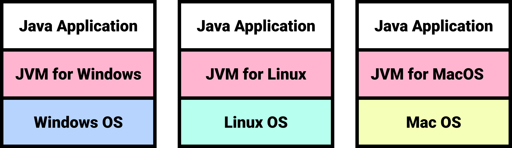
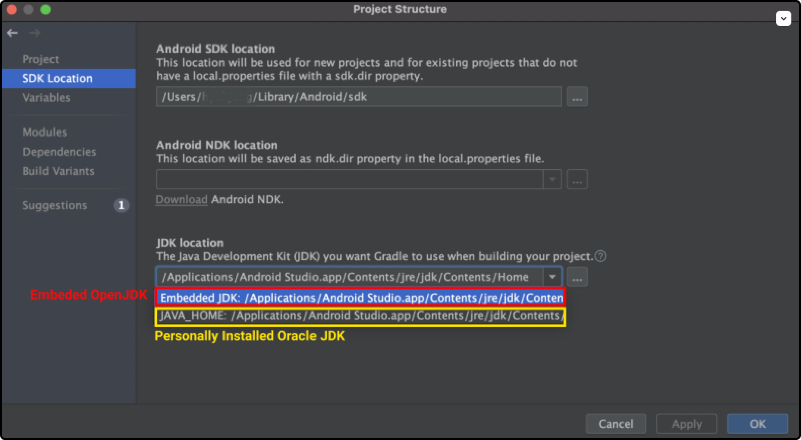

# Table of Contents
[[toc]]

## Compiler vs. Interpreter
- `Compiler`: 컴파일러는 소스 코드를 기계어로 컴파일한다. 컴파일러 언어는 소스 코드를 컴파일하는 과정이 필요하다. 예를 들어 c언어는 `.c` 확장자의 소스코드는 `gcc`컴파일러로 컴파일하여 `.o`확장자의 오브젝트 파일이라는 실행 파일을 생성한다.
- `Interpreter`: 인터프리터 언어 소스 코드를 컴파일하는 과정이 필요없으며, 인터프리터가 소스 코드를 한 줄씩 읽어서 실행한다. 예를 들어 JavaScript 언어는 크롬 V8 런타임이 소스코드를 한 줄씩 읽어 실행한다.
- Java는 두 특성을 모두 가진 언어다. 소스코드를 컴파일하여 클래스 파일을 생성한다는 점에서 컴파일 언어다. 또한 JVM이 클래스 파일을 한 줄씩 실행한다는 점에서 인터프리터 언어의 특성도 가지고 있다.

# Java Compiler, JVM, JRE, JDK
`Java Compiler`, `JVM`, `JRE`, `JDK` 차이점은 다음과 같다.

## Java Compiler
Java로 작성한 파일 이름 뒤에는 `.java`라는 확장자가 붙으며, 이 파일을 `자바 소스코드`라고 한다. `자바 컴파일러`는 이 소스코드를 `자바 바이트코드`로 변환한다. 자바 바이트코드는 파일 이름 뒤에 `.class`확장자가 붙는다.


Java Compiler는 JDK에 포함되어있다. 글쓴이의 PC에는 다음 경로에 JDK가 설치되어있다.
```
/Library/Java/JavaVirtualMachines/adoptopenjdk-8.jdk
```
JDK의 `bin`디렉토리의 `javac`가 바로 Java Compiler다.
``` shellsession{6}
$ pwd
/Library/Java/JavaVirtualMachines/adoptopenjdk-8.jdk/Contents/Home/bin

$ ls
java
javac
jar
...
```
이제 `.java`파일을 작성하고 컴파일하고 실행해보자. 우선 `Main.java`를 작성한다.
``` java 
// Main.java
public class Main {
	public static void main(String[] args) {
		System.out.println("Hello World");
	}
} 
```
이제 Java Compiler를 사용하여 `Main.java`를 컴파일해보자.
``` shellsession
$ javac Main.java

$ ls
Main.java   
Main.class  // 생성된 바이트 코드
```
이제 생성된 바이크 코드를 실행할 수 있다.
``` shellsession
$ java Main
Hello Wolrd
```

## JVM
`JVM(Java Virtual Machine)`은 자바 바이트코드를 운영체제에 종속적인 기계어로 변환한 후 실행한다.


서로 다른 운영체제라도 JVM만 설치되어 있다면, 같은 자바 어플리케이션을 다른 운영체제에서 실행할 수 있다. 단, JVM은 운영체제에 종속적이므로 각 운영체제에 맞는 JVM을 설치해야한다.



## JRE
`JRE(Java Runtime Edition)`은 Java 애플리케이션의 <u>실행</u>과 관련되어있다. JRE는 크게 두 가지 요소로 구성된다.
- JVM
- Java 애플리케이션 실행을 위한 API

## JDK
`JDK(Java Development Kit)`는 Java 어플리케이션의 <u>개발</u>에 관련되어있다. JRE 외에도 `Java Compiler`, `Java Debugger` 등 개발에 필요한 도구들을 포함하고 있다.

JDK에 포함된 요소 및 명령어는 Java 설치 경로의 `bin`디렉토리에 위치한다.
``` shellsession
$ pwd
/Library/Java/JavaVirtualMachines/jdk-9.0.4.jdk/Contents/Home/bin

$ ls 
java
javac
jar
javadoc
...
```

`MacOS`에는 JDK가 기본적으로 설치되어있다. 터미널에서 다음과 같이 설치 여부를 확인할 수 있다.
``` shellsession
$ java -version
java version "13.0.1" 2019-10-15    // Java Platform(JDK) Version
Java(TM) SE Runtime Environment (build 13.0.1+9)    // JRE version
Java HotSpot(TM) 64-Bit Server VM (build 13.0.1+9, mixed mode, sharing) // JVM version
```

## Oracle JDK vs OpenJDK
2018년 Oracle은 `Java SE`의 과금 방식을 영구 라이선스에서 구독 모델로 변경하겠다고 선언한다. 이 선언이 그동안 무료로 인식된 Java의 유료화로 받아들여지면서 관련 업계에 큰 혼란을 초래하고있다. Java의 유료화를 이해하려면 `Oracle JDK`와 `OpenJDK`에 대해 알아야 한다.
::: tip INFO
참고로 Java 언어 자체는 무료다. Java 언어로 작성된 어플리케이션을 컴파일하고 실행하는 <b>JDK(Java Development Kit)</b>가 유료화 논쟁의 대상이다.
:::

### Oracle JDK
`Oracle JDK`는 <u>사용 목적</u>에 따라 유료이기도 무료이기도 한 JDK다.

Oracle JDK는 서버, PC, 스마트폰 등의 <u>일반적인 목적</u>으로 사용될 때는 무료다. 반면 키오스크 등 <u>특수한 목적</u>의 컴퓨팅에 사용될 땐 유료다. 또한 `Oracle JDK 8(Oracle Java SE 8)`부터는 Oracle의 지속적인 업데이트와 보안 패치, 기술지원을 받으려면 유료 서비스를 구매해야한다. (참고로 Oracle JDK 8 이전 버전에서도 일반적인 목적의 사용은 무료였고 지속적인 업데이트와 보안 패치, 기술지원은 유료였다.)

Oracle JDK는 OpenJDK를 기본으로 한다. Open JDK에 추가적인 기능이 더해진 것이 `Oracle JDK`다. Oracle JDK에 존재하고 Open JDK에는 없는 대표적 기능으로는 글꼴 라이브러리와 Java Web Start다.


### OpenJDK
`OpenJDK`는 <u>사용 목적</u>에 관계없이 무료인 JDK다. 

2007년 Java를 개발한 Sun Microsystems사는 JDK를 오픈소스화하기 위해 OpenJDK를 만들었다. Sun Microsystems사는 저작권자가 오픈소스화를 거부한 일부 기능을 제외한 나머지 JDK 소스코드 전부를 OpenJDK에 제공했고, OpenJDK는 이를 기반으로 JDK 7 프로젝트를 시작했다.

JDK 6 시절에는 OpenJDK가 Oracle JDK보다 성능이나 안정성이 크게 떨어졌다. 하지만 오늘날에는 Oracle JDK만이 제공하는 일부 기능을 제외하고는 차이가 없다는게 Oracle의 설명이다. 

### 안드로이드 스튜디오의 JDK
참고로 안드로이드 스튜디오에는 OpenJDK가 내장되어 있으므로 별도의 JDK 설치가 필요없다. 설치 경로는 `Android Studio > File > Project Structure > SDK Location`에서 확인할 수 있다.

안드로이드 스튜디오에서는 보통 `compileSDKVersion`에 따라 적당한 JDK 버전이 자동으로 설정된다. 물론 프로젝트 수준의 `build.gradle` 파일에서 직접 JDK 버전을 설정할 수 있다.

```groovy
// build.gradle

android {
    // Java 8을 사용하도록 설정
    compileOptions {
        sourceCompatibility JavaVersion.VERSION_1_8
        targetCompatibility JavaVersion.VERSION_1_8
    }
}
```

### 결론
Kakao나 Line처럼 한국에서 잘 알려진 기업도 OpenJDK를 도입하고 활용하고 있는 것으로 알려져있다. OpenJDK에서는 제공하지 않는 컴포넌트를 사용해야하거나, Oracle의 지속적인 지원을 받아야 하거나, 키오스크 등 특수한 목적의 컴퓨팅에 사용하는 경우에는 비용을 지불하고 Oracle JDK를 사용해야 할 것이다. 그렇지 않은 경우에는 OpenJDK를 사용해도 무방할 것 같다.

## IntelliJ JDK 설정하기
`IntelliJ > File > Project Structure`로 이동한다.


`Project Settings > Project`탭에서 JDK를 변경할 수 있다.


그 다음 빌드 툴의 JDK를 변경한다. `Maven`을 사용하는 경우 `pom.xml`을 다음과 같이 변경한다.
``` xml
<build>
    <plugins>
        <plugin>
            <groupId>org.apache.maven.plugins</groupId> 
            <artifactId>maven-compiler-plugin</artifactId> 
            <configuration> 
                <source>1.8</source> 
                <target>1.8</target> 
            </configuration>
        </plugin>
    </plugins>
</build>
```
`Gradle`을 사용하는 경우 `build.gradle`을 다음과 같이 변경한다.
``` groovy 
sourceCompatibility = 1.8   // 소스 코드의 Java 버전. 일반적으로 개발 환경에서 사용 중인 JDK의 버전과 일치시킨다.
targetCompatibility = 1.8   // 바이트 코드의 Java 버전. 운영 환경에서 사용 중인 JDK의 버전과 일치시킨다.
``` 