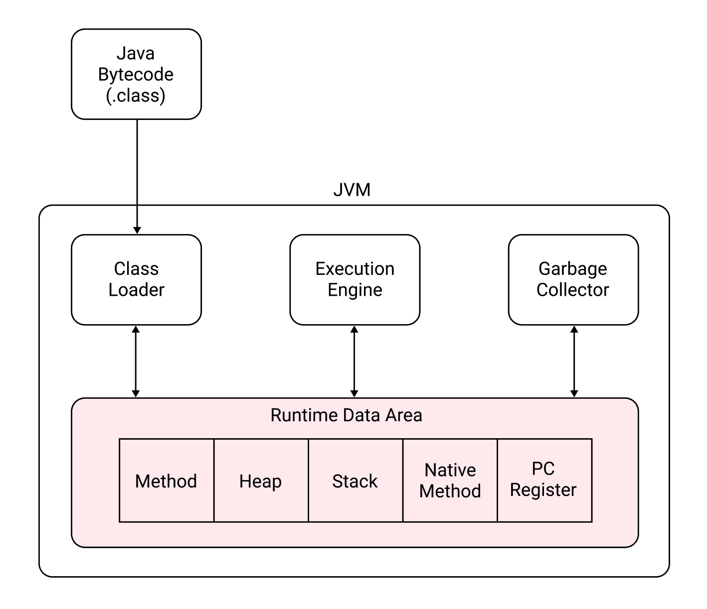

# Table of Contents
[[toc]]

# JVM 메모리 구조

JVM의 메모리 구조는 다음과 같다.

## Class Loader
`Class Loader`는 런타임에 동적으로 자바 바이트코드를 로드하고 링크하여 Runtime Data Area에 배치한다.

## Execution Engine
`Execution Engine`는 Runtime Data Area에 배치된 자바 바이트코드를 실행한다.

## Garbage Collector
Class의 인스턴스는 Runtime Data Area의 Heap 영역에 생성된다. `Garbage Collector`는 참조되지 않는 인스턴스를 해제하는 역할을 한다.

## Runtime Data Area
Class Loader가 로드한 자바 바이트코드는 `Runtime Data Area`에 배치된다. Runtime Data Area는 크게 다섯 개의 요소로 구성된다.

### Method
모든 스레드가 공유하는 영역. 메소드, 클래스, 인터페이스, Static 변수, 상수가 배치된다.

### Heap
모든 스레드가 공유하는 영역. 클래스의 인스턴스나 배열이 생성된다.

### Stack
지역변수, 메서드의 매개변수가 배치된다.

### Native Method
C/C++ 같이 Java 외의 언어로 작성된 코드가 배치된다.

### PC Register
Program Counter Register. 스레드 마다 존재한다. 현재 스레드에서 실행 중인 명령어의 주소를 저장한다.