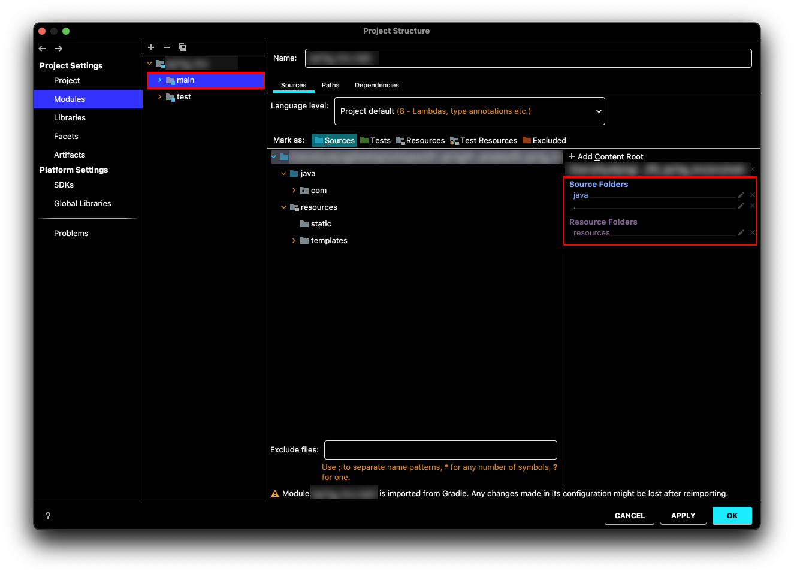
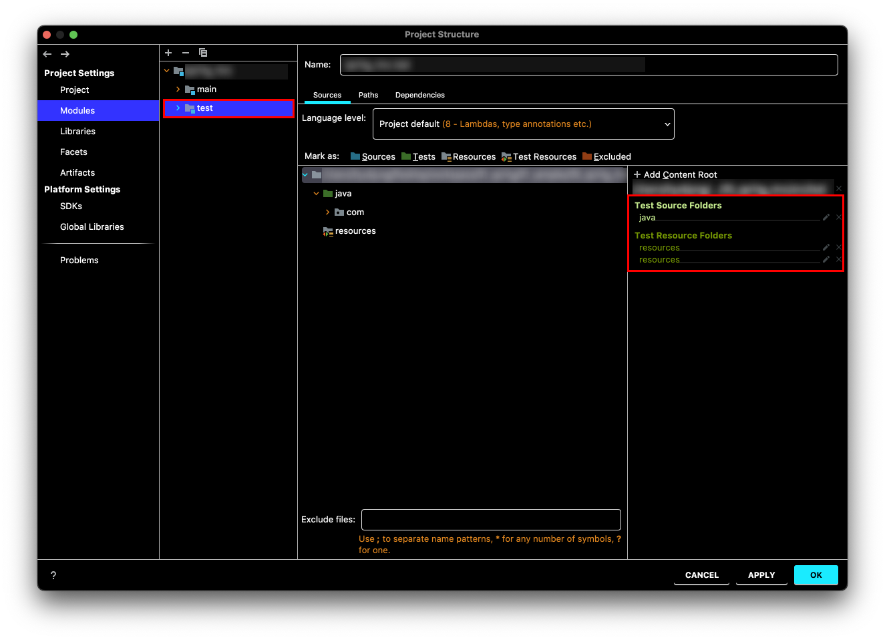

# Table of Contents 
[[toc]]

## 클래스패스
`클래스패스(classpath)`는 클래스를 찾기 위한 경로다. 간단한 예제를 통해 클래스패스에 대해 알아보자. 

### 예제 1
첫 번째 예제의 프로젝트 구조는 다음과 같다.
```
$ pwd 
/yologger/workspace/project

$ tree
.
└── Main.java
```
``` java 
// Main.java
public class Main {
	public static void main(String[] args) {
		System.out.println("Hello World");
	}
}
```
다음과 같이 `Main.java`가 위치하는 경로에서는 이 파일을 컴파일하고 실행할 수 있다. 이는 JVM이 현재 위치를 클래스 파일로 인식하기 때문이다.
```
$ pwd 
/yologger/workspace/project

$ javac Main.java

$ java Main
Hello World
```
그렇다면 `/yologger/workspace`로 이동하여 똑같은 명령어를 실행하면 어떻게 될까?
```{4}
$ cd ..

$ pwd
/yologger/workspace

$ java Main
```
다음과 같은 에러가 발생할 것이다. `Main.class` 바이트코드의 위치를 찾지 못했기 때문이다.
```
Error: Could not find or load main class Main
Caused by: java.lang.ClassNotFoundException: Main
```

이제 클래스패스를 통해 `Main.class`의 경로를 알려주자. `-classpath` 또는 `-cp` 옵션을 사용하면 된다.
```
$ java -classpath "./project" Main
Hello World
```

### 예제 2
이제 `lib`폴더에 `Printer`클래스를 추가하고 `Main.java` 코드를 다음과 같이 수정해보자.
``` java
// Printer
class Printer {
    public void print(String something) {
        System.out.println(something);
    }
}
```
``` java
// Main.java
public class Main {
	public static void main(String[] args) {
		Printer printer = new Printer();
        printer.print("Hello World");
	}
}
```
프로젝트 구조는 다음과 같다.
```
$ pwd 
/yologger/workspace/project

$ tree
.
├── Main.java
└── lib
    └── Printer.java
```
`Main.java`는 `Printer.java`를 참조하고 있다. 따라서 `Main.java`를 컴파일할 때 `Priner.java`의 클래스패스를 알려주어야 한다.
```
$ javac -classpath ./lib Main.java
```
컴파일을 하면 `Main.class`, `Printer.class`가 생성된다.
```
$ tree
.
├── Main.class
├── Main.java
└── lib
    ├── Printer.class
    ├── Printer.java
    └── gson-2.8.0.jar
```
이제 `Main.class`를 실행해보자. 실행할 때 역시 `Printer.class`의 경로를 알려주어야 한다.
```
java -classpath .:./lib Main
```

### 예제 3
`jar`파일을 클래스패스에 추가하는 방법을 알아보자. 

`lib` 폴더에 `jar` 파일을 추가한다.
``` {5} 
$ tree
.
├── Main.java
└── lib
    └── gson-2.8.0.jar
```
그리고 `Main.java`에서 `jar`에 의존하도록 수정한다.
``` java{1,5}
import com.google.gson.Gson;

public class Main {
	public static void main(String[] args) {
		Gson gson = new Gson();
	}
}
```

컴파일 할 때 `jar` 파일의 경로를 클래스패스 옵션으로 알려주어야 한다.
```
$ javac -classpath "./lib/gson-2.8.0.jar" Main.java
```
실행할 때도 `jar` 파일의 경로를 알려주어야 한다.
```
$ java -classpath ".:./lib/gson-2.8.0.jar" Main
```

## Spring Boot와 클래스패스
IntelliJ로 생성한 스프링 부트 프로젝트의 클래스 패스는 `IntelliJ > File > Project Structure`에서 확인할 수 있다.



테스트 환경을 위한 클래스 패스는 다음과 같이 확인할 수 있다.

