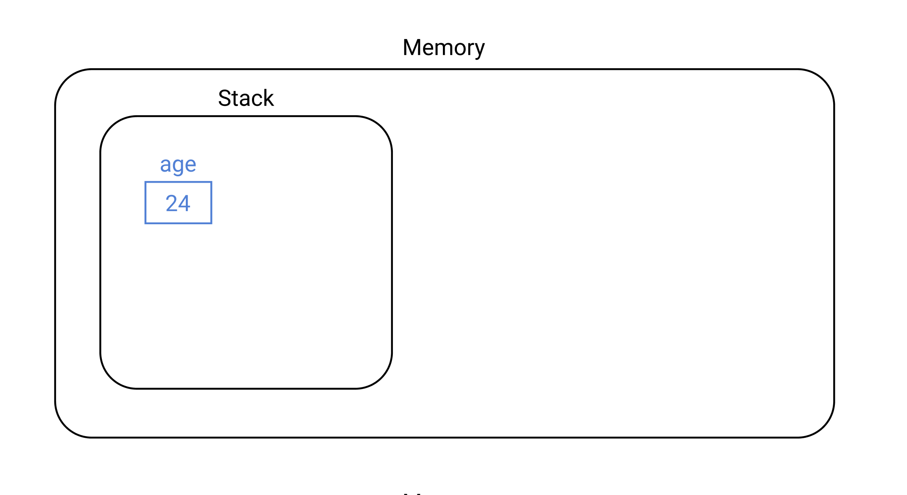

# Table of Contents
[[toc]]

# Java 데이터 타입
Java의 데이터 타입에 대해 정리한다.

## 데이터 타입
`데이터 타입`은 데이터의 종류를 의미한다. 예를 들어 나이는 숫자고 이름은 문자열이다. 여기서 숫자와 문자열을 데이터 타입이라고 한다. 이를 Java에서 다음과 같이 표현한다.
``` java
int age = 30;
String name = "Paul";
``` 

### 정수형 숫자
`10진수 정수형 숫자`는 다음과 같이 사용한다.
``` java
byte age = 24;      // 1 byte
short age = 24;     // 2 byte
int age = 24;       // 4 byte
long age = 24;     // 8 byte
```

### 실수형 숫자
`실수형 숫자`는 다음과 같이 사용한다.
``` java
float weight = 78.9F;
double height = 180.8D;
```
`double`형 데이터의 경우 `D`를 생략할 수 있다.
``` java
double height = 180.8;
```

### 불리언
``` java
boolean isMarried = true;   // 1 bit
```

### 문자
문자를 선언하고 초기화할 때는 `따옴표(')`를 사용한다.
``` java
char alphabetA = 'A';   // 2 byte
char alphabetB = 'B';   // 2 byte
```

### 문자열 
문자열을 선언하고 초기화할 때는 `쌍따옴표(")`를 사용한다.
``` java
String name = "Ronaldo";
```
문자열 타입의 변수에는 유용한 속성과 메소드가 내장되어있다.
``` java
name.length();          // 7
name.toLowerCase();     // ronaldo
name.toUpperCase();     // RONALDO
```
문자열과 문자열을 합쳐 새로운 문자열을 만들 때는 `+`를 사용한다.
``` java
String description = name + " is from " + nation;
```

## 변수와 상수
### 변수
변수는 자료형을 변수명 앞에 붙여서 선언한다.
``` java
int age = 24;
double height = 180.8;
boolean isMarried = true;
String name = "Paul";
```
변수는 값을 초기화한 후 변경할 수 있다.
``` java
int age = 24;
age = 25;
```

### 상수
상수는 자료형 앞에 키워드 `final`를 붙인다. 보통 상수의 이름은 `대문자`와 `언더바(_)`를 사용한다.
``` java
final int AGE = 24;
final double HEIGHT = 180.8;
final boolean IS_MARRIED = true;
final String NAME = "Ronaldo";
```
상수는 값을 한번 할당하면 변경할 수 없다.
``` java
final int AGE = 24;
AGE = 25;   // Error
```

## 원시 타입과 참조 타입
Java에는 크게 두 종류의 자료형이 있다.
- 원시 타입
- 참조 타입

::: tip
[JVM의 메모리 구조](/post/01_java/180104_jvm_memory_structure.html)에 관한 포스트를 먼저 읽고 오길 권장한다.
:::


### 원시 타입
Java가 제공하는 `원시 타입(Primitive type)`은 다음과 같다.
- byte
- short
- int
- long
- float
- double
- boolean
- char

원시 타입은 `스택(Stack)`이라는 메모리 영역에 저장된다. 예를 들어 코드가 다음과 같다면
``` java
int age = 35;
```
메모리에 다음과 같은 형태로 저장된다.


### 참조 타입
원시 타입을 제외한 모든 타입을 `참조 타입(Referencee type)`이라고 한다. Class, Array, List, Enum 등이 참조 타입에 포함된다.

참조 타입은 `힙(Heap)`이라는 메모리 영역에 저장된다. 예를 들어 코드가 다음과 같다면
``` java
Person p = new Person("Paul", 33);
```
메모리에 다음과 같은 형태로 저장된다.

다시 말해 객체 자체는 힙 영역에 생성되며, 스택에 생성된 변수에는 객체의 주소값을 담고 있다. 좀 더 추상적으로 힙에 생성된 객체를 가리키는 형태다.


## 연산자
Java에서 제공하는 연산자는 다음과 같다.

### 산술 연산자
수식 계산과 관련된 산술 연산자는 다음과 같다.

#### 덧셈
덧셈은 `+` 연산자를 사용한다.
``` java
int result1 = 3 + 5;
double result2 = 3.3 + 5.5;
```
피연산자의 자료형이 다른 경우 값 손실을 방지하기 위해 더 큰 자료형으로 형변환된다.
``` java
double result = 3 + 5.5;
```
#### 뺄셈
뺄셈은 `-` 연산자를 사용한다.
``` java
int result = 10 - 3;
double result2 = 10 - 3.3;
```

#### 곱셈
곱셈은 `*` 연산자를 사용한다.
``` java
int result1 = 3 * 3;
double result2 = 3 * 3.3;
```

#### 몫, 나머지
피연산자가 정수일 때 몫은 `/`, 나머지는 `%` 연산자를 사용한다.
``` java
int quotient = 11 / 4;  // 2
int remainder = 11 % 4;  // 3
```
피연산자가 정수일 때 연산자 `/`를 사용하면 소수점까지 계산하게 된다.
``` java
double result1 = 10.0 / 3.0;  // 3.3333333333333335
double result2 = 3.0 / 10.0;  // 0.3
```

숫자를 나눌 때 소수점까지 계산하려면 피연산자 중 하나를 실수형으로 캐스팅하면 된다.
``` java
double result1 = (double)11 / 3;  // 3.6666666666666665
double result2 = 11 / (double)3;  // 3.6666666666666665
```

### 논리 연산자
AND 연산자는 `&&`, OR 연산자는 `||`을 사용한다.
``` java
boolean result1 = true && false;  // false
boolean result2 = true || false;  // true
```