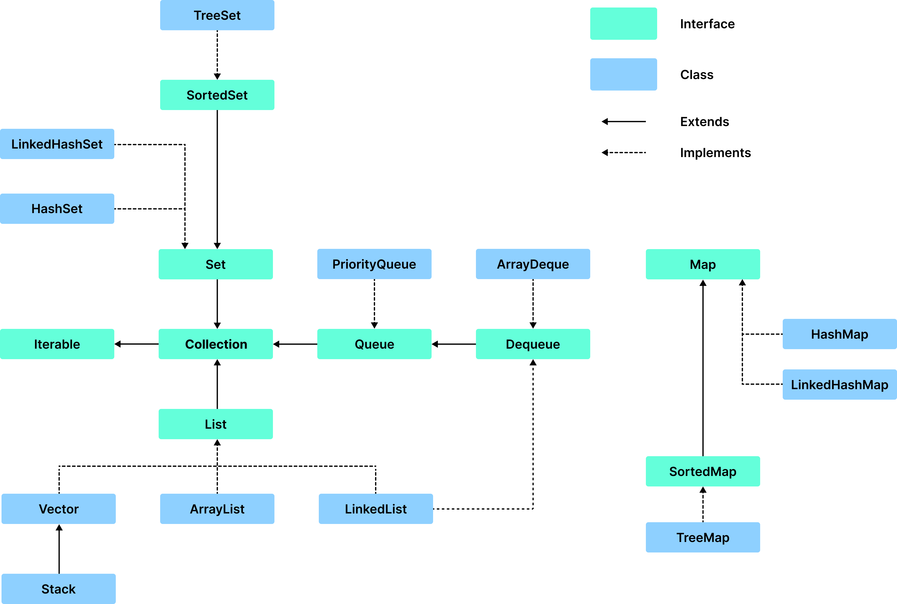

# Table of Contents
[[toc]]

# 컬렉션 프레임워크
Java API는 같은 타입의 여러 데이터를 한꺼번에 효율적으로 관리하기 위해 `컬렉션 프레임워크(Collection Framework)`를 제공한다. 



컬렉션 프레임워크는 `java.util` 패키지에 포함되어있으며, 가장 중요한 요소는 `List`, `Set`, `Map`이다.

## List
배열은 생성할 때 크기가 결정된다. 따라서 배열이 생성되면 동적으로 데이터를 추가하거나 삭제할 수 없다. 데이터를 동적으로 추가, 삭제하려면 `List`를 사용해야한다.

`List`의 특징은 다음과 같다.
- 순서가 있다.
- 중복을 허용한다.

컬렉션 프레임워크가 제공하는 `List`의 정의는 다음과 같다.
``` java
public interface List<E> extends Collection<E> {
    int size();
    boolean isEmpty();
    boolean contains(Object o);
    boolean add(E e);
    boolean remove(Object o);
    E set(int index, E element);
    E get(int index);
    ...
}
``` 
`List`는 인터페이스이므로 인스턴스를 생성할 수 없으며, 구현체가 필요하다. 자바 API에서는 `Vector`, `ArrayList`, `LinkedList` 등 다양한 구현체를 제공한다.

### Vector
`Vector`는 다음과 같이 선언하고 초기화한다.
``` java
Vector<String> vector = new Vector<String>();
```
다음과 같이 요소를 추가한다.
``` java
vector.add("Joey");
vector.add("Chandler");
vector.add("Ross");

System.out.println(vector.toString());   // [Joey, Chandler, Ross]
```
요소 값에 접근할 수 있다.
``` java
vector.get(0);   // Joey
```
요소 값을 변경할 수 있다.
``` java
vector.set(0, "Rachel");
```
다음과 같이 요소를 삭제할 수 있다.
``` java
// 인덱스로 삭제
vector.remove(0);

// 요소로 삭제
vector.remove("Ross");
```

### ArrayList
`ArrayList`는 가장 많이 사용되는 `List`의 구현체다. `ArrayList`는 다음과 같이 선언하고 초기화한다.
``` java
List<String> list = new ArrayList<String>();
```
다음과 같이 요소를 추가한다.
``` java
list.add("Ronaldo");
list.add("Benzema");
list.add("Bale");

System.out.println(list.toString());    // [Ronaldo, Benzema, Bale]
``` 
요소 값에 접근할 수 있다.
``` java
System.out.println(list.get(0));        // Son
```
요소 값을 변경할 수 있다.
``` java
list.set(0, "Son");

System.out.println(list.toString());    // [Son, Bale]
``` 
다음과 같이 요소를 삭제할 수 있다.
``` java
list.remove(0);

list.remove("Ronaldo");
```

### LinkedList
`LinkedList`는 다음과 같이 선언하고 초기화한다.
``` java
List<String> linkedList = new LinkedList<String>();
```
다음과 같이 요소를 추가한다.
``` java
linkedList.add("Chandler");
linkedList.add("Ross");
linkedList.add("Joey");

System.out.println(linkedList.toString());  // [Chandler, Ross, Joey]
```
요소 값에 접근할 수 있다.
``` java
linkedList.get(1);
```
요소를 변경할 수 있다.
``` java
linkedList.set(0, "Monica");
```
요소를 삭제할 수 있다.
``` java
// 요소로 삭제
linkedList.remove("Ross");

// 인덱스로 삭제
linkedList.remove(0);
```

### Vector vs. ArrayList
`Vector`는 동기화가 되어있다. 다시 말해 한 순간에 하나의 스레드만 접근할 수 있기 때문에 <u>스레드에 안전(Thread Safe)</u>하다. 대신 속도가 느리다. 반면 `ArrayList`는 동기화되지 않았기 때문에 동시에 여러 스레드가 접근할 수 있으며 속도가 빠르다.

따라서 싱글 스레드 환경에서는 `ArrayList`를 사용하고 멀티 스레드 환경에서는 `Vector`를 사용하는 것이 바람직하다.

### ArrayList vs. LinkedList
`ArrayList`는 내부적으로 배열을 사용한다. 
``` java ArrayList.java
public class ArrayList<E> {
    transient Object[] elementData; 
    private int size;
    // 생략 ...
}
```
`ArrayList`를 생성할 때 내부적으로 크기가 고정된 배열을 생성한다. 그리고 고정된 배열이 꽉 차면 더 큰 크기의 새로운 배열을 생성하고 복사한다.

반면 `LinkedList`는 내부적으로 `Node`를 사용한다.
``` java LinkedList
public class LinkedList<E> {
    transient int size = 0;
    transient Node<E> first;
    transient Node<E> last;
    // 생략 ...
}
``` 

보통 데이터를 순차적으로 추가, 삭제하는 경우 `ArrayList`가 더 빠르다. 반면 데이터를 중간에 추가, 삭제하는 경우 `LinkedList`가 더 빠르다. 따라서 상황에 따라 적절한 것을 선택하자.

### Array로 List 생성하기
`Arrays.asList()`를 사용하면 `Array`로 `List`를 생성할 수 있다.
``` java
List<Integer> list = new ArrayList(Arrays.asList(1, 2, 3, 4, 5));
```

### List를 특정 크기의 값으로 초기화하기
`Collections.nCopies()`메소드를 사용하면 `List`를 특정 크기의 값으로 쉽게 초기화할 수 있다.
``` java{1}
List<Integer> list = new ArrayList<Integer>(Collections.nCopies(10, 1));

System.out.println(list.toString());    // [1, 1, 1, 1, 1, 1, 1, 1, 1, 1]
```

### List 깊은 복사
`ArrayList` 생성자에 기존 `List`를 전달하는 방식으로 깊은 복사르르 할 수 있다.
``` java{7}
List<Integer> list = new ArrayList<Integer>();
list.add(1);
list.add(2);
list.add(3);

// 깊은 복사
List<Integer> copy = new ArrayList<Integer>(list);
copy.add(4);

System.out.println(list.toString());    // [1, 2, 3]
System.out.println(copy.toString());    // [1, 2, 3, 4]
System.out.println(list.hashCode());    // 30817
System.out.println(copy.hashCode());    // 955331
```

### List 메소드 정리
`List`인터페이스가 제공하는 메소드는 다음과 같다. 

#### List.add()
`List.add()`를 사용하면 `List`의 맨 끝에 요소를 추가할 수 있다.
``` java
List<Integer> list = new ArrayList(Arrays.asList(1, 2, 3, 4, 5));

list.add(6);

System.out.println(list);  // [1, 2, 3, 4, 5, 6]
```
첫 번째 인자로 인덱스를 지정할 수 있다.
``` java
List<Integer> list = new ArrayList(Arrays.asList(1, 2, 3, 4, 5));

list.add(0, 20);

System.out.println(list);  // [20, 1, 2, 3, 4, 5]
```

#### List.addAll()
`List.addAll()`를 사용하면 `List`를 `List`에 추가할 수 있다.
``` java
List<Integer> list1 = new ArrayList(Arrays.asList(1, 2, 3, 4, 5));
List<Integer> list2 = new ArrayList(Arrays.asList(6, 7, 8, 9, 10));

list1.addAll(list2);
System.out.println(list1);  // [1, 2, 3, 4, 5, 6, 7, 8, 9, 10]
```

#### List.get()
특정 인덱스의 요소를 가져올 수 있다.
``` java
List<Integer> list = new ArrayList(Arrays.asList(1, 2, 3, 4, 5));

System.out.println(list.get(0));    // 1
```

#### List.set()
특정 인덱스의 요소를 변경할 수 있다.
``` java
List<Integer> list = new ArrayList(Arrays.asList(1, 2, 3, 4, 5));
list.set(0, 10);

System.out.println(list);   // [10, 2, 3, 4, 5]
```

#### List.remove()
특정 요소를 삭제할 수 있다.
``` java
List<String> list = new ArrayList(Arrays.asList("Paul", "John", "Smith", "Kane"));

// 인덱스로 삭제
list.remove(0);

// 요소로 삭제
list.remove("Kane");

System.out.println(list);    // [John, Smith]
```

#### List.indexOf()
특정 요소의 첫 번째 인덱스를 가져올 수 있다.
``` java
List<String> list = new ArrayList(Arrays.asList("Paul", "John", "Smith", "Paul"));

System.out.println(list.indexOf("Paul"));       // 0
```
#### List.lastIndexOf()
특정 요소의 마지막 인덱스를 가져올 수 있다.
``` java
List<String> list = new ArrayList(Arrays.asList("Paul", "John", "Smith", "Paul"));

System.out.println(list.lastIndexOf("Paul"));   // 3
```

#### List.size()
`List`의 크기를 가져올 수 있다.
``` java
List<String> list = new ArrayList(Arrays.asList("Paul", "John", "Smith", "Paul"));

System.out.println(list.size());           // 4
```

#### List.forEach()
`List`를 순회할 수 있다.
``` java
List<String> list = new ArrayList(Arrays.asList("Paul", "John", "Smith", "Paul"));

list.forEach((String item) -> {
    // ...
});
```

#### List.contains()
요소 포함 여부를 확인할 수 있다.
``` java
List<String> list = new ArrayList(Arrays.asList("Paul", "John", "Smith", "Paul"));

if (list.contains("Paul")) {
    // ...
}
```

#### List.isEmpty()
`List`가 비어있는지 확인할 수 있다.
``` java
List<String> list = new ArrayList(Arrays.asList("Paul", "John", "Smith", "Paul"));

if (list.isEmpty()) {
    // ...
}
```

#### List.subList()
`List`의 일부분으로 새로운 `List`를 생성할 수 있다.
``` java
List<String> list = Arrays.asList("Paul", "John", "Smith", "Monica", "Chandler", "Ross");
List<String> subList = list.subList(1, 4);      // [John, Smith, Monica]
```

#### List.clear()
`List`를 클리어할 수 있다.
``` java
List<String> list = new ArrayList<>();
list.add("john");
list.add("paul");
list.add("smith");
System.out.println(list);   // [john, paul, smith]

list.clear();
System.out.println(list);   // []
```

#### List.toArray()
`List`를 배열로 변환할 수 있다.
``` java
List<String> list = new ArrayList(Arrays.asList("Paul", "John", "Smith", "Paul"));

String[] arr = list.toArray(new String[list.size()]);   // [Paul, John, Smith, Paul]
```

## Set
`Set`은 다음과 같은 특징이 있는 자료구조다.

- 순서가 없다.
- 중복을 허용하지 않는다.

자바 API에서 제공하는 `Set`의 정의는 다음과 같다.
``` java
public interface Set<E> extends Collection<E> {
    int size();
    boolean isEmpty();
    boolean contains(Object o);
    Iterator<E> iterator();
    boolean add(E e);
    boolean remove(Object o);
    boolean removeAll(Collection<?> c);
    void clear();
}
``` 
`Set`은 인터페이스이므로 인스턴스를 생성할 수 없으며 구현체가 필요하다. 자바 API에서는 `HashSet`, `TreeSet`, `LinkedHashSet`이라는 구현체를 제공한다. 

### TreeSet
`TreeSet`은 다음과 같이 생성한다.
``` java
Set<Integer> treeSet = new TreeSet<Integer>();
```
다음과 같이 데이터를 추가할 수 있다.
``` java
treeSet.add(1);
```
중복을 허용하지 않는 것을 확인할 수 있다.
``` java
Set<Integer> treeSet = new TreeSet<Integer>();

treeSet.add(3);
treeSet.add(1);
treeSet.add(1);
treeSet.add(1);
treeSet.add(2);
treeSet.add(2);

System.out.println(treeSet.toString());     // [1, 2, 3]
```
`TreeSet`은 내부적으로 Binary Search Tree를 사용하기 때문에 자동으로 정렬된다.
``` java
Set<Integer> treeSet = new TreeSet<>();

treeSet.add(3);
treeSet.add(8);
treeSet.add(90);
treeSet.add(6);
treeSet.add(65);
treeSet.add(1);

System.out.println(treeSet.toString());     // [1, 3, 6, 8, 65, 90]
```

### HashSet
`HashSet`은 다음과 같이 생성한다.
``` java
Set<Integer> hashSet = new HashSet<Integer>();
```
다음과 같이 데이터를 추가한다.
``` java
hashSet.add(1);
```
중복을 허용하지 않는 것을 확인할 수 있다.
``` java
Set<Integer> hashSet = new HashSet<Integer>();

hashSet.add(3);
hashSet.add(1);
hashSet.add(1);
hashSet.add(1);
hashSet.add(2);
hashSet.add(2);

System.out.println(hashSet.toString());     // [1, 2, 3]
```
`HashSet`은 내부적으로 Hash Table을 사용하기 때문에 데이터가 임의로 저장된다.
``` java
Set<Integer> hashSet = new HashSet<Integer>();

hashSet.add(3);
hashSet.add(8);
hashSet.add(90);
hashSet.add(6);
hashSet.add(65);
hashSet.add(1);

System.out.println(hashSet.toString());     // [65, 1, 3, 6, 8, 90]
```


### LinkedHashSet
`LinkedHashSet`은 다음과 같이 생성한다.
``` java
Set<Integer> linkedHashSet = new LinkedHashSet<>();
```
다음과 같이 데이터를 추가한다.
``` java
linkedHashSet.add(1);
```
`LinkedHashSet` 역시 중복을 허용하지 않는다.
``` java
Set<Integer> linkedHashSet = new LinkedHashSet<>();

linkedHashSet.add(3);
linkedHashSet.add(1);
linkedHashSet.add(1);
linkedHashSet.add(2);
linkedHashSet.add(2);

System.out.println(linkedHashSet.toString());   // [3, 1, 2]
``` 
`LinkedHashSet`은 데이터의 삽입 순서를 보장한다.
``` java
Set<Integer> linkedHashSet = new LinkedHashSet<>();

linkedHashSet.add(3);
linkedHashSet.add(8);
linkedHashSet.add(90);
linkedHashSet.add(6);
linkedHashSet.add(65);
linkedHashSet.add(1);

System.out.println(linkedHashSet.toString());     // [3, 8, 90, 6, 65, 1]
```


### TreeSet vs. HashSet
`TreeSet`은 내부적으로 Binary Search Tree를 통해 구현되어있다. 따라서 데이터를 삽입, 삭제하거나 포함 여부를 확인할 때 `O(log n)`의 시간복잡도를 가진다. 또한 Binary Search Tree를 사용하기 때문에 <u>데이터가 정렬된다.</u>  
``` java
Set<Integer> treeSet = new TreeSet<>();

treeSet.add(7);
treeSet.add(90);
treeSet.add(15);
treeSet.add(10);
treeSet.add(6);
treeSet.add(60);
treeSet.add(1);

System.out.println(treeSet);    // [1, 6, 7, 10, 15, 60, 90]
```

`HashSet`은 내부적으로 Hash Table을 통해 구현되어있다. 해시 함수를 통한 직접 접근을 하기 때문에 데이터를 삽입, 삭제, 탐색에 `O(1)`의 시간복잡도를 가진다. 물론 충돌로 인한 오버헤드가 발생할 수 있다. 그리고 <u>데이터가 임의의 순서로 배치된다.</u>
``` java
Set<Integer> hashSet = new HashSet<Integer>();

hashSet.add(7);
hashSet.add(90);
hashSet.add(15);
hashSet.add(10);
hashSet.add(6);
hashSet.add(60);
hashSet.add(1);

System.out.println(hashSet);    // [1, 6, 7, 90, 10, 60, 15]
```

데이터의 삽입, 삭제, 탐색이 빈번할 때는 `HashSet`을 사용한다. 반면 정렬이 필요하면 `LinkedHashSet`이나 `TreeSet`을 사용한다.

### Set 순회
`Set`은 다음과 같은 방법으로 순회할 수 있다.
``` java{11-13}
Set<Integer> hashSet = new HashSet<Integer>();

hashSet.add(7);
hashSet.add(90);
hashSet.add(15);
hashSet.add(10);
hashSet.add(6);
hashSet.add(60);
hashSet.add(1);

for (Integer e: hashSet) {
    System.out.println(e);
}
```

### HashSet vs. LinkedHashSet
`HashSet`은 <u>데이터 삽입 순서</u>를 보장하지 않는다.
``` java
Set<Integer> hashSet = new HashSet<Integer>();

hashSet.add(5);
hashSet.add(3);
hashSet.add(1);
hashSet.add(2);
hashSet.add(4);

System.out.println(hashSet.toString());   // [1, 2, 3, 4, 5]
```
반면 `LinkedHashSet`은 데이터 삽입 순서를 보장한다.
``` java
Set<Integer> linkedHashSet = new LinkedHashSet<>();

linkedHashSet.add(5);
linkedHashSet.add(3);
linkedHashSet.add(1);
linkedHashSet.add(2);
linkedHashSet.add(4);

System.out.println(linkedHashSet.toString());   // [5, 3, 1, 2, 4]
```
데이터 삽입 순서를 보장하려면 `LinkedHashSet`을 사용한다.

### Set 깊은 복사
`Set`의 깊은 복사는 다음과 같이 할 수 있다.
``` java {8}
Set<Integer> set = new HashSet<>();
set.add(1);
set.add(2);
set.add(3);
set.add(3);

// 깊은 복사
Set<Integer> copy = new HashSet<>(set);
copy.add(4);

System.out.println(set.toString());     // [1, 2, 3]
System.out.println(copy.toString());    // [1, 2, 3, 4]

System.out.println(set.hashCode());     // 6
System.out.println(copy.hashCode());    // 10
```

### HashSet 정렬하기
`TreeSet`을 생성한 후 요소들을 삽입하는 방식으로 정렬할 수 있다.
``` java
Set<Integer> hashSet = new HashSet<Integer>();

hashSet.add(3);
hashSet.add(8);
hashSet.add(90);
hashSet.add(6);
hashSet.add(65);
hashSet.add(1);

Set<Integer> treeSet = new TreeSet<Integer>();

for (Integer element: hashSet) {
    treeSet.add(element);
}

System.out.println(treeSet);   // [1, 3, 6, 8, 65, 90]
```
또는 `HashSet`은 `List`로 변환한 후 `Collections.sort()`메소드로 정렬할 수 있다.
``` java
Set<Integer> hashSet = new HashSet<Integer>();

hashSet.add(3);
hashSet.add(8);
hashSet.add(90);
hashSet.add(6);
hashSet.add(65);
hashSet.add(1);

List<Integer> list = new ArrayList<Integer>(hashSet);
Collections.sort(list);

System.out.println(list);   // [1, 3, 6, 8, 65, 90]
```

### Set의 메소드
`Set`이 제공하는 주요 메소드는 다음과 같다. 

#### Set.add()
`Set.add()`는 데이터를 추가할 때 사용한다.
``` java
Set<Integer> set = new HashSet<>();
set.add(1);
set.add(2);
set.add(3);
set.add(3);

System.out.println(set);    // [1, 2, 3]
```

`Set.add()`는 불리언 타입의 데이터를 반환한다. 이를 통해 데이터 삽입 여부를 확인할 수 있다.
``` java
Set set = new HashSet();
System.out.println(set.add(1)); // true
System.out.println(set.add(1)); // false
System.out.println(set.add(1)); // false
System.out.println(set.add(2)); // true
System.out.println(set.add(2)); // false
System.out.println(set.add(3)); // true
```

#### Set.remove()
특정 요소를 삭제할 수 있다.
``` java
set.remove(3);
```

#### Set.contains()
특정 요소의 포함 여부를 확인할 수 있다.
``` java
if (set.contains(3)) {
    // ...
}
```

#### Set.isEmpty()
`Set`이 비어있는지 확인할 수 있다.
``` java
if (set.isEmpty()) {
    // ...
}
```

#### Set.size()
요소의 개수를 반환한다.
``` java
if (set.size() > 10) {
    // ...
}
```

#### Set.forEach()
``` java
set.forEach((Integer element) -> {
    // ...
});
```
``` java
for (Integer element: set) {
    // ...
}
```

#### Set.clear()
`Set`을 클리어할 수 있다.
``` java
Set<Integer> set = new HashSet<>();
set.add(1);
set.add(2);
set.add(3);
set.add(3);

System.out.println(set);  // [1, 2, 3]

set.clear();

System.out.println(set);  // []
```

## Map
`맵(Map)`은 `Key-Value`로 구성된 데이터 집합이다. 키를 통해 값을 저장하거나 읽어오거나 변경하거나 삭제할 수 있다. `Map`의 특징은 다음과 같다.

- `키(Key)`에는 중복된 값이 입력될 수 없다.
- `값(Value)`는 중복된 값이 입력될 수 있다.

자바 API에서 제공하는 `Map`의 정의는 다음과 같다.
``` java
public interface Map<K, V> {
    int size();
    boolean isEmpty();
    V get(Object key);
    V put(K key, V value);
    V remove(Object key);
    void putAll(Map<? extends K, ? extends V> m);
    void clear();
    ... 

    interface Entry<K,V> {
        K getKey();
        V getValue();    
        // ...
    }
}
``` 
`Map`은 인터페이스이므로 인스턴스를 생성할 수 없으며 구현체가 필요하다. Java API에서는 `HashMap`, `TreeMap`, `LinkedMap`이라는 구현체를 제공한다.

### TreeMap
`TreeMap`은 다음과 같이 선언하고 초기화한다.
``` java
Map<Integer, String> players = new TreeMap<Integer, String>();
```
다음과 같이 데이터를 추가한다.
``` java
players.put(7, "Ronaldo");
players.put(9, "Benzema");
players.put(11, "Bale");

players.toString(); // {7=Ronaldo, 9=Benzema, 11=Bale}
```
다음과 같이 데이터에 접근할 수 있다.
``` java
players.get(7); // Ronaldo
```
다음과 같이 데이터를 변경할 수 있다.
``` java
players.replace(7, "Son");

System.out.println(players.toString()); // {7=Son, 9=Benzema, 11=Bale}
```
다음과 같이 데이터를 삭제할 수 있다.
``` java
players.remove(7);
System.out.println(players.toString()); // {9=Benzema, 11=Bale}
```

`TreeMap`은 기본적으로 <u>키 값을 기준으로 오름차순으로 정렬한다.</u>
``` java
players.put(7, "Ronaldo");
players.put(9, "Benzema");
players.put(11, "Bale");

players.toString(); // {7=Ronaldo, 9=Benzema, 11=Bale}
```
다음과 같이 내림차순으로 정렬할 수도 있다.
``` java
Map<Integer, String> players = new TreeMap<Integer, String>(Collections.reverseOrder());

players.put(7, "Ronaldo");
players.put(9, "Benzema");
players.put(11, "Bale");

System.out.println(players.toString()); // {11=Bale, 9=Benzema, 7=Ronaldo}
```
키가 객체인 경우 `Comparator`나 `Comparable`을 사용할 수 있다.
``` java
Map<Person, String> players = new TreeMap<Person, String>(new Comparator<Person>() {
    @Override
    public int compare(Person p1, Person p2) {
        return p1.getAge() - p2.getAge();
    }
});

players.put(new Person("paul", 35), "paul");
players.put(new Person("smith", 25), "smith");
players.put(new Person("john", 45), "paul");

System.out.println(players.toString()); // {{name: smith, age: 25}=smith, {name: paul, age: 35}=paul, {name: john, age: 45}=paul}
```


### HashMap
`HashMap`은 다음과 같이 선언하고 초기화한다.
``` java
Map<Integer, String> players = new HashMap<Integer, String>();
``` 
다음과 같이 데이터를 추가한다.
``` java
players.put(7, "Ronaldo");
players.put(9, "Benzema");
players.put(11, "Bale");

System.out.println(players.toString()); // {7=Ronaldo, 9=Benzema, 11=Bale}
```
다음과 같이 데이터에 접근할 수 있다.
``` java
players.get(7); // Ronaldo
```
다음과 같이 데이터를 변경할 수 있다.
``` java
players.replace(7, "Son");

System.out.println(players.toString()); // {7=Son, 9=Benzema, 11=Bale}
```
다음과 같이 데이터를 삭제할 수 있다.
``` java
players.remove(7);

System.out.println(players.toString()); // {9=Benzema, 11=Bale}
```

### LinkedHashMap
`LinkedHashMap`은 다음과 같이 선언하고 초기화한다.
``` java
Map<Integer, String> players = new LinkedHashMap<Integer, String>();
```
다음과 같이 데이터를 추가한다.
``` java
players.put(7, "Ronaldo");
players.put(9, "Benzema");
players.put(11, "Bale");

System.out.println(players.toString()); // {7=Ronaldo, 9=Benzema, 11=Bale}
```
다음과 같이 데이터에 접근할 수 있다.
``` java
players.get(7); // Ronaldo
```
다음과 같이 데이터를 변경할 수 있다.
``` java
players.replace(7, "Son");

System.out.println(players.toString()); // {7=Son, 9=Benzema, 11=Bale}
```
다음과 같이 데이터를 삭제할 수 있다.
``` java
players.remove(7);

System.out.println(players.toString()); // {9=Benzema, 11=Bale}
```

### TreeMap vs. HashMap
`TreeMap`은 내부적으로 Binary Search Tree를 통해 구현되어있다. 
``` java
public class TreeMap<K,V> {

    static final class Entry<K,V> implements Map.Entry<K,V> {
        K key;
        V value;
        Entry<K,V> left;
        Entry<K,V> right;
        Entry<K,V> parent;
        // ...
    }

    private transient Entry<K,V> root;

    // ..
}
```

따라서 데이터를 삽입, 삭제하거나 포함 여부를 확인할 때 `O(log n)`의 시간복잡도를 가진다. 또한 Binary Search Tree를 사용하기 때문에 <u>데이터가 정렬된다.</u> 

반면 `HashMap`은 내부적으로 Hash Table을 통해 구현되어있다. 또한 충돌 해결 알고리즘으로 `Chaining(LinkedList)`를 사용한다.
``` java
public class HashMap<K,V> {

    Node(int hash, K key, V value, Node<K,V> next) {
        this.hash = hash;
        this.key = key;
        this.value = value;
        this.next = next;
    }

    transient Node<K,V>[] table;

    // ...
}
```
`HashMap`은 데이터를 삽입할 때 `hashcode()`값을 해시 테이블의 인덱스 주소값으로 사용한다. 또한 충돌을 판별할 때 `equal()`을 사용한다. 따라서 충돌을 줄이고 성능을 향상시키려면 객체의 `hashcode()`와 `equal()`메소드를 잘 정의하는 것이 중요하다.

`HashMap`은 데이터를 삽입, 삭제하거나 포함여부를 확인할 때 `O(1)`의 시간복잡도를 가진다. 또한 데이터가 <u>임의의 순서로 배치된다.</u> 

요약하자면 데이터의 삽입, 삭제, 포함여부 확인이 빈번할 때는 `HashMap`을 사용한다. 반면 정렬이 필요하면 `TreeMap`을 사용한다.

### Map 순회
`Map.keySet()`을 사용하여 `Map`을 순회할 수 있다.
``` java {6-8}
Map<Integer, String> players = new HashMap<Integer, String>();
players.put(7, "Ronaldo");
players.put(9, "Benzema");
players.put(11, "Bale");

for (Integer key: players.keySet()) {
    System.out.println(players.get(key));
}
```

`Map.entrySet()`을 사용할 수도 있다.
``` java {6-8}
Map<Integer, String> players = new HashMap<Integer, String>();
players.put(7, "Ronaldo");
players.put(9, "Benzema");
players.put(11, "Bale");

for (Map.Entry<Integer, String> player: players.entrySet()) {
    System.out.println(player.getKey() + " : " + player.getValue());
}
```

### HashMap vs. LinkedHashMap
`HashMap`은 <u>데이터 삽입 순서</u>를 보장하지 않는다.
``` java
Map<Integer, String> hashMap = new HashMap<Integer, String>();

hashMap.put(11, "Bale");
hashMap.put(7, "Ronaldo");
hashMap.put(1, "Courtois");
hashMap.put(9, "Benzema");
hashMap.put(4, "Ramos");
hashMap.put(8, "Kroos");

System.out.println(hashMap.toString()); 
// {1=Courtois, 4=Ramos, 7=Ronaldo, 8=Kroos, 9=Benzema, 11=Bale}
```

반면 `LinkedHashMap`은 <u>데이터 삽입 순서</u>를 보장한다.
``` java
Map<Integer, String> linkedHashMap = new LinkedHashMap<>();

linkedHashMap.put(11, "Bale");
linkedHashMap.put(7, "Ronaldo");
linkedHashMap.put(1, "Courtois");
linkedHashMap.put(9, "Benzema");
linkedHashMap.put(4, "Ramos");
linkedHashMap.put(8, "Kroos");

System.out.println(linkedHashMap.toString()); 
// {11=Bale, 7=Ronaldo, 1=Courtois, 9=Benzema, 4=Ramos, 8=Kroos}
```

### Map 깊은 복사
`Map`의 깊은 복사는 다음과 같이 할 수 있다.
``` java{6}
Map<String, String> map = new HashMap<String, String>();
map.put("name", "Paul");
map.put("nation", "USA");

// 깊은 복사
Map<String, String> copy = new HashMap<String, String>(map);
copy.put("job", "Programmer");

System.out.println(map.toString());     // {nation=USA, name=Paul}
System.out.println(copy.toString());    // {name=Paul, job=Programmer, nation=USA}

System.out.println(map.hashCode());     // -1051088633
System.out.println(copy.hashCode());    // 974907474
```

### HashMap을 TreeMap으로 변환
`HashMap`은 다음과 같은 방법으로 `TreeMap`으로 변환할 수 있다.
``` java{10,13-15}
HashMap<Person, String> hashMap = new HashMap<Person, String>();

hashMap.put(new Person("paul", 35), "paul");
hashMap.put(new Person("smith", 25), "smith");
hashMap.put(new Person("john", 45), "paul");

System.out.println(hashMap.toString());     // {{name: paul, age: 35}=paul, {name: smith, age: 25}=smith, {name: john, age: 45}=paul}

// TreeMap 생성
TreeMap<Person, String> treeMap = new TreeMap<Person, String>((p1, p2) -> p1.getAge() - p2.getAge());

// HashMap의 요소를 TreeMap에 삽입
for (Map.Entry<Person, String> entry : hashMap.entrySet()) {
    treeMap.put(entry.getKey(), entry.getValue());
}

System.out.println(treeMap.toString());     // {{name: smith, age: 25}=smith, {name: paul, age: 35}=paul, {name: john, age: 45}=paul}
```
### TreeMap을 HashMap으로 변환
`TreeMap`은 다음과 같은 방법으로 `HashMap`으로 변환할 수 있다.
``` java {9}
TreeMap<Person, String> treeMap = new TreeMap<Person, String>((p1, p2) -> p1.getAge() - p2.getAge());

treeMap.put(new Person("paul", 35), "paul");
treeMap.put(new Person("smith", 25), "smith");
treeMap.put(new Person("john", 45), "paul");

System.out.println(treeMap.toString());     // {{name: smith, age: 25}=smith, {name: paul, age: 35}=paul, {name: john, age: 45}=paul}

HashMap<Person, String> hashMap = new HashMap<Person, String>(treeMap);

System.out.println(hashMap.toString());     // {{name: john, age: 45}=paul, {name: smith, age: 25}=smith, {name: paul, age: 35}=paul}
```

### HashMap를 Key로 정렬하기
새로운 `TreeMap`을 생성한 후 요소를 추가하는 방식으로 `HashMap`을 정렬할 수 있다.
``` java{10,13-15}
HashMap<Person, String> hashMap = new HashMap<Person, String>();

hashMap.put(new Person("paul", 35), "paul");
hashMap.put(new Person("smith", 25), "smith");
hashMap.put(new Person("john", 45), "paul");

System.out.println(hashMap.toString());     // {{name: paul, age: 35}=paul, {name: smith, age: 25}=smith, {name: john, age: 45}=paul}

// TreeMap 생성
TreeMap<Person, String> treeMap = new TreeMap<Person, String>((p1, p2) -> p1.getAge() - p2.getAge());

// HashMap의 요소를 TreeMap에 삽입
for (Map.Entry<Person, String> entry : hashMap.entrySet()) {
    treeMap.put(entry.getKey(), entry.getValue());
}

System.out.println(treeMap.toString());     // {{name: smith, age: 25}=smith, {name: paul, age: 35}=paul, {name: john, age: 45}=paul}
```
다음과 같이 `keySet()`을 `List`로 변환한 후 `Collections.sort()`메소드로 정렬할 수도 있다.
``` java {9,10}
HashMap<Integer, String> hashMap = new HashMap<>();

hashMap.put(9, "Benzema");
hashMap.put(11, "Bale");
hashMap.put(7, "Ronaldo");
hashMap.put(4, "Ramos");
hashMap.put(10, "Kane");

List<Integer> list = new ArrayList<>(hashMap.keySet());
Collections.sort(list);

for (Integer key: list) {
    System.out.println(hashMap.get(key));
}
```
```
Ramos
Ronaldo
Benzema
Kane
Bale
```

### HashMap를 Value로 정렬하기
``` java {10,13-15}
HashMap<Integer, String> hashMap = new HashMap<>();

hashMap.put(9, "Benzema");
hashMap.put(11, "Bale");
hashMap.put(7, "Ronaldo");
hashMap.put(4, "Ramos");
hashMap.put(10, "Kane");

// KeySet을 List로 변환
List<Map.Entry<Integer, String>> entryList = new ArrayList<>(hashMap.entrySet());

// List 정렬
Collections.sort(entryList, (entry1, entry2) -> {
    return entry1.getValue().compareTo(entry2.getValue());
});

for(Map.Entry<Integer, String> entry : entryList) {
    System.out.println(entry.getKey() + " : " + entry.getValue());
}
```
```
11 : Bale
9 : Benzema
10 : Kane
4 : Ramos
7 : Ronaldo
```

### Map 메소드 정리
`Map`인터페이스가 제공하는 메소드는 다음과 같다.

#### Map.put()
`put()`은 값이 없으면 새로운 값을 삽입한다.
``` java
Map<Integer, String> players = new TreeMap<Integer, String>();

players.put(7, "Ronaldo");
players.put(9, "Benzema");
players.put(11, "Bale");

System.out.println(players);    // {7=Ronaldo, 9=Benzema, 11=Bale}
```
값이 있으면 새로운 값으로 대치한다.
``` java
System.out.println(players);    // {7=Ronaldo, 9=Benzema, 11=Bale}

players.put(11, "Neymar");

System.out.println(players);    // {7=Ronaldo, 9=Benzema, 11=Neymar}
```

#### Map.get()
키로 값을 조회한다.
``` java
Map<Integer, String> players = new TreeMap<Integer, String>();

players.put(7, "Ronaldo");
players.put(9, "Benzema");
players.put(11, "Bale");

String player1 = players.get(7);    // "Ronaldo"
```
키가 없으면 `null`을 반환한다.
``` java
String player2 = players.get(4);    // null
```

#### Map.getOrDefault()
키가 없을 때 반환할 기본값을 지정할 수 있다.
``` java
String player3 = players.getOrDefault(4, "Ramos");  // "Ramos"
```

#### Map.replace()
값을 대치하고 이전 값을 반환한다.
``` java {7}
Map<Integer, String> players = new TreeMap<Integer, String>();

players.put(7, "Ronaldo");
players.put(9, "Benzema");
players.put(11, "Bale");

System.out.println(players.replace(7, "Son"));      // Ronaldo

System.out.println(players);    // {7=Son, 9=Benzema, 11=Bale}
```
키가 없으면 `null`을 반환한다.
``` java
System.out.println(players.replace(4, "ramos"));    // null
```

#### Map.remove()
키와 값을 삭제한다.
``` java
players.remove(7);
```

#### Map.isEmpty()
`Map`이 비어있는지 확인한다.
``` java
if (players.isEmpty()) {
    // ...
}
```

#### Map.containsKey()
특정 키를 포함하는지 확인한다.
``` java
if (players.containsKey(7)) {
    // ...
}
```

#### Map.containsValue()
특정 값을 포함하는지 확인한다.
``` java
if (players.containsValue("Ronaldo")) {
    // ...
}
```

#### Map.keySet()
키의 집합을 반환한다.
``` java {7}
Map<Integer, String> players = new TreeMap<Integer, String>();

players.put(7, "Ronaldo");
players.put(9, "Benzema");
players.put(11, "Bale");

Set<Integer> keySet = players.keySet();
```
키의 집합을 통해 `Map`을 순회할 수 있다.
``` java
for (Integer key: keySet) {
    System.out.println(key);
}
```

#### Map.entrySet()
키와 값의 쌍인 `Entry`의 집합을 반환한다.
``` java {7}
Map<Integer, String> players = new TreeMap<Integer, String>();

players.put(7, "Ronaldo");
players.put(9, "Benzema");
players.put(11, "Bale");

Set<Map.Entry<Integer, String>> entries = players.entrySet();
```
`Entry`의 집합은 다음과 같이 순회할 수 있다. 또한 `Entry.getKey()`를 통해서 키를, `Entry.getValue()`를 통해서 값을 가져올 수 있다.
``` java
for (Map.Entry<Integer, String> entry : entries) {
    System.out.println("[Key] " + entry.getKey() + " [Value] " + entry.getValue());
}
```
```
[Key] 7 [Value] Ronaldo
[Key] 9 [Value] Benzema
[Key] 11 [Value] Bale
```

#### Map.clear()
`Map`을 클리어할 수 있다.
``` java
Map<Integer, String> players = new TreeMap<Integer, String>();
players.put(7, "Ronaldo");
players.put(9, "Benzema");
players.put(11, "Bale");
System.out.println(players);    // {7=Ronaldo, 9=Benzema, 11=Bale}

players.clear();
System.out.println(players);    // {}
```

## Stack
`Stack`은 다음과 같이 생성한다.
``` java
Stack<Integer> stack = new Stack<Integer>();
```
`push()`로 가장 위에 요소를 추가할 수 있다.
``` java
stack.push(1);
stack.push(2);
stack.push(3);
```
`peek()`로 맨위 요소에 접근할 수 있다.
``` java
stack.peek();
```
`pop()`으로 가장 위의 요소를 제거하고 반환할 수 있다.
``` java
Integer value = stack.pop();
```
`clear()`로 모든 요소를 클리어할 수 있다.
``` java
stack.clear();

System.out.println(stack);  // []
```


## Queue
`Queue`인터페이스와 `LinkedList`클래스로 큐를 사용할 수 있다.
``` java
public interface Queue<E> extends Collection<E> {
    boolean add(E e);
    E remove();
    E peek();
    // ...
}
```
큐는 다음과 같이 생성한다.
``` java
Queue<Integer> queue = new LinkedList<Integer>();
```
`add()`로 데이터를 삽입할 수 있다.
``` java
Queue<Integer> queue = new LinkedList<Integer>();
queue.add(1);
queue.add(2);

System.out.println(queue.toString());   // [1, 2]
```
`peek()`로 가장 먼저 들어온 요소에 접근할 수 있다.
``` java
System.out.println(queue.toString());   // [1, 2, 3]

Integer result = queue.peek();          // 1
```
`remove()`로 데이터를 삭제할 수 있다.
``` java
System.out.println(queue.toString());   // [1, 2, 3, 4]

System.out.println(queue.remove());     // 1
System.out.println(queue.remove());       // 2

System.out.println(queue.toString());   // [3, 4]
```
`clear()`로 모든 요소를 제거할 수 있다.
``` java
Queue<Integer> queue = new LinkedList<Integer>();
queue.add(1);
queue.add(2);

queue.clear();
```

## Deque
`Deque` 인터페이스와 `ArrayDeque`로 데크를 구현할 수 있다.
``` java Deque.java
public interface Deque<E> extends Queue<E> {
    void addFirst(E e);
    void addLast(E e);
    E removeFirst();
    E removeLast();
    E peekFirst();
    E peekLast();
    boolean contains(Object o);
    // ...
}
```
`addFirst()`, `addLast()`로 데이터를 삽입한다.
``` java
Deque<Integer> deque = new ArrayDeque<>();

deque.addLast(1);
deque.addLast(2);
System.out.println(deque.toString());   // [1, 2]

deque.addFirst(5);
deque.addFirst(6);
System.out.println(deque.toString());   // [6, 5, 1, 2]
``` 
`peekFirst()`, `peekLast()`로 데이터에 접근한다.
``` java
System.out.println(deque.toString());   // [6, 5, 1, 2]

System.out.println(deque.peekFirst());  // 6
System.out.println(deque.peekLast());   // 2
```
`removeFirst()`, `removeLast()`로 데이터를 삭제한다.
``` java
System.out.println(deque.toString());       // [6, 5, 1, 2]

System.out.println(deque.removeFirst());    // 6
System.out.println(deque.removeLast());     // 2

System.out.println(deque.toString());       // [5, 1]
```

## PriorityQueue
`PriorityQueue` 클래스로 힙을 구현할 수 있다.
``` java
PriorityQueue<Integer> priorityQueue = new PriorityQueue<Integer>();
```
`add()`로 데이터를 삽입한다.
``` java
priorityQueue.add(3);
priorityQueue.add(1);
priorityQueue.add(7);
priorityQueue.add(4);
priorityQueue.add(9);
priorityQueue.add(5);
```
정렬 기준을 별도로 설정하지 않으면 가장 낮은 값이 높은 우선순위를 갖는다. 따라서 오름차순으로 졍렬된 것과 동일하게 된다.
``` java
System.out.println(priorityQueue.toString());   // [1, 3, 5, 4, 9, 7]
```

`peek()`으로 우선순위가 가장 높은 데이터에 접근한다.
``` java
System.out.println(priorityQueue.peek());       // 1
```
`remove()`으로 우선순위가 가장 높은 데이터를 삭제한다.
``` java
System.out.println(priorityQueue.toString());   // [1, 3, 5, 4, 9, 7]

System.out.println(priorityQueue.remove());     // 1
System.out.println(priorityQueue.remove());     // 3
System.out.println(priorityQueue.toString());   // [4, 7, 5, 9]
```
`clear()`로 `PriorityQueue`를 클리어할 수 있다.
``` java
priorityQueue.clear();
```

### 내림차순 정렬
`PriorityQueue` 객체를 생성할 때 `Collections.reverseOrder()`를 인자로 전달하여 큰 값에 높은 우선순위를 부여할 수 있다.
``` java
PriorityQueue<Integer> priorityQueue = new PriorityQueue<Integer>(Collections.reverseOrder());
priorityQueue.add(3);
priorityQueue.add(1);
priorityQueue.add(7);
priorityQueue.add(4);
priorityQueue.add(9);
priorityQueue.add(5);

System.out.println(priorityQueue.toString());   // [9, 7, 5, 1, 4, 3]

System.out.println(priorityQueue.remove());     // 9
System.out.println(priorityQueue.remove());     // 7
System.out.println(priorityQueue.toString());   // [5, 4, 3, 1]
```

### 우선순위 기준 직접 지정하기
요소가 객체인 경우 `Comparable` 또는 `Comparator`를 사용하여 정렬 기준을 설정할 수 있다.

`Comparator` 예제는 다음과 같다.
``` java Person.java
class Person {
    private String name;
    private int age;

    public Person(String name, int age) {
        this.name = name;
        this.age = age;
    }

    public String getName() {
        return name;
    }

    public void setName(String name) {
        this.name = name;
    }

    public int getAge() {
        return age;
    }

    public void setAge(int age) {
        this.age = age;
    }

    @Override
    public String toString() {
        return "[name='" + name + "', age=" + age + ']';
    }
}
```
``` java Main.java
PriorityQueue<Person> priorityQueue = new PriorityQueue<Person>((p1, p2) -> p1.getAge() - p2.getAge());

priorityQueue.add(new Person("Monica", 23));
priorityQueue.add(new Person("Phoebe", 25));
priorityQueue.add(new Person("Rachel", 24));
priorityQueue.add(new Person("Ross", 27));
priorityQueue.add(new Person("Chandler", 26));
priorityQueue.add(new Person("Ross", 22));

System.out.println(priorityQueue.remove().toString());      // [name='Ross', age=22]
System.out.println(priorityQueue.remove().toString());      // [name='Monica', age=23]
System.out.println(priorityQueue.remove().toString());      // [name='Rachel', age=24]
System.out.println(priorityQueue.remove().toString());      // [name='Phoebe', age=25]
System.out.println(priorityQueue.remove().toString());      // [name='Chandler', age=26]
System.out.println(priorityQueue.remove().toString());      // [name='Ross', age=27]
```

`Comparable` 예제는 다음과 같다. 어린 나이에 높은 우선순위를 부여하고 있다.
``` java{1,32-35}
class Person implements Comparable<Person> {

    private String name;
    private int age;

    public Person(String name, int age) {
        this.name = name;
        this.age = age;
    }

    public String getName() {
        return name;
    }

    public void setName(String name) {
        this.name = name;
    }

    public int getAge() {
        return age;
    }

    public void setAge(int age) {
        this.age = age;
    }

    @Override
    public String toString() {
        return "[name='" + name + "', age=" + age + ']';
    }

    @Override
    public int compareTo(Person p) {
        return this.getAge() - p.getAge();
    }
}
```
``` java Main.java
PriorityQueue<Person> priorityQueue = new PriorityQueue<Person>();

priorityQueue.add(new Person("Monica", 23));
priorityQueue.add(new Person("Phoebe", 25));
priorityQueue.add(new Person("Rachel", 24));
priorityQueue.add(new Person("Ross", 27));
priorityQueue.add(new Person("Chandler", 26));
priorityQueue.add(new Person("Ross", 22));

System.out.println(priorityQueue.remove().toString());      // [name='Ross', age=22]
System.out.println(priorityQueue.remove().toString());      // [name='Monica', age=23]
System.out.println(priorityQueue.remove().toString());      // [name='Rachel', age=24]
System.out.println(priorityQueue.remove().toString());      // [name='Phoebe', age=25]
System.out.println(priorityQueue.remove().toString());      // [name='Chandler', age=26]
System.out.println(priorityQueue.remove().toString());      // [name='Ross', age=27]
```

## Collections 클래스
`Collections`클래스는 `List`, `Set`, `Map`를 조작하기 위한 유용한 메소드들을 제공한다.

### nCopies()
첫 번째 인자로 전달된 크기의 `List`를 생성한 후 두 번째 인자로 전달된 객체들로 초기화하여 반환한다.
``` java {1}
List list = Collections.nCopies(10, 1);
System.out.println(list);   // [1, 1, 1, 1, 1, 1, 1, 1, 1, 1]
```
`Collections.nCopies()`은 불변 리스트를 반환하므로 변경할 수 없다. 가변 리스트는 다음과 같이 생성한다.
``` java
List list = new ArrayList(Collections.nCopies(10, 1));
```

### fill()
List의 모든 요소를 특정 값으로 대체한다.
``` java {4}
List list = new ArrayList(Collections.nCopies(4, 1));
System.out.println(list);   // [1, 1, 1, 1]

Collections.fill(list, 5);
System.out.println(list);   // [5, 5, 5, 5]
```

### sort()
`List`를 정렬한다.
``` java
List list = new ArrayList(Arrays.asList(3, 7, 1, 9));
Collections.sort(list);
System.out.println(list);   // [1, 3, 7, 9]
```
요소가 객체인 경우 `sort()`의 두 번째 인자로 `Comparator`를 전달하여 정렬 기준을 지정할 수 있다.
``` java
PriorityQueue<Person> priorityQueue = new PriorityQueue<Person>(new Comparator<Person>() {
    @Override
    public int compare(Person p1, Person p2) {
        return p1.getAge() - p2.getAge();
    }
});
```
또는 요소가 `Comparable` 인터페이스를 구현하고 `compareTo()` 메소드를 오버라이드하여 정렬 기준을 지정할 수 있다.
``` java
class Person implements Comparable<Person> {

    // ...

    @Override
    public int compareTo(Person p) {
        return this.getAge() - p.getAge();
    }
}
```

### max()
최대값을 반환한다.
``` java
List list = new ArrayList(Arrays.asList(3, 7, 8, 1));

Collections.max(list);  // 8
```
요소가 객체인 경우 두 번째 인자로 `Comparator`를 전달할 수 있다.
``` java
List list = new ArrayList(Arrays.asList(
    new Person("Paul", 35),
    new Person("Smith", 24),
    new Person("Kane", 18)
));

Person old = Collections.max(list, (Person p1, Person p2) -> p1.getAge() - p2.getAge());

System.out.println(old.getName() + " " + old.getAge()); // Paul 35
```

### min()
최소값을 반환한다.
``` java
List list = new ArrayList(Arrays.asList(3, 7, 8, 1));

Collections.min(list);  // 1
```
요소가 객체인 경우 두 번째 인자로 `Comparator`를 전달할 수 있다.

### swap()
두 요소를 스왑한다.
``` java {5}
List list = new ArrayList(Arrays.asList(1, 2, 3, 4));

System.out.println(list);   // [1, 2, 3, 4]

Collections.swap(list, 0, 3);

System.out.println(list);   // [4, 2, 3, 1]
```

### copy()
`List`를 복사한다. 목적지 `List`는 출발지 `List`보다 크거나 같아야한다. 그렇지 않으면 `IndexOutOfBoundsException`가 발생한다.
``` java {3}
List src = new ArrayList(Arrays.asList(1, 1, 1));
List dest = new ArrayList(Arrays.asList(2, 2, 2, 2, 2));
Collections.copy(dest, src);    
System.out.println(dest);       // [1, 1, 1, 2, 2]
```
`Collections.copy()` 대신 새로운 `ArrayList`를 생성을 하는 방식을 사용할 수도 있다.
``` java {5}
Integer[] arr = {1, 2, 3};
List<Integer> list = new ArrayList<Integer>(Arrays.asList(arr));

// 깊은 복사
List<Integer> copied = new ArrayList<Integer>(list);
copy.add(4);

System.out.println(list.toString());        // [1, 2, 3]
System.out.println(copied.toString());      // [1, 2, 3, 4]
System.out.println(list.hashCode());        // 30817
System.out.println(copied.hashCode());      // 955331
```

### addAll()
여러 요소들을 추가한다.
``` java
List list = new ArrayList(Arrays.asList(1, 2, 3, 4));
Collections.addAll(list, 5, 6, 7);
System.out.println(list);   // [1, 2, 3, 4, 5, 6, 7]
```

### replaceAll()
특정 요소를 다른 요소로 대체한다.
``` java
List list = new ArrayList(Arrays.asList(1, 1, 1, 2, 2, 2, 2));
Collections.replaceAll(list, 2, 3);
System.out.println(list);   // [1, 1, 1, 3, 3, 3, 3]
```

### binarySearch()
정렬된 List에서 요소를 찾는다.
``` java
List list = new ArrayList(Arrays.asList(1, 2, 3, 4, 5));

Collections.binarySearch(list, 1);  // 0
Collections.binarySearch(list, 4)); // 3
Collections.binarySearch(list, 10); // -6
```
요소가 검색된 경우 인덱스를, 요소가 존재하지 않으면 음수를 반환한다.


### reverse()
`List`의 순서를 뒤집는다.
``` java
List list = new ArrayList(Arrays.asList(1, 2, 3, 4, 5));
Collections.reverse(list);
System.out.println(list);   // [5, 4, 3, 2, 1]
```

### shuffle()
요소의 순서를 무작위로 섞는다.
``` java
List list = new ArrayList(Arrays.asList(1, 2, 3, 4, 5));
Collections.shuffle(list);
System.out.println(list);   // [3, 1, 4, 2, 5]
```

### rotate()
두 번째 인자로 전달된 값만큼 배열을 회전시킨다.
``` java
List list = new ArrayList(Arrays.asList(1, 2, 3, 4, 5));
Collections.rotate(list, 2);
System.out.println(list);   // [4, 5, 1, 2, 3]
```

### emptyList()
빈 불변 List를 반환한다.
``` java
List list = Collections.emptyList();    
list.add(1);  // UnsupportedOperationException
```

### emptySet()
빈 불변 Set을 반환한다.
``` java
Set set = Collections.emptySet();
set.add(7);  // UnsupportedOperationException
```

### emptyMap()
빈 불변 Map을 반환한다.
``` java
Map map = Collections.emptyMap();
map.put(7, "Ronaldo");  // UnsupportedOperationException
```

### singleton()
하나의 요소만 포함하는 불변 `Set`을 생성한다.
``` java
Set<Person> set = Collections.singleton(new Person("paul", 3));
```

### singletonList()
하나의 요소만 포함하는 불변 `List`를 생성한다.
``` java
List<Person> list = Collections.singletonList(new Person("Paul", 3));
```

### singletonMap()
하나의 요소만 포함하는 불변 `Map`를 생성한다.
``` java
Map<String, Person> map = Collections.singletonMap("p", new Person("Paul", 3));
```

### unmodifiableList()
`List`를 불변 객체로 만들어 반환한다.
``` java {4}
List list = new ArrayList(Arrays.asList(1, 2, 3, 4));
list.add(5);        // Success

List immutable = Collections.unmodifiableList(list);
immutable.add(6);   // Error, UnsupportedOperationException
```

### unmodifiableSet()
`Set`을 불변 객체로 만들어 반환한다.
``` java
Set set = new HashSet();
set.add(1);
set.add(2);

Set immutable = Collections.unmodifiableSet(set);
immutable.add(3);   // UnsupportedOperationException
```

### unmodifiableMap()
`Map`을 불변 객체로 만들어 반환한다.
``` java
Map map = new HashMap();
map.put(7, "Ronaldo");
map.put(11, "Bale");

Map immutable = Collections.unmodifiableMap(map);
immutable.put(9, "Benzema");  // UnsupportedOperationException
```