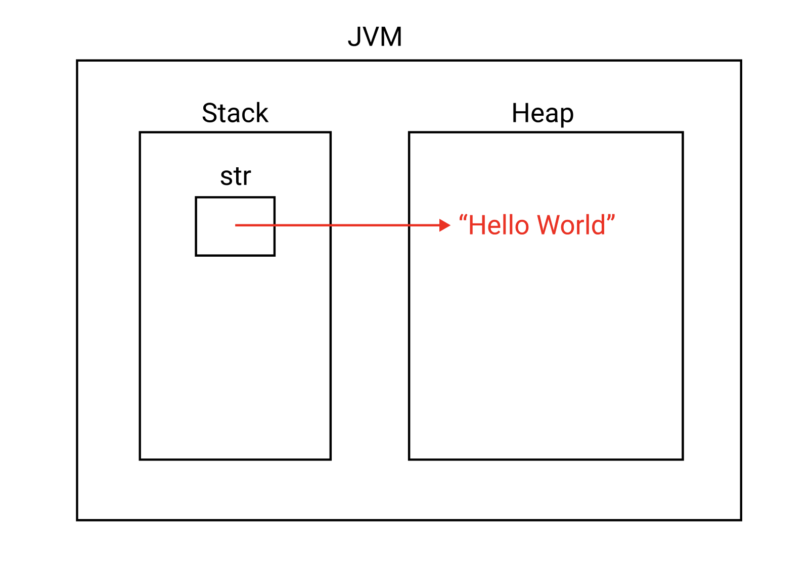

# Table of Contents
[[toc]]


# Java 문자열 다루기
Java에서 문자열을 다루는 대표적인 클래스에는 `String`, `StringBuffer`, `StringBuilder`가 있다.
::: tip
`String`클래스를 제대로 이해하려면 다음 포스트들을 먼저 읽어보길 권장한다.
- [JVM의 메모리 구조](/post/10_java/180104_jvm_memory_structure.html)
- [원시 타입과 참조 타입](/post/10_java/180108_datatype.html#원시-타입과-참조-타입)
- [Mutable과 Immutable](/post/10_java/180504_mutable_immutable.html#가변-객체)
:::


##  문자열 리터럴
Java에서 문자열은 원시 타입이 아니라 참조 타입이다. 문자열은 다음과 같이 생성한다
``` java
String str = "Hello";

// 또는
String str = new String("Hello");
```
문자열은 참조 타입이기 때문에 힙 영역에 저장된다.

문자열을 합칠 때는 `+`연산자를 사용한다. 변수 str에 " world!" 문자열을 추가해보자.
``` java
String str = new String("Hello");
str = str + " world!";
```
문자열은 Immutable Object이기 때문에 메모리 구조는 다음과 같이 동작하는게 아니라

다음과 같이 새로운 String 객체가 생성된다.


## StringBuffer 클래스
이처럼 문자열은 Immutable Object이기 때문에 문자열 추가, 수정, 삭제 등의 연산이 빈번하면 메모리의 힙 영역에 객체가 여러 번 생성되어 성능에 영향을 주게 된다.

이러한 문제를 해결하기 위해 Java는 Mutable Object인 `StringBuffer`와 `StringBuilder`를 도입했다.

`StringBuffer`가 제공하는 `append()`, `insert()`, `delete()`, `replace()` 등의 메소드를 제공하면 동일한 객체에서 문자열을 변경할 수 있다.

`StringBuffer` 예제를 살펴보자. `StringBuffer`는 다음과 같이 생성한다.
``` java
StringBuffer buffer = new StringBuffer("Hello");
```
이제 뒤에 문자열을 붙여보자.
``` java
buffer.append(" world!");
```
위 코드는 아래처럼 객체를 새롭게 생성하는게 아니라

아래처럼 기존 객체의 값을 변경한다.


`StringBuffer`클래스는 다양한 메소드를 지원한다.
### append()
끝에 문자열을 추가한다.
``` java
StringBuilder builder = new StringBuilder("abcd");
builder.append("efg");

System.out.println(builder);    // abcdefg
```
### insert()
특정 위치에 문자열을 추가한다.
``` java
StringBuilder builder = new StringBuilder("1111");
builder.insert(2, 3333);

System.out.println(builder);    // 11333311
```
### delete()
특정 범위의 문자열을 삭제한다.
``` java
StringBuilder builder = new StringBuilder("1122211");
builder.delete(2, 5);

System.out.println(builder);    // 1111
```
### replace()
특정 범위의 문자열을 다른 문자열로 대치한다.
``` java
StringBuilder builder = new StringBuilder("1122211");
builder.replace(2, 5, "aaaa");

System.out.println(builder);    // 11aaaa11
```
### reverse()
문자열을 뒤짚는다.
``` java
StringBuilder builder = new StringBuilder("123456");
builder.reverse();

System.out.println(builder);    // 654321
```
### substring()
문자열의 일부분을 추출한다.
``` java
StringBuilder builder = new StringBuilder("123456");
String substring = builder.substring(0, 3);

System.out.println(substring);    // 123
```
### toString()
`StringBuilder`객체를 `String`객체로 변환한다.
``` java
StringBuilder builder = new StringBuilder("123456");
String str = builder.toString();

System.out.println(str);    // 123456
```


## StringBuilder 클래스
`StringBuilder`는 `StringBuffer`와 사용법이 거의 유사하다. 다만 다음과 같은 차이점이 있다.

|StringBuffer|StringBuilder|
|------|---|
|동기화를 지원한다|동기화를 지원하지 않는다|
|멀티 스레드 환경에서 안전하다|멀티 스레드 환경에서 안전하지 않다.|
|동기화 때문에 성능이 상대적으로 낮다.|성능이 상대적으로 높다.|

따라서 단일 스레드 환경에서는 `StringBuilder`를 사용하고 멀티 스레드 환경에서는 `StringBuffer`를 사용한다. 요약하자면 문자열의 추가, 수정, 삭제가 빈번한 경우 `String`보다 `StringBuffer` 또는 `StringBuilder`클래스를 사용한다.

## String 클래스
`String`클래스에는 문자열 조작을 위한 다양한 메소드가 존재한다.

### toUpperCase()
문자열을 대문자로 변환한다.
``` java
String name = "Leonel Messi";
System.out.println(name.toUpperCase());     // LEONEL MESSI
```
### toLowerCase()
문자열을 소문자로 변환한다.
``` java
String name = "Leonel Messi";
System.out.println(name.toLowerCase());     // leonel messi
```

### substring()
문자열의 일부분을 반환한다.
``` java
String name = "Leonel Messi";
System.out.println(name.substring(0, 6));     // Leonel
```

### trim()
문자열 앞과 뒤의 공백을 제거한다.
``` java
String name = "      Hello     ";
System.out.println(name.trim());     // "Hello"
```

### spilt()
인자로 전달받은 정규표현식 또는 문자를 기준으로 문자열을 나누어 배열에 저장하여 반환한다.
``` java
String name = "aa_bb_cc_dd_ee";
String[] spilt = name.split("_");

for (int i=0; i<spilt.length; i++) {
    System.out.println(spilt[i]);
}
```
```
aa
bb
cc
dd
ee
```

### replace()
특정 문자를 다른 문자로 대치한다.
``` java
String str = "afafaf";
System.out.println(str.replace("a", "c"));      // cfcfcf
```

### replaceAll()
특정 문자열을 다른 문자열로 대치한다.
``` java
String str = "afafaf";
System.out.println(str.replaceAll("af", "19"));     // 191919
```

### startsWith()
문자열이 특정 문자열로 시작하는지 확인한다.
``` java
String str = "abcdef";
System.out.println(str.startsWith("ab"));  // true
System.out.println(str.startsWith("aa"));  // false
```

### endsWith()
문자열이 특정 문자열로 끝나는지 확인한다.
``` java
String str = "abcdef";
System.out.println(str.endsWith("def")); // true
System.out.println(str.endsWith("fff")); // false
```

### length()
문자열의 길이를 반환한다.
``` java
String str = "abcdef";
System.out.println(str.length());   // 6
```

### indexOf()
문자열에서 특정 문자의 인덱스를 반환한다. 특정 문자가 없으면 음수값을 반환한다.
``` java
String str = "abcde";
System.out.println(str.indexOf('b'));   // 1
System.out.println(str.indexOf('z'));   // -1
```

### charAt()
문자열에서 특정 인덱스에 위치하는 문자를 반환한다.
``` java
String str = "abcde";
System.out.println(str.charAt(0));   // a
System.out.println(str.charAt(1));   // b
System.out.println(str.charAt(2));   // c
```

### concat()
문자열 뒤에 추가한다. `+`연산자와 동일하다.
``` java
String str = "aaa";
System.out.println(str.concat("ccc"));  // aaaccc
System.out.println(str + "eee");        // aaaeee
```


### equals()
두 문자열이 동일한지 비교한다.
``` java
String str = "aaa";
System.out.println(str.equals("aaa"));      // true
System.out.println(str.equals("ccc"));      // false
```

### contains()
특정 문자나 문자열이 포함되는지 확인한다.
``` java
String str = "abcde";
System.out.println(str.contains("a"));      // true
System.out.println(str.contains("bcd"));    // true
System.out.println(str.contains("z"));      // false
```

### matches()
문자열이 특정 패턴의 문자열을 포함하는지 확인한다. 특정 패턴은 정규 표현식을 의미한다.
``` java
String str = "aaacccaaa";
System.out.println(str.matches("(.*)ccc(.*)")); // true
```