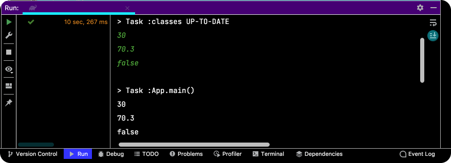
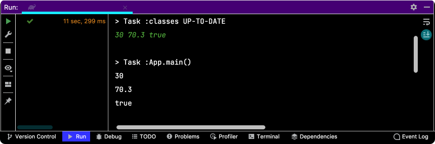
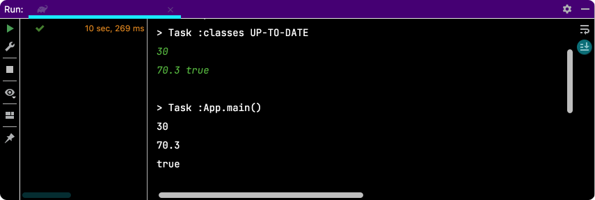
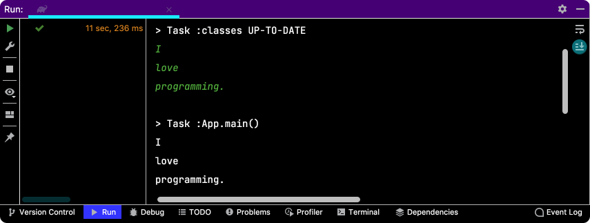

# Table of Contents
[[toc]]

# 입출력
애플리케이션에서는 외부에서 데이터를 읽어오거나 외부로 데이터를 보내는 작업이 빈번하게 일어난다. 외부에서 애플리케이션으로 데이터를 읽어오는 것을 `입력(Input)`, 애플리케이션에서 외부로 데이터를 내보내는 것을 `출력(Output)`이라고 한다.

- 입력
    - 사용자로부터 키보드, 마우스 등으로 데이터를 받아옴
    - 파일에서 데이터를 읽어옴
    - 네트워크를 통해 데이터를 읽어옴

- 출력
    - 모니터에 데이터를 출력하여 보여줌
    - 파일에 데이터를 출력하여 저장함

Java에서는 입출력을 위한 요소들이 `java.io` 패키지에 포함되어있다.

## InputStream, OutputStream
Java에서는 `InputStream`을 통해 입력을, `OutputStream`을 통해 출력을 처리한다. InputStream과 OutputStream은 `1바이트(8비트)` 단위로 데이터를 입출력한다. 문자 뿐만 아니라 이미지, 멀티미디어 등 모든 종류의 데이터를 바이트 단위로 주고받을 수 있다.

InputStream과 OutputStream은 인터페이스며 대표적인 구현체는 다음과 같다.
- FileInputStream, FileOutputStream (기반 스트림)
- BufferedInputStream, BufferedOutputStream (보조 스트림)
- DataInputStream, DataOutputStream (보조 스트림)
- ObjectInputStream, ObjectOutputStream (보조 스트림)


### FileInputStream, FileOutputStream
`FileInputStream`, `FileOutputStream`은 파일에 입출력할 때 사용한다.

`FileInputStream` 예제를 살펴보자. 이미지 파일을 애플리케이션으로 읽어온다.
``` java App.java
public class App {

    public static void main(String[] args) {

        String sourcePath = null;
        InputStream inputStream = null;

        int data = 0;

        try {
            sourcePath = "/Users/yologger/Desktop/folder" + File.separator + "avatar.gif";
            inputStream = new FileInputStream(sourcePath);

            while((data = inputStream.read()) != -1) {
                System.out.println(data);
            }

        } catch(IOException e) {
            e.printStackTrace();
        } finally {
            try {
                inputStream.close();
            } catch (IOException e) {
                e.printStackTrace();
            }
        }
    }
}
```
`FileOutputStream` 예제를 살펴보자. 읽어온 이미지 파일을 다른 이름으로 디렉토리에 복사하고있다.
``` java App.java
import java.io.*;

public class App {

    public static void main(String[] args) {

        String sourcePath = null;
        InputStream inputStream = null;

        String destinationPath = null;
        OutputStream outputStream = null;

        int data = 0;

        try {
            sourcePath = "/Users/yologger/Desktop/folder" + File.separator + "avatar.gif";
            inputStream = new FileInputStream(sourcePath);

            destinationPath = "/Users/yologger/Desktop/folder" + File.separator + "copy.gif";
            outputStream =  new FileOutputStream(destinationPath);

            while((data = inputStream.read()) != -1) {
                outputStream.write(data);
            }

        } catch(IOException e) {
            e.printStackTrace();
        } finally {
            try {
                inputStream.close();
                outputStream.close();
            } catch (IOException e) {
                e.printStackTrace();
            }
        }
    }
}
```

### BufferedInputStream, BufferedOutputStream
`BufferedInputStream`, `BufferedOutputStream`는 보조 스트림으로 버퍼 단위로 입출력하기 때문에 훨씬 효율적인 입출력이 가능하다. 보조 스트림은 기반 스트림을 감싸는 형태로 사용한다.
``` java  {15,16,19,20}
public static void main(String[] args) {

    String sourcePath = null;
    InputStream inputStream = null;
    BufferedInputStream bufferedInputStream = null;

    String destinationPath = null;
    OutputStream outputStream = null;
    BufferedOutputStream bufferedOutputStream = null;

    int data = 0;

    try {
        sourcePath = "/Users/yologger/Desktop/folder" + File.separator + "a.png";
        inputStream = new FileInputStream(sourcePath);
        bufferedInputStream = new BufferedInputStream(inputStream);

        destinationPath = "/Users/yologger/Desktop/folder" + File.separator + "c.png";
        outputStream =  new FileOutputStream(destinationPath);
        bufferedOutputStream = new BufferedOutputStream(outputStream, 16);  // 버퍼로 몇 바이트를 사용할 것인지 지정

        while((data = bufferedInputStream.read()) != -1) {
            bufferedOutputStream.write(data);
        }

    } catch(IOException e) {
        e.printStackTrace();
    } finally {
        try {
            inputStream.close();
            outputStream.close();
        } catch (IOException e) {
            e.printStackTrace();
        }
    }
}
```

### DataInputStream, DataOutputStream
`DataInputStream`, `DataOutputStream` 또한 보조 스트림으로 Java의 원시 타입 단위로 입출력할 수 있다. 
``` java App.java
import java.io.*;

public class App {

    public static void main(String[] args) {

        FileOutputStream fos = null;
        DataOutputStream dos = null;

        FileInputStream fis = null;
        DataInputStream dis = null;

        try {
            String path = "/Users/yologger/Desktop/folder" + File.separator + "store.txt";

            // Write
            fos = new FileOutputStream(path);
            dos = new DataOutputStream(fos);

            dos.writeInt(3);
            dos.writeDouble(183.2);
            dos.writeChar('a');
            dos.writeUTF("Hello World.");

            // Read
            fis = new FileInputStream(path);
            dis = new DataInputStream(fis);

            System.out.println(dis.readInt());      // 3
            System.out.println(dis.readDouble());   // 183.2
            System.out.println(dis.readChar());     // a
            System.out.println(dis.readUTF());      // Hello World.


        } catch (IOException e) {
            e.printStackTrace();
        } finally {
            try {
                dos.close();
                fos.close();
                dis.close();
                fis.close();
            } catch (IOException e) {
                e.printStackTrace();
            }
        }
    }
}
```

### 직렬화
운영체제나 네트워크에는 Java의 객체의 개념이 없다. 그렇다면 어떻게 객체를 운영체제의 파일 시스템에 저장하거나 네트워크로 전송할 수 있을까?

`직렬화(Serialization)`는 객체를 바이트 배열로 변환하여 저장하는 것을 의미한다. `역직렬화(Deserialization)`는 바이트 배열을 다시 객체로 변환하는 것이다.

#### Serializable
직렬화할 클래스는 `Serializable`를 구현해야한다.
``` java Person.java
class Person implements Serializable {
    private String name;
    private String nation;
    private int age;

    public Person(String name, String nation, int age) {
        this.name = name;
        this.nation = nation;
        this.age = age;
    }

    public String getName() {
        return name;
    }

    public void setName(String name) {
        this.name = name;
    }

    public String getNation() {
        return nation;
    }

    public void setNation(String nation) {
        this.nation = nation;
    }

    public int getAge() {
        return age;
    }

    public void setAge(int age) {
        this.age = age;
    }
} 
```

#### ObjectInputStream, ObjectOutputStream
직렬화와 역직렬화에는 보통 `ObjectInputStream`, `ObjectOutputStream`을 사용한다. 두 스트림 모두 보조 스트림이다.
``` java App.java
import java.io.*;

public class App {

    public static void main(String[] args) {

        FileOutputStream fos = null;
        ObjectOutputStream oos = null;

        FileInputStream fis = null;
        ObjectInputStream ois = null;

        Person original = new Person("Ronaldo", "Portugal", 37);

        try {
            String path = "/Users/yologger/Desktop/folder" + File.separator + "store.txt";

            fos = new FileOutputStream(path);
            oos = new ObjectOutputStream(fos);
            oos.writeObject(original);

            fis = new FileInputStream(path);
            ois = new ObjectInputStream(fis);

            Person result = (Person) ois.readObject();

            System.out.println(result.getName());   // Ronaldo
            System.out.println(result.getNation()); // Portugal
            System.out.println(result.getAge());    // 37

        } catch (IOException | ClassNotFoundException e) {
            e.printStackTrace();
        } finally {
            try {
                oos.close();
                fos.close();
                ois.close();
                fis.close();
            } catch(IOException e) {
                e.printStackTrace();
            }
        }
    }
}
```

#### transient
멤버변수에 `transient`을 붙이면 직렬화 대상에서 제외된다.
``` java Person.java
class Person implements Serializable{

    private String name;
    transient private String nation;
    private int age;

    // ...
}
```
`transient`가 붙은 멤버변수를 역직렬화하면 값이 `null`이 된다.
``` java
System.out.println(result.getName());   // Ronaldo
System.out.println(result.getNation()); // null
System.out.println(result.getAge());    // 37
```

## Reader, Writer
`Reader`와 `Writer`는 <b>`문자(char)`</b> 단위 입출력에 사용된다. 이 클래스들은 인터페이스며 대표적인 구현체들은 다음과 같다.
- FileReader, FileWriter (기반 스트림)
- BufferedReader, BufferedWriter (보조 스트림)

### FileReader, FileWriter
`FileReader`, `FileWriter`는 기반 스트림으로 파일에서 문자 단위로 입출력하는데 사용한다.

``` java App.java
public class App {

    public static void main(String[] args) {

        String sourcePath = null;
        FileReader fileReader = null;

        String destinationPath = null;
        FileWriter fileWriter = null;

        try {
            sourcePath = "/Users/yologger/Desktop/folder" + File.separator + "source.txt";
            fileReader = new FileReader(sourcePath);

            destinationPath = "/Users/yologger/Desktop/folder" + File.separator + "copy.txt";
            fileWriter = new FileWriter(destinationPath);

            int data = 0;
            while ((data = fileReader.read()) != -1) {
                // System.out.print((char) data);
                fileWriter.write((char) data);
            }
            fileWriter.flush();

        } catch(IOException e) {
            e.printStackTrace();
        } finally {
            try {
                fileReader.close();
                fileWriter.close();
            } catch (IOException e) {
                e.printStackTrace();
            }
        }
    }
}
```
``` java App.java
public class App {

    public static void main(String[] args) {
        String destinationPath = null;
        FileWriter fileWriter = null;

        try {
            destinationPath = "/Users/yologger/Desktop/folder" + File.separator + "destination.txt";
            fileWriter = new FileWriter(destinationPath);

            fileWriter.write("Ronaldo\n");
            fileWriter.write("Kane\n");
            fileWriter.write("Benzema\n");
            fileWriter.flush();

        } catch(IOException e) {
            e.printStackTrace();
        } finally {
            try {
                fileWriter.close();
            } catch (IOException e) {
                e.printStackTrace();
            }
        }
    }
}
```

### BufferedReader, BufferedWriter
`BufferedReader`, `BufferedWriter`는 보조 스트림으로 버퍼를 사용해서 입출력 효율을 높혀준다.
``` java
public class App {

    public static void main(String[] args) {
        String destinationPath = null;
        FileWriter fileWriter = null;
        BufferedWriter bufferedWriter = null;
        FileReader fileReader = null;
        BufferedReader bufferedReader = null;

        try {
            destinationPath = "/Users/yologger/Desktop/folder" + File.separator + "destination.txt";
            fileWriter = new FileWriter(destinationPath);
            bufferedWriter = new BufferedWriter(fileWriter);

            bufferedWriter.write("Ronaldo");
            bufferedWriter.newLine();
            bufferedWriter.write("Kane");
            bufferedWriter.newLine();
            bufferedWriter.write("Benzema");
            bufferedWriter.newLine();
            bufferedWriter.flush();

            fileReader = new FileReader(destinationPath);
            bufferedReader = new BufferedReader(fileReader);

            String data;
            while((data = bufferedReader.readLine()) != null) {
                System.out.println(data);
            }
        } catch(IOException e) {
            e.printStackTrace();
        } finally {
            try {
                fileWriter.close();
            } catch (IOException e) {
                e.printStackTrace();
            }
        }
    }
}
```
`BufferedWriter`는 `newLine()`이라는 줄 바꿈 메서드를 지원한다. 또한 `BufferedReader`의 `readLine()` 메서드를 사용하면 라인 단위로 데이터를 읽어올 수 있다.

## 표준 입출력
`표준 입출력`은 개발자가 스트림을 생성하지 않아도 시스템이 제공하는 스트림이다. 키보드에서 입력받는 스트림이나 모니터에 출력하는 스트림이 대표적인 표준 입출력과 관련된 스트림이다.
``` java
public class App {

    public static void main(String[] args) {

        try {
            int input = 0;
            
            while((input = System.in.read()) != -1) {
                System.out.println("Input: " + (char)input);
            }
        } catch (IOException e) {
            e.printStackTrace();
        }
    }
}
```

## Scanner
`Scanner`클래스를 사용하면 기본 자료형을 키보드에서 입력받을 수 있다.

### 기본자료형 입력받기
``` java
import java.util.Scanner;

public class App {
    public static void main(String[] args) {

        Scanner in = new Scanner(System.in);

        int age = in.nextInt();
        Double weight = in.nextDouble();
        boolean isMarried = in.nextBoolean();

        System.out.println(age);        // 30
        System.out.println(weight);     // 70.5
        System.out.println(isMarried);  // true
    }
}
```
`nextXXX()`메소드는 <b>공백(띄어쓰기)</b> 또는 <b>개행문자(줄바꿈)</b>를 기준으로 데이터를 읽어들인다.







### 문자열 입력받기
문자열은 `next()` 또는 `nextLine()`을 통해 입력받을 수 있다.

- <b>`next()`</b>: <b>공백(띄어쓰기)</b> 또는 <b>개행문자(줄바꿈)</b>를 기준으로 문자열을 읽어들인다.
- <b>`nextLine()`</b>: <b>개행문자(줄바꿈)</b>를 기준으로 문자열을 읽어들인다.

#### next()
``` java
public class App {
    public static void main(String[] args) {

        Scanner in = new Scanner(System.in);

        String str1 = in.nextLine();
        String str2 = in.nextLine();
        String str3 = in.nextLine();

        System.out.println(str1);
        System.out.println(str2);
        System.out.println(str3);
    }
}
```




#### nextLine()

``` java
public class App {
    public static void main(String[] args) {

        Scanner in = new Scanner(System.in);

        String str1 = in.nextLine();

        System.out.println(str1);
    }
}
```


### Scanner 장단점
`Scanner`는 Stream, Reader, Writer에 비해 쉬운 입출력이 가능하다. 그러나 버퍼 기능이 제공되지 않아 성능이 느리다.

## File 클래스
`File`클래스를 사용하면 파일이라 디렉토리를 쉽게 다룰 수 있다.

### 파일 다루기
``` java App.java
public class App {

    public static void main(String[] args) {

        String path = "/Users/yologger/Desktop/project" + File.separator + "source.txt";
        File file = new File(path);

        System.out.println(file.getName());
        // source.txt

        System.out.println(file.getAbsolutePath());
        // /Users/yologger/Desktop/project/source.txt

        System.out.println(file.getPath());
        // /Users/yologger/Desktop/project/source.txt

        System.out.println(file.exists());
        // true

        System.out.println(file.isFile());
        // true

        System.out.println(file.isDirectory());
        // false
    }
}
```

### 디렉토리 다루기
``` java App.java
public class App {

    public static void main(String[] args) {

        String path = "/Users/yologger/Desktop/project";
        File file = new File(path);

        System.out.println(file.getName());
        // project

        System.out.println(file.getAbsolutePath());
        // /Users/yologger/Desktop/project

        System.out.println(file.getPath());
        // /Users/yologger/Desktop/project

        System.out.println(file.exists());
        // true

        System.out.println(file.isFile());
        // false

        System.out.println(file.isDirectory());
        // true
    }
}
```