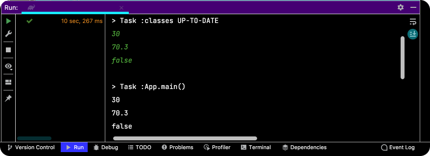
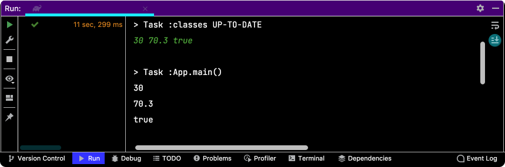
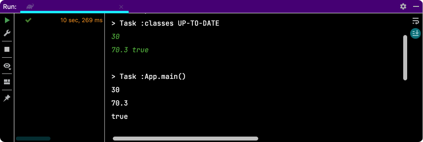
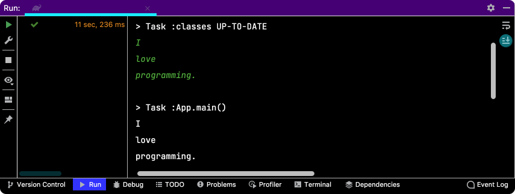
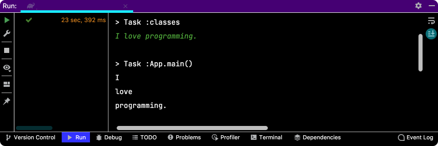
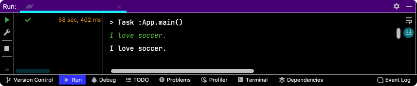

# Table of Contents
[[toc]]

# Scanner
`Scanner`클래스를 사용하면 기본 자료형을 키보드에서 입력받을 수 있다.

## 기본자료형 입력받기
``` java
import java.util.Scanner;

public class App {
    public static void main(String[] args) {

        Scanner in = new Scanner(System.in);

        int age = in.nextInt();
        Double weight = in.nextDouble();
        boolean isMarried = in.nextBoolean();

        System.out.println(age);        // 30
        System.out.println(weight);     // 70.5
        System.out.println(isMarried);  // true
    }
}
```
`nextXXX()`메소드는 <b>공백(띄어쓰기)</b> 또는 <b>개행문자(줄바꿈)</b>를 기준으로 데이터를 읽어들인다.







## 문자열 입력받기
문자열은 `next()` 또는 `nextLine()`을 통해 입력받을 수 있다.

- <b>`next()`</b>: <b>공백(띄어쓰기)</b> 또는 <b>개행문자(줄바꿈)</b>를 기준으로 문자열을 읽어들인다.
- <b>`nextLine()`</b>: <b>개행문자(줄바꿈)</b>를 기준으로 문자열을 읽어들인다.

### next()
``` java
public class App {
    public static void main(String[] args) {

        Scanner in = new Scanner(System.in);

        String str1 = in.nextLine();
        String str2 = in.nextLine();
        String str3 = in.nextLine();

        System.out.println(str1);
        System.out.println(str2);
        System.out.println(str3);
    }
}
```





### nextLine()

``` java
public class App {
    public static void main(String[] args) {

        Scanner in = new Scanner(System.in);

        String str1 = in.nextLine();

        System.out.println(str1);
    }
}
```

