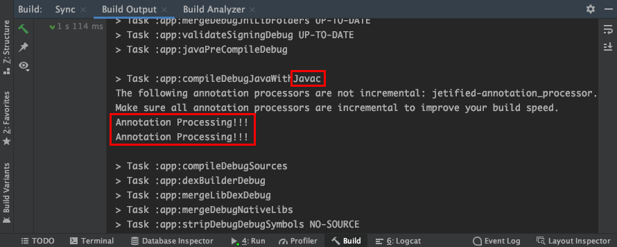

# Table of Contents
[[toc]]

# 어노테이션
Java로 개발을 하다 보면 클래스, 메서드, 변수 앞에 `@Override` 같은 `@` 표시를 많이 봤을 것이다. `@`를 `어노테이션(Annotation)`이라고 한다.

어노테이션은 <u>컴파일 타임이나 런타임에 특정 처리를 하도록 컴파일러에게 정보를 제공</u>한다. 이를 통해 소스코드 작성 단계에서 보일러코드를 제거하고 소스코드를 간결하게 작성할 수 있다. 컴파일 과정에서 어노테이션을 처리하여 데이터를 검증할 수 있으며, 소스코드를 추가하거나 변경할 수도 있기 때문이다. 

`어노테이션`은 크게 세 가지 용도로 사용된다.
1. 컴파일 과정에서 에러나 경고를 감지하도록 컴파일러에게 정보를 제공
2. 컴파일 과정에서 특정 코드를 생성하도록 컴파일러에게 정보를 제공
3. 런타임에서 특정 기능을 실행하도록 정보를 제공

## 어노테이션 사용법
어노테이션을 통해 데이터를 검증하는 예제를 살펴보자. 아래 코드는 두 인자의 합을 반환하는 함수다. 
``` java
int sum(int a, int b) {
    return a+b;
}

int result = sum(30, 10)
```
두 인자의 범위를 제한하기 위해 어노테이션을 붙여보자. 자바 API에서 기본으로 제공하는 빌트인 어노테이션 `@IntRange`를 사용하고 있다.
``` java
int sum(@IntRange(from = 0, to = 10) int a, @IntRange(from = 0, to = 10) int b) {
    return a+b;
}

int result = sum(30, 10)    // 아래와 같은 에러가 발생하며 컴파일 자체가 되지 않는다.
// Value must be ≤ 10 (was 20)
```
어노테이션 덕분에 우리는 `sum()`함수 안에서 범위를 확인하는 코드를 작성하지 않아도 된다. 이처럼 `어노테이션`은 보일러 코드를 제거하고 데이터를 검증하는데 활용할 수 있다. 


## 커스텀 어노테이션 만들기
커스텀 어노테이션을 만들 때는 키워드 `@interface`를 사용한다.
``` java
@interface CustomAnnotation {
    // ..
}
```


## 어노테이션 위치
어노테이션은 클래스에 붙일 수 있다.
``` java
@CustomAnnotation
class Person {
    // ..
}
```
어노테이션은 클래스의 멤버변수에도 붙일 수 있다.
``` java
class Person {
    
    @CustomAnnotation 
    String name;
    
    Person() {
        this.name ="";
    }
}
```
메소드에도 붙일 수 있다.
``` java
class Person {

    // ...

    @CustomAnnotation
    void printName() {
        // ...
    }
}
```
메소드 인자에도 어노테이션을 붙일 수 있다.
``` java
class Person {

    void printSomething(@CustomAnnotation String something) {
        // ...
    }
}
```

## 어노테이션은 어떻게 처리되는가?
다음 예제를 살펴보자
``` java
int sum(@IntRange(from = 0, to = 10) int a, @IntRange(from = 0, to = 10) int b) {
    return a+b;
}

int result = sum(30, 10)
```
어노테이션 `@IntRange`를 통해 데이터 유효성을 검증하고있다. 그렇다면 실제로 유효성을 검사하는 코드는 어디에 존재할까? 이를 이해하기 위해서는 어노테이션 프로세서에 대해 알아야한다.

### 어노테이션 프로세싱
`어노테이션 프로세싱`은 자바 컴파일러가 컴파일 단계에서 어노테이션을 분석하고 처리하는 기법이다. 

`자바 컴파일러`는 자바 소스코드를 자바 바이트코드로 변환한다. 이때 `어노테이션 프로세서(Annotation Processor)`를 플러그인 형태로 자바 컴파일러에 등록하면 어노테이션을 처리하게 된다.

### 자바 컴파일러와 어노테이션 프로세서
자바 컴파일러는 등록된 어노테이션 프로세서가 모두 처리될 때까지 반복하여 실행한다. 이 때 어노테이션 프로세서에 구현된 로직에 따라 경고나 에러를 발생시키기도, 추가적인 자바코드를 추가하기도 한다. 자바 컴파일러는 이렇게 최종적으로 완성된 자바 소스코드를 자바 바이트코드로 변환한다. 

###  설정
사용하는 IDE에 따라 어노테이션 프로세서를 등록하는 방법이 다르다. 이 포스트에서는 `Android Studio`를 기준으로 설명한다.

우선 다음과 같이 새로운 프로젝트를 생성하고 세 개의 모듈을 생성한다.


각 모듈에 의존성을 추가한다.

``` groovy
// app/build.gradle
implementation project(':annotation')
annotationProcessor project(':annotation_processor')
```

``` groovy
// annotation_processor/build.gradle
dependencies {
    implementation project(':annotation')
}
```

### 어노테이션 만들기
설정이 끝났다면 `annotation`모듈에 `MyAnnotation.java`파일을 생성한다.


``` java
package com.yologger.annotation;

public @interface MyAnnotation {
    // ...
}
```
### 어노테이션 프로세서 만들기
`annotation_processor`모듈에 다음과 같이 `MyAnnotation.java`파일을 생성하자.


어노테이션을 프로세서를 구현할 땐 `AbstractProcessor`를 상속해야한다. 또한 `process()`메소드를 구현해야한다. 이 메소드 안에서 실제로 어노테이션 처리를 하게된다. 

``` java
public class MyAnnotationProcessor extends AbstractProcessor {

    @Override
    public boolean process(Set<? extends TypeElement> set, RoundEnvironment roundEnvironment) {
        return false;
    }
}
```
어노테이션을 사용하면 "Annotation Processing!!!"를 출력하도록 코드를 작성해보자.
``` java
public class MyAnnotationProcessor extends AbstractProcessor {

    @Override
    public synchronized void init(ProcessingEnvironment processingEnvironment) {
        // 프로세싱에 필요한 기본적인 정보들을 processingEnvironment 부터 가져올 수 있다.
        super.init(processingEnvironment);
    }

    @Override
    public boolean process(Set<? extends TypeElement> set, RoundEnvironment roundEnvironment) {
        // 프로세싱이 되는지 확인하기 위한 로그입
        System.out.println("Annotation Processing!!!");
        return false;
    }

    @Override
    public SourceVersion getSupportedSourceVersion() {
        // 지원되는 소스 버전을 리턴합니다.
        return SourceVersion.latestSupported();
    }

    @Override
    public Set<String> getSupportedAnnotationTypes() {
        // 어떤 애노테이션을 처리할 지를 Set에 추가한다.
        return new HashSet<String>() {
            {
                add(MyAnnotation.class.getCanonicalName());
            }
        };
    }
}
```
- `init()`: 파일을 생성하기 위해 필요한 FileWriter, 디버깅에 필요한 Messager 등 각종 유틸리티 클래스들을 이 곳에서 사용할 수 있다.
- `process()`: 프로세서의 핵심 부분이다. 이곳에서 클래스, 메소드, 필드 등에 추가한 어노테이션을 처리하고 처리에 대한 결과로 자바 파일을 생성할 수 있다.
- `getSupportedAnnotationType()`: 어떤 어노테이션들을 처리할 지 `집합(Set)` 형태로 리턴하게 된다.
- `getSupportedSourceVersion()`: 일반적으로 최신의 Java 버전을 리턴한다.

### 어노테이션 프로세서 등록하기
어노테이션 프로세서를 구현했다면 자바 컴파일러가 사용할 수 있도록 등록해야한다. 

`annotation_processor`모듈에 다음과 같이 폴더를 생성한다.

```
annotation_processor/src/main/resources/META-INF/services
```
그 다음 파일을 하나 생성한다. 파일명은 반드시 다음과 같아야한다.
```
javax.annotation.processing.Processor
```


이제 파일을 열어 위에서 작성한 어노테이션 프로세서를 등록하자. 이때 반드시 프로젝트의 패키지명을 포함해서 작성해야한다.
```
com.yologger.annotation_processor.MyAnnotationProcessor
```
이제 `app`모듈을 빌드해보자. 어노테이션 프로세서가 정상적으로 작동되었다면, 다음과 같은 로그를 확인할 수 있다.




### auto-service 라이브러리
구글의 `auto-service 라이브러리`를 사용하면 위의 번거로운 등록 과정없이 자동으로 어노테이션 프로세서를 컴파일러에 등록해준다.

`annotation_processeor`모듈에 다음과 같이 auto-service 라이브러리 의존성을 추가한다.
``` groovy
// annotation_processor/build.gradle

dependencies {
    implementation 'com.google.auto.service:auto-service:1.0-rc5'
}
```

그 다음 어노테이션 프로세서 클래스에 다음과 같이 `@AutoService(Processor.class)`어노테이션을 추가하자.
``` java
@AutoService(Processor.class)
public class CharlesProcessor extends AbstractProcessor {
    ...
}
```
이제 `app`모듈을 다시 빌드하면 어노테이션 프로세서가 자동으로 등록되고 동작한다.

## 내장 어노테이션
Java API는 사전에 정의된 내장 어노테이션을 제공한다. 내장 어노테이션은 `java.lang` 또는 `java.annotation` 패키지에 포함된다. 자주 사용되는 내장 어노테이션은 다음과 같다.

### @override
`@override`는 부모 클래스의 메소드를 재정의했다는 것을 알려준다.
``` java Person.java
class Person {
    void work() {
        System.out.println("Work");
    }
}
```
``` java Musician.java
class Musician extends Person {
    @override
    void work() {
        System.out.println("Sing");
    }
}
```

### @Deprecated
`@deprecated`는 앞으로 사용하지 않을 코드임을 표시한다.
``` java Calculator.java
class Calculator {
    int plus(int a, int b) {
        return a+b;
    }

    @Deprecated
    int minus(int a, int b) {
        return a-b;
    }
}

public class App {
    public static void main(String[] args) {
        Calculator calculator = new Calculator();
        calculator.minus();
    }
}
```
이 어노테이션이 붙은 코드를 사용하면 경고를 보여준다.
```
Warning: java: minux() has been deprecated
```

### @SuppressWarnings
경고를 무시하도록 컴파일러에게 지시한다.

### @FunctionalInterface
Java 8부터 추가되었으며, 함수형 인터페이스를 정의하는데 사용된다.
``` java
@FunctionalInterface
interface Lambda {
    void execute(String name);
}
``` 
``` java
Lambda printName = (String name) -> {
    System.out.println(name);
};

printName.execute("Paul");
```

### @Documented
javadoc 같은 문서화 도구로 코드를 문서화할 때 해당 어노테이션을 문서에 표시한다.

### @Target
어노테이션의 적용 범위를 지정할 수 있다. 예제를 살펴보자.
``` java
@Target(ElementType.FIELD)
public @interface First {}
```
커스텀 어노테이션 `First`를 정의하고 있다. 이 어노테이션은 필드에만 적용할 수 있다.

또 다른 예제를 살펴보자.
``` java
@Target({ElementType.FIELD, ElementType.METHOD})
public @interface Second {}
```
이 어노테이션은 필드와 메소드에만 적용할 수 있게 된다.

인자로는 다음과 같은 enum `ElementType`이 올 수 있다.

|이름|설명|
|------|---|
|TYPE|class, interface, annotation, enum에 적용 가능|
|FIELD|class, interface의 필드에만 적용 가능|
|METHOD|메소드에만 적용 가능|
|PARAMETER|함수의 파라미터에만 적용 가능|
|CONSTRUCTOR|생성자에만 적용 가능|
|LOCAL_VARIABLE|지역변수에만 적용 가능|
|ANNOTATION_TYPE|어노테이션에만 적용 가능|
|PACKAGE|패키지에만 적용 가능|
|TYPE_PARAMETER|어노테이션의 타입 파라미터에만 적용 가능|

### @Retention
어노테이션의 유지 범위를 지정할 수 있으며, 세 가지의 enum `RetentionPolicy` 값이 올 수 있다.

|이름|설명|
|------|---|
|SOURCE|어노테이션이 소스코드에서만 유지된다. 컴파일 시점에 어노테이션이 사라진다.|
|CLASS|어노테이션이 .class 파일에서도 유지된다. 런타임에서 실행될 때는 어노테이션이 사라진다.|
|RUNTIME|어노테이션이 JVM에서 실행될 때에도 유지된다.|