# Table of Contents
[[toc]]

# Thread
`스레드(Thread)`를 사용하면 동시성 처리를 할 수 있다.

## Thread 사용법
Java에서 두 가지 방법으로 Thraed를 생성할 수 있다.

### Runnable 
첫 번째 방법은 `Runnable`인터페이스를 구현하는 것이다.
``` java MyRunnable.java
class MyRunnable implements Runnable {

    @Override
    public void run() {
        System.out.println("name: " + Thread.currentThread().getName());
    }
}
```
``` java Main.java
public class Main {

    public static void main(String[] args) {

        Thread thread = new Thread(new MyRunnable());

        System.out.println("name: " + Thread.currentThread().getName());
        thread.start();
    }
}
```
다음과 같이 단축할 수도 있다.
``` java Main.java
public class Main {

    public static void main(String[] args) {

        Thread thread = new Thread(new Runnable() {
            @Override
            public void run() {
                System.out.println("name: " + Thread.currentThread().getName());
            }
        });
        
        thread.start();
    }
}
```

### Thread
두 번째 방법은 `Thread`클래스를 상속하는 것이다.
``` java MyThread.java
class MyThread extends Thread {
    @Override
    public void run() {
        System.out.println("name: " + Thread.currentThread().getName());
    }
}
```
``` java Main.java
public class Main {

    public static void main(String[] args) {

        Thread thread = new MyThread();
        
        System.out.println("name: " + Thread.currentThread().getName());
        thread.start();
    }
}
```

## Thread의 상태
스레드는 크게 네 가지 상태를 가지고 있다.
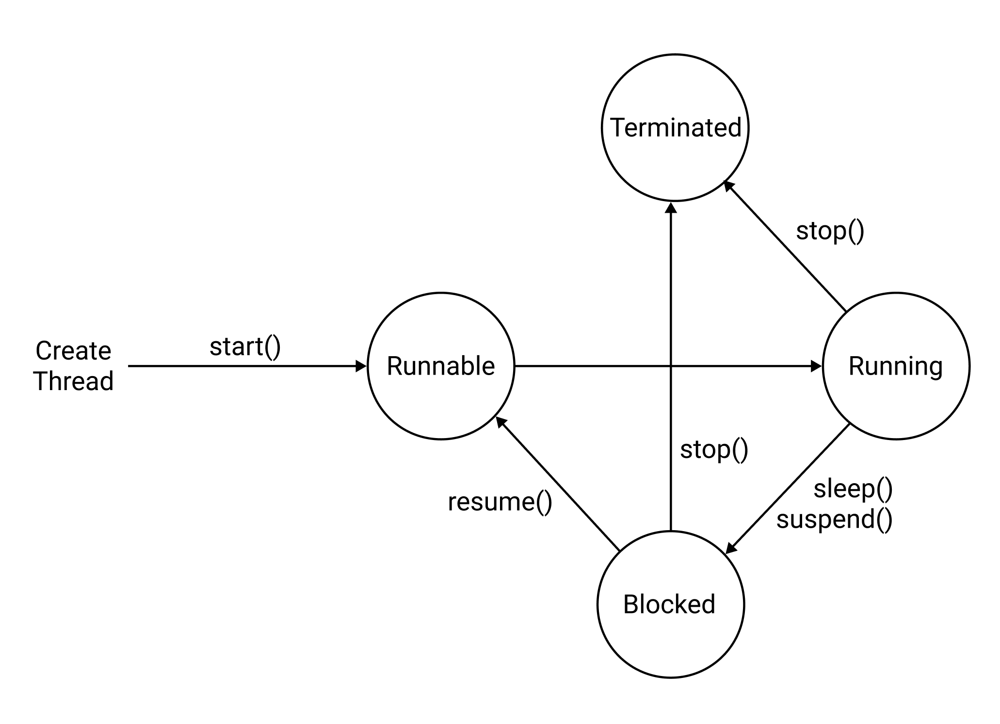

### Runnable
스레드를 생성하고 `start()`를 호출하면 `Runnable`상태가 된다.
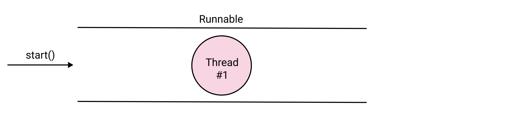
주목할 점은 `Runnable`상태는 아직 스레드가 실행 중인 상태가 아니다.

### Running
`Running`은 스레드가 실행 중인 상태다.
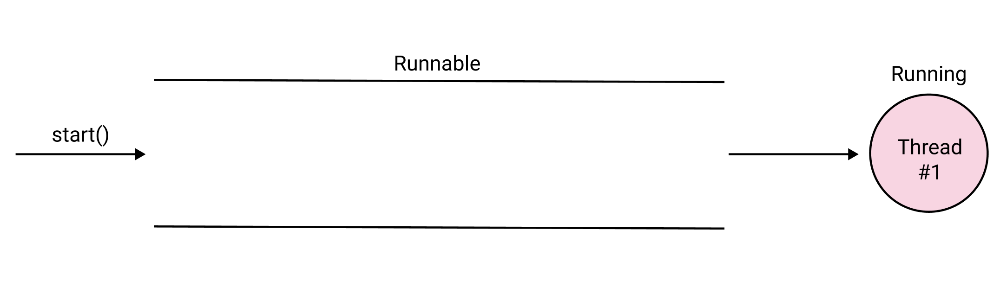
`Runnable`과 `Running`상태를 구분한 이유는 여러 스레드가 존재할 수 있기 때문이다.
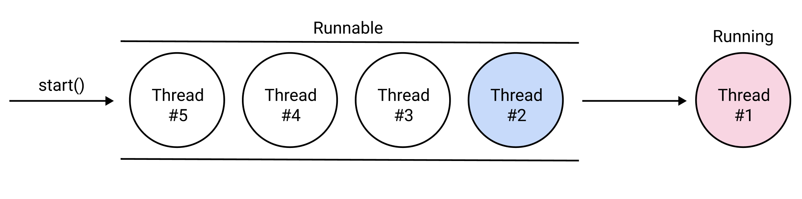
`Thread`클래스의 `start()`를 호출하면 Thread가 순서대로 Queue에 들어가며, 여기에서 `Runnable`상태로 대기하고 있다. 그리고 가장 먼저 들어온 Thread가 `Running`상태로 실행된다.

### Blocked
스레드가 일시중지 상태로 들어간다.

### Terminated
스레드가 종료되어 메모리에서 사라진다.

## 스레드 실행 제어
 
멀티 스레드 환경에서는 다양한 함수로 실행을 제어할 수 있다.
- sleep()
- join()
- suspend()
- resume()
- yield()

### sleep()
`sleep()`은 현재 스레드를 일정 시간동안 일시중지시킨다.
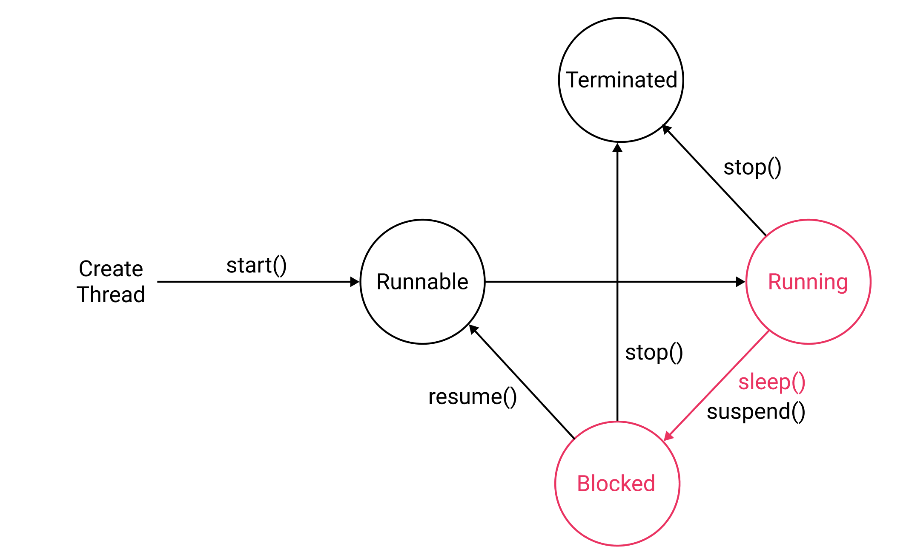
`sleep()`을 호출하기 전 상태가 다음과 같다면

`sleep()`을 호출하면 다음 상태가 된다.
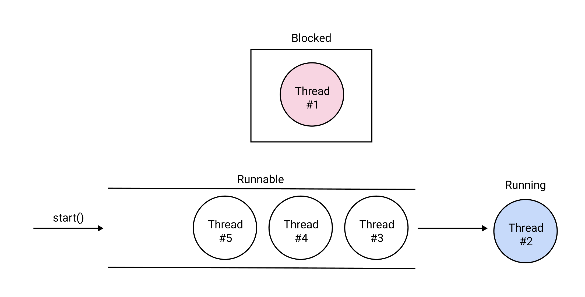
일정 시간이 지나면 다음 상태가 된다.
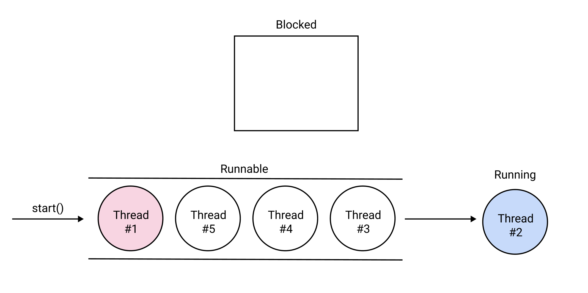
예제를 살펴보자.
``` java Main.java
public class Main {

    public static void main(String[] args) {
        System.out.println("Before Sleep");

        try {
            // 현재 스레드를 5초 동안 일시중지
            Thread.sleep(5 * 1000);
        } catch (InterruptedException e) {
            e.printStackTrace();
        } finally {
            System.out.println("After Sleep");
        }
    }
}
```
결과는 다음과 같다.
```
Before Sleep    // 앱 실행 시 바로 출력
After Sleep     // 5초 뒤 출력
```
### join()
`join()`은 다른 스레드가 종료될 때까지 기다린다.

`join()`을 사용하지 않는 예제를 살펴보자. `WorkerThread`는 5초 뒤에 로그를 출력한다
``` java WorkerThread.java
class WorkerThread extends Thread {
    @Override
    public void run() {
        try {
            Thread.sleep(5 * 1000);
        } catch (InterruptedException e) {
            e.printStackTrace();
        } finally {
            System.out.println("run() from WorkerThread");
        }
    }
}
```
`Main`클래스는 다음과 같다.
``` java Main.java
public class Main {

    public static void main(String[] args) {

        WorkerThread workerThread = new WorkerThread();
        workerThread.start();

        System.out.println("run() from MainThread");
    }
}
```
결과는 다음과 같다.
```
run() from MainThread       // Main Thread에서 바로 출력
run() from WorkerThread     // Worker Thread에서 5초 뒤 출력
```
이제 `join()`을 추가해보자.
``` java Main.java
public class Main {

    public static void main(String[] args) {

        WorkerThread workerThread = new WorkerThread();
        workerThread.start();

        try {
            // 다음 코드를 실행하지 않고 WorkerThread가 종료될 때 까지 기다린다.
            workerThread.join();
        } catch (InterruptedException e) {
            e.printStackTrace();
        }

        System.out.println("run() from MainThread");
    }
}
```
결과는 다음과 같다.
```
run() from WorkerThread     // 5초 뒤 출력
run() from MainThread
```

### suspend()
`suspend()`는 스레드를 일시정지시킨다.
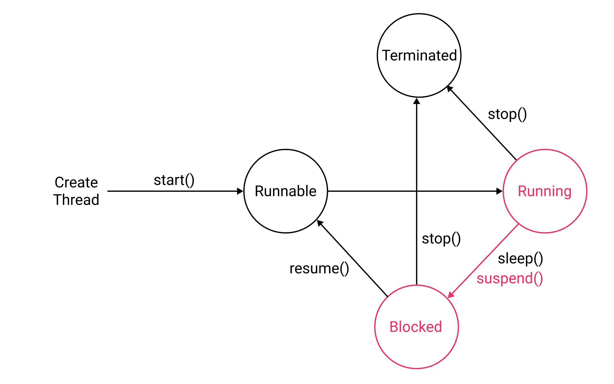
`suspend()`을 호출하기 전 상태가 다음과 같다면
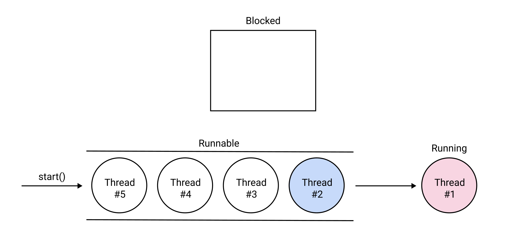
`suspend()`을 호출하면 다음 상태가 된다.
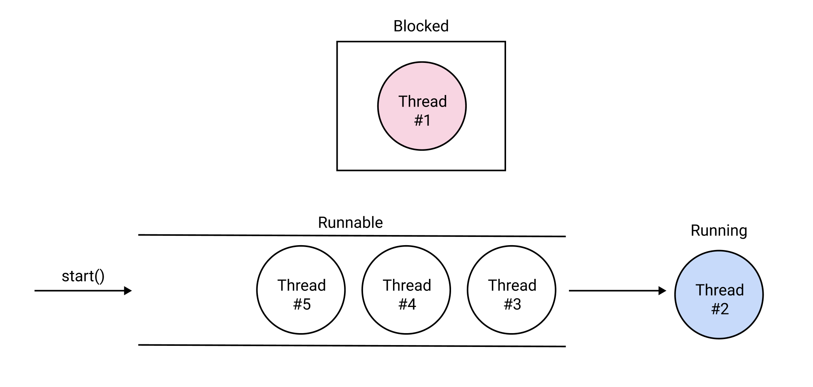

### resume()
`resume()`는 스레드를 재개한다.
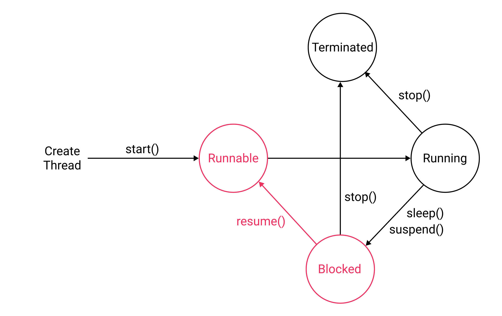
`resume()`을 호출하기 전 상태가 다음과 같다면

`resume()`을 호출하면 다음 상태가 된다.
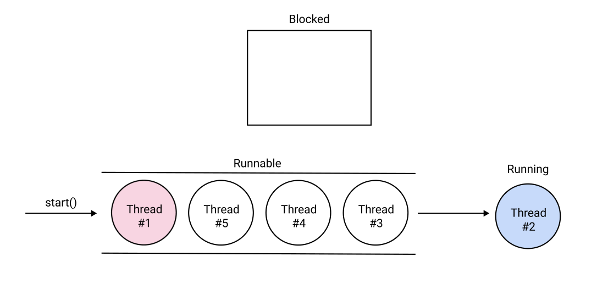

### stop()
`stop()`는 스레드를 종료시킨다.
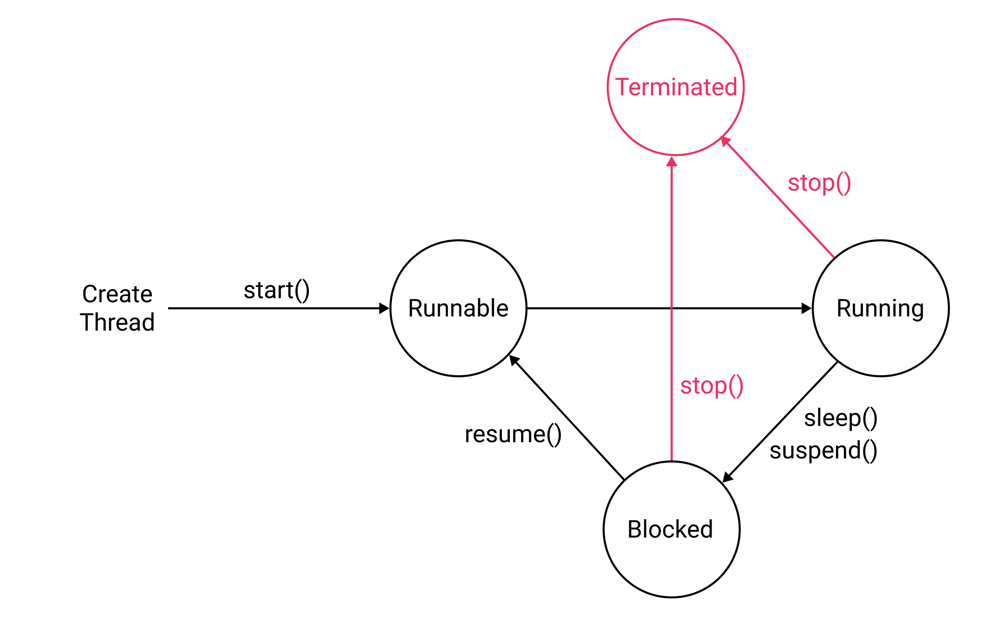
`stop()`을 호출하기 전 상태가 다음과 같다면
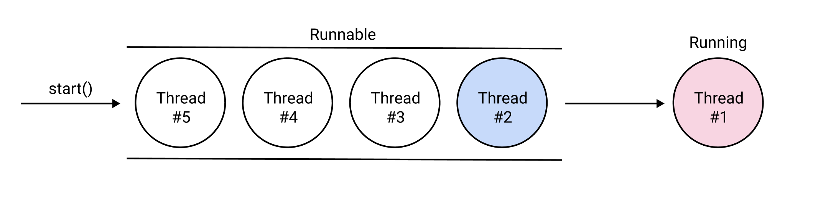
`stop()`을 호출하면 다음 상태가 된다.
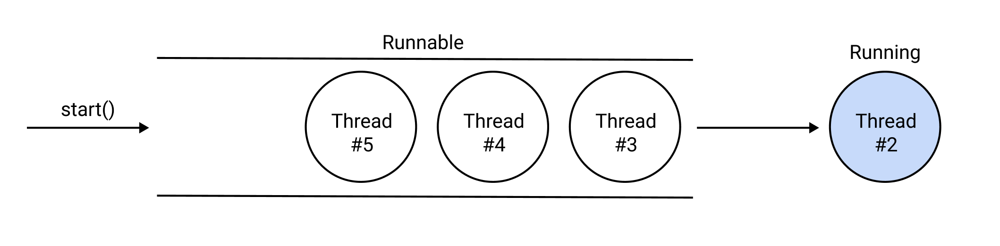


### 예제

예제를 살펴보자. `WorkerThread`는 1초에 한번씩 로그를 출력한다.
``` java WorkerThread.java
class WorkerThread extends Thread {
    @Override
    public void run() {
        while (true) {
            try {
                Thread.sleep(1 * 1000);
            } catch (InterruptedException e) {
                e.printStackTrace();
            } finally {
                System.out.println("run() from WorkerThread");
            }
        }
    }
}
```
``` java Main.java
public class Main {

    public static void main(String[] args) {

        WorkerThread workerThread = new WorkerThread();
        workerThread.start();

        try {
            // 현재 스레드를 5초 일시정지
            Thread.sleep(5 * 1000);

            // WorkerThread를 일시정지
            workerThread.suspend();

            // 현재 스레드를 5초 일시정지
            Thread.sleep(5 * 1000);

            // WorkerThread를 재개
            workerThread.resume();

            // 현재 스레드를 5초 일시정지
            Thread.sleep(5 * 1000);

            // WorkerThread를 종료
            workerThread.stop();
        } catch (InterruptedException e) {
            e.printStackTrace();
        }
    }
}
```
결과는 다음과 같다.
```
// 5초 뒤부터 1초 마다 출력
run() from WorkerThread
run() from WorkerThread
run() from WorkerThread
run() from WorkerThread

// 5초 동안 일시정지

// 다시 1초 마다 출력
run() from WorkerThread
run() from WorkerThread
run() from WorkerThread
run() from WorkerThread
run() from WorkerThread
run() from WorkerThread

// 종료
```

### yield()
`yield()`는 현재 실행 중인 스레드를 중지하거나 종료하진 않는다. 다만 대기중인 스레드가 먼저 실행되도록 양보한다.
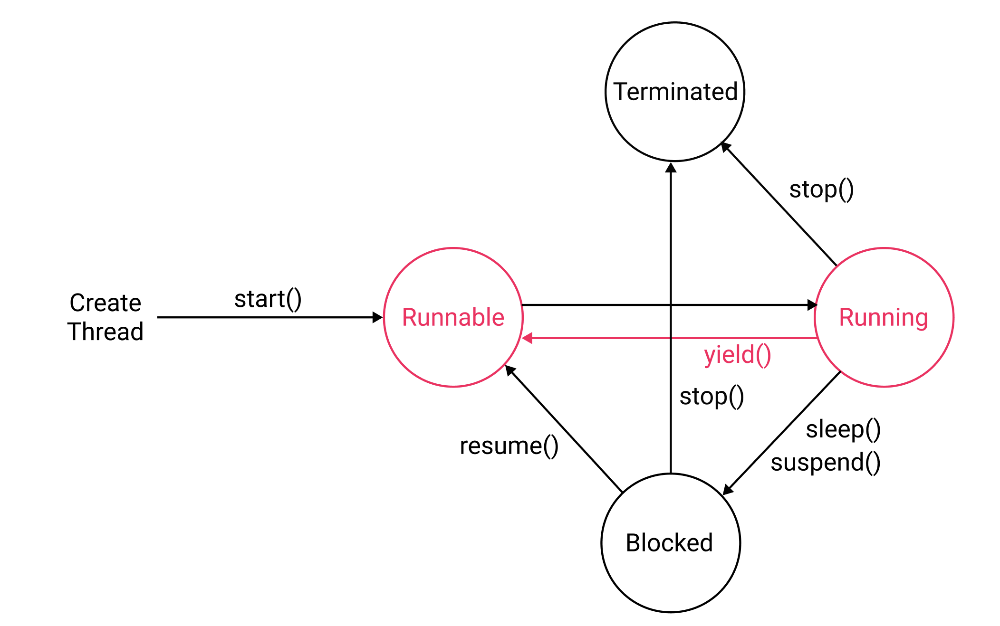
`yield()` 호출 전 상태가 다음과 같다면
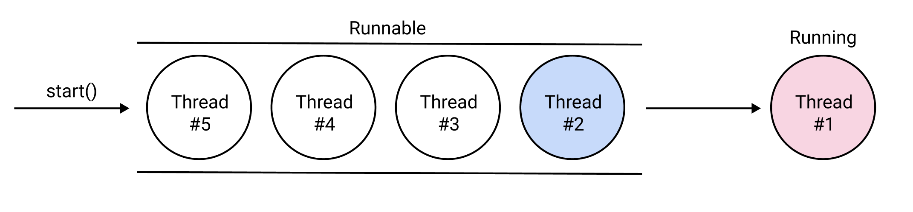
`yield()` 호출 후 상태는 다음과 같아진다.
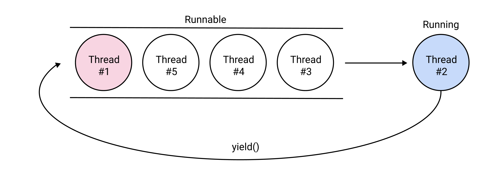

## 스레드 동기화
멀티 스레드 환경에서는 여러 스레드가 한 데이터을 동시에 조작할 수 있다. 이 때문에 결과를 예측할 수 없게 될 수도 있다.
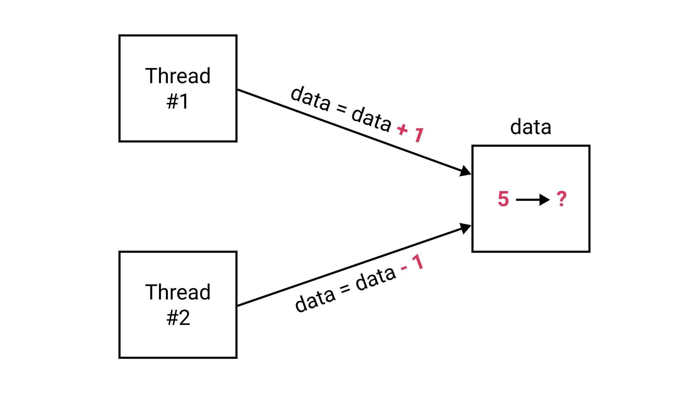
이 때문에 하나의 스레드가 데이터를 조작할 때 다른 스레드가 데이터를 조작할 수 없도록 공유데이터에 `락(Lock)`을 걸 수 있다. 이를 `동기화(Synchronization)`이라고 한다.

예제를 살펴보자. 잔고 데이터를 가지고 있는 계좌인 `Account`클래스는 다음과 같다. 
``` java Account.java
class Account {

    private int balance = 1000;

    public int getBalance() {
        return balance;
    }

    public void withdraw(int money) {
        if (balance >= money) {
            try {
                Thread.sleep(1000);
                balance -= money;
            } catch (InterruptedException e) {
                e.printStackTrace();
            }
        }
    }
}
```
`WorkerThread`클래스는 다음과 같다. 이 스레드는 잔고가 0원 이상일 때만 200원 인출을 요청한다. 
``` java WorkerThread.java
class WorkerThread extends Thread {
    private Account account;

    WorkerThread(Account account) {
        this.account = account;
    }

    @Override
    public void run() {
        while (account.getBalance() > 0) {
            account.withdraw(200);
            System.out.println("Balance: " + account.getBalance());
        }
    }
}
```
`Main`클래스는 다음과 같다.
``` java Main.java
public class Main {

    public static void main(String[] args) {
        Account account = new Account();

        WorkerThread t1 = new WorkerThread(account);
        WorkerThread t2 = new WorkerThread(account);

        t1.start();
        t2.start();
    }
}
```
애플리케이션을 실행하면 다음과 같이 출력된다.
```
Balance: 600
Balance: 600
Balance: 400
Balance: 200
Balance: -200
Balance: -200
```
논리적으로는 출금(`withdraw()`)을 호출할 때 출금액이 잔액보다 크면 잔액에서 출금을 마이너스하면 안된다. 
``` java
public void withdraw(int money) {
    if (balance >= money) {
        try {
            Thread.sleep(1000);
            balance -= money;
        } catch (InterruptedException e) {
            e.printStackTrace();
        }
    }
}
```
그러나 두 스레드가 공유 데이터에 동시에 접근하기 때문에 잔액이 마이너스 값으로 출력된다. 따라서 동기화가 필요하다. 

동기화는 두 가지 방법으로 할 수 있다.

### synchronized method
공유 데이터에 접근하는 메소드에 `synchronized` 키워드를 붙이면 된다.
``` java
public synchronized void withdraw(int money) {
    if (balance >= money) {
        try {
            Thread.sleep(1000);
            balance -= money;
        } catch (InterruptedException e) {
            e.printStackTrace();
        }
    }
}
```
특정 스레드가 `synchronized`메소드를 실행할 때 메소드 안에서 접근하는 데이터에 `락(Lock)`을 건다. 락이 걸린 상태에서 다른 스레드가 이 메소드를 호출하면 락이 풀릴 때까지 기다리게 된다.

### synchronized data
공유 데이터 자체에 `synchronized` 키워드를 붙일 수도 있다.
``` java
public void withdraw(int money) {
    synchronized (this) {
        if (balance >= money) {
            try {
                Thread.sleep(1000);
                balance -= money;
            } catch (InterruptedException e) {
                e.printStackTrace();
            }
        }
    }
}
```

## 데드락
동기화 과정에서 가장 조심해야할 부분이 데드락이다. `데드락(Deadlock)`은 두 스레드가 서로 상대방이 락을 풀 때까지 기다리고 있기 때문에 결과적으로 아무것도 하지 못하는 상태를 가리킨다.

이때 `Object` 클래스에 정의된 `wait()`, `notify()`, `notifyAll()`을 사용하면 동기화의 효율을 높일 수 있다.

### wait()
한 스레드가 자원에 락을 걸고 오래 기다리는 대신 다른 스레드에게 제어권을 넘겨주고 대기 상태로 들어간다.

### notify()
다른 스레드는 작업을 하다가 `notify()`를 호출하며, 대기 상태에 들어갔던 스레드가 다시 실행 상태가 된다.

`Account`클래스 예제에 `wait()`와 `notify()`를 적용하면 다음과 같다.
``` java Account.java
class Account {

    private int balance = 1000;

    public int getBalance() {
        return balance;
    }

    // 인출
    public synchronized void withdraw(int money) {
        while (balance < money) {
            try {
                Thread.sleep(1000);
                wait()
            } catch (InterruptedException e) {
                e.printStackTrace();
            }
        }
        balance -= money;
    }

    // 예금
    public synchronized void deposit(int money) {
        balance += money;
        notify();
    }
}
```