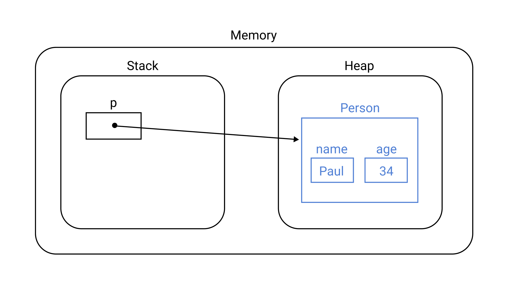
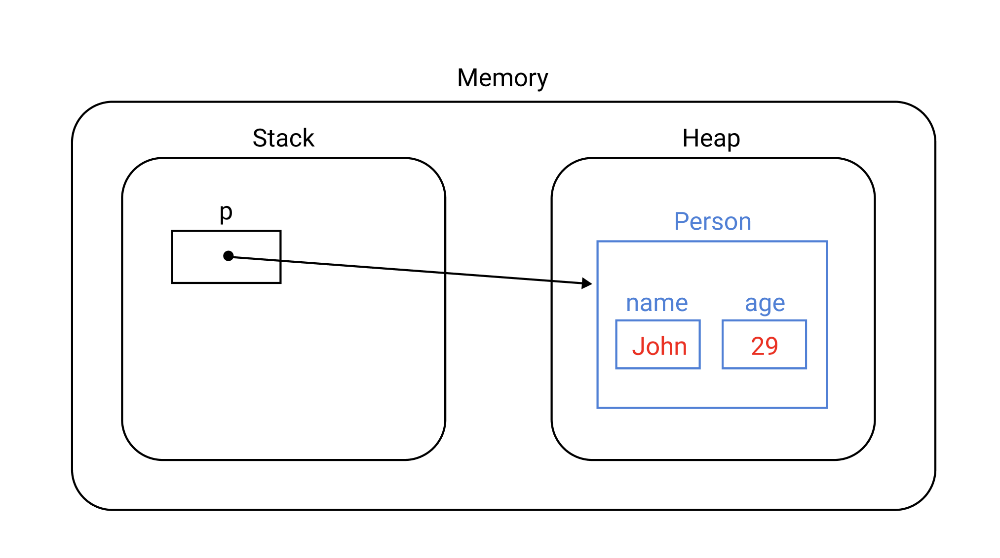
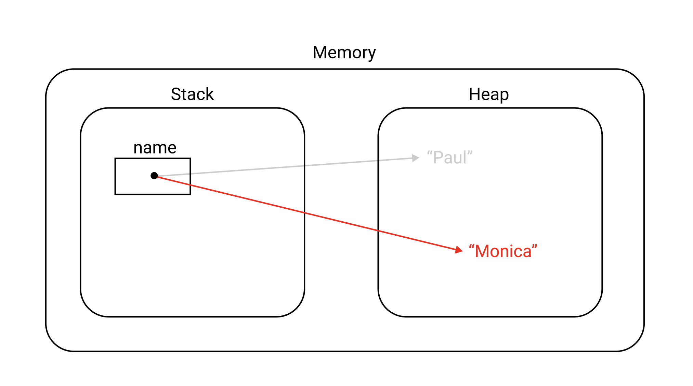

# Table of Contents
[[toc]]

# 가변 객체와 불변 객체
`가변 객체`와 `불변 객체`에 대해 알아보자.

## 가변 객체
객체 지향 프로그래밍에서 `가변 객체(Mutable Object)`는 생성 후 상태를 바꿀 수 있는 객체를 의미한다.

Java에서는 `String`클래스와 `Wrapper`클래스를 제외한 대부분의 객체가 `Mutable`하다.

예제를 살펴보자. 다음과 같이 객체를 생성하면
``` java
// 객체 생성
Person p = new Person("Paul", 34);
```
메모리 상에서 객체의 상태는 다음과 같다.



객체의 상태를 변경하면
``` java
// 상태 변화
p.setName("John");
p.setAge(29);
```
메모리 상에서 객체의 상태는 다음과 같이 변한다.



이처럼 `Mutable Object`은 객체를 생성한 후 상태를 바꿀 수 있는 객체를 의미한다. List, Set, Map 같은 `Collection`객체도 Mutable Object에 포함된다.
``` java
// 객체 생성
List<String> players = new ArrayList<String>();

// 상태 변화 - 요소 추가
players.add("Joey");
players.add("Ross");
players.add("Rachel");

// 상태 변화 - 요소 삭제
players.remove(0);
```


## 불변 객체
객체 지향 프로그래밍에서 `불변 객체(Immutable Object)`는 생성 후 상태를 바꿀 수 없는 객체를 의미한다.

Java에서 `문자열 리터럴`은 대표적인 `Immutable Object`다. 예제를 살펴보자.
``` java
String name = "Paul";
name = "Monica";
```
위 예제를 보고 객체를 변경하고 있다고 생각할 수 있다. 하지만 위 코드는 객체를 변경하는 것이 아니라 새로운 객체를 생성한 후 참조값을 변경하는 것이다.



이러한 점에서 `문자열 리터럴`은 Immutable Object라 할 수 있다. 
