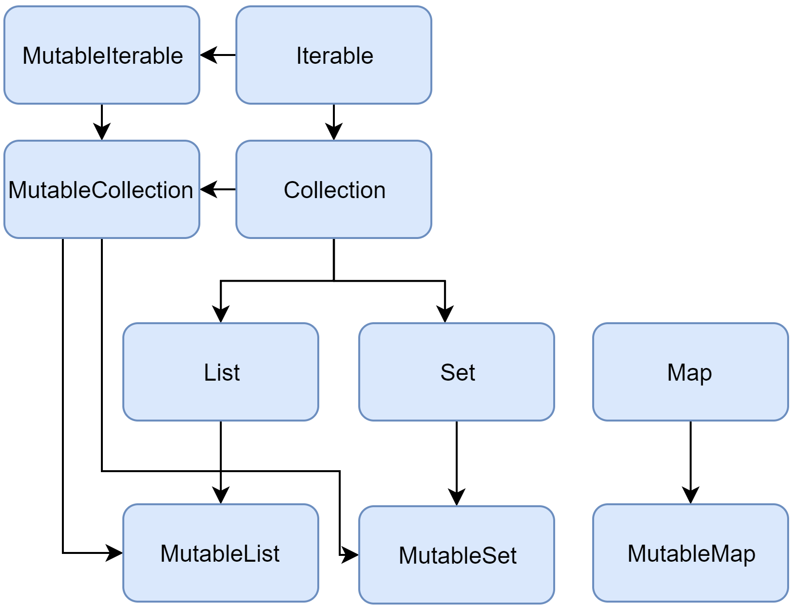

# Table of Contents
[[toc]]

## 컬렉션(Collection)
`컬렉션(Collection)`을 사용하면 같은 타입의 데이터를 한꺼번에 쉽게 관리할 수 있다. `컬렉션(Collection)`이 제공하는 인터페이스 및 클래스와 상속 구조는 다음과 같다.



## List
배열은 생성할 때 크기가 결정된다. 따라서 배열이 생성되면 동적으로 데이터를 추가하거나 삭제할 수 없다. 데이터를 동적으로 추가, 삭제하려면 `List` 또는 `MutableList`를 사용해야한다.

### List
`List`는 변경이 불가능하며, 두 가지 방법으로 생성할 수 있다.

변경 불가능한 리스트를 선언할 때는 `listOf()`메소드를 사용한다.
``` kotlin
// 초기화 이후 추가, 삭제, 변경 불가능
val numbers: List<Int> = listOf(10, 20, 30)

// List의 요소에 접근만 가능
players[0]  
```

`List`클래스의 생성자를 사용할 수도 있다.
``` kotlin
val numbers: List<Int> = List<Int>(4, {index -> index})

for (number in numbers) {
    println(number)
}

// 0
// 1
// 2
// 3
```

### MutableList
`MutableList`는 변경이 가능하며, 두 가지 방법으로 생성할 수 있다.

변경 가능한 리스트를 선언할 때는 `mutableListOf()`메소드를 사용한다.
``` kotlin
// 데이터 추가, 삭제, 변경이 가능
val numbers: MutableList<Int> = mutableListOf(10, 20, 30)

// 리스트의 끝에 데이터 추가
numbers.add(40)

// 2번 인덱스에 데이터 추가
numbers.add(2, 15)

// 데이터 삭제
numbers.remove(15)

// 0번째 인덱스의 데이터 변경
numbers.set(0, 40)
numbers[0] = 50
```
빈 리스트는 다음과 같이 생성한다.
``` kotlin
val numbers: MutableList<Int> = mutableListOf()
```

`MutableList`클래스의 생성자를 사용할 수도 있다.
``` kotlin
val numbers: MutableList<Int> = MutableList<Int>(5, {index -> index})
```

### ArrayList
변경 가능한 리스트는 `ArrayList`를 사용하여 구현할 수도 있다.
``` kotlin
// 빈 ArrayList 생성
val numbers: ArrayList<Int> = ArrayList<Int>();

// 요소 추가
numbers.add(1)
numbers.add(2)

// 요소 접근
numbers[0]

// 요소 삭제
numbers.removeAt(0)
```

## Set
집합은 `Set`클래스와 `setOf()`, `mutableSetOf()` 메소드를 사용한다.

### setOf()
변경 불가능한 집합을 선언할 때는 `setOf()`메소드를 사용한다.
``` kotlin
// 초기화 이후 추가, 삭제, 변경 불가능
var jobs: Set<String> = setOf("programmer", "desinger", "footballer")

// 데이터 포함여부 확인
jobs.contains("programmer") // true
jobs.contains("singer")     // false
```
### mutableSetOf()
변경 가능한 집합을 선언할 때는 `mutableSetOf()`메소드를 사용한다.
``` kotlin
// 초기화 이후 추가, 삭제, 변경 가능
var jobs: MutableSet<String> = mutableSetOf("footballer", "programmer", "desinger")

// 데이터 추가
jobs.add("CEO")

// 데이터 삭제
jobs.remove("footballer")
```
집합은 중복을 허락하지 않는다. 동일한 데이터를 여러 개 넣어도 한 개만 유지한다.
``` kotlin
// 초기화 이후 추가, 삭제, 변경 가능
var jobs: MutableSet<String> = mutableSetOf()

jobs.add("footballer")
jobs.add("footballer")
jobs.add("footballer")
jobs.add("CEO")

println(jobs)   // [footballer, CEO]
```

## Map
`Map`은 `키(Key)`와 `값(Value)`으로 구성된 집합 자료형이다. 키를 통해 값을 저장하거나 읽어오거나 변경하거나 삭제할 수 있다.

### mapOf()
우선 변경 불가능한 맵을 선언할 때는 `mapOf()`메소드를 사용한다.
``` kotlin 
var map: Map<String, String> = mapOf("name" to "paul", "job" to "programmer")
```
다음과 같이 키를 사용하여 값을 읽어올 수 있다..
``` kotlin
map["name"]     // paul
map.get("job")     // programmer
```

### mutableMapOf()
변경 가능한 맵를 선언할 때는 `mutableMapOf()`메소드를 사용한다.
``` kotlin
var mutableMap: MutableSet<String, String> = mutableMapOf("name" to "paul", "job" to "programmer")
```
다음과 같이 키를 사용하여 값을 변경할 수도 있다.
``` kotlin
mutableMap["job"] = "designer"
```
키와 값을 추가할 수도 있다.
``` kotlin
mutableMap["address"] = "seoul"
```

## 집합 자료형 조작 함수
집합 자료형은 데이터 조작을 위한 다양한 메소드를 제공한다. 리스트의 대표적인 메소드 몇 가지만 알아보자.

### filter()
조건에 맞는 요소만 필터링하는데 사용한다.
``` kotlin
// 필터링
val fruits = listOf("pineapple", "melon", "apple", "banana", "mango")

// 문자'm'으로 시작하는 요소만 찾기
var newFruits = fruits.filter({ fruit: String -> fruit.startsWith('m') })  // ["melon", "mango"]
```
### sortedBy()
리스트를 조건에 맞게 정렬하는데 사용한다.
``` kotlin
// 정렬
val fruits = listOf("pineapple", "melon", "apple", "banana")
var newFruits = fruits.sortedBy({ element: String -> element }) ["apple", "banana", "melon", "pineapple"]
```
### map(), forEach()
``` kotlin
val fruits = listOf("apple", "banana", "melon")
    .map({ fruit -> 
        // 람다는 마지막 값이 반환
        "My favorite fruit is ${fruit}"
    })
    .forEach { println(it) }
    
// My favorite fruit is apple
// My favorite fruit is banana
// My favorite fruit is melon
```
위 코드는 다음과 같이 단축할 수 있다.
``` kotlin
val fruits = listOf("apple", "banana", "melon")
    .map { it.toUpperCase() }
    .forEach { println(it) }

// APPLE
// BANANA
// MELON
```

### subList()
``` kotlin
val fruits = listOf("apple", "banana", "melon", "orange", "grape")

fruits.subList(0, 3)   // [apple, banana, melon]
fruits.subList(3, fruits.size)   // [orange, grape]
```

### contains()
``` kotlin
val fruits = listOf("apple", "banana", "melon", "orange", "grape")

fruits.contains("apple")  // true
fruits.contains("mango")  // false
```

### indexOf()
``` kotlin
val fruits = listOf("apple", "banana", "melon", "orange", "grape")

fruits.indexOf("apple")   // 0
fruits.indexOf("grape")   // 4
fruits.indexOf("watermelon")   // -1
```