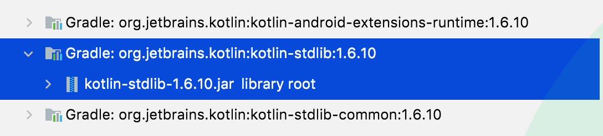

# Table of Contents
[[toc]]

## 집합자료형(Collection)
Kotlin은 같은 타입의 데이터를 한꺼번에 쉽게 관리할 수 있도록 `집합자료형(Collection)`을 제공한다.


Kotlin이 제공하는 집합자료형은 `Kotlin 표준 라이브러리`에 포함되어있다.



## List
`List`는 다음 특징을 가진 집합 자료형이다.

- 순서가 있다.
- 중복을 허용한다.


### List
`List`는 생성 후 값을 추가, 삭제, 변경할 수 없다.

`List`는 `listOf()`메소드로 생성할 수 있다.
``` kotlin
// 초기화 이후 추가, 삭제, 변경 불가능
val numbers: List<Int> = listOf(10, 20, 30)

// List의 요소에 접근만 가능
numbers.get(0)  
```

`List`클래스의 생성자를 사용할 수도 있다.
``` kotlin
val numbers: List<Int> = List<Int>(4, {index -> index})

for (number in numbers) {
    println(number)
}

// 0
// 1
// 2
// 3
```

### MutableList
`List`는 생성 후 값을 추가, 삭제, 변경할 수 있다.

변경 가능한 리스트를 선언할 때는 `mutableListOf()`메소드를 사용한다.
``` kotlin
// 데이터 추가, 삭제, 변경이 가능
val numbers: MutableList<Int> = mutableListOf(10, 20, 30)

// 리스트의 끝에 데이터 추가
numbers.add(40)

// 2번 인덱스에 데이터 추가
numbers.add(2, 15)

// 특정 요소 삭제 
numbers.remove(15)

// 인덱스로 특정 요소 삭제
numbers.removeAt(20)

// 0번째 인덱스의 데이터 변경
numbers.set(0, 40)

// List의 크기
numbers.size
```
빈 리스트는 다음과 같이 생성한다.
``` kotlin
val numbers: MutableList<Int> = mutableListOf()
```

`MutableList`클래스의 생성자를 사용할 수도 있다.
``` kotlin
val numbers: MutableList<Int> = MutableList<Int>(5, {index -> index})
```

### List 순회
`for in` 구문으로 `List`를 순회할 수 있다.
``` kotlin
for (number in numbers) {
    println(number)
}
```

## Set
`Set`은 다음 특징을 갖는 자료구조다.
- 중복을 허용하지 않는다.
- 순서가 없다.

### setOf()
변경 불가능한 집합을 선언할 때는 `setOf()`메소드를 사용한다.
``` kotlin
// 초기화 이후 추가, 삭제, 변경 불가능
var jobs: Set<String> = setOf("programmer", "designer", "footballer")

// 데이터 포함여부 확인
jobs.contains("programmer") // true
jobs.contains("singer")     // false
```
### mutableSetOf()
변경 가능한 집합을 선언할 때는 `mutableSetOf()`메소드를 사용한다.
``` kotlin
// 초기화 이후 추가, 삭제, 변경 가능
var jobs: MutableSet<String> = mutableSetOf("footballer", "programmer", "designer")

// 데이터 추가
jobs.add("CEO")

// 데이터 삭제
jobs.remove("footballer")
```
집합은 중복을 허락하지 않는다. 동일한 데이터를 여러 개 넣어도 한 개만 유지한다.
``` kotlin
// 초기화 이후 추가, 삭제, 변경 가능
var jobs: MutableSet<String> = mutableSetOf()

jobs.add("footballer")
jobs.add("footballer")
jobs.add("footballer")
jobs.add("CEO")

println(jobs)   // [footballer, CEO]
```

### Set 순회
`for in` 구문으로 `Set`을 순회할 수 있다.
``` kotlin
var jobs: Set<String> = setOf("programmer", "designer", "footballer")

for (job in jobs) {
    println(job)
}
```

## Map
`Map`은 `키(Key)`와 `값(Value)`으로 구성된 집합 자료형이다. 키를 통해 값을 저장하거나 읽어오거나 변경하거나 삭제할 수 있다.

### mapOf()
변경 불가능한 맵을 선언할 때는 `mapOf()`메소드를 사용한다.
``` kotlin 
var map: Map<String, String> = mapOf("name" to "paul", "job" to "programmer")
```
다음과 같이 키를 사용하여 값을 읽어올 수 있다.
``` kotlin
map.get("job")   // programmer
// map["job"]
```

### mutableMapOf()
변경 가능한 맵를 선언할 때는 `mutableMapOf()`메소드를 사용한다.
``` kotlin
var mutableMap: MutableMap<String, String> = mutableMapOf("name" to "paul", "job" to "programmer")
```
다음과 같이 키를 사용하여 값을 변경할 수도 있다.
``` kotlin
mutableMap.set("job", "designer")
// mutableMap["job"] = "designer"
```
키와 값을 추가할 수도 있다.
``` kotlin
mutableMap.put("address", "Seoul")
// mutableMap["address"] = "Seoul"
```
`Map`의 `toMutableMap()`을 사용할 수도 있다.
``` kotlin
var map: Map<Int, String> = mapOf(9 to "Benzema", 7 to "Ronaldo", 4 to "Ramos", 11 to "Bale")

var mutableMap = map.toMutableMap()
```

### sortedMapOf()
`키(Key)`로 맵을 정렬할 때는 `sortedMapOf()`를 사용한다.
``` kotlin
var sortedMap: SortedMap<Int, String> = sortedMapOf()

sortedMap.put(11, "Bale")
sortedMap.put(4, "Ramos")
sortedMap.put(7, "Ronaldo")
sortedMap.put(9, "Benzema")

println(sortedMap)      // {4=Ramos, 7=Ronaldo, 9=Benzema, 11=Bale}
```
첫 번째 인자로 `Comparator`를 전달할 수 있다.
``` kotlin
var sortedMap: SortedMap<Int, String> = sortedMapOf({e1, e2 -> e2 - e1}, 9 to "Benzema", 7 to "Ronaldo", 4 to "Ramos", 11 to "Bale")

println(sortedMap)  // {4=Ramos, 7=Ronaldo, 9=Benzema, 11=Bale}
```
`MutableMap`의 `toSortedMap()`메소드로 `MutableMap`을 `SortedMap`으로 변환할 수 있다.
``` kotlin
var mutableMap: MutableMap<Int, String> = mutableMapOf(9 to "Benzema", 7 to "Ronaldo", 4 to "Ramos", 11 to "Bale")

var sortedMap = mutableMap.toSortedMap { e1, e2 -> e2 - e1 }
```

### linkedMapOf()
`linkedMapOf()`을 사용하면 데이터 삽입 순서를 보장할 수 있다.
``` kotlin
val linkedMap: LinkedHashMap<Int, String> = linkedMapOf<Int, String>()

linkedMap.put(11, "Bale")
linkedMap.put(4, "Ramos")
linkedMap.put(7, "Ronaldo")
linkedMap.put(9, "Benzema")

println(linkedMap)      // {11=Bale, 4=Ramos, 7=Ronaldo, 9=Benzema}
```

### Map 순회
`Map`인터페이스의 `keys` 속성으로 키 집합에 접근할 수 있다.
``` kotlin
var map: Map<Int, String> = mapOf(9 to "Benzema", 7 to "Ronaldo", 4 to "Ramos", 11 to "Bale")

for (key in map.keys) {
    println(map[key])
}

// Benzema
// Ronaldo
// Ramos
// Bale
```
`Map`인터페이스의 `entries` 속성으로 `Map.Entry` 집합에 접근할 수 있다.
``` kotlin
var map: Map<Int, String> = mapOf(9 to "Benzema", 7 to "Ronaldo", 4 to "Ramos", 11 to "Bale")

for (entry in map.entries) {
    println("${entry.key} : ${entry.value}")
}

// 9 : Benzema
// 7 : Ronaldo
// 4 : Ramos
// 11 : Bale
```

## Kotlin과 Java 표준 라이브러리
Kotlin에서는 `Java 표준 라이브러리`도 자유롭게 사용할 수 있다. 다만 `java 표준 라이브러리`를 임포트해야 한다. 
``` kotlin{1}
import java.util.*

val numbers = ArrayList<Int>();

numbers.add(3)
numbers.add(1)
numbers.add(9)
numbers.add(7)

Collections.sort(numbers, Collections.reverseOrder())
```

## Stack
스택은 Java 표준 라이브러리의 `Stack`클래스를 사용한다.
``` kotlin
import java.util.*

val stack = Stack<Int>()

stack.push(1)
stack.peek()
stack.pop()
```

## Queue
큐 역시 Java 표준 라이브러리의 `Queue`인터페이스와 `LinkedList`클래스를 사용한다.
``` kotlin
import java.util.*

val queue: Queue<Int> = LinkedList<Int>()

queue.add(1)
queue.add(2)

queue.peek()

queue.remove()
```

## PriorityQueue
``` kotlin
val heap: PriorityQueue<Int> = PriorityQueue(Collections.reverseOrder())

heap.add(1)
heap.add(2)
heap.add(3)

heap.peek()

val result: Int = heap.remove()
```
다음과 같이 `Comparator`를 사용할 수도 있다.
``` kotlin
val heap: PriorityQueue<Int> = PriorityQueue { e1, e2 -> e1 - e2 }
```