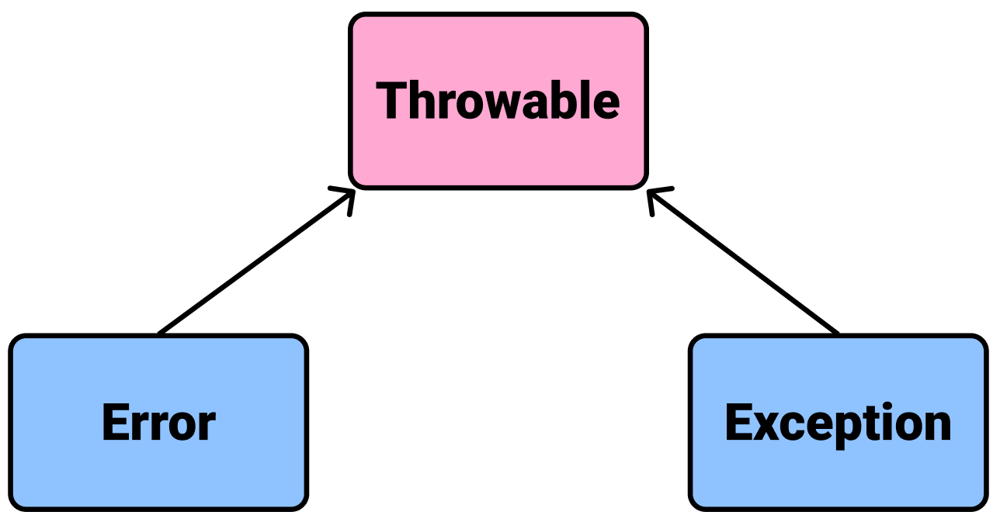

# Table Of Contents
[[toc]]

## Throwable
코틀린은 오류가 발생하면 `Error`나 `Exception`을 발생시킵니다. `Error`와 `Exception`은 모두 `Throwable`클래스를 상속받습니다.


## Error
`Error`는 코드에서 잡아낼 수 없으며 어플리케이션 자체가 다운됩니다. 대표적으로 `OutOfMemoryError`, `StackOveflowError`가 있습니다.

## Exception
`Exception`은 `try-catch`구문으로 잡아낼 수 있으며, 프로그램이 다운되지 않도록 처리할 수 있습니다. 대표적으로 값이 `null`인 변수에 접근할 때 발생하는 `NullPointException`이 있습니다. 
``` kotlin
var person: Person? = null

try {
    // 값이 null인 변수 person에 접근하므로 NullPointException이 발생합니다.
    person!!.printName()
} catch (exception: NullPointerException) {
    // 프로그램이 다운되지 않고 catch문이 실행됩니다.
    println("NullPointException has occurred.")
} finally {
    // finally 구문은 에러 처리와 상관없이 무조건 실행되는 코드입니다.
}
```

함수에서 `try-catch`구문을 바로 반환할 수도 있습니다.
``` kotlin
fun getSomething(): String {
    return try {
        "something"
    } catch(e: Exception) {
        "nothing"
    }
}

var something = getSomething()
```

개발자가 직접 `Exception`을 정의할 수 있습니다.
``` kotlin
class CustomException constructor(message: String): Exception(message) {
    // ...
}
```
개발자가 직접 `Exception`을 발생시킬 수도 있습니다. 이 때는 키워드 `throw`를 사용합니다. 
``` kotlin
try {
    // 직접 Exception을 발생시킵니다.
    throw CustomException("This is custom exception message.")
} catch (exception: CustomException) {
    println(exception.message)
} finally {
    // ...
}
```
`Exception`을 발생시킬 수 있는 메소드에는 `@Throws` 어노테이션을 붙여 에러 가능성을 표기할 수 있습니다.
``` kotlin
@Throws(CustomException::class)
fun getUsers() {
    throw CustomException("This is CustomException.")
}
```
`@Throws`어노테이션이 붙은 메소드는 `try-catch`문 내에서 호출하는 걸 권장합니다. 
``` kotlin
try {
    getUsers()
} catch (e: CustomException) {
    println(e.message)
}
```