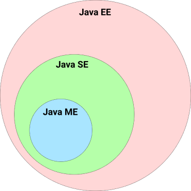
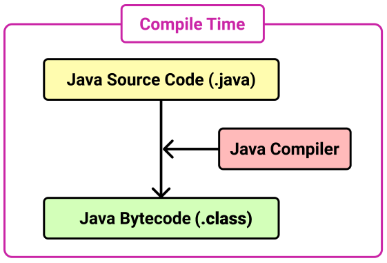
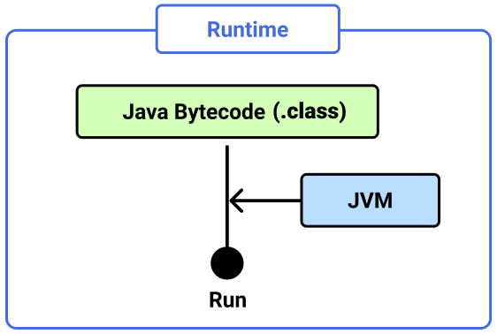

# Java Platform

`Java Platform`은 크게 세 가지 에디션으로 나뉜다.

### Java SE (Java Platform, Standard Edition)

- 가장 보편적으로 사용되는 에디션
- 자바 <u>데스크탑, 스마트폰 어플리케이션 개발</u>에 사용된다.
- 안드로이드 어플리케이션을 개발할 때에도 주로 Java SE가 사용된다.
- 기초적인 데이터 타입부터 네트워킹, 보안, 데이터베이스 처리, GUI(Swing, AWT) 등 데스크탑 개발에 필요한 API를 포함한다.

### Java EE (Java Platform, Enterprise Edition)

- 자바 <u>서버 어플리케이션 개발</u>에 사용된다.
- Java SE의 모든 API를 포함한다.
- 그 외 JSP, Sevlet, EJB 등 서버 어플리케이션 개발을 위한 API를 포함한다.
- 2017년 오라클은 오픈소스 진영인 이클립스 재단에 Java EE를 넘겼으며, 명칭은 <u>Jakarta EE</u>로 변경되었다.

### Java ME (Java Platform, Micro Edition)

- Java SE API의 일부만 포함한다.
- <u>셋톱박스</u>, <u>PDA</u>등 소형 임베디드 시스템을 개발하는데 사용된다.



# Java Compiler, JVM, JRE, JDK

### Java Compiler

Java로 작성한 파일 이름 뒤에는 `.java`라는 확장자가 붙으며, 이 파일을 `자바 소스코드`라고 한다. `자바 컴파일러`는 이 소스코드를 `자바 바이트코드`로 변환한다. 자바 바이트코드는 파일 이름 뒤에 `.class`확장자가 붙는다.


### JVM

`JVM(Java Virtual Machine)`은 자바 바이트코드를 운영체제에 종속적인 기계어로 변환한 후 실행한다.


서로 다른 운영체제라도 JVM만 설치되어 있다면, 같은 자바 어플리케이션을 다른 운영체제에서 실행할 수 있다.


단, JVM은 운영체제에 종속적이므로 각 운영체제에 맞는 JVM을 설치해야한다.

### JRE

`JRE(Java Runtime Edition)`은 Java 애플리케이션의 <u><b>실행</b></u>과 관련된 요소들이다. JRE는 다음 두 요소로 구성되어있다.

- JVM
- Java 애플리케이션 실행을 위한 API

### JDK

`JDK(Java Development Kit)`는 Java 어플리케이션의 <u><b>개발</b></u>에 필요한 요소들이다. JRE 외에도 `Java Compiler`, `Java Debugger` 등 개발에 필요한 도구들을 포함하고 있다.

JDK 명령어는 Java 설치 경로의 `bin`디렉토리에 위치한다.

```sh
$ pwd
/Library/Java/JavaVirtualMachines/jdk-9.0.4.jdk/Contents/Home/bin

$ ls
java
javac
jar
javadoc
...
```

# Java SE 7, JDK 7, Java 7의 차이점

`Java SE`는 Java Platform Standard Edition의 약자로 Java Platform의 근간을 이루는 추상적인 <u>명세(Specification)</u>를 의미한다. `JDK`는 Java SE 명세를 코드로 구현한 구체적인 <u>구현체(Implementation)</u>다. 즉 Java SE 7은 JSR-336로 규정된 Java SE의 일곱 번째 명세를 의미하며, JDK 7은 OpenJDK 7, Oracle JDK 7과 같은 구현체를 의미한다.

`Java EE` 역시 Java Server Application 개발을 위한 <u>명세(Specification)</u>를 의미한다. Java EE의 <u>구현체(Implementation)</u>는 다음과 같다.

- Java EE 명세를 모두 구현한 WAS
  - Oracle WebLogic
  - IBM Websphere
  - Red Hat Jboss
  - Tmax JEUS
- Java EE 명세의 일부를 구현한 Web Container
  - Apache Tomcat

추가적으로 엄밀히 말하자면 `Java 7`은 정확한 표현이 아니다.. 하지만 Java SE 7이나 JDK 7보다 사용하기 편해서 흔히 Java 7이라고 부른다.

# Mac OS 환경에서 JDK 버전 확인하기

`MacOS`에는 Java Platform(JDK)가 기본적으로 설치되어있다. 터미널에서 다음과 같이 설치 여부를 확인할 수 있다.

```bash
$ java -version
java version "13.0.1" 2019-10-15    // Java Platform(JDK) Version
Java(TM) SE Runtime Environment (build 13.0.1+9)    // JRE version
Java HotSpot(TM) 64-Bit Server VM (build 13.0.1+9, mixed mode, sharing) // JVM version
```

# 부록. Java Compiler 사용법

JDK에는 Java Compiler가 포함되어있다. 필자의 PC에는 다음 경로에 JDK가 설치되어있다.

```bash
/Library/Java/JavaVirtualMachines/adoptopenjdk-8.jdk
```

JDK의 `bin`디렉토리에는 JDK가 지원하는 다양한 명령어가 포함되어있다.

```
$ pwd
/Library/Java/JavaVirtualMachines/adoptopenjdk-8.jdk/Contents/Home/bin

$ ls
java
javac
jar
...
```

이제 `.java`파일을 작성하고 컴파일하고 실행해보자. 우선 `Main.java`를 작성한다.

```java Main.java
public class Main {
	public static void main(String[] args) {
		System.out.println("Hello World");
	}
}
```

JDK의 `javac`가 바로 Java Compiler다. 이를 사용해서 `Main.java`를 컴파일해보자.

```
$ javac Main.java

$ ls
Main.java
Main.class  // 생성된 바이트 코드
```

JDK의 `java`로 생성된 바이트 코드를 실행할 수 있다.

```sh
$ java Main
Hello Wolrd
```
