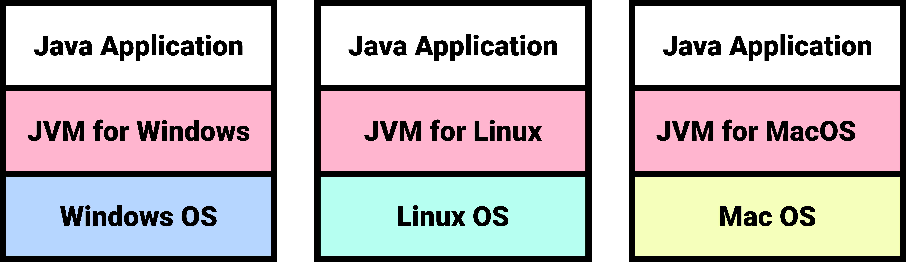
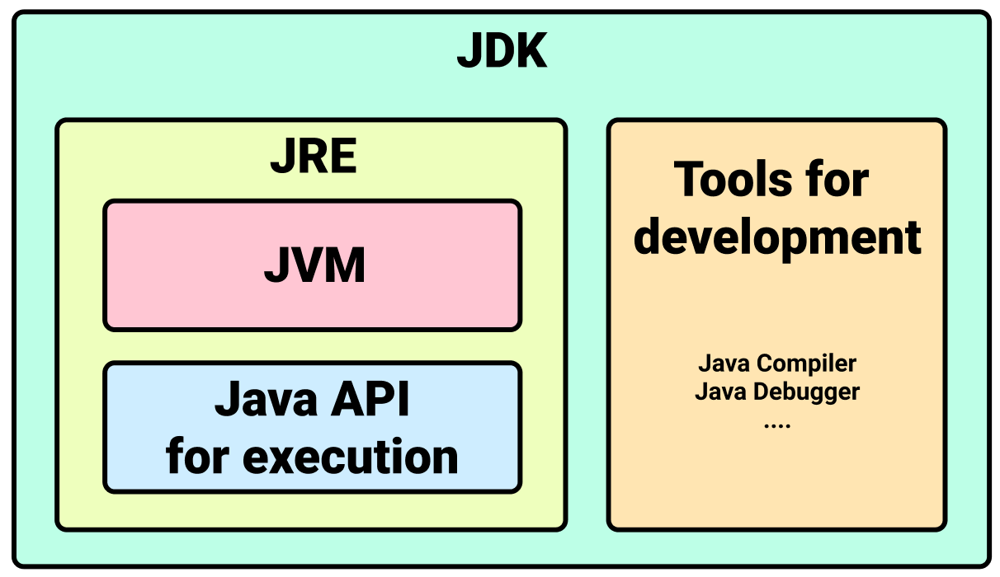

## Java Compiler
Java로 작성한 파일 이름 뒤에는 `.java`라는 확장자가 붙으며, 이 파일을 `자바 소스코드`라고 한다. `자바 컴파일러`는 이 소스코드를 `자바 바이트코드`로 변환한다. 자바 바이트코드는 파일 이름 뒤에 `.class`확장자가 붙는다.


Java Compiler는 JDK에 포함되어있다. 글쓴이의 PC에는 다음 경로에 JDK가 설치되어있다.
```
/Library/Java/JavaVirtualMachines/adoptopenjdk-8.jdk
```
JDK의 `bin`디렉토리의 `javac`가 바로 Java Compiler다.
``` shellsession{6}
$ pwd
/Library/Java/JavaVirtualMachines/adoptopenjdk-8.jdk/Contents/Home/bin

$ ls
java
javac
jar
...
```
이제 `.java`파일을 작성하고 컴파일하고 실행해보자. 우선 `Main.java`를 작성한다.
``` java 
// Main.java
public class Main {
	public static void main(String[] args) {
		System.out.println("Hello World");
	}
} 
```
이제 Java Compiler를 사용하여 `Main.java`를 컴파일해보자.
``` shellsession
$ javac Main.java

$ ls
Main.java   
Main.class  // 생성된 바이트 코드
```
이제 생성된 바이크 코드를 실행할 수 있다.
``` shellsession
$ java Main
Hello Wolrd
```

## JVM
`JVM(Java Virtual Machine)`은 자바 바이트코드를 운영체제에 종속적인 기계어로 변환한 후 실행한다.


서로 다른 운영체제라도 JVM만 설치되어 있다면, 같은 자바 어플리케이션을 다른 운영체제에서 실행할 수 있다. 단, JVM은 운영체제에 종속적이므로 각 운영체제에 맞는 JVM을 설치해야한다.



## JRE
`JRE(Java Runtime Edition)`은 Java 애플리케이션의 <u>실행</u>과 관련되어있다. JRE는 크게 두 가지 요소로 구성된다.
- JVM
- Java 애플리케이션 실행을 위한 API

## JDK
`JDK(Java Development Kit)`는 Java 어플리케이션의 <u>개발</u>에 관련되어있다. JRE 외에도 `Java Compiler`, `Java Debugger` 등 개발에 필요한 도구들을 포함하고 있다.

JDK에 포함된 요소 및 명령어는 Java 설치 경로의 `bin`디렉토리에 위치한다.
``` shellsession
$ pwd
/Library/Java/JavaVirtualMachines/jdk-9.0.4.jdk/Contents/Home/bin

$ ls 
java
javac
jar
javadoc
...
```

`MacOS`에는 JDK가 기본적으로 설치되어있다. 터미널에서 다음과 같이 설치 여부를 확인할 수 있다.
``` shellsession
$ java -version
java version "13.0.1" 2019-10-15    // Java Platform(JDK) Version
Java(TM) SE Runtime Environment (build 13.0.1+9)    // JRE version
Java HotSpot(TM) 64-Bit Server VM (build 13.0.1+9, mixed mode, sharing) // JVM version
```