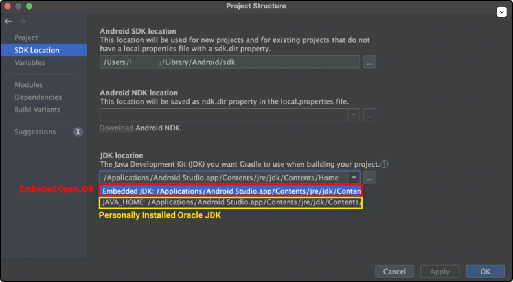

# Oracle JDK와 OpenJDK
2018년 Oracle은 `Java SE`의 과금 방식을 영구 라이선스에서 구독 모델로 변경하겠다고 선언한다. 이 선언이 그동안 무료로 인식된 Java의 유료화로 받아들여지면서 관련 업계에 큰 혼란을 초래하고있다. Java의 유료화를 이해하려면 `Oracle JDK`와 `OpenJDK`에 대해 알아야 한다.
::: tip INFO
참고로 Java 언어 자체는 무료다. Java 언어로 작성된 어플리케이션을 컴파일하고 실행하는 <b>JDK(Java Development Kit)</b>가 유료화 논쟁의 대상이다.
:::

## Oracle JDK
`Oracle JDK`는 <u>사용 목적</u>에 따라 유료이기도 무료이기도 한 JDK다.

Oracle JDK는 서버, PC, 스마트폰 등의 <u>일반적인 목적</u>으로 사용될 때는 무료다. 반면 키오스크 등 <u>특수한 목적</u>의 컴퓨팅에 사용될 땐 유료다. 또한 `Oracle JDK 8(Oracle Java SE 8)`부터는 Oracle의 지속적인 업데이트와 보안 패치, 기술지원을 받으려면 유료 서비스를 구매해야한다. (참고로 Oracle JDK 8 이전 버전에서도 일반적인 목적의 사용은 무료였고 지속적인 업데이트와 보안 패치, 기술지원은 유료였다.)

Oracle JDK는 OpenJDK를 기본으로 한다. Open JDK에 추가적인 기능이 더해진 것이 `Oracle JDK`다. Oracle JDK에 존재하고 Open JDK에는 없는 대표적 기능으로는 글꼴 라이브러리와 Java Web Start다.


## OpenJDK
`OpenJDK`는 <u>사용 목적</u>에 관계없이 무료인 JDK다. 

2007년 Java를 개발한 Sun Microsystems사는 JDK를 오픈소스화하기 위해 OpenJDK를 만들었다. Sun Microsystems사는 저작권자가 오픈소스화를 거부한 일부 기능을 제외한 나머지 JDK 소스코드 전부를 OpenJDK에 제공했고, OpenJDK는 이를 기반으로 JDK 7 프로젝트를 시작했다.

JDK 6 시절에는 OpenJDK가 Oracle JDK보다 성능이나 안정성이 크게 떨어졌다. 하지만 오늘날에는 Oracle JDK만이 제공하는 일부 기능을 제외하고는 차이가 없다는게 Oracle의 설명이다. 

## 안드로이드 스튜디오의 JDK
참고로 안드로이드 스튜디오에는 OpenJDK가 내장되어 있으므로 별도의 JDK 설치가 필요없다. 설치 경로는 `Android Studio > File > Project Structure > SDK Location`에서 확인할 수 있다.

안드로이드 스튜디오에서는 보통 `compileSDKVersion`에 따라 적당한 JDK 버전이 자동으로 설정된다. 물론 프로젝트 수준의 `build.gradle` 파일에서 직접 JDK 버전을 설정할 수 있다.

```groovy
// build.gradle

android {
    // Java 8을 사용하도록 설정
    compileOptions {
        sourceCompatibility JavaVersion.VERSION_1_8
        targetCompatibility JavaVersion.VERSION_1_8
    }
}
```


## 결론
Kakao나 Line처럼 한국에서 잘 알려진 기업도 OpenJDK를 도입하고 활용하고 있는 것으로 알려져있다. OpenJDK에서는 제공하지 않는 컴포넌트를 사용해야하거나, Oracle의 지속적인 지원을 받아야 하거나, 키오스크 등 특수한 목적의 컴퓨팅에 사용하는 경우에는 비용을 지불하고 Oracle JDK를 사용해야 할 것이다. 그렇지 않은 경우에는 OpenJDK를 사용해도 무방할 것 같다.