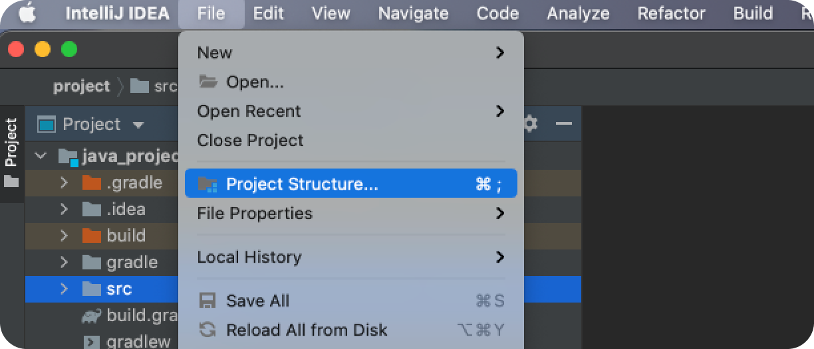

# IntelliJ에서 JDK 버전 확인학기
`IntelliJ > File > Project Structure`로 이동한다.



`Project Settings > Project`탭에서 JDK를 변경할 수 있다.


그 다음 빌드 툴의 JDK를 변경한다. `Maven`을 사용하는 경우 `pom.xml`을 다음과 같이 변경한다.
``` xml
<build>
    <plugins>
        <plugin>
            <groupId>org.apache.maven.plugins</groupId> 
            <artifactId>maven-compiler-plugin</artifactId> 
            <configuration> 
                <source>1.8</source> 
                <target>1.8</target> 
            </configuration>
        </plugin>
    </plugins>
</build>
```
`Gradle`을 사용하는 경우 `build.gradle`을 다음과 같이 변경한다.
``` groovy 
sourceCompatibility = 1.8   // 소스 코드의 Java 버전. 일반적으로 개발 환경에서 사용 중인 JDK의 버전과 일치시킨다.
targetCompatibility = 1.8   // 바이트 코드의 Java 버전. 운영 환경에서 사용 중인 JDK의 버전과 일치시킨다.
```