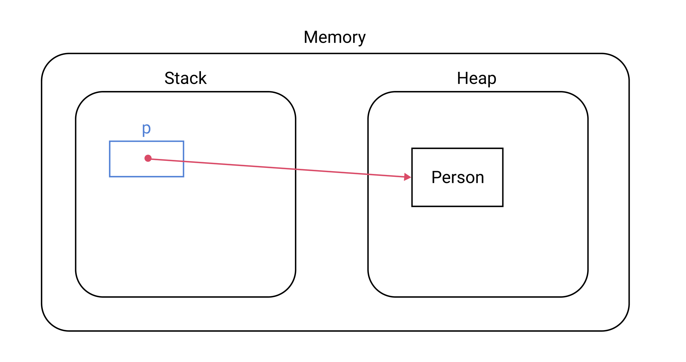

## 데이터 타입
`데이터 타입`은 데이터의 종류를 의미한다. 예를 들어 나이는 숫자고 이름은 문자열이다. 여기서 숫자와 문자열을 데이터 타입이라고 한다. 이를 Java에서 다음과 같이 표현한다.
``` java
int age = 30;
String name = "Paul";
``` 

## 정수형 숫자
`10진수 정수형 숫자`는 다음과 같이 사용한다.
``` java
byte age = 24;      // 1 byte
short age = 24;     // 2 byte
int age = 24;       // 4 byte
long age = 24;      // 16 byte
```

### 실수형 숫자
`실수형 숫자`는 다음과 같이 사용한다.
``` java
float weight = 78.9f;
double height = 180.8;
```

### 불리언
``` java
boolean isMarried = true;
```

### 문자
문자를 선언하고 초기화할 때는 `따옴표(')`를 사용한다.
``` java
char alphabetA = 'A';
char alphabetB = 'B';
```

### 문자열 
문자열을 선언하고 초기화할 때는 `쌍따옴표(")`를 사용한다.
``` java
String name = "Ronaldo";
String nation = new String("Portugal");
```
문자열 타입의 변수에는 유용한 속성과 메소드가 내장되어있다.
``` java
name.length();          // 7
name.toLowerCase();     // ronaldo
name.toUpperCase();     // RONALDO
```
문자열과 문자열을 합쳐 새로운 문자열을 만들 때는 `+`를 사용한다.
``` java
String description = name + " is from " + nation;
```

## 변수와 상수
### 변수
변수는 자료형을 변수명 앞에 붙여서 선언한다.
``` java
int age = 24;
double height = 180.8;
boolean isMarried = true;
String name = "Paul";
```
변수는 값을 초기화한 후 변경할 수 있다.
``` java
int age = 24;
age = 25;
```

### 상수
상수는 자료형 앞에 키워드 `final`를 붙인다. 보통 상수의 이름은 `대문자`와 `언더바(_)`를 사용한다.
``` java
final int AGE = 24;
final double HEIGHT = 180.8;
final boolean IS_MARRIED = true;
final String NAME = "Ronaldo";
```
상수는 값을 한번 할당하면 변경할 수 없다.
``` java
final int AGE = 24;
AGE = 25;   // Error
```

## 원시 타입과 참조 타입
Java에는 크게 두 종류의 자료형이 있다.
- 원시 타입(Primitive Type)
- 참조 타입(Reference Type)

::: tip
[JVM의 메모리 구조](/post/10_java/180104_jvm_memory_structure.html)에 관한 포스트를 먼저 읽고 오길 권장한다.
:::


### 원시 타입
Java가 제공하는 `원시 타입(Primitive type)`은 다음과 같다.
- byte
- short
- int
- long
- float
- double
- boolean
- char

원시 타입은 `스택(Stack)`이라는 메모리 영역에 저장된다. 예를 들어 코드가 다음과 같다면
``` java
int age = 35;
```
메모리에 다음과 같은 형태로 저장된다.


### 참조 타입
원시 타입을 제외한 모든 타입을 `참조 타입(Referencee type)`이라고 한다. Class, Array, List, Enum 등이 참조 타입에 포함된다.

참조 타입은 `힙(Heap)`이라는 메모리 영역에 저장된다. 예를 들어 코드가 다음과 같다면
``` java
Person p = new Person("Paul", 33);
```
메모리에 다음과 같은 형태로 저장된다.

다시 말해 객체 자체는 힙 영역에 생성되며, 스택에 생성된 변수에는 객체의 주소값을 담고 있다. 좀 더 추상적으로 힙에 생성된 객체를 가리키는 형태다.


## Wrapper 클래스
Java에서 개발을 하다보면 `원시 타입(Primitive Type)`을 객체로 취급해야하는 경우가 있다. 예를 들면 `Generic`을 사용할 때는 타입 파라미터로 참조 타입만을 전달할 수 있다.
``` java
class Person<T> {
    T data;

    public Person(T data) {
        this.data = data;
    }
}
```
``` java
Person<int> person = new Person<int>(3); // Error. Type argument cannot be of primitive type
```
이럴 때 `Wrapper 클래스`를 사용할 수 있다. 즉  `Wrapper 클래스`는 <u>원시 타입을 참조 타입으로 취급하기 위해 사용</u>한다.
``` java
Person<Integer> person = new Person<Integer>(3);
```
`Wrapper 클래스`는 `java.lang` 패키지에 포함되어있으며, 원시 타입에 대응하는 `Wrapper 클래스`가 존재한다.

|원시 타입|래퍼 클래스|
|-------|--------|
|byte|Byte|
|char|Character|
|short|Short|
|int|Integer|
|long|Long|
|boolean|Boolean|
|float|Float|
|double|Double|

### 박싱과 언박싱
원시 타입의 값으로 `Wrapper 클래스`를 만드는 것을 `박싱(Boxing)`이라고 한다.
``` java
Integer age = new Integer(30);
Double height = new Double(165.3);
```
`Wrapper 클래스`에서 기본 타입의 값을 얻어내는 것을 `언박싱(Boxing)`이라고 한다.
``` java
int _age = age.intValue();
double _height = height.doubleValue();
``` 

### 오토 박싱과 오토 언박싱
직접적으로 박싱/언박싱을 하지 않아도 자동으로 박싱/언박싱이 일어나기도 한다. `Wrapper 클래스`에 원시 타입의 데이터를 할당할 경우 오토 박싱이 된다.
``` java
Integer age = 30;
``` 
`Wrapper 클래스`의 객체를 원시 타입에 할당할 때도 오토 언박싱이 된다.
``` java
int _age = age;
``` 