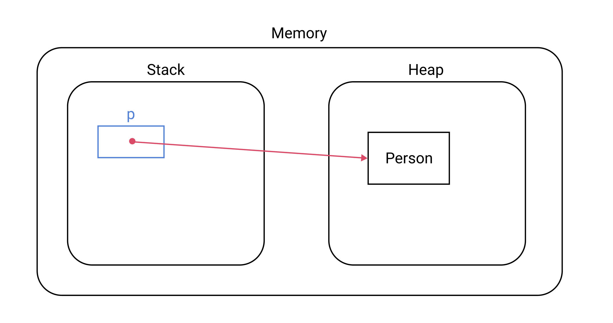

# 원시 타입과 참조 타입
Java에는 크게 두 종류의 자료형이 있다.
- 원시 타입(Primitive Type)
- 참조 타입(Reference Type)

::: tip
[JVM의 메모리 구조](/post/10_java/180104_jvm_memory_structure.html)에 관한 포스트를 먼저 읽고 오길 권장한다.
:::


## 원시 타입
Java가 제공하는 `원시 타입(Primitive type)`은 다음과 같다.
- byte
- short
- int
- long
- float
- double
- boolean
- char

원시 타입은 `스택(Stack)`이라는 메모리 영역에 저장된다. 예를 들어 코드가 다음과 같다면
``` java
int age = 35;
```
메모리에 다음과 같은 형태로 저장된다.


## 참조 타입
원시 타입을 제외한 모든 타입을 `참조 타입(Referencee type)`이라고 한다. Class, Array, List, Enum 등이 참조 타입에 포함된다.

참조 타입은 `힙(Heap)`이라는 메모리 영역에 저장된다. 예를 들어 코드가 다음과 같다면
``` java
Person p = new Person("Paul", 33);
```
메모리에 다음과 같은 형태로 저장된다.

다시 말해 객체 자체는 힙 영역에 생성되며, 스택에 생성된 변수에는 객체의 주소값을 담고 있다. 좀 더 추상적으로 힙에 생성된 객체를 가리키는 형태다.
