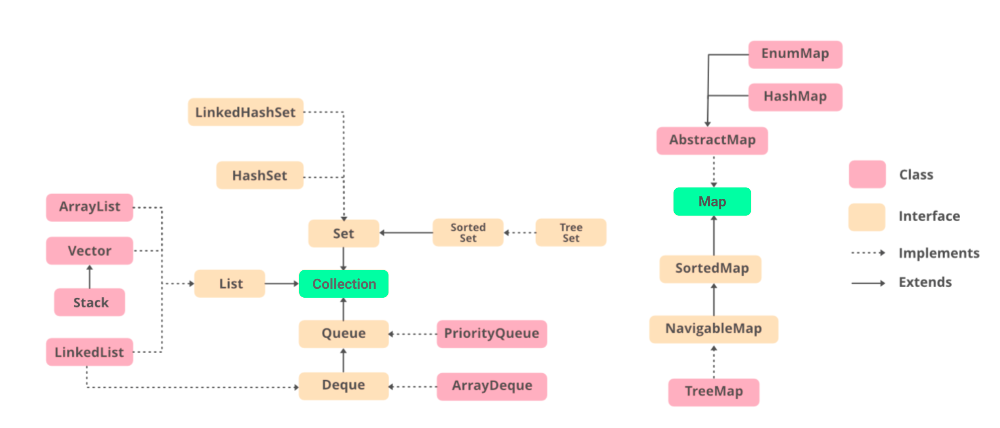

# 컬렉션 프레임워크
Java API는 같은 타입의 여러 데이터를 한꺼번에 효율적으로 관리하기 위해 `컬렉션 프레임워크(Collection Framework)`를 지원한다. 


컬렉션 프레임워크는 `java.util` 패키지에 포함되어있으며, 가장 중요한 요소는 `List`, `Set`, `Map`이다. 그 밖에도 `Stack`, `Queue`, `Deque`, `PriorityQueue` 등의 자료구조를 지원한다.

## Heap과 Priority Queue
Heap과 Priority Queue는 데이터를 Enqueue한 순서에 상관없이 우선순위가 높은 데이터가 먼저 Dequeue되는 자료구조다. Java에서는 `PriorityQueue`클래스로 Heap과 Priority Queue를 구현할 수 있다.

## 사용법

Priority Queue는 `PriorityQueue`클래스를 사용하여 생성한다.
``` java
PriorityQueue<Integer> priorityQueue = new PriorityQueue<Integer>();
```
`add()` 또는 `offer()`를 사용하여 Enqueue한다.
``` java
priorityQueue.add(3);
priorityQueue.add(1);
priorityQueue.add(7);
priorityQueue.offer(4);
priorityQueue.offer(9);
priorityQueue.offer(5);
```
정렬 기준을 별도로 설정하지 않으면 가장 낮은 값이 높은 우선순위를 갖는다. 따라서 오름차순으로 졍렬된 것과 동일하게 된다.
``` java
System.out.println(priorityQueue.toString());   // [1, 3, 5, 4, 9, 7]
```

`peek()`를 사용하여 우선순위가 가장 높은 데이터에 접근한다.
``` java
System.out.println(priorityQueue.peek());       // 1
```
`remove()`, `poll()`을 사용하여 우선순위가 가장 높은 데이터를 Dequeue한다.
``` java
System.out.println(priorityQueue.toString());   // [1, 3, 5, 4, 9, 7]

System.out.println(priorityQueue.remove());     // 1
System.out.println(priorityQueue.poll());       // 3
System.out.println(priorityQueue.toString());   // [4, 7, 5, 9]
```

## 내림차순 정렬
높은 값에 높은 우선순위를 부여할 수도 있다. 객체를 생성할 때 `Collections.reverseOrder()`를 인자로 전달한다.
``` java
PriorityQueue<Integer> priorityQueue = new PriorityQueue<Integer>(Collections.reverseOrder());
priorityQueue.add(3);
priorityQueue.add(1);
priorityQueue.add(7);
priorityQueue.add(4);
priorityQueue.add(9);
priorityQueue.add(5);

System.out.println(priorityQueue.toString());   // [9, 7, 5, 1, 4, 3]

System.out.println(priorityQueue.remove());     // 9
System.out.println(priorityQueue.poll());       // 7
System.out.println(priorityQueue.toString());   // [5, 4, 3, 1]
```

## 우선순위 기준 직접 지정하기
요소가 객체인 경우 [Comparable](/10_java/180501_comparable_comparator.html#comparable) 또는 [Comparator](/post/10_java/180501_comparable_comparator.html#comparator)를 사용하여 정렬 기준을 설정할 수 있다.

`Comparator` 예제는 다음과 같다.
``` java Person.java
class Person {
    private String name;
    private int age;

    public Person(String name, int age) {
        this.name = name;
        this.age = age;
    }

    public String getName() {
        return name;
    }

    public void setName(String name) {
        this.name = name;
    }

    public int getAge() {
        return age;
    }

    public void setAge(int age) {
        this.age = age;
    }

    @Override
    public String toString() {
        return "[name='" + name + "', age=" + age + ']';
    }
}
```
``` java Main.java
PriorityQueue<Person> priorityQueue = new PriorityQueue<Person>(new Comparator<Person>() {
    @Override
    public int compare(Person p1, Person p2) {
        return p1.getAge() - p2.getAge();
    }
});

priorityQueue.add(new Person("Monica", 23));
priorityQueue.add(new Person("Phoebe", 25));
priorityQueue.add(new Person("Rachel", 24));
priorityQueue.add(new Person("Ross", 27));
priorityQueue.add(new Person("Chandler", 26));
priorityQueue.add(new Person("Ross", 22));

System.out.println(priorityQueue.remove().toString());      // [name='Ross', age=22]
System.out.println(priorityQueue.remove().toString());      // [name='Monica', age=23]
System.out.println(priorityQueue.remove().toString());      // [name='Rachel', age=24]
System.out.println(priorityQueue.remove().toString());      // [name='Phoebe', age=25]
System.out.println(priorityQueue.remove().toString());      // [name='Chandler', age=26]
System.out.println(priorityQueue.remove().toString());      // [name='Ross', age=27]
```

`Comparable` 예제는 다음과 같다. 어린 나이에 높은 우선순위를 부여하고 있다.
``` java Person.java
class Person implements Comparable<Person> {

    private String name;
    private int age;

    public Person(String name, int age) {
        this.name = name;
        this.age = age;
    }

    public String getName() {
        return name;
    }

    public void setName(String name) {
        this.name = name;
    }

    public int getAge() {
        return age;
    }

    public void setAge(int age) {
        this.age = age;
    }

    @Override
    public String toString() {
        return "[name='" + name + "', age=" + age + ']';
    }

    @Override
    public int compareTo(Person p) {
        return this.getAge() - p.getAge();
    }
}
```
``` java Main.java
PriorityQueue<Person> priorityQueue = new PriorityQueue<Person>();

priorityQueue.add(new Person("Monica", 23));
priorityQueue.add(new Person("Phoebe", 25));
priorityQueue.add(new Person("Rachel", 24));
priorityQueue.add(new Person("Ross", 27));
priorityQueue.add(new Person("Chandler", 26));
priorityQueue.add(new Person("Ross", 22));

System.out.println(priorityQueue.remove().toString());      // [name='Ross', age=22]
System.out.println(priorityQueue.remove().toString());      // [name='Monica', age=23]
System.out.println(priorityQueue.remove().toString());      // [name='Rachel', age=24]
System.out.println(priorityQueue.remove().toString());      // [name='Phoebe', age=25]
System.out.println(priorityQueue.remove().toString());      // [name='Chandler', age=26]
System.out.println(priorityQueue.remove().toString());      // [name='Ross', age=27]
```
