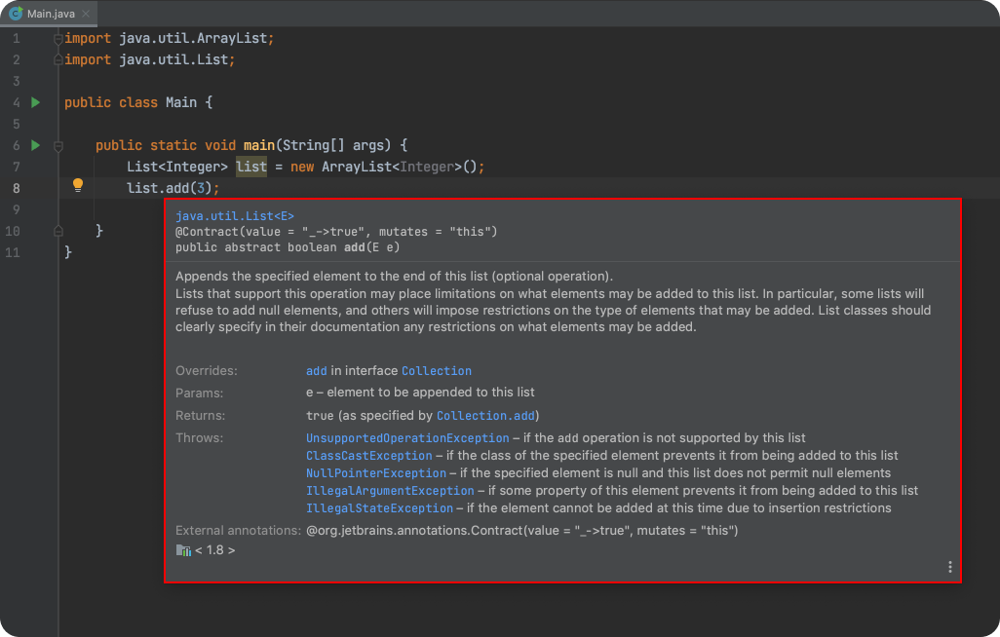
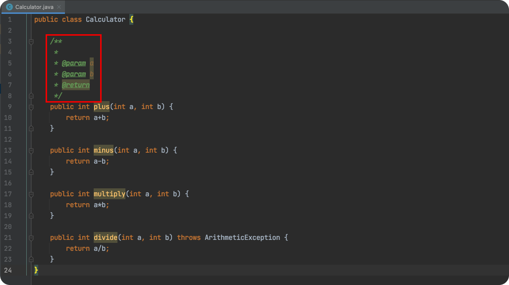
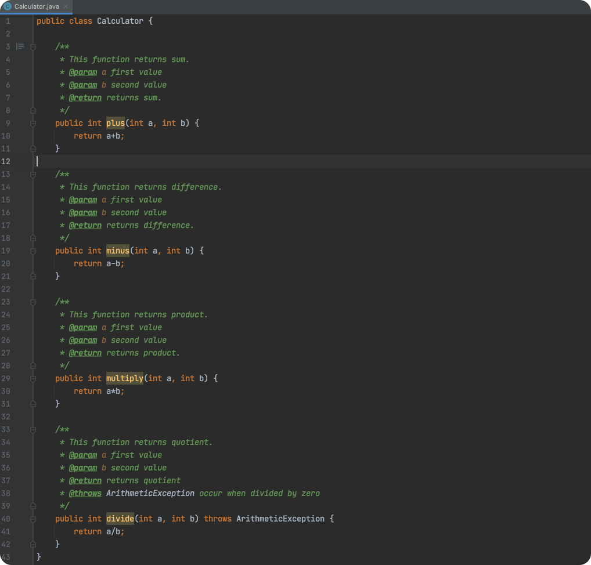
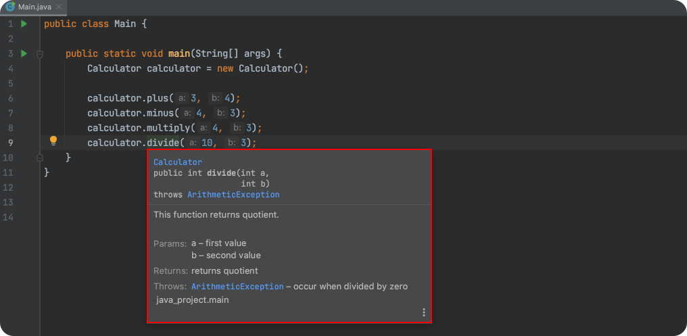
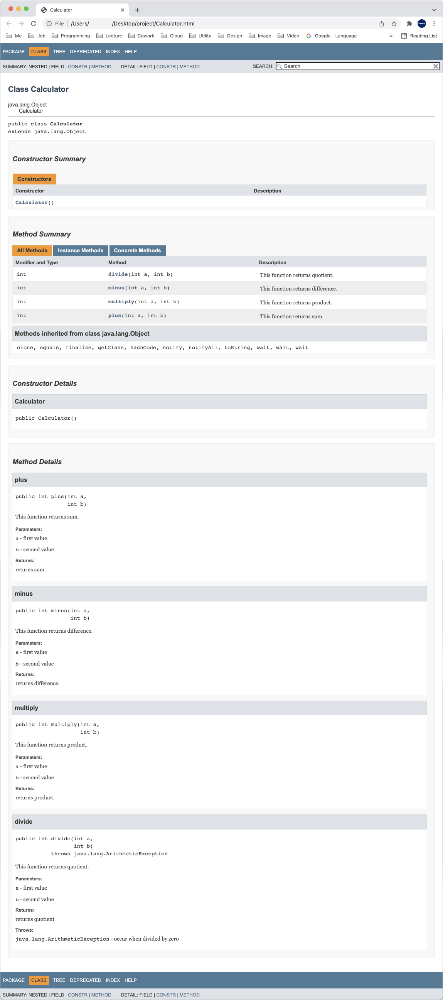

## 한 줄 주석
`한 줄 주석(Single-line Comment)`을 작성할 때는 `//`을 사용한다.
``` java
// This is Single-line Comment
System.out.println();
```

## 여러 줄 주석
`여러 줄 주석(Multi-line Comment)`를 작성할 때는 `/* */`을 사용한다.
``` java
/*
This is Multi-line Comment
This is Multi-line Comment
This is Multi-line Comment
*/
System.out.println();
```

## 주석 제대로 작성하기
인텔리J에서 특정 메소드 위에 마우스를 올리면 메소드에 대한 자세한 설명을 확인할 수 있다. 아래 사진에서는 메소드에 대한 설명, 파라미터, 발생할 수 있는 예외 등을 설명하고 있다.

 

`여러 줄 주석(Multi-line Comment)`을 사용하여 이러한 설명을 추가할 수 있다. 예제를 살펴보자.
``` java
public class Calculator {

    public int plus(int a, int b) {
        return a+b;
    }

    public int minus(int a, int b) {
        return a-b;
    }

    public int multiply(int a, int b) {
        return a*b;
    }

    public int divide(int a, int b) throws ArithmeticException {
        return a/b;
    }
}
```
이제 `Calculator`클래스의 메소드에 주석을 달아보자. 메소드 위에 `/**`를 입력하고 `Enter`버튼을 누르면 기본 템플릿이 자동으로 입력된다.


다음과 같이 메소드에 주석을 달아보자.


이제 `Main`클래스에서 `Calculator`클래스를 사용해보자.
``` java Main.java
public class Main {

    public static void main(String[] args) {
        Calculator calculator = new Calculator();
        calculator.plus(3, 4);
        calculator.minus(4, 3);
        calculator.multiply(4, 3);
        calculator.divide(10, 3);
    }
}
```
메소드 위에 마우스를 올리면 주석에서 작성한 내용을 확인할 수 있다.


## javadoc
JDK에 포함된 `javadoc`를 사용하면 소스코드를 문서화하고 HTML 등 다양한 포맷으로 export할 수 있다. `javadoc`는 JDK에 내장되어있으며, 사용법은 다음과 같다.
```
$ javadoc Calculator.java
```
다음과 같은 파일들이 생성된다.
```
Calculator.html          index-all.html           package-tree.html
Calculator.java          index.html               resources
allclasses-index.html    member-search-index.js   script-dir
allpackages-index.html   member-search-index.zip  script.js
constant-values.html     overview-tree.html       search.js
deprecated-list.html     package-search-index.js  stylesheet.css
element-list             package-search-index.zip type-search-index.js
help-doc.html            package-summary.html     type-search-index.zip
```
`index.html`을 열어보자. 주석으로 작성한 설명이 문서화 되어있다.
