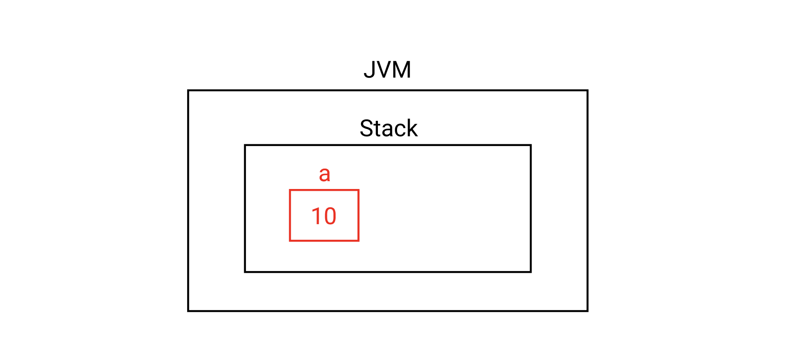
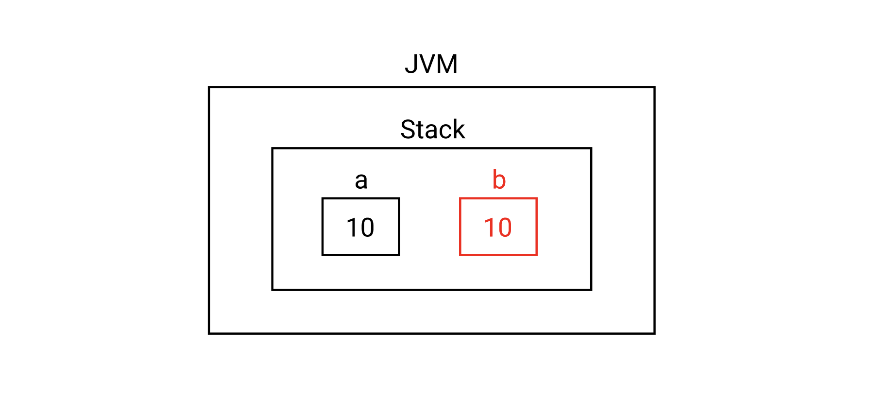
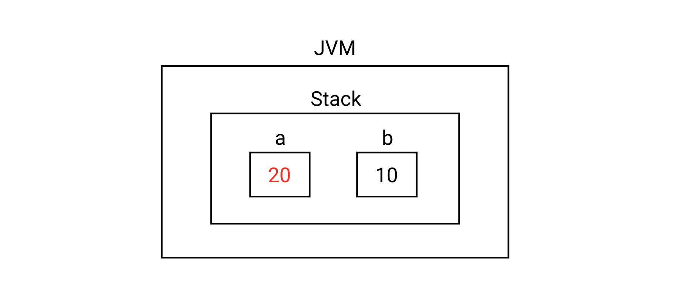
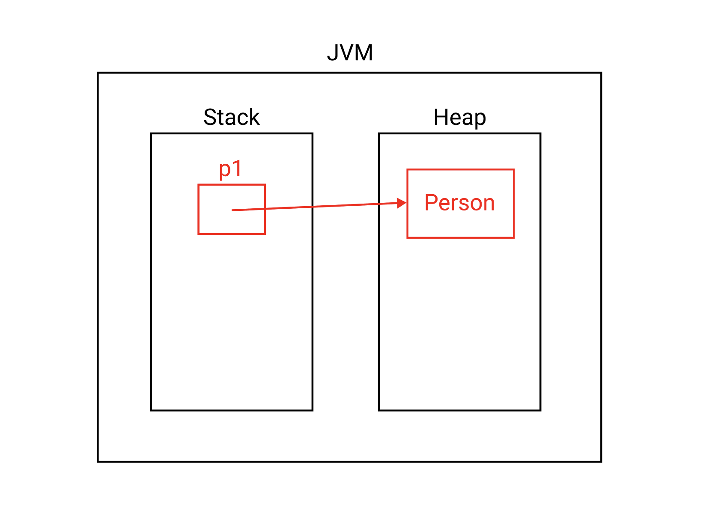
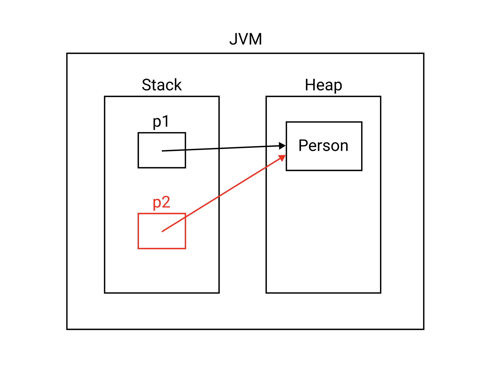
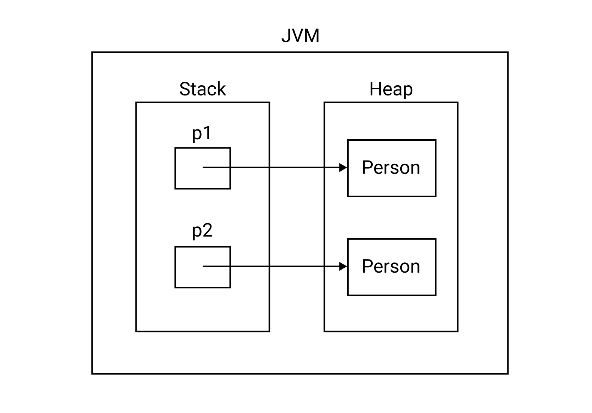

# Table of Contents
[[toc]]

# 복사
객체 지향 프로그래밍에서는 `얕은 복사`와 `깊은 복사`를 구분해야한다.

## 원시 타입의 값 복사
예제를 살펴보자. 다음과 같이 `int`타입의 변수 a를 생성하고 값을 할당하자.
``` java
int a = 10;
```
메모리 구조는 다음과 같다.



변수 b를 설정하고 값을 할당하자.
``` java
int a = 10;
int b = a;
```



이제 변수 a의 값을 변경하자. a를 변경해도 b는 영향받지 않는다.
``` java
int a = 10;
int b = a;
a = 20;
```



이처럼 원시타입의 값 복사는 대입연산자(`=`)를 사용해도 문제가 없다.

## 참조 타입의 얕은 복사
얕은 복사의 예제를 살펴보자. `Person`타입의 변수 p1을 생성하고 객체를 할당하자.
``` java
Person p1 = new Person("Paul");
```
메모리 구조는 다음과 같다.



참조 타입의 `얕은 복사(shallow copy)`는 대입 연산자(`=`)를 사용한다
``` java
Person p1 = new Person("Paul");
Person p2 = p1;
```
메모리 구조는 다음과 같다.



## 얕은 복사의 문제점
이제 변수 p1이 가리키는 객체의 속성을 변경해보자.
``` java
Person p1 = new Person("Paul");
Person p2 = p1;

p1.setName("Monica")

System.out.println(p1.getName());
System.out.println(p2.getName());
```
출력값을 확인해보자
```
Monica
Monica
```
변수 p1가 가리키는 객체의 속성값을 변경했는데 변수 p2가 가리키는 객체의 속성값도 변경됐다. 대입 연산자(`=`)를 통한 얕은 복사는 두 변수가 같은 객체를 가리키기 때문이다.

## 깊은 복사
완전히 같은 속성 값을 가진 새로운 객체를 복사하면서, 이전 객체에는 아무런 영향이 없도록 하는 것을 `깊은 복사(Deep copy)`라고 한다.

깊은 복사를 사용하려면 `Cloneable`인터페이스를 구현하고 `clone()`메소드를 오버라이드해야한다.
``` java Person.java
class Person implements Cloneable {

    private String name;

    public Person(String name) {
        this.name = name;
    }

    public String getName() {
        return name;
    }

    public void setName(String name) {
        this.name = name;
    }

    @Override
    protected Object clone() throws CloneNotSupportedException {
        return super.clone();
    }
}
```
이제 다음과 같이 깊은 복사를 할 수 있다.
``` java Main.java
public class Main {

    public static void main(String[] args) {
        Person p1 = new Person("Paul");

        try {
            Person p2 = (Person) p1.clone();

            p1.setName("Monica");

            System.out.println(p1.getName());   // Monica
            System.out.println(p2.getName());   // Paul

        } catch (CloneNotSupportedException e) {
            e.printStackTrace();
        }
    }
}
```
메모리 구조는 다음과 같다.

