# Table of Contents

[[toc]]

## 액티비티
안드로이드 애플리케이션은 하나 이상의 액티비티로 구성됩니다. `액티비티(Activity)`는 애플리케이션을 구성하는 구성요소입니다. 액티비티는 하나의 `사용자 인터페이스 화면` 및 그것의 `기능`으로 구성됩니다.

예를 들어 다음 메모장 앱을 살펴봅시다.

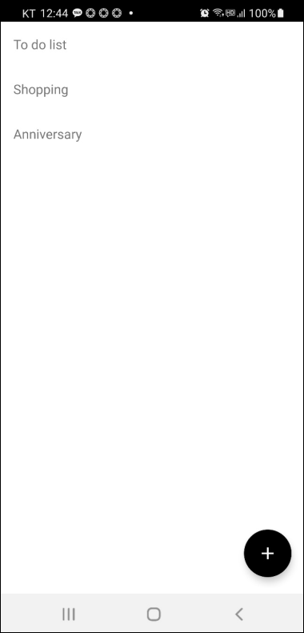

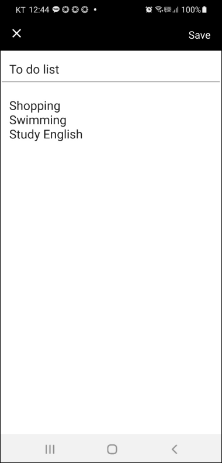

이 메모장 앱은 `목록을 보여주는 화면`과 `글을 작성하는 화면`으로 구성되어있습니다. 따라서 두 개의 액티비티로 구성되어있습니다.

액티비티는 사용자 인터페이스 화면을 담당하는 `xml 파일`과 화면의 기능을 명세하는 `.kt 파일 (또는 .java 파일)`로 구성되어있습니다. 안드로이드 스튜디오에서 새로운 프로젝트를 만들면 기본으로 생성되는 `activity_main.xml`과 `MainActivity.kt`이 바로 그것입니다.

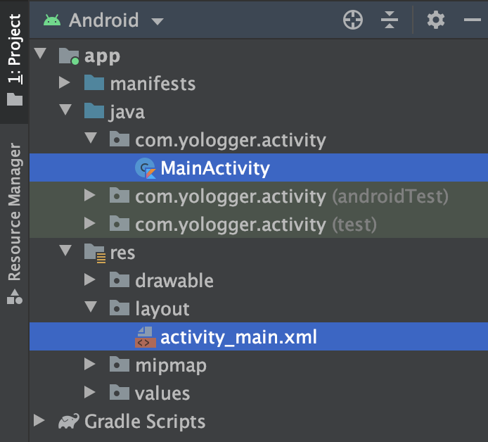

## 액티비티의 상태
어플리케이션이 실행되는 동안 액티비티는 다음과 같은 상태를 거칩니다.

### Active / Running
액티비티가 태스크의 가장 위에 있고, 화면에서 볼 수 있으며, 사용자와 상호작용할 수 있는 상태입니다.

### Paused
액티비티를 화면에서 볼 수 있지만 사용자와 상호작용할 수 없는 상태입니다. 다른 액티비티가 이 액티비티를 부분적으로 가리고 있는 경우입니다.

### Stopped
다른 액티비티가 화면 전체를 가려 사용자가 볼 수 없는 상태입니다.

### Killed
안드로이드 운영체제가 액티비티를 메모리에서 해제한 상태입니다.

## 액티비티 생명주기 메소드
`Activity` 클래스에는 액티비티의 상태가 변할 때 호출되는 `생명주기 메소드(Lifecycle Method)`가 정의되어있습니다.

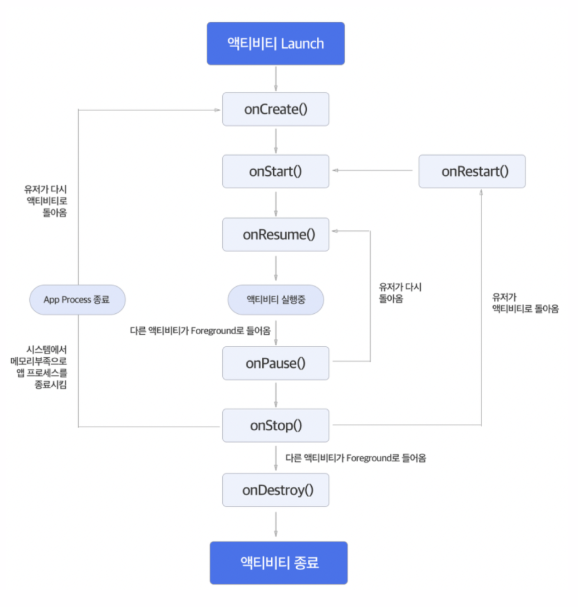

안드로이드 운영체제는 액티비티의 상태가 변하면 생명주기 메소드를 호출합니다.

### onCreate()
액티비티가 생성될 때 호출되며, 보통 다음과 같은 작업을 수행합니다.
- 사용자 인터페이스 선언
- ViewModel 초기화
- 데이터 바인딩
- 기타 초기화 작업

예제 코드를 살펴봅시다.
``` kotlin
class MainActivity: AppCompatActivity() {

    lateinit var viewModel: MainViewModel

    lateinit var button: Button
    lateinit var textView: TextView

    override fun onCreate(savedInstanceState: Bundle?) {
        super.onCreate(savedInstanceState)

        // 사용자 인터페이스 선언
        setContentView(R.layout.activity_main)

        // ViewModel 초기화
        viewModel = ViewModelProviders.of(this).get(MainViewModel::class.java)

        // 데이터 바인딩
        button = findViewById(R.id.button)
        textView = findViewById(R.id.textview)
    }
}
```

### onstart()
액티비티가 화면에 표시될 때 호출됩니다. 보통 이 메소드에서 UI 작업을 수행합니다.
``` kotlin
class MainActivity: AppCompatActivity() {

    lateinit var button: Button
    lateinit var textView: TextView

    // ...

    override fun onStart() {
        super.onStart()

        button.setBackgroundColor(Color.parseColor("#2596be"))
        button.setTextColor(Color.parseColor("#eab676"))

        textView.text = "Hello World"
        textView.hint = "textView"
    }
}
```

### onResume()
액티비티가 사용자와 상호작용할 수 있을 때 호출됩니다. 
``` kotlin
class MainActivity: AppCompatActivity() {

    // ...

    override fun onResume() {
        super.onResume()
    }
}
```

### onPause()
액티비티가 사용자와 상호작용할 수 없을 때 호출됩니다. 보통 다른 액티비티가 이 액티비티의 일부를 가려서 포커스를 잃었을 때 호출됩니다. 
``` kotlin
class MainActivity: AppCompatActivity() {

    // ...

    override fun onResume() {
        super.onResume()
    }
}
```

### onStop()
다른 액티비티가 이 액티비티 전체를 가려 화면이 보이지 않을 때 호출됩니다.
``` kotlin
class MainActivity: AppCompatActivity() {

    // ...

    override fun onStop() {
        super.onStop()
    }
}
```

### onDestroy()
액티비티가 메모리에서 해제될 때 호출됩니다. 보통 onCreate()에서 초기화했던 자원을 해제하는데 사용합니다.
``` kotlin
class MainActivity: AppCompatActivity() {

    // ...

    override fun onDestroy() {
        super.onDestroy()
    }
}
```

### onRestart()
정지(Stopped)된 액티비티가 다시 시작되기 전에 호출됩니다. 
``` kotlin
class MainActivity: AppCompatActivity() {

    // ...

    override fun onRestart() {
        super.onRestart()
    }
}
```

### 예제
이제 다양한 상황에서 액티비티 생명주기 메소드가 어떻게 호출되는지 알아보기 위해 예제 프로젝트를 만듭니다.
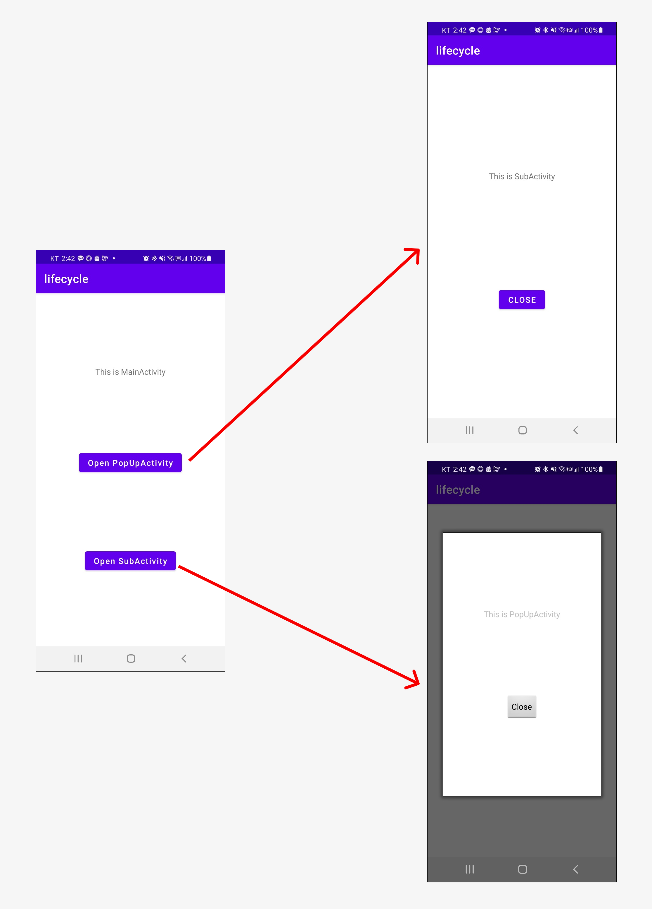

코드는 다음과 같습니다.
``` xml
// AndroidManifest.xml
<?xml version="1.0" encoding="utf-8"?>
<manifest xmlns:android="http://schemas.android.com/apk/res/android"
    package="com.yologger.lifecycle">

    <application
        android:allowBackup="true"
        android:icon="@mipmap/ic_launcher"
        android:label="@string/app_name"
        android:roundIcon="@mipmap/ic_launcher_round"
        android:supportsRtl="true"
        android:theme="@style/Theme.Lifecycle">
        <activity android:name=".MainActivity">
            <intent-filter>
                <action android:name="android.intent.action.MAIN" />
                <category android:name="android.intent.category.LAUNCHER" />
            </intent-filter>
        </activity>
        <activity android:name=".SubActivity" />
        <activity android:name=".PopUpActivity"
            android:theme="@android:style/Theme.Dialog"/>
    </application>
</manifest>
```

``` xml
// activity_main.xml
<?xml version="1.0" encoding="utf-8"?>
<androidx.constraintlayout.widget.ConstraintLayout xmlns:android="http://schemas.android.com/apk/res/android"
    xmlns:app="http://schemas.android.com/apk/res-auto"
    xmlns:tools="http://schemas.android.com/tools"
    android:layout_width="match_parent"
    android:layout_height="match_parent"
    tools:context=".MainActivity">

    <TextView
        android:id="@+id/activity_main_tv_label"
        android:layout_width="wrap_content"
        android:layout_height="wrap_content"
        android:text="This is MainActivity"
        app:layout_constraintLeft_toLeftOf="parent"
        app:layout_constraintRight_toRightOf="parent"
        app:layout_constraintTop_toTopOf="parent"
        app:layout_constraintBottom_toTopOf="@+id/activity_main_btn_open_pop_up_activity"/>

    <Button
        android:id="@+id/activity_main_btn_open_pop_up_activity"
        android:layout_width="wrap_content"
        android:layout_height="wrap_content"
        android:text="Open PopUpActivity"
        android:textAllCaps="false"
        app:layout_constraintTop_toBottomOf="@+id/activity_main_tv_label"
        app:layout_constraintStart_toStartOf="parent"
        app:layout_constraintEnd_toEndOf="parent"
        app:layout_constraintBottom_toTopOf="@+id/activity_main_btn_open_sub_activity"/>

    <Button
        android:id="@+id/activity_main_btn_open_sub_activity"
        android:layout_width="wrap_content"
        android:layout_height="wrap_content"
        android:text="Open SubActivity"
        android:textAllCaps="false"
        app:layout_constraintTop_toBottomOf="@+id/activity_main_btn_open_pop_up_activity"
        app:layout_constraintStart_toStartOf="parent"
        app:layout_constraintEnd_toEndOf="parent"
        app:layout_constraintBottom_toBottomOf="parent"/>

</androidx.constraintlayout.widget.ConstraintLayout>
```

``` kotlin
// MainActivity.kt 
class MainActivity : AppCompatActivity() {

    lateinit var textViewLabel: TextView
    lateinit var buttonOpenPopUpActivity: Button
    lateinit var buttonOpenSubActivity: Button

    override fun onCreate(savedInstanceState: Bundle?) {
        println("[MainActivity] onCreate()")

        super.onCreate(savedInstanceState)
        setContentView(R.layout.activity_main)

        buttonOpenPopUpActivity = findViewById(R.id.activity_main_btn_open_pop_up_activity)
        buttonOpenSubActivity = findViewById(R.id.activity_main_btn_open_sub_activity)

        buttonOpenPopUpActivity.setOnClickListener {
            val nextIntent = Intent(this, PopUpActivity::class.java)
            startActivity(nextIntent)
        }

        buttonOpenSubActivity.setOnClickListener {
            val nextIntent = Intent(this, SubActivity::class.java)
            startActivity(nextIntent)
        }
    }

    override fun onStart() {
        super.onStart()
        println("[MainActivity] onStart()")
    }

    override fun onResume() {
        super.onResume()
        println("[MainActivity] onResume()")
    }

    override fun onPause() {
        super.onPause()
        println("[MainActivity] onPause()")
    }

    override fun onStop() {
        super.onStop()
        println("[MainActivity] onStop()")
    }

    override fun onDestroy() {
        super.onDestroy()
        println("[MainActivity] onDestroy()")
    }
}
```

``` xml
// activity_sub.xml
<?xml version="1.0" encoding="utf-8"?>
<androidx.constraintlayout.widget.ConstraintLayout xmlns:android="http://schemas.android.com/apk/res/android"
    xmlns:app="http://schemas.android.com/apk/res-auto"
    xmlns:tools="http://schemas.android.com/tools"
    android:layout_width="match_parent"
    android:layout_height="match_parent"
    tools:context=".SubActivity">

    <TextView
        android:id="@+id/activity_sub_tv_label"
        android:layout_width="wrap_content"
        android:layout_height="wrap_content"
        android:text="This is SubActivity"
        app:layout_constraintTop_toTopOf="parent"
        app:layout_constraintStart_toStartOf="parent"
        app:layout_constraintEnd_toEndOf="parent"
        app:layout_constraintBottom_toTopOf="@+id/activity_sub_btn_close"/>

    <Button
        android:id="@+id/activity_sub_btn_close"
        android:layout_width="wrap_content"
        android:layout_height="wrap_content"
        android:text="Close"
        app:layout_constraintTop_toBottomOf="@+id/activity_sub_tv_label"
        app:layout_constraintStart_toStartOf="parent"
        app:layout_constraintEnd_toEndOf="parent"
        app:layout_constraintBottom_toBottomOf="parent"/>

</androidx.constraintlayout.widget.ConstraintLayout>
```

``` kotlin
// SubActivity.kt
class SubActivity : AppCompatActivity() {

    lateinit var buttonClose: Button

    override fun onCreate(savedInstanceState: Bundle?) {
        println("[SubActivity] onCreate()")
        super.onCreate(savedInstanceState)
        setContentView(R.layout.activity_sub)

        buttonClose = findViewById(R.id.activity_sub_btn_close)

        buttonClose.setOnClickListener {
            finish()
        }
    }

    override fun onStart() {
        super.onStart()
        println("[SubActivity] onStart()")
    }

    override fun onResume() {
        super.onResume()
        println("[SubActivity] onResume()")
    }

    override fun onPause() {
        super.onPause()
        println("[SubActivity] onPause()")
    }

    override fun onStop() {
        super.onStop()
        println("[SubActivity] onStop()")
    }

    override fun onDestroy() {
        super.onDestroy()
        println("[SubActivity] onDestroy()")
    }
}
```

``` xml
// activity_pop_up.xml
<?xml version="1.0" encoding="utf-8"?>
<androidx.constraintlayout.widget.ConstraintLayout xmlns:android="http://schemas.android.com/apk/res/android"
    xmlns:app="http://schemas.android.com/apk/res-auto"
    xmlns:tools="http://schemas.android.com/tools"
    android:layout_width="300dp"
    android:layout_height="500dp"
    android:background="@color/white"
    tools:context=".PopUpActivity">


    <TextView
        android:id="@+id/activity_pop_up_tv_label"
        android:layout_width="wrap_content"
        android:layout_height="wrap_content"
        android:text="This is PopUpActivity"
        app:layout_constraintTop_toTopOf="parent"
        app:layout_constraintStart_toStartOf="parent"
        app:layout_constraintEnd_toEndOf="parent"
        app:layout_constraintBottom_toTopOf="@+id/activity_pop_up_btn_close"/>

    <Button
        android:id="@+id/activity_pop_up_btn_close"
        android:layout_width="wrap_content"
        android:layout_height="wrap_content"
        android:text="Close"
        app:layout_constraintTop_toBottomOf="@+id/activity_pop_up_tv_label"
        app:layout_constraintStart_toStartOf="parent"
        app:layout_constraintEnd_toEndOf="parent"
        app:layout_constraintBottom_toBottomOf="parent"/>

</androidx.constraintlayout.widget.ConstraintLayout>
```

``` kotlin
// PopUpActivity.kt
class PopUpActivity : Activity() {

    lateinit var buttonClose: Button

    override fun onCreate(savedInstanceState: Bundle?) {
        println("[PopUpActivity] onStart()")
        super.onCreate(savedInstanceState)
        requestWindowFeature(Window.FEATURE_NO_TITLE)
        setContentView(R.layout.activity_pop_up)

        buttonClose = findViewById(R.id.activity_pop_up_btn_close)

        buttonClose.setOnClickListener {
            finish()
        }
    }

    override fun onStart() {
        super.onStart()
        println("[PopUpActivity] onStart()")
    }

    override fun onResume() {
        super.onResume()
        println("[PopUpActivity] onResume()")
    }

    override fun onPause() {
        super.onPause()
        println("[PopUpActivity] onPause()")
    }

    override fun onStop() {
        super.onStop()
        println("[PopUpActivity] onStop()")
    }

    override fun onDestroy() {
        super.onDestroy()
        println("[PopUpActivity] onDestroy()")
    }
}
```

이제 앱을 실행하면 루트 액티비티인 MainActivity가 화면에 나오고 다음과 같이 출력됩니다.

```
[MainActivity] onCreate()
[MainActivity] onStart()
[MainActivity] onResume()
```

안드로이드 운영체제는 하단에 세 개의 소프트웨어 버튼을 제공합니다. 이 영역을 `Soft Keys`라고 부릅니다.

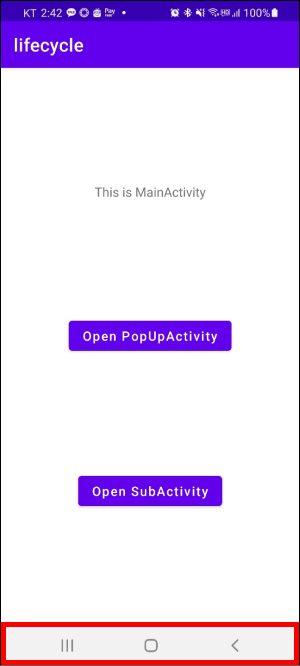

`홈 버튼`을 누르면 어떻게 될까요?

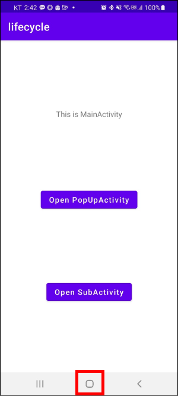

``` 
[MainActivity] onPause()
[MainActivity] onStop()
```

다시 앱으로 돌아오면 다음과 같이 출력됩니다.

``` 
[MainActivity] onRestart()
[MainActivity] onStart()
[MainActivity] onResume()
```

`최근 앱 목록 버튼`을 눌러도 다음과 같이 출력됩니다.

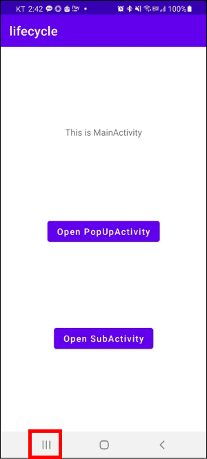

``` 
[MainActivity] onPause()
[MainActivity] onStop()
```

다시 앱으로 돌아오면 다음과 같이 출력됩니다.

``` 
[MainActivity] onRestart()
[MainActivity] onStart()
[MainActivity] onResume()
```

`백 버튼`을 눌러봅시다. 

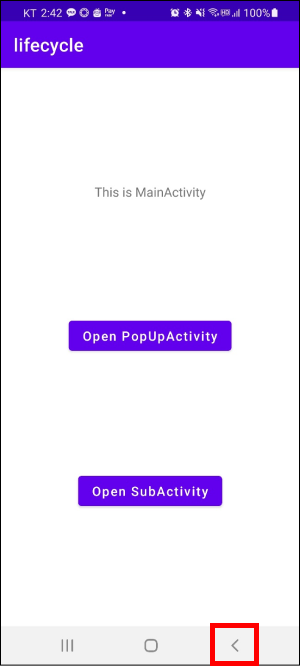

앱이 종료되고 다음과 같이 출력됩니다.

```
[MainActivity] onStart()
[MainActivity] onResume()
[MainActivity] onDestroy()
```

다시 앱을 실행하면 다음과 같이 출력됩니다.

```
[MainActivity] onCreate()
[MainActivity] onStart()
[MainActivity] onResume()
```

이제 SubActivity를 실행해봅시다.
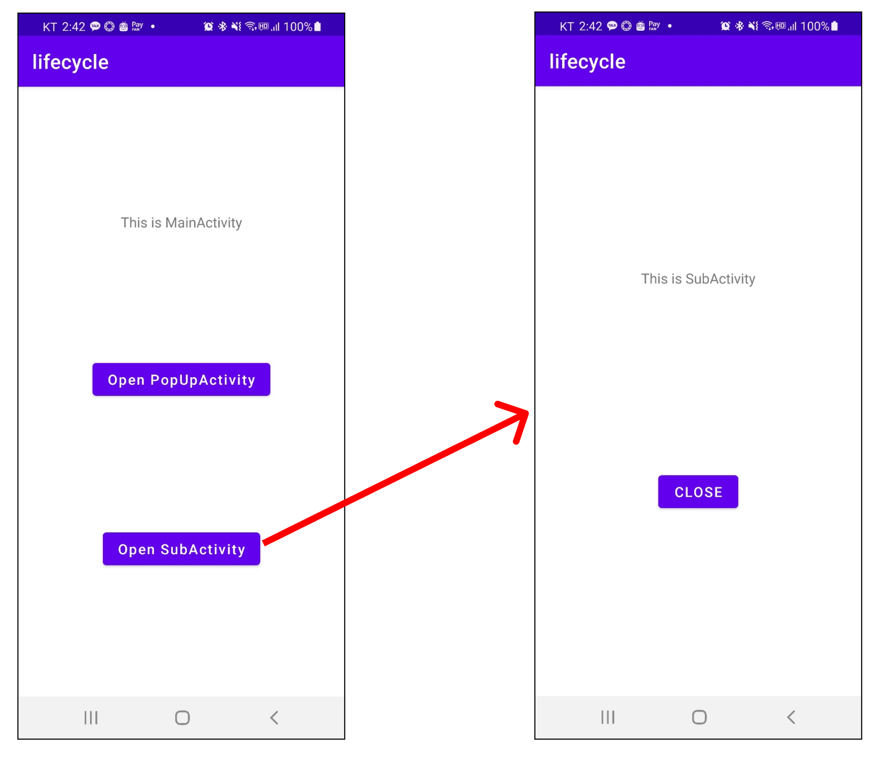

```
[MainActivity] onPause()
[SubActivity] onCreate()
[SubActivity] onStart()
[SubActivity] onResume()
[MainActivity] onStop()
```

`CLOSE`버튼을 눌러 SubActivity를 종료해봅시다.

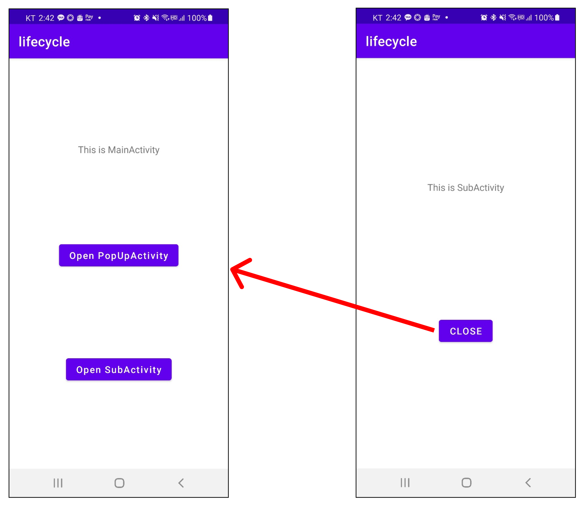

```
[SubActivity] onPause()
[MainActivity] onRestart()
[MainActivity] onStart()
[MainActivity] onResume()
[SubActivity] onStop()
[SubActivity] onDestroy()
```

이번엔 화면의 일부만 가리는 PopUpActivity를 호출해봅시다.

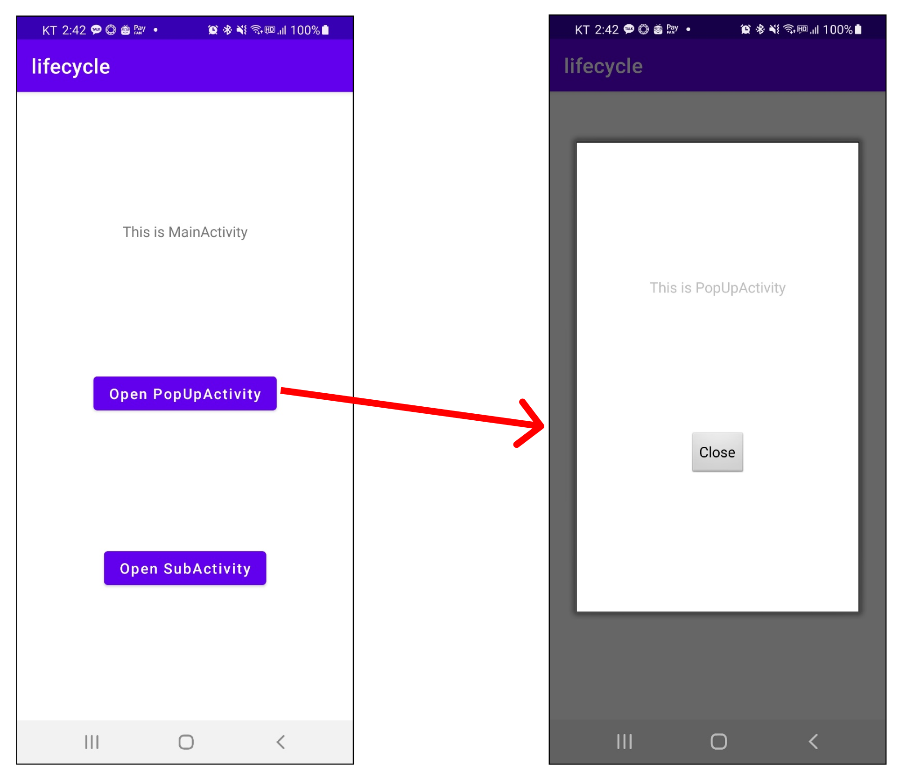

```
[MainActivity] onPause()
[PopUpActivity] onCreate()
[PopUpActivity] onStart()
[PopUpActivity] onResume()
```

이때 MainActivity는 `onStop()`이 아닌 `onPause()`까지만 호출됩니다. 이제 PopUpActivity를 닫아봅시다.

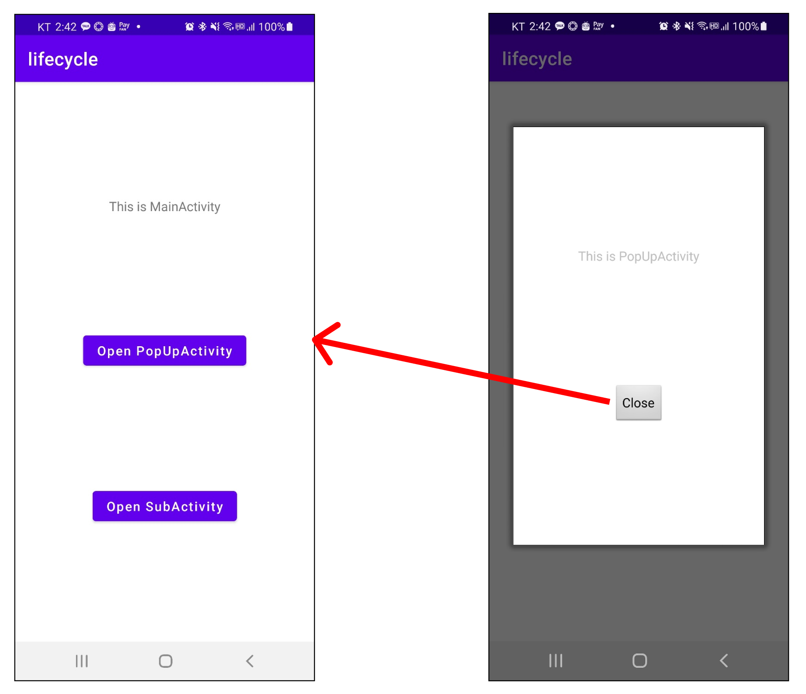

```
[PopUpActivity] onPause()
[MainActivity] onResume()
[PopUpActivity] onStop()
[PopUpActivity] onDestroy()
```