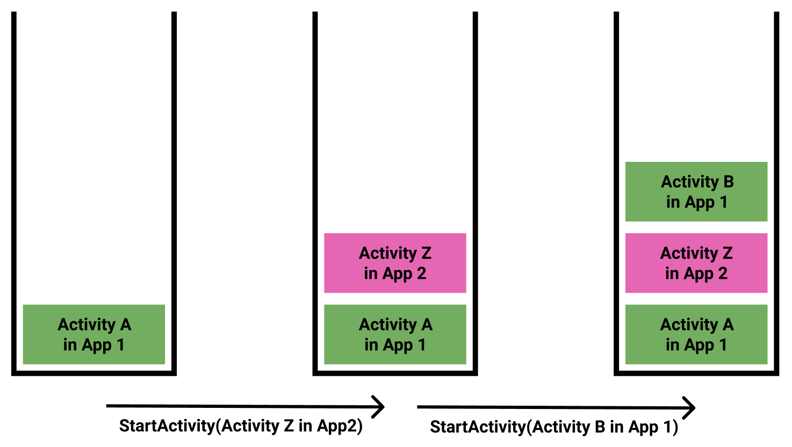

# Table of Contents
[[toc]]

# 인텐트(Intent)란?
`인텐트(Intent)`는 안드로이드 시스템에 특정 작업을 요청하는데 사용됩니다. 크게 다섯 가지 용도로 사용됩니다.
- 같은 어플리케이션의 다른 액티비티 실행
- 다른 어플리케이션의 액티비티 실행
- 데이터 전송
- 브로드캐스트
- 서비스 실행

인텐트에는 크게 `명시적 인텐트`와 `암시적 인텐트` 두 종류가 있습니다.

## 명시적 인텐트와 화면 전환
`명시적 인텐트(Explicit Intent)`는 실행할 액티비티의 자바 클래스 이름을 참조하여 특정 액티비티를 실행하는데 사용합니다. 아래 코드는 버튼을 눌렀을 때 SubActivity로 화면을 전환하는 예제입니다.
``` kotlin
class MainActivity : AppCompatActivity() {

    val button: Button by lazy { findViewById<Button>(R.id.activity_main_button) }

    override fun onCreate(savedInstanceState: Bundle?) {
        super.onCreate(savedInstanceState)
        setContentView(R.layout.activity_contact)

        button.setOnClickListener {
            // 실행할 액티비티의 자바 클래스 이름을 참조하여 인텐트 생성
            val intent = Intent(this, SubActivity::class.java)

            // 액티비티 실행
            startActivity(intent)
        }
    }
}
``` 
화면전환을 할 때는 아래와 같이 `startActivity()` 메소드를 사용합니다. 이때 인텐트를 인자로 전달하면 됩니다.

### 데이터 전달
인텐트는 액티비티 사이에서 데이터를 전송하는데 사용할 수도 있습니다. `Intent`클래스의 `putExtra()`메소드를 사용하면 데이터를 추가할 수 있습니다.

데이터를 보내는 액티비티의 코드는 다음과 같습니다.
``` kotlin MainActivity.kt
class MainActivity : AppCompatActivity() {

    val button: Button by lazy { findViewById<Button>(R.id.activity_main_button) }

    override fun onCreate(savedInstanceState: Bundle?) {
        super.onCreate(savedInstanceState)
        setContentView(R.layout.activity_contact)

        button.setOnClickListener {
            val intent = Intent(this, SubActivity::class.java)

            // 인텐트에 키-값 형태도 데이터 추가
            intent.putExtra("name", "Paul")

            startActivity(intent)
        }
    }
}
``` 

데이터를 수신하는 액티비티의 코드는 다음과 같습니다.
``` kotlin SubActivity.kt
class SubActivity : AppCompatActivity() {

    override fun onCreate(savedInstanceState: Bundle?) {
        super.onCreate(savedInstanceState)
        setContentView(R.layout.activity_contact)

        // 인텐트에서 데이터 추출
        var extras = intent.extras

        extras?.getString("name")?.run {
            Toast.makeText(this@SubActivity, this, Toast.LENGTH_SHORT).show()
        }
    }
}
```

### 데이터 반환
SubActivity는 MainActivity로 데이터를 반환할 수 있습니다. 이때는 `startActivity()` 대신 `startActivityForResult()`메소드를 사용하여 SubActivity를 실행합니다.
``` kotlin MainActivity.kt
class MainActivity : AppCompatActivity() {

    private val button: Button by lazy { findViewById<Button>(R.id.activity_main_button) }
    private val REQUEST_CODE = 1
    override fun onCreate(savedInstanceState: Bundle?) {
        super.onCreate(savedInstanceState)
        setContentView(R.layout.activity_main)

        button.setOnClickListener {
            val intent = Intent(this, SubActivity::class.java)
            intent.putExtra("name", "Paul")
            // startActivity(intent)
            startActivityForResult(intent, REQUEST_CODE)
        }
    }
}
``` 

SubActivity에서는 버튼을 누르면 데이터를 반환하고 액티비티를 종료합니다. 이 때 `setResult()`메소드와 `finish()`메소드를 사용합니다.
``` kotlin SubActivity.kt
class SubActivity : AppCompatActivity() {

    val button: Button by lazy { findViewById<Button>(R.id.activity_sub_button) }

    override fun onCreate(savedInstanceState: Bundle?) {
        super.onCreate(savedInstanceState)
        setContentView(R.layout.activity_sub)

        var extras = intent.extras
        extras?.getString("name")?.run {
            Toast.makeText(this@SubActivity, this, Toast.LENGTH_SHORT).show()
        }

        button.setOnClickListener {
            val intent = Intent()
            intent.putExtra("nation", "England")
            setResult(Activity.RESULT_OK, intent)
            finish()
        }
    }
}
``` 

이제 SubActivity가 반환한 데이터를 받으려면 `onActivityResult()`를 다음과 같이 구현해야합니다.
``` kotlin MainActivity.kt
class MainActivity : AppCompatActivity() {

    private val button: Button by lazy { findViewById<Button>(R.id.activity_main_button) }
    private val REQUEST_CODE = 1
    override fun onCreate(savedInstanceState: Bundle?) {
        super.onCreate(savedInstanceState)
        setContentView(R.layout.activity_main)

        button.setOnClickListener {
            val intent = Intent(this, SubActivity::class.java)
            intent.putExtra("name", "Paul")
            startActivityForResult(intent, REQUEST_CODE)
        }
    }

    override fun onActivityResult(requestCode: Int, resultCode: Int, data: Intent?) {
        super.onActivityResult(requestCode, resultCode, data)
        if (requestCode == REQUEST_CODE) {
            if (resultCode != Activity.RESULT_OK) { return }
            data?.extras?.getString("nation")?.run {
                Toast.makeText(this@MainActivity, this, Toast.LENGTH_SHORT).show()
            }
        }
    }
}
``` 

## Task, Activity Stack
액티비티는 같은 앱의 다른 액티비티를 호출할 수 있습니다. 아래 예제는 버튼을 눌렀을 때 `ActivityA.kt`에서 `ActivityB.kt`를 실행하고 있습니다.
``` kotlin ActivityA.kt
class ActivityA: AppCompatActivity() {

    lateinit var button: Button
    lateinit var textView: TextView

    override fun onCreate(savedInstanceState: Bundle?) {
        super.onCreate(savedInstanceState)
        button.setOnClickListener {
            val nextIntent = Intent(this, ActivityB::class.java)
            startActivity(nextIntent)
        }
    }
}
```

이때 액티비티는 스택의 형태로 관리됩니다. 즉 Activity A가 Activity B를 호출하면 위에 쌓이고, Activity B가 Activity C를 호출하면 또 위에 쌓입니다. 


그러나 액티비티는 다른 앱의 액티비티도 호출할 수 있습니다. 



이처럼 여러 앱 사이의 경계가 없이 다른 액티비티를 호출하다보니, 액티비티는 앱 단위가 아닌 태스크 단위로 관리됩니다. `태스크(Task)`는 스택 형태로 구성되며, 새로운 액티비티를 실행하면 스택의 가장 위에 추가됩니다. 이러한 점에서 태스크는 `액티비티 스택(Activity Stack)`이라고도 합니다.

보통 `홈 화면`이나 `앱스`, `앱 런처`에서 앱 아이콘을 클릭하여 앱을 실행하면 메모리에 새로운 태스크가 생성됩니다. 


그리고 이 태스크를 시작한 액티비티가 태스크의 가장 하단에 놓이게됩니다. 이를 `루트 액티비티(Root Activity)`라고 합니다.


루트 액티비티는 `AndroidManifest.xml`에 `Intent Filter`를 통해 지정합니다.
``` xml
<?xml version="1.0" encoding="utf-8"?>
<manifest xmlns:android="http://schemas.android.com/apk/res/android"
    package="com.yologger.activity">

    <application ... >
        <activity android:name=".ActivityA">
            <!-- Activity A를 루트 액티비티로 지정-->
            <intent-filter>
                <action android:name="android.intent.action.MAIN" />
                <category android:name="android.intent.category.LAUNCHER" />
            </intent-filter>
        </activity>
    </application>

</manifest>
```

이제 다른 액티비티를 실행하면, 새로운 액티비티가 스택의 가장 위에 놓이게 됩니다.


스택의 가장 위에 있는 액티비티는 화면에 표시되고 사용자와 상호작용할 수 있습니다. 이러한 상태를 `foreground`라고 합니다. 반면 아래에 놓인 액티비티의 화면은 위에 있는 액티비티에 의해 가려지며, 사용자와의 상호작용도 할 수 없게 됩니다. 이러한 상태를 `background`라고 합니다.

이제 `뒤로 가기(Back) 버튼`을 누르면 가장 위의 액티비티가 태스크에서 사라지고 이전 화면으로 이동합니다. 


::: top
액티비티가 태스크에 생성되거나 background 상태에 진입하거나 foreground 상태로 돌아오거나 태스크에서 사라지면 액티비티의 생명주기 함수가 호출됩니다.
:::

사용자가 `홈(Home) 버튼`을 누르면 홈 화면이 등장합니다. 그리고 액티비티가 쌓여있는 태스크가 통째로 background 상태로 진입합니다. 

태스크는 메모리 상에 동시에 여러 개 존재할 수 있습니다. 태스크 A가 활성화된 상태에서 홈 화면으로 이동합니다. 이후 다른 앱을 실행하면 태스크 B가 시작됩니다. 태스크 A는 background 상태가 되고 태스크 B는 foreground 상태가 됩니다.


주의할 점은 홈 화면으로 이동한다고 해서 태스크가 메모리에서 사라지는 것은 아니라는 것입니다. `최근 사용한 앱 버튼(Recent List) 버튼`을 클릭하면 현재 메모리에 있는 태스크를 확인할 수 있습니다.


이제 다시 홈 화면으로 이동한 후 태스크 A로 돌아가봅시다. 이 때는 새로운 태스크를 생성하는게 아니라 기존에 존재하던 태스크 A를 foreground 상태로 변경합니다. 물론 태스크 B는 메모리에서 없어지지 않고 background 상태로 진입합니다.


보통 안드로이드 운영체제는 background 상태에 진입한 태스크의 상태를 유지합니다. 따라서 다른 태스크로 이동했다가 돌아와도 동일한 액티비티에 위치해있습니다. 

그러나 주의할 점이 있습니다. <u>태스크의 스택 상태</u>는 유지되지만 <u>최상위 액티비티의 상태</u>가 유지되는 것은 아닙니다. 이러한 경우 액티비티 상태를 복구하기 위해 `onSaveInstanceState()`메소드를 사용할 수 있습니다.

만약 메모리가 부족하거나 사용자가 해당 태스크를 오랫동안 활성화하지 않는 경우, 안드로이드 운영체제가 자동으로 태스크를 종료시키기도 합니다. 이땐 보통 background 상태의 태스크를 우선적으로 종료시킵니다.
