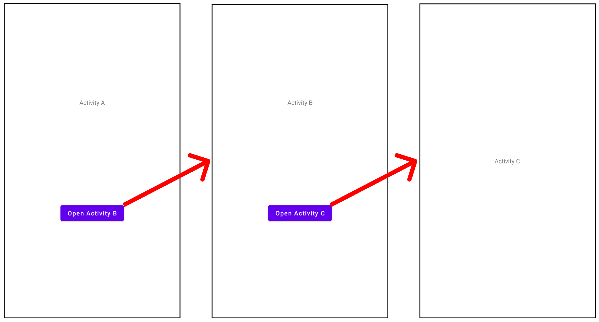
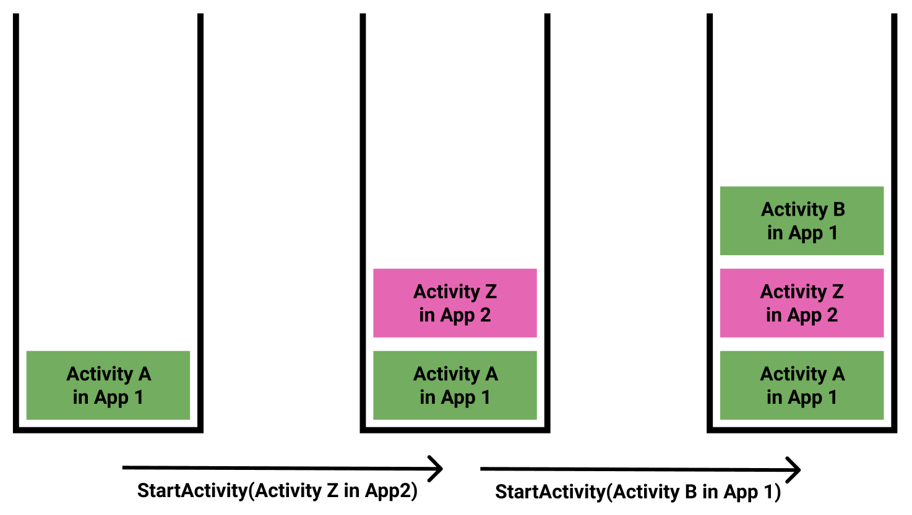
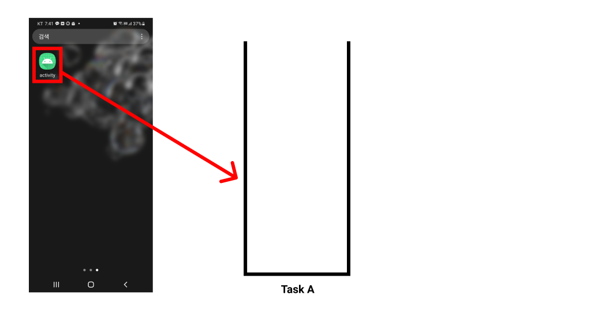
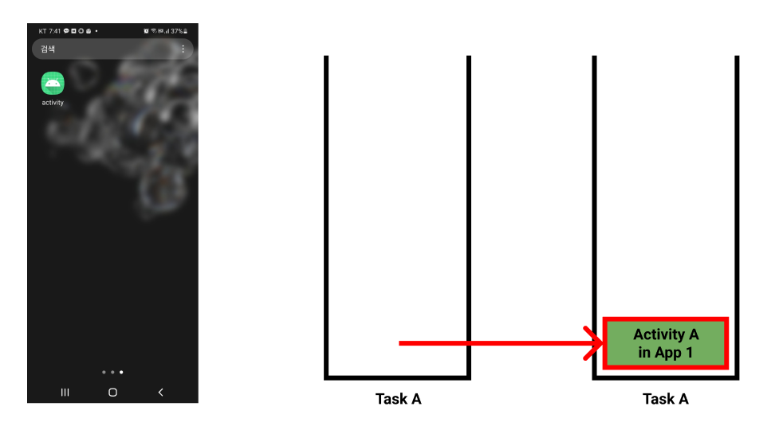
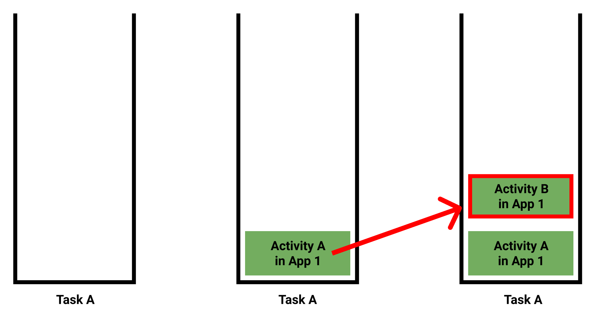
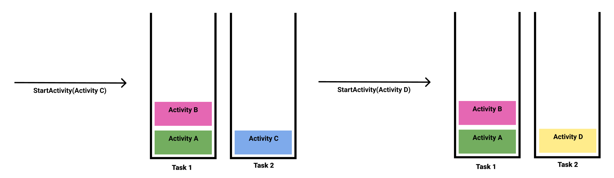
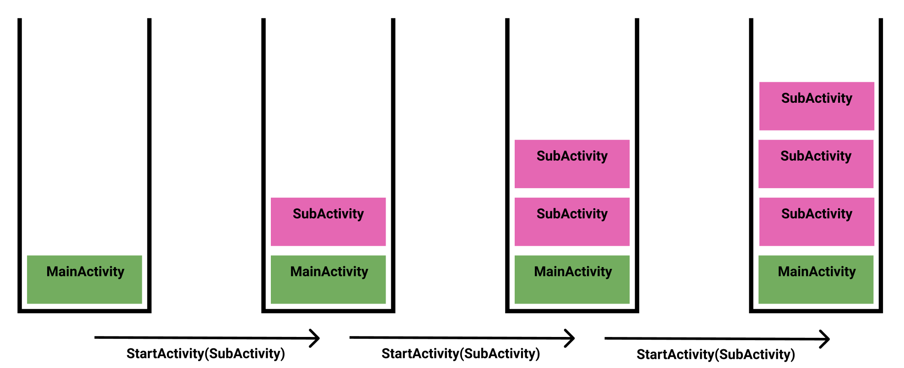
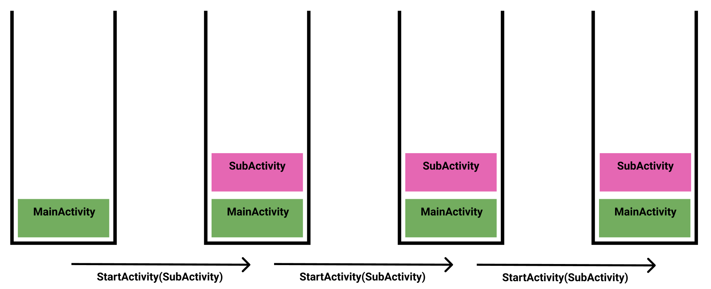

# Table of Contents
[[toc]]

## taskAffinity, launchMode
`taskAffinity`와 `launchMode`를 이해하기 위해 다음과 같은 프로젝트를 생성합시다.

세 개의 액티비티로 구성된 앱이 있습니다. `Activity A`에서 버튼을 누르면 `Activity B`로 화면이 전환됩니다. `Activity B`에서 버튼을 누르면 `Activity C`로 화면이 전환됩니다.



코드는 다음과 같습니다.
``` kotlin ActivityA.kt
class ActivityA : AppCompatActivity() {

    val button: Button by lazy { findViewById<Button>(R.id.activity_a_button) }

    override fun onCreate(savedInstanceState: Bundle?) {
        super.onCreate(savedInstanceState)
        setContentView(R.layout.activity_a)

        button.setOnClickListener {
            val intent = Intent(this, ActivityB::class.java)
            startActivity(intent)
        }
    }
}
``` 
``` kotlin ActivityB.kt
class ActivityB : AppCompatActivity() {

    val button: Button by lazy { findViewById<Button>(R.id.activity_b_button) }

    override fun onCreate(savedInstanceState: Bundle?) {
        super.onCreate(savedInstanceState)
        setContentView(R.layout.activity_bb)

        button.setOnClickListener {
            val intent = Intent(this, ActivityC::class.java)
            startActivity(intent)
        }
    }
}
``` 
``` kotlin ActivityC.kt
class ActivityC : AppCompatActivity() {
    override fun onCreate(savedInstanceState: Bundle?) {
        super.onCreate(savedInstanceState)
        setContentView(R.layout.c)
    }
}
``` 

`AndroidManifest.xml`은 다음과 같습니다.
``` xml AndroidManifest.xml
<?xml version="1.0" encoding="utf-8"?>
<manifest xmlns:android="http://schemas.android.com/apk/res/android"
    package="com.yologger.activity">

    <application
        android:allowBackup="true"
        android:icon="@mipmap/ic_launcher"
        android:label="@string/app_name"
        android:roundIcon="@mipmap/ic_launcher_round"
        android:supportsRtl="true"
        android:theme="@style/Theme.Activity">
        <activity android:name=".ActivityA">
            <intent-filter>
                <action android:name="android.intent.action.MAIN" />
                <category android:name="android.intent.category.LAUNCHER" />
            </intent-filter>
        </activity>
        <activity android:name=".ActivityB">
        </activity>
        <activity android:name=".ActivityC">
        </activity>
    </application>

</manifest>
```

이제 앱을 실행하고 Activity A > Activity B > Activity C 순서로 호출합시다. 그리고 `ADB`를 사용하여 태스크의 스택을 출력해봅시다. 터미널에서 아래 명령어를 입력하면 됩니다.

``` console
$ adb shell dumpsys activity activities
```

이제 출력 결과를 확인해봅시다. 출력 결과가 매우 길기 때문에 중요한 부분만 살펴보겠습니다.
``` console
ACTIVITY MANAGER ACTIVITIES (dumpsys activity activities)
Display #0 (activities from top to bottom):
    ...
    * Task{ ... A=10719:com.yologger.activity U=0 StackId=28904 sz=3}
        ...    
      * Hist #2: ActivityRecord{2eef99a u0 com.yologger.activity/.ActivityC t28904}
        ... 
      * Hist #1: ActivityRecord{b4dbaed u0 com.yologger.activity/.ActivityB t28904}
        ... 
      * Hist #0: ActivityRecord{bdd0c7e u0 com.yologger.activity/.ActivityA t28904}
    ... 
```
`com.yologger.activity`라는 태스크에 세 개의 액티비티가 쌓여있는 것을 확인할 수 있습니다. 태스크 이름을 별도로 설정하지 않으면 자동으로 패키지 이름으로 설정됩니다. 

## taskAffinity
`taskAffinity`속성을 사용하면 태스크 이름을 직접 설정할 수 있습니다. `AndroidManifest.xml`에서 루트 액티비티인 ActivityA의 `taskAffinity`속성을 설정해봅시다.

``` xml AndroidManifest.xml
<?xml version="1.0" encoding="utf-8"?>
<manifest xmlns:android="http://schemas.android.com/apk/res/android"
    package="com.yologger.activity">

    <application>
        <activity android:name=".ActivityA"
            android:taskAffinity="com.yologger.my_task">
            <intent-filter>
                <action android:name="android.intent.action.MAIN" />
                <category android:name="android.intent.category.LAUNCHER" />
            </intent-filter>
        </activity>
        ...
    </application>

</manifest>
``` 

태스크의 스택을 다시 출력해봅시다.
``` console
ACTIVITY MANAGER ACTIVITIES (dumpsys activity activities)
Display #0 (activities from top to bottom):
    ...
    * Task{ ... A=10719:com.yologger.my_task U=0 StackId=28904 sz=3}
        ...    
      * Hist #2: ActivityRecord{2eef99a u0 com.yologger.activity/.ActivityC t28904}
        ... 
      * Hist #1: ActivityRecord{b4dbaed u0 com.yologger.activity/.ActivityB t28904}
        ... 
      * Hist #0: ActivityRecord{bdd0c7e u0 com.yologger.activity/.ActivityA t28904}
    ... 
```
태스크의 이름이 `com.yologger.my_task`로 변경된 것을 확인할 수 있습니다.

## 의문점
주목할 것이 하나 있습니다. 위 예제에서는 Activity B와 Activity C에는 별도의 속성을 지정하지 않고, Activity A에만 `taskAffinity`속성을 지정했습니다. 그런대도 Activity B와 Activity C가 동일한 이름의 태스크에 추가되었습니다.

만약 Activity B와 Activity C는 또 다른 태스크에서 실행하려면 어떻게 해야할까요? 이러한 경우 `launchMode`를 사용할 수 있습니다.

## launchMode
`AndroidManifest.xml`의 `launchMode`속성을 사용하면 태스크와 액티비티 실행의 흐름을 제어할 수 있습니다. `launchMode`는 다음과 같이 네 개의 값 중 하나를 설정할 수 있습니다.
``` xml
<activity 
    android:name="your_activity_name"
    android:launchMode=["singleTask" | "singleInstance" | "multiple" | "singleTop"]>
</activity>
```
### singleTask
`android:launchMode="singleTask"`는 새로운 태스크를 생성하고 그 곳에 액티비티를 추가합니다. 주의할 점은 새로운 태스크의 이름을 `taskAffinity`속성으로 설정해주어야 한다는 것입니다. `taskAffinity`속성을 설정하지 않으면 새로운 액티비티를 호출하는 액티비티의 태스크에 추가됩니다.

위 예제에서 Activity C에 `launchMode`속성과 `taskAffinity`속성을 추가해봅시다.

``` xml AndroidManifest.xml
<?xml version="1.0" encoding="utf-8"?>
<manifest xmlns:android="http://schemas.android.com/apk/res/android"
    package="com.yologger.activity">

    <application>
        <activity android:name=".ActivityA"
            android:taskAffinity="com.yologger.task1">
            <intent-filter>
                <action android:name="android.intent.action.MAIN" />
                <category android:name="android.intent.category.LAUNCHER" />
            </intent-filter></activity>

        <activity android:name=".ActivityB">
        </activity>

        <activity android:name=".ActivityC"
            android:taskAffinity="com.yologger.task2"
            android:launchMode="singleTask">
        </activity>
    </application>

</manifest>
```
다시 태스크의 스택을 확인해봅시다.
``` console
ACTIVITY MANAGER ACTIVITIES (dumpsys activity activities)
Display #0 (activities from top to bottom):
  ...
    * Task{ ... A=10719:com.yologger.task2 }
      * Hist #0: ActivityRecord{260ef2c u0 com.yologger.activity/.ActivityC t28915}
    * Task{ ... A=10719:com.yologger.task1 }
      * Hist #1: ActivityRecord{656d934 u0 com.yologger.activity/.ActivityB t28914}
      * Hist #0: ActivityRecord{8320723 u0 com.yologger.activity/.ActivityA t28914}
```
Activity C는 `com.yologger.task2`라는 새로운 태스크에서 실행되었습니다. 

현재 실행 중인 태스크가 Task 2일 때는 Task 1 전체가 background 상태로 진입합니다.



`최근 앱 목록(Recent List)`에서도 두 개의 태스크를 확인할 수 있습니다.



주의할 점이 하나 있습니다. Task 1과 Task 2가 둘 다 실행된 상태에서 Activity C를 다시 호출하면, 새로운 Task 3가 생성되지 않고 기존의 Task 2를 재사용합니다.



또한 Activity C에서는 `onCreate()`가 호출되지 않고 `onNewIntent()`가 호출됩니다.

이제 Activity D를 추가하고 다음과 같이 `launchMode`와 `taskAffinity`를 설정해봅시다.
``` xml AndroidManifest.xml
<?xml version="1.0" encoding="utf-8"?>
<manifest 
xmlns:android="http://schemas.android.com/apk/res/android"
    package="com.yologger.activity">

    <application
        android:allowBackup="true"
        android:icon="@mipmap/ic_launcher"
        android:label="@string/app_name"
        android:roundIcon="@mipmap/ic_launcher_round"
        android:supportsRtl="true"
        android:theme="@style/Theme.Activity">
        <activity
            android:name=".ActivityA"
            android:taskAffinity="com.yologger.task1">
            <intent-filter>
                <action android:name="android.intent.action.MAIN" />

                <category android:name="android.intent.category.LAUNCHER" />
            </intent-filter>
        </activity>
        <activity android:name=".ActivityB">
        </activity>
        <activity
            android:name=".ActivityC"
            android:taskAffinity="com.yologger.task2"
            android:launchMode="singleTask">
        </activity>
        <activity
            android:name=".ActivityD"
            android:taskAffinity="com.yologger.task2"
            android:launchMode="singleTask">
        </activity>
    </application>
</manifest>
``` 

이제 Activity A > Activity B > Activity C > Activity D 순서대로 실행하면 다음과 같이 스택과 액티비티가 생성됩니다.



### singleInstance
바로 위 예제에서 Activity C와 Activity D의 `launchMode`만 `singleInstance`로 바꿔봅시다.
``` xml AndroidManifest.xml
<?xml version="1.0" encoding="utf-8"?>
<manifest xmlns:android="http://schemas.android.com/apk/res/android"
    package="com.yologger.activity">

    <application
        android:allowBackup="true"
        android:icon="@mipmap/ic_launcher"
        android:label="@string/app_name"
        android:roundIcon="@mipmap/ic_launcher_round"
        android:supportsRtl="true"
        android:theme="@style/Theme.Activity">
        <activity
            android:name=".ActivityA"
            android:taskAffinity="com.yologger.task1">
            <intent-filter>
                <action android:name="android.intent.action.MAIN" />

                <category android:name="android.intent.category.LAUNCHER" />
            </intent-filter>
        </activity>
        <activity android:name=".ActivityB"></activity>
        <activity
            android:name=".ActivityC"
            android:taskAffinity="com.yologger.task2"
            android:launchMode="singleInstance"></activity>
        <activity
            android:name=".ActivityD"
            android:taskAffinity="com.yologger.task2"
            android:launchMode="singleInstance"></activity>
    </application>
</manifest>
``` 
다시 Activity A > Activity B > Activity C > Activity D 순서대로 실행하면 다음과 같이 스택과 액티비티가 생성됩니다.


`singleInstance`는 `singleTask`와 매우 유사합니다. 다만 차이점은 새로운 태스크 안에 오직 하나의 루트 액티비티만을 유지한다는 것입니다.

### standard
`standard`와 `singleTop`은 새로운 태스크를 만드는 것과는 관련이 없습니다. 기존 태스크에 새로운 액티비티를 어떻게 추가할 것인지와 관련있습니다.

`standard`는 기본값입니다. 실행할 액티비티를 기존 태스크의 가장 위에 추가합니다. 또한 동일한 액티비티의 인스턴스를 여러 개 추가할 수 있습니다. 

다음과 같이 두 개의 액티비티(MainActivity, SubActivity)가 있다고 가정합시다. 
``` xml AndroidManifest.xml
<?xml version="1.0" encoding="utf-8"?>
<manifest xmlns:android="http://schemas.android.com/apk/res/android"
    package="com.yologger.activity">

    <application
        android:allowBackup="true"
        android:icon="@mipmap/ic_launcher"
        android:label="@string/app_name"
        android:roundIcon="@mipmap/ic_launcher_round"
        android:supportsRtl="true"
        android:theme="@style/Theme.Activity">
        <activity android:name=".MainActivity">
            <intent-filter>
                <action android:name="android.intent.action.MAIN" />
                <category android:name="android.intent.category.LAUNCHER" />
            </intent-filter>
        </activity>
        <activity 
            android:name=".SubActivity"
            android:launchMode="standard" />
    </application>

</manifest>
``` 

이제 MainActivity > SubActivity > SubActivity > SubActivity 순서대로 호출하면, 태스크 상태는 다음과 같습니다.



### singleTop
바로 위 예제에서 `standard`를 `singleTop`으로 변경합시다.
``` xml AndroidManifest.xml
<?xml version="1.0" encoding="utf-8"?>
<manifest xmlns:android="http://schemas.android.com/apk/res/android"
    package="com.yologger.activity">

    <application
        android:allowBackup="true"
        android:icon="@mipmap/ic_launcher"
        android:label="@string/app_name"
        android:roundIcon="@mipmap/ic_launcher_round"
        android:supportsRtl="true"
        android:theme="@style/Theme.Activity">
        <activity android:name=".MainActivity">
            <intent-filter>
                <action android:name="android.intent.action.MAIN" />
                <category android:name="android.intent.category.LAUNCHER" />
            </intent-filter>
        </activity>
        <activity 
            android:name=".SubActivity"
            android:launchMode="singleTop" />
    </application>

</manifest>
``` 

다시 MainActivity > SubActivity > SubActivity > SubActivity 순서대로 호출하면, 태스크 상태는 다음과 같습니다.



`singleTop`은 실행할 액티비티의 인스턴스가 이미 스택의 맨 위에 있으면 새로운 인스턴스를 생성하지 않고 기존 인스턴스를 사용합니다. 이때 호출되는 액티비티에서는 `onCreate()`가 아니라 `onNewIntent()`가 호출됩니다.
``` kotlin
class SecondActivity : AppCompatActivity() {

    override fun onNewIntent(intent: Intent?) {
        super.onNewIntent(intent)
    }
}
``` 
