# Table of Contents
[[toc]]

## 인텐트 플래그 설정 방법
인텐트 플래그를 설정하는 방법에는 두 가지가 있습니다.

- `setFlags()`: 기존 플래그는 없애고 인자로 전달된 플래그를 설정합니다.
- `addFlags()`: 기존 플래그를 유지하고 인자로 전달된 플래그를 추가합니다.

##  인탠트 플래그 종류
안드로이드에는 무수히 많은 인탠트 플래그가 있습니다. 이번 포스트에서는 자주 사용하는 인텐트 플래그에 대해 알아보겠습니다.

### FLAG_ACTIVITY_CLEAR_TOP
실행되는 액티비티가 이미 태스크에 존재할 경우, 그 위에 있는 액티비티들을 종료하고 실행되는 액티비티를 스택의 가장 위에 위치시킵니다.

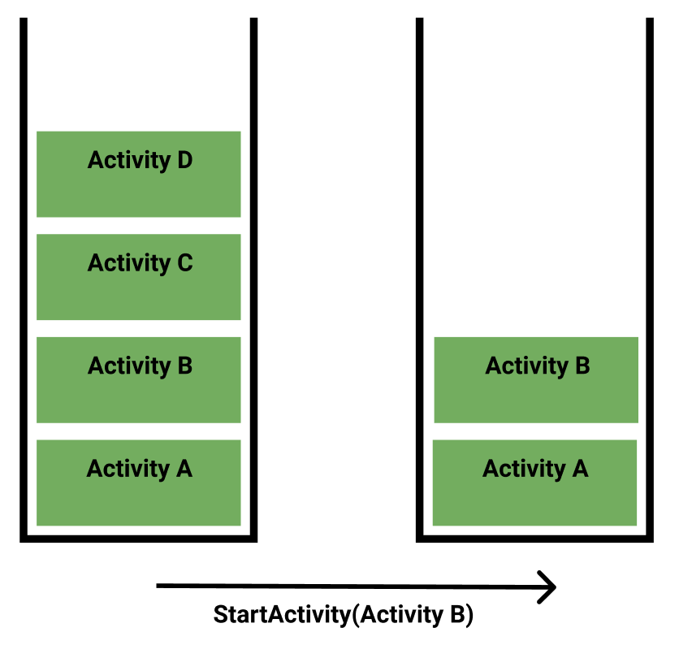

``` kotlin ActivityD.kt
val intent = Intent(this@ActivityD, ActivityB::class.java)
intent.setFlags(FLAG_ACTIVITY_CLEAR_TOP)
startActivity(intent)
```

### FLAG_ACTIVITY_NO_ANIMATION
화면 전환 시 애니메이션을 없애줍니다.
``` kotlin ActivityA.kt
val intent = Intent(this@ActivityA, ActivityB::class.java)
intent.setFlags(FLAG_ACTIVITY_NO_ANIMATION)
startActivity(intent)
```

### FLAG_ACTIVITY_SINGLE_TOP
`launchMode="singleTop"`과 동일합니다.

### FLAG_ACTIVITY_REORDER_TO_FRONT
실행되는 액티비티가 태스크에 이미 존재하면 태스크의 가장 위로 올려줍니다.
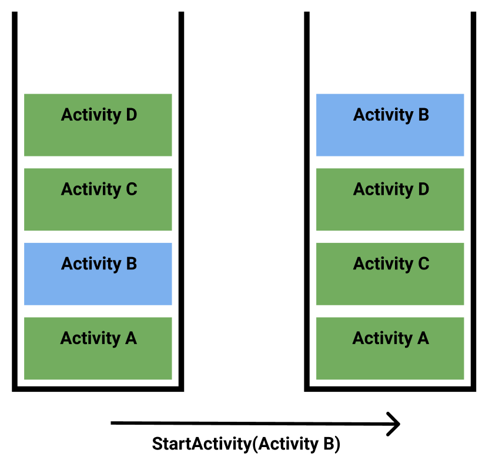

``` kotlin ActivityD.kt
val intent = Intent(this@ActivityD, ActivityB::class.java)
intent.setFlags(FLAG_ACTIVITY_REORDER_TO_FRONT)
startActivity(intent)
```


### FLAG_ACTIVITY_NO_HISTORY
Activity A > Activity B > Activity C 순서대로 실행한다고 가정합시다.

Activity A에서 Activity B를 실행할 때 `FLAG_ACTIVITY_NO_HISTORY`플래그를 설정하면 Activity B는 태스크에 추가되지 않고 화면전환만 됩니다.

``` kotlin ActivityA.kt
val intent = Intent(this@ActivityA, ActivityB::class.java)
intent.setFlags(FLAG_ACTIVITY_NO_HISTORY)
startActivity(intent)
```

이제 Activity B에서 어떠한 플래그도 설정하지 않고 Activity C로 이동합시다.
``` kotlin ActivityB.kt
val intent = Intent(this@ActivityB, ActivityC::class.java)
startActivity(intent)
```

Activity C에서 `뒤로 가기(Back) 버튼`을 누르면 Activity B가 아니라 Activity A로 이동합니다. Activity B는 태스크에 추가되지 않았기 때문입니다. 로딩 화면처럼 다시 돌아올 필요가 없는 화면에 사용합니다.

### FLAG_ACTIVITY_FORWARD_RESULT
Activity A > Activity B > Activity C로 화면 이동을 한다고 가정합시다. Activity C에서 Activity A로 돌아가면서 데이터를 반환하려면 Activity B에서 `onActivityResult()`를 구현하고, 이 안에서 다시 Activity A로 데이터를 반환하는 로직을 구현해야합니다.

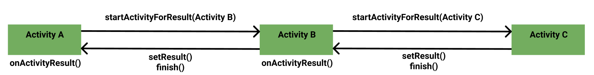

이러한 경우 `FLAG_ACTIVITY_FORWARD_RESULT`을 사용하여 값을 쉽게 반환할 수 있습니다.

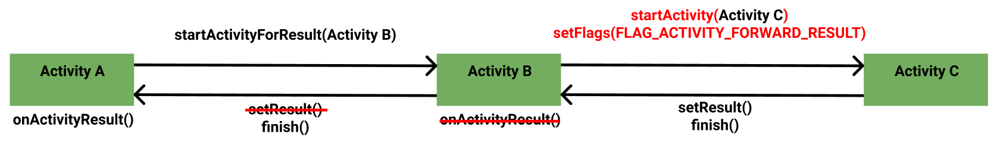

우선 Activity A에서 Activity B로 이동하는 코드는 다음과 같습니다.

``` kotlin ActivityA.kt
class ActivityA : AppCompatActivity() {

    private val buttonOpenB: Button by lazy { findViewById<Button>(R.id.activity_a_button_open_b) }

    private val REQUEST_CODE = 1000

    override fun onCreate(savedInstanceState: Bundle?) {
        super.onCreate(savedInstanceState)
        setContentView(R.layout.activity_a)

        buttonOpenB.setOnClickListener {
            // Open B 버튼을 눌렀을 때 Activity B 실행
            val intent = Intent(this, ActivityB::class.java)
            startActivityForResult(intent, REQUEST_CODE)
        }

        // ...
    }
}
``` 

Activity B에서 Activity C를 실행할 때는 `startActivityForResult()` 대신 `startActivity()`를 사용합니다. 또한 `FLAG_ACTIVITY_FORWARD_RESULT`플래그를 설정합니다.
``` kotlin ActivityB.kt
class ActivityB : AppCompatActivity() {

    private val buttonOpenC: Button by lazy { findViewById<Button>(R.id.activity_b_button_open_c) }
    private val buttonCloseC: Button by lazy { findViewById<Button>(R.id.activity_b_button_close_c) }

    override fun onCreate(savedInstanceState: Bundle?) {
        super.onCreate(savedInstanceState)
        setContentView(R.layout.activity_b)

        buttonOpenC.setOnClickListener {
            // Open C 버튼을 눌렀을 때 Activity C 실행
            val intent = Intent(this@ActivityB, ActivityC::class.java)
            // 플래그 설정
            intent.setFlags(FLAG_ACTIVITY_FORWARD_RESULT)
            startActivity(intent)
        }
    }
}
```

Activity C에서 Activity B로 돌아가는 로직은 다음과 같이 구현합니다.
``` kotlin ActivityC.kt
class ActivityC : AppCompatActivity() {

    val buttonCloseC: Button by lazy { findViewById<Button>(R.id.activity_c_button_close_c) }

    override fun onCreate(savedInstanceState: Bundle?) {
        super.onCreate(savedInstanceState)
        setContentView(R.layout.activity_c)

        buttonCloseC.setOnClickListener {
            // Close C 버튼을 눌렀을 때 데이터를 반환하면서 Activity C 종료
            val intent = Intent()
            intent.putExtra("name", "Paul")
            setResult(Activity.RESULT_OK, intent)
            finish()
        }

        // ...
    }
}
```
이제 Activity B에서 데이터를 받아 Activity A로 전달해봅시다. 

Activity B에서 Activity C로 이동할 때 `FLAG_ACTIVITY_FORWARD_RESULT`플래그를 설정하지 않았다면, Activity B에 `onActivityResult()`를 구현하고 이 안에서 `setResult()`와 `finish()`를 호출하여 Activity A로 데이터를 반환하는 로직을 구현해야 합니다. 그러나 Activity B에서 Activity C로 이동할 때 플래그를 설정했으므로 그저 `finish()`만 호출하여 Activity B를 종료하면 됩니다.

``` kotlin ActivityB.kt
class ActivityB : AppCompatActivity() {

    private val buttonOpenC: Button by lazy { findViewById<Button>(R.id.activity_b_button_open_c) }
    private val buttonCloseB: Button by lazy { findViewById<Button>(R.id.activity_b_button_back_to_a) }

    override fun onCreate(savedInstanceState: Bundle?) {
        super.onCreate(savedInstanceState)
        setContentView(R.layout.activity_b)

        buttonOpenC.setOnClickListener {
            // ...
        }

        buttonCloseB.setOnClickListener {
            // Close B 버튼을 눌렀을 때 Activity B 종료
            finish()
        }
    }

    // onActivityResult()를 구현하지 않아도 됩니다.
    /* 
    override fun onActivityResult(requestCode: Int, resultCode: Int, data: Intent?) {
        super.onActivityResult(requestCode, resultCode, data)
        // ...
    }
    */
}
``` 


이제 Activity A에서 `onActivityResult()`를 구현하여 Activity C에서 온 데이터를 전달받을 수 있습니다.
``` kotlin ActivityA.kt
class ActivityA : AppCompatActivity() {

    private val button: Button by lazy { findViewById<Button>(R.id.activity_a_button_open_b) }

    private val REQUEST_CODE = 1000

    override fun onCreate(savedInstanceState: Bundle?) {
        super.onCreate(savedInstanceState)
        setContentView(R.layout.activity_a)

        button.setOnClickListener {
            // ...
        }
    }

    override fun onActivityResult(requestCode: Int, resultCode: Int, data: Intent?) {
        super.onActivityResult(requestCode, resultCode, data)
        if (requestCode == REQUEST_CODE) {
            if (resultCode != Activity.RESULT_OK) { return }
            data?.extras?.getString("name")?.run {
                Toast.makeText(this@ActivityA, this, Toast.LENGTH_SHORT).show()
            }
        }
    }
}
```

### FLAG_ACTIVITY_NEW_TASK
새로운 태스크를 생성하고 그 안에서 액티비티를 실행합니다. 그러나 동일한 `affinity`를 가진 태스크가 존재하면 새로운 태스크를 생성하지 않고 기존의 태스크를 재활용합니다.

`AndroidManifest.xml`에 다음과 같이 네 개의 액티비티가 정의되어있다고 가정합시다. Activity A와 Activity B의 `taskAffinity`값이 동일하고, Activity C와 Activity D의 `taskAffinity`값이 동일합니다.
``` xml AndroidManifest.xml
<?xml version="1.0" encoding="utf-8"?>
<manifest xmlns:android="http://schemas.android.com/apk/res/android"
    package="com.yologger.example">
 
    <application
        android:icon="@mipmap/ic_launcher"
        android:label="@string/app_name"
        android:theme="@style/AppTheme">

        <activity
            android:name=".ActivityA"
            android:taskAffinity="com.yologger.task1">
            <intent-filter>
                <action android:name="android.intent.action.MAIN" />
                <category android:name="android.intent.category.LAUNCHER" />
            </intent-filter>
        </activity>
 
        <activity android:name=".ActivityB"
            android:taskAffinity="com.yologger.task1"/>
 
        <activity android:name=".ActivityC"
            android:taskAffinity="com.yologger.task2"/>
 
        <activity android:name=".ActivityD"
            android:taskAffinity="com.yologger.task2"/>
 
    </application>
 
</manifest>
``` 

앱을 처음 실행하면 다음과 같은 상태입니다. 

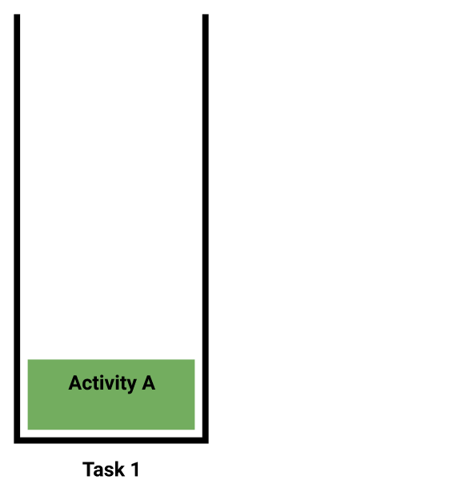

Activity A에서 다음과 같이 Activity B를 실행합시다.

``` kotlin ActivityA.kt
val intent = Intent(this, ActivityB::class.java)
intent.setFlags(FLAG_ACTIVITY_NEW_TASK)
startActivity(intent)
``` 

그럼 태스크는 아래와 같습니다. Activity A와 Activity B는 동일한 taskAffinity 속성값을 가지고 있기 때문입니다.

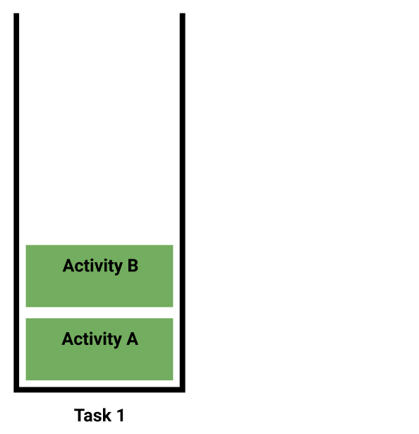

이제 Activity B에서 Activity C를 실행합니다.
``` kotlin ActivityB.kt
val intent = Intent(this, ActivityC::class.java)
intent.setFlags(FLAG_ACTIVITY_NEW_TASK)
startActivity(intent)
```
이제 태스크는 아래와 같습니다. Activity B와 Activity C는 다른 taskAffinity 속성값을 가지고 있기 때문입니다.

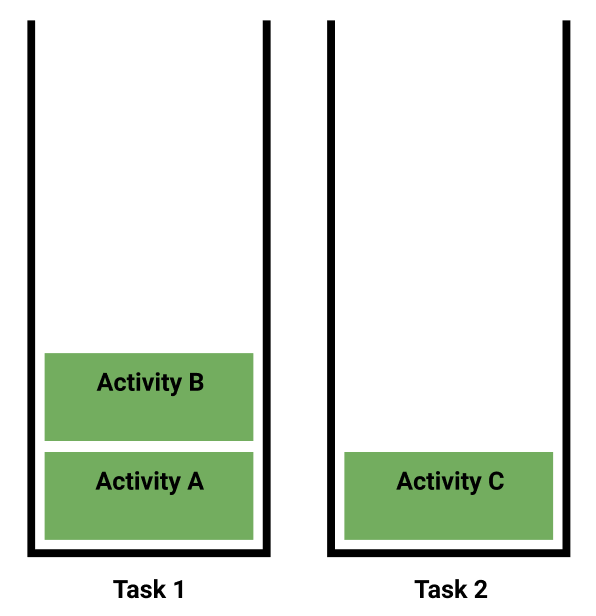

이제 Activity C에서 Activity D를 실행합니다.
``` kotlin ActivityC.kt
val intent = Intent(this, ActivityD::class.java)
intent.setFlags(FLAG_ACTIVITY_NEW_TASK)
startActivity(intent)
```
이제 태스크는 아래와 같습니다. Activity C와 Activity D는 동일한 `taskAffinity`속성값을 가지고 있기 때문입니다.

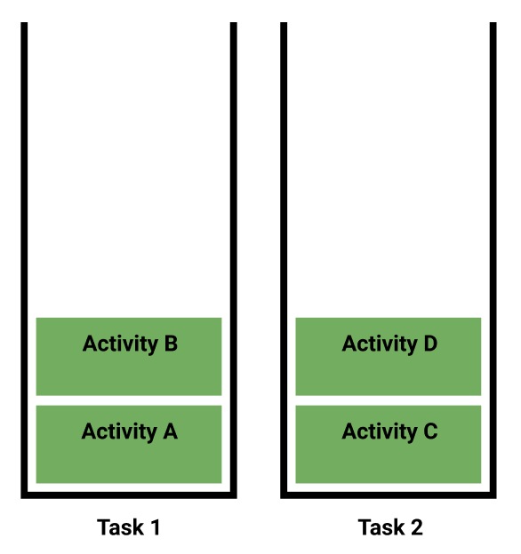

### FLAG_ACTIVITY_MULTIPLE_TASK
이 플래그는 `FLAG_ACTIVITY_NEW_TASK`와 같이 사용하지 않으면 아무련 효과가 없습니다. 액티비티를 실행하면 무조건 새로운 태스크를 생성하고 그 안의 루트 액티비티로 지정하여 실행합니다. 만약 동일한 `taskAffinity`속성값을 같는 태스크가 존재하면, 기존의 태스크를 제거하고 새로운 태스크를 생성한 후 루트 액티비티로 지정합니다.

바로 위 예제와 동일하게 `AndroidManifest.xml`에 네 개의 액티비티가 정의되어있습니다.
``` xml AndroidManifest.xml
<?xml version="1.0" encoding="utf-8"?>
<manifest xmlns:android="http://schemas.android.com/apk/res/android"
    package="com.yologger.example">
 
    <application
        android:icon="@mipmap/ic_launcher"
        android:label="@string/app_name"
        android:theme="@style/AppTheme">
        <activity
            android:name=".ActivityA"
            android:taskAffinity="com.yologger.task1">
            <intent-filter>
                <action android:name="android.intent.action.MAIN" />
                <category android:name="android.intent.category.LAUNCHER" />
            </intent-filter>
        </activity>
 
        <activity android:name=".ActivityB"
            android:taskAffinity="com.yologger.task1"/>
 
        <activity android:name=".ActivityC"
            android:taskAffinity="com.yologger.task2"/>
 
        <activity android:name=".ActivityD"
            android:taskAffinity="com.yologger.task2"/>
 
    </application>
 
</manifest>
```

앱을 처음 실행하면 다음과 같은 상태입니다.


이제 `FLAG_ACTIVITY_NEW_TASK`와 `FLAG_ACTIVITY_MULTIPLE_TASK`를 모두 설정하여 Activity B를 실행합시다.
``` kotlin ActivityA.kt
val intent = Intent(this, ActivityB::class.java)
intent.setFlags(FLAG_ACTIVITY_NEW_TASK or FLAG_ACTIVITY_MULTIPLE_TASK)
startActivity(intent)
```

이제 앱은 다음과 같은 상태가 됩니다.

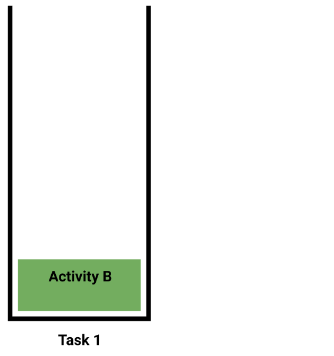

`FLAG_ACTIVITY_MULTIPLE_TASK`플래그는 태스크를 무조건 생성합니다. 그런데 Activity A와 Activity B의 `taskAffinity`속성값이 동일합니다. 따라서 기존 태스크를 제거하고 새로운 태스크를 생성한 후 Activity B를 루트 액티비티로 지정합니다.

이제 다음과 같이 Activity B에서 Activity C를 실행합시다.

``` kotlin ActivityB.kt
val intent = Intent(this, ActivityC::class.java)
intent.setFlags(FLAG_ACTIVITY_NEW_TASK or FLAG_ACTIVITY_MULTIPLE_TASK)
startActivity(intent)
```

Activity B와 Activity C는 taskAffinity 속성값이 다릅니다. 따라서 태스크는 두 개가 되며, 앱은 다음과 같은 상태가 됩니다.

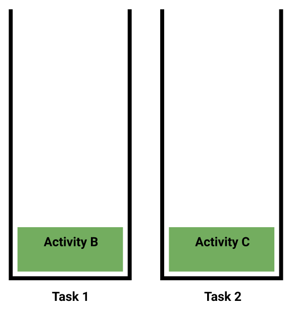

마지막으로 Activity C에서 Activity D를 실행합시다.

``` kotlin ActivityC.kt
val intent = Intent(this, ActivityD::class.java)
intent.setFlags(FLAG_ACTIVITY_NEW_TASK or FLAG_ACTIVITY_MULTIPLE_TASK)
startActivity(intent)
```

이제 앱은 다음과 같은 상태가 됩니다.

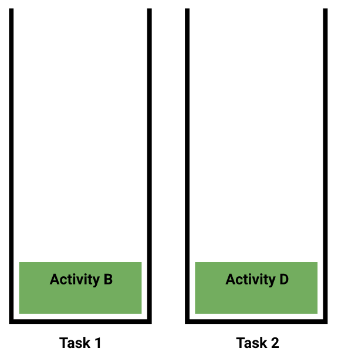
