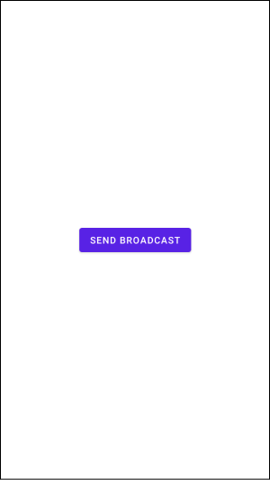
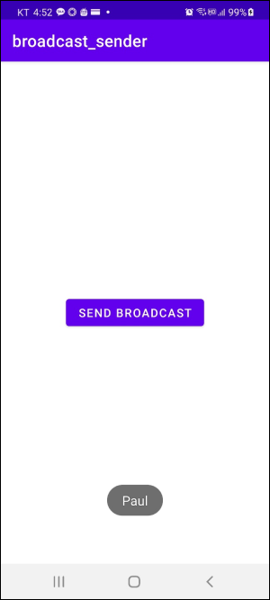
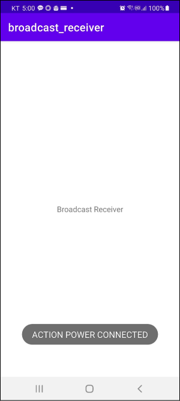

# Table of Contents
[[toc]]

## Broadcast Intent, Broadcast Receiver
`브로드캐스트 인탠트(Broadcast Intent)`와 `브로드캐스트 리시버(Broadcast Receiver)`를 사용하면 시스템의 다른 컴포넌트들에게 시스템 차원의 메시지를 전송할 수 있습니다.

예제를 통해 `브로드캐스트 인탠트(Broadcast Intent)`와 `브로드캐스트 리시버(Broadcast Receiver)`에 대해 알아보겠습니다. 아래와 같이 두 개의 프로젝트를 생성합니다.
- broadcast_sender
- broadcast_receiver

### broadcast_sender
broadcast_sender 프로젝트는 브로드캐스트 인텐트를 생성하여 안드로이드 시스템에 전달합니다. 레이아웃은 다음과 같습니다.
``` xml activity_main.xml
<?xml version="1.0" encoding="utf-8"?>
<androidx.constraintlayout.widget.ConstraintLayout xmlns:android="http://schemas.android.com/apk/res/android"
    xmlns:app="http://schemas.android.com/apk/res-auto"
    xmlns:tools="http://schemas.android.com/tools"
    android:layout_width="match_parent"
    android:layout_height="match_parent"
    tools:context=".MainActivity">

    <Button
        android:id="@+id/activity_main_button"
        android:layout_width="wrap_content"
        android:layout_height="wrap_content"
        android:text="Send Broadcast"
        app:layout_constraintTop_toTopOf="parent"
        app:layout_constraintBottom_toBottomOf="parent"
        app:layout_constraintStart_toStartOf="parent"
        app:layout_constraintEnd_toEndOf="parent"/>

</androidx.constraintlayout.widget.ConstraintLayout>
``` 

화면은 다음과 같습니다.



코드는 다음과 같습니다. 버튼을 누르면 브로드캐스트 인텐트를 생성하여 시스템에 전송합니다. 이때 `sendBroadcast()`메소드를 사용합니다.
``` kotlin MainActivity.kt 
class MainActivity : AppCompatActivity() {

    val button: Button by lazy { findViewById<Button>(R.id.activity_main_button) }

    override fun onCreate(savedInstanceState: Bundle?) {
        super.onCreate(savedInstanceState)
        setContentView(R.layout.activity_main)

        button.setOnClickListener {
            // 인텐트 생성
            val intent = Intent()
            // 액션 설정
            intent.action = "com.yologger.broadcast_sender"
            // 데이터 추가
            intent.putExtra("name", "Paul")
            // 브로드케스트 인텐트 전송
            sendBroadcast(intent)
        }
    }
}
```

### broadcast_receiver
broadcast_receiver 프로젝트는 브로드캐스트 인텐트를 수신합니다. 브로드캐스트 인텐트를 수신하려면 `BroadcastReceiver`클래스를 구현하고 `onReceive()`메소드를 오버라이딩 해야합니다. 아래 코드는 브로드케스트 인텐트를 수신하면 토스트 메시지를 출력합니다.
``` kotlin CustomBroadcastReceiver.kt
class CustomBroadcastReceiver : BroadcastReceiver() {

    override fun onReceive(context: Context, intent: Intent) {
        intent.action?.run {
            intent?.extras?.getString("name").run {
                Toast.makeText(context, "$this", Toast.LENGTH_SHORT).show()
            }
        }
    }
}
```

이제 `MainActivity.kt`에서 브로드캐스트 리시버를 등록합니다. 브로드캐스트 리시버를 등록할 때는 `registerReceiver()`메소드를 사용합니다. `onDestroy()`에서는 `unregisterReceiver()`메소드를 호출하여 브로드캐스트 리시버를 해제해야합니다.
``` kotlin MainActivity.kt
class MainActivity : AppCompatActivity() {

    lateinit var customBroadcastReceiver: CustomBroadcastReceiver

    override fun onCreate(savedInstanceState: Bundle?) {
        super.onCreate(savedInstanceState)
        setContentView(R.layout.activity_main)

        customBroadcastReceiver = CustomBroadcastReceiver()

        var intentFilter = IntentFilter()
        intentFilter.addAction(Intent.ACTION_POWER_DISCONNECTED)
        intentFilter.addAction(Intent.ACTION_POWER_CONNECTED)
        intentFilter.addAction("com.yologger.broadcast_sender")

        registerReceiver(customBroadcastReceiver, intentFilter)
    }

    override fun onDestroy() {
        super.onDestroy()
        unregisterReceiver(customBroadcastReceiver)
    }
}
```

이제 두 앱을 설치하고 broadcast-receiver 앱을 실행합니다. 이후 broadcast-sender 앱을 실행하고 버튼을 누르면 다음과 같이 토스트 매시지가 출력됩니다.




## 시스템 브로드캐스트 인텐트
안드로이드 시스템은 전원 연결, 전원 해제, 네트워크 상태 변경 등 특정 이벤트가 발생하면 브로드캐스트 인텐트를 전송합니다. 우리는 이 `시스템 브로드캐스트 인텐트`도 수신할 수 있습니다. 아래 코드는 전원이 연결되었을 때, 전원이 해제되었을 때 시스템 인텐트를 수신하는 예제입니다.
``` kotlin CustomBroadcastReceiver.kt
class CustomBroadcastReceiver : BroadcastReceiver() {

    override fun onReceive(context: Context, intent: Intent) {
        intent.action?.run {
            when(this) {
                // 전원이 연결되었을 때
                Intent.ACTION_POWER_CONNECTED -> {
                    Toast.makeText(context, "ACTION POWER CONNECTED", Toast.LENGTH_SHORT).show()
                }
                // 전원이 해제되었을 때
                Intent.ACTION_POWER_DISCONNECTED -> {
                    Toast.makeText(context, "ACTION POWER DISCONNECTED", Toast.LENGTH_SHORT).show()
                }
                else -> {
                    intent?.extras?.getString("name").run {
                        Toast.makeText(context, "$this", Toast.LENGTH_SHORT).show()
                    }
                }
            }
        }
    }
}
```
이제 휴대폰에 전원코드를 꼽았다 빼면 아래와 같이 토스트 메시지가 출력됩니다.



