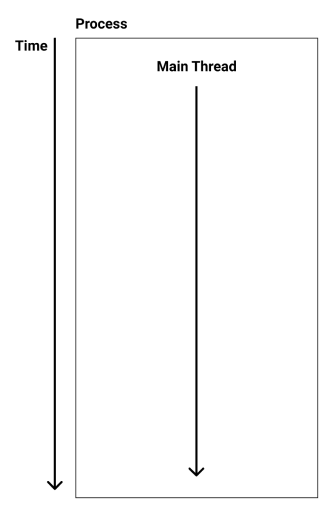
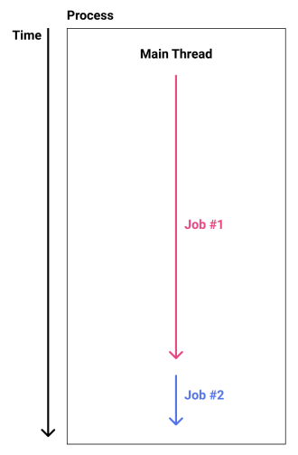
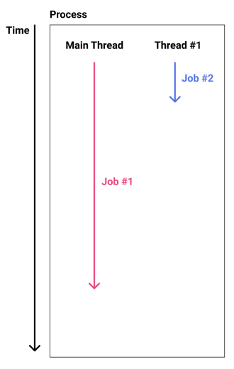
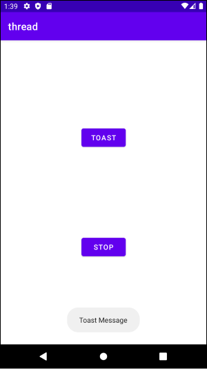
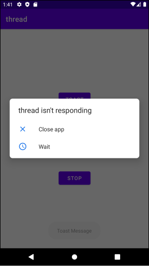
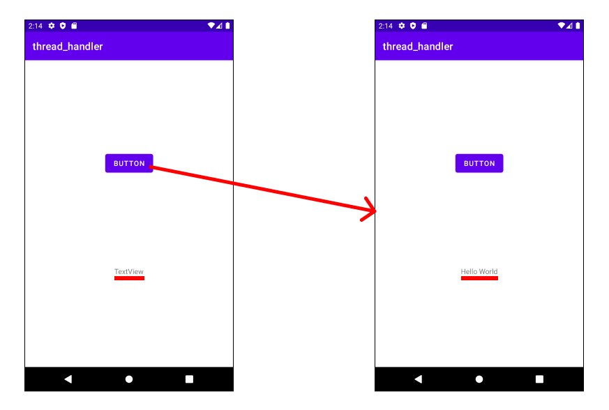
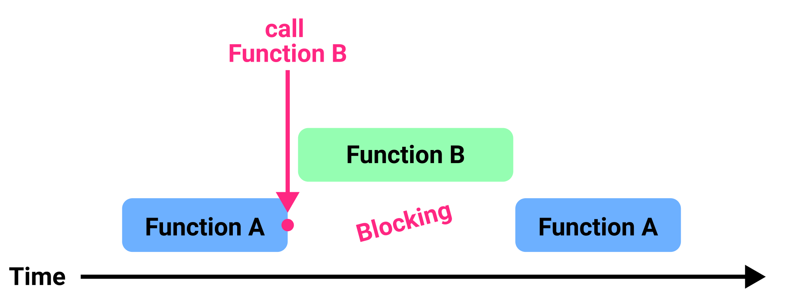
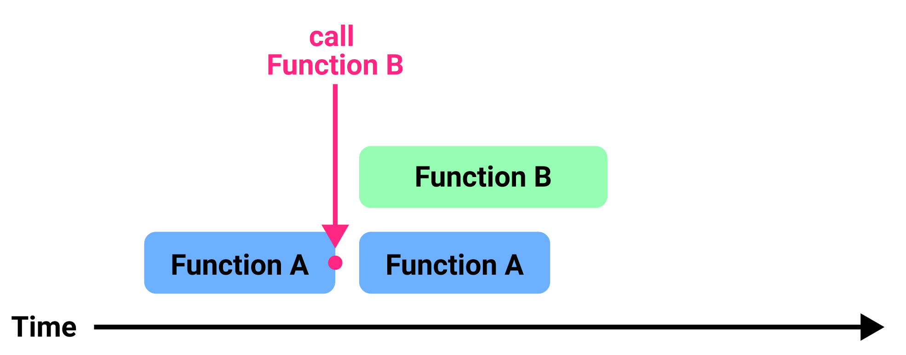
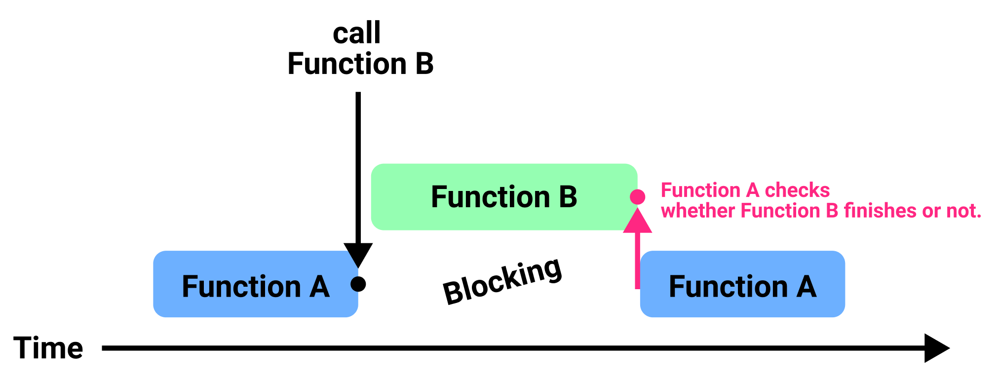
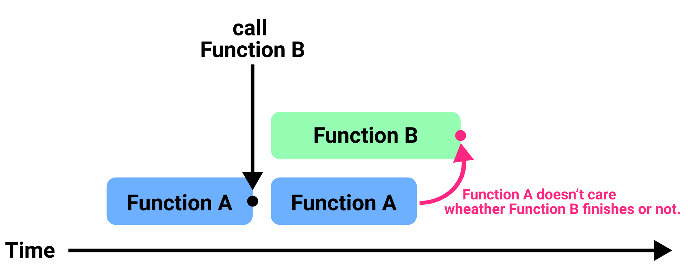

# Table of Contents
[[toc]]

## 어플리케이션과 프로세스
리눅스 기반의 운영체제인 안드로이드에서는 어플리케이션이 `리눅스 프로세스(Linux Process)`로 실행됩니다. 이때 프로세스 이름을 별도로 지정하지 않으면 `패키지 이름`을 프로세스 이름으로 사용합니다.

패키지 이름은 `AndroidManifest.xml`에서 확인할 수 있습니다.
```xml AndroidManifest.xml
<?xml version="1.0" encoding="utf-8"?>
<manifest 
    xmlns:android="http://schemas.android.com/apk/res/android"
    package="com.yologger.your_project_name">

    <application>
        <!-- .. -->
    </application>

</manifest> 
```

이제 에뮬레이터나 연결된 기기에 앱을 설치합니다. 그리고 ADB를 통해 실제 프로세스 이름을 확인해봅시다.
```
$ adb shell

> ps -ef | grep "com.yologger.your_project_name"
u0_a289   14996   850 0 15:08:05 ?   00:00:01 com.yologger.your_project_name
...
```
`<application>`태그 안에서 `android:process`속성을 사용하여 프로세스 이름을 직접 지정할 수도 있습니다.

``` xml AndroidManifest.xml
<?xml version="1.0" encoding="utf-8"?>
<manifest 
    xmlns:android="http://schemas.android.com/apk/res/android"
    package="com.yologger.your_project_name">

    <application android:process="com.yologger.your_process_name">
        <!-- ... -->
    </application>

</manifest> 
``` 

다시 프로세스 이름을 확인해봅시다.
``` console
$ adb shell

> ps -ef | grep "com.yologger.your_process_name"            
u0_a289   18014   850 1 15:14:50 ?   00:00:01 com.yologger.your_process_name
...
```

## 컴포넌트와 프로세스
하나의 애플리케이션은 여러 컴포넌트로 구성됩니다. 대부분의 컴포넌트들은 같은 프로세스에서 실행됩니다. 그러나 컴포넌트를 다른 프로세스에서 실행할 수도 있습니다. 이때는 컴포넌트에서 `android:process`속성을 사용하면 됩니다.

``` xml AndroidManifest.xml
<?xml version="1.0" encoding="utf-8"?>
<manifest xmlns:android="http://schemas.android.com/apk/res/android"
    package="com.yologger.your_project">

    <application android:allowBackup="true"
        android:icon="@mipmap/ic_launcher"
        android:label="@string/app_name"
        android:roundIcon="@mipmap/ic_launcher_round"
        android:supportsRtl="true"
        android:theme="@style/Theme.Your_Project">

        <activity android:name=".MainActivity"
            android:process="com.yolo">
            <intent-filter>
                <action android:name="android.intent.action.MAIN" />
                <category android:name="android.intent.category.LAUNCHER" />
            </intent-filter>
        </activity>

        <activity 
            android:name=".ActivityA"
            android:process="com.yolo.process1">
        </activity> 

        <activity 
            android:name=".ActivityB"
            android:process="com.yolo.process2">
        </activity>  

        <service
            android:name=".MyService"
            android:enabled="true"
            android:exported="true"
            android:process="com.yolo.process3">
        </service>
    </application>

</manifest>
```

## 스레드
`스레드(Thread)`는 `프로세스(Process)` 내에서 실행되는 흐름을 말합니다. 일반적으로 하나의 프로세스에는 하나의 기본 스레드가 존재합니다. 이를 `매인 스레드`라고 합니다.



이제 하나의 스레드에서 두 개의 작업을 순차적으로 수행한다고 가정해봅시다.



`Job #1`은 매우 긴 시간이 소요되는 작업입니다. 반면 `Job #2`는 상대적으로 짧은 시간이 소요되는 작업입니다. 그러나 `Job #1`이 먼저 실행되었으므로 `Job #2`는 `Job #1`이 끝날 때 까지 기다려야합니다. 

이제 스레드를 한 개 더 생성해보겠습니다.



이처럼 스레드를 여러 개 추가하여 프로세스를 병렬 처리하는 환경을 `멀티 스레드` 환경이라고 합니다. 

### 안드로이드에서의 스레드
안드로이드 애플리케이션이 처음 시작되면, 안드로이드 운영체제는 하나의 프로세스와 하나의 매인 스레드를 생성합니다. 애플리케이션의 모든 컴포넌트는 매인 스레드 내에서 실행됩니다. 

### 매인 스레드의 역할
`매인 스레드`의 주된 역할은 사용자 인터페이스를 처리하는 것입니다. 이러한 이유로 안드로이드에서의 메인 스레드는 `UI 스레드`라고도 합니다. 매인 스레드에서 시간이 오래 걸리는 작업을 수행하면, 그 작업이 끝날 때까지 애플리캐이션 전체가 멈춘 것처럼 보이게 됩니다.

예제를 살펴보겠습니다. `TOAST`버튼을 누르면 토스트 매시지를 보여줍니다. 예제는 `STOP`버튼을 누르면 매인 스래드를 10초 동안 정지합니다. 



코드는 다음과 같습니다.
``` kotlin MainActivity.kt
class MainActivity : AppCompatActivity() {

    val buttonToast: Button by lazy { findViewById<Button>(R.id.activity_main_btn_toast) }
    val buttonStop: Button by lazy { findViewById<Button>(R.id.activity_main_btn_stop) }

    override fun onCreate(savedInstanceState: Bundle?) {
        super.onCreate(savedInstanceState)
        setContentView(R.layout.activity_main)

        buttonToast.setOnClickListener {
            Toast.makeText(this, "Hello World", Toast.LENGTH_SHORT).show()
        }

        buttonStop.setOnClickListener {
            Thread.sleep(10 * 1000)     //  10 seconds
        }
    }
}
```
이제 `STOP`버튼을 누르면 안드로이드 시스템이 10초 동안 정지합니다. 이 때 `TOAST`버튼을 누르면 다음과 같은 에러가 발생합니다. 매인 스레드가 10초 동안 정지된 상태에서는 사용자 인터페이스 작업을 처리할 수 없기 때문입니다.



따라서 시간이 오래 걸리는 작업은 별도의 스래드에서 실행해야합니다. `Runnable`클래스와 `Thread`클래스를 사용하여 별도의 스레드를 생성합시다.

``` kotlin MainActivity.kt
buttonStop.setOnClickListener {
    var runnable = Runnable {
        Thread.sleep(10 * 1000)     //  10 seconds
    }

    var thread = Thread(runnable)
    thread.start()
}
```
이제 `STOP`버튼을 눌러도 앱이 멈추지 않습니다. 10초 정지 작업을 별도의 스레드에서 실행하기 때문에 매인 스레드는 사용자 인터페이스를 처리할 수 있습니다.

### 스레드 핸들러
스레드와 관련해서 주의할 점이 하나 더 있습니다. 매인 스레드 외의 다른 스레드에서는 `사용자 인터페이스(UI) 요소`를 변경해서는 안된다는 것입니다. 다른 스레드에서 UI를 변경해야 하는 경우, 메인 스레드에 선언된 `핸들러(Handler)`로 메시지를 보내야 합니다.

우선 `android.os.Handler`클래스를 사용하여 매인 스레드에 핸들러를 정의합니다. `handleMessage()`는 다른 스레드에서 메시지를 전송했을 때 호출됩니다.
``` kotlin MainActivity.kt
import android.os.Handler

class MainActivity : AppCompatActivity() {

    val button: Button by lazy { findViewById<Button>(R.id.activity_main_btn) }
    val textView: TextView by lazy { findViewById<TextView>(R.id.activity_main_tv) }

    val handler = object: Handler() {
        override fun handleMessage(msg: Message) {
            super.handleMessage(msg)
            // ...
        }
    }
}
```
새로 생성한 스레드에서는 10초 후에 매인 스레드로 메시지를 전송합니다.
``` kotlin MainActivity.kt
class MainActivity : AppCompatActivity() {

    val button: Button by lazy { findViewById<Button>(R.id.activity_main_btn) }

    // ...

    override fun onCreate(savedInstanceState: Bundle?) {
        super.onCreate(savedInstanceState)
        setContentView(R.layout.activity_main)

        button.setOnClickListener {
            var runnable = Runnable {
                Thread.sleep(10 * 1000)     //  10 seconds

                val message = handler.obtainMessage()
                val bundle = Bundle()
                bundle.putString("text", "Hello World")
                message.data = bundle
                handler.sendMessage(message)
            }

            var thread = Thread(runnable)
            thread.start()
        }
    }
}
```
`Handler`클래스의 `obtainMessage()`를 호출하여 메시지를 생성하비다. 이후 `Bundle` 객체를 사용하여 전송할 데이터를 추가합니다. 마지막으로 `sendMessage()`를 호출하면 메시지가 전송됩니다.

이제 매인 스레드에서 메시지를 수신한 후 UI를 변경하겠습니다.

``` kotlin MainActivity.kt
class MainActivity : AppCompatActivity() {

    val handler = object: Handler() {
        override fun handleMessage(msg: Message) {
            super.handleMessage(msg)
            val bundle = msg.data
            val string = bundle.getString("text")
            string?.let {
                textView.text = it
            }
        }
    }
}
```
버튼을 클릭하면 10초 후 텍스트 뷰가 변경됩니다.



## 블로킹과 논블로킹

### 블로킹(Blocking)
`함수 A`에서 `함수 B`를 호출한다고 가정합시다.
``` kotlin
fun A() {
    B()
}
```
`함수 A`는 `함수 B`가 끝날 때 까지 <u>기다리게 됩니다</u>. 이를 `함수 A`가 `블로킹(Blocking)`되었다고 합니다. 



즉, `함수 A`는 `함수 B`가 함수가 종료되었다는 의미의 `return`를 호출하기 전까지 기다리게 됩니다.

### 논블로킹(Non-blocking)
`함수 A`에서 `함수 B`를 호출한다고 가정합시다.
``` kotlin
fun A() {
    B()
}
```

`함수 A`는 `함수 B`를 호출한 후 <u>기다리지 않고</u> 자신의 실행 흐름을 수행합니다. 



이를 `함수 A`가 `논블로킹(Non-Blocking)`되었다고 합니다.


## 동기와 비동기

### 동기(Synchronous)
`함수 A`에서 `함수 B`를 호출한다고 가정합시다.
``` kotlin
fun A() {
    B()
}
```
동기식 모델에서 `함수 A`는 `함수 B`가 끝날 때 까지 기다리게 됩니다. 


이 때문에 `함수 A`와 `함수 B` 사이에 <u>연관성</u>있다고 하며, 두 함수가 <u>동기화 되었다고</u> 합니다.

### 비동기(Asynchronous)
`함수 A`에서 `함수 B`를 호출한다고 가정합시다.
``` kotlin
fun A() {
    B()
}
```
`함수 A`는 `함수 B`가 호출된 후 `함수 B`가 끝나든 말든 신경쓰지 않고 자신의 일을 수행합니다. 



이 때문에 `함수 A`와 `함수 B` 사이에 <u>연관성</u>이 없다고 하며, 두 함수가 <u>동기화되지 않았다</u>고 합니다.

## 관점의 차이
위 예제를 살펴보면 동기는 블로킹과 비슷하고 비동기와 논블로킹이 비슷하다는게 느껴지시나요? 결국 동기/비동기, 블로킹/논블로킹의 차이는 상황을 어떠한 <u>관점</u>에서 바라보는지에 있습니다. 이 때문에 컴퓨터공학에서는 보통 소프트웨어의 실행 흐름을 두 가지로 구분합니다. 
- 동기-블로킹 모델
- 비동기-논블로킹 모델

### 동기-블로킹 모델
`함수 A`에서 `함수 B`를 호출한다고 가정합시다.
``` kotlin
fun A() {
    B()
}

fun B() {
    // ...
    return
}
```
동기-블로킹 모델에서 `함수 A`는 `함수 B`가 `return`을 호출하여 자신을 종료할 때 까지 기다립니다.

### 비동기-논블로킹
`함수 A`에서 `함수 B`를 호출한다고 가정합시다. 
``` kotlin
fun A() {
    B()
}

fun B() {
    // ...
    return
}
```

프로그래밍 언어에 따라 비동기-논블로킹 모델을 구현하는 방법이 다를 수 있습니다. Java나 Kotlin에서 비동기-논블로킹 모델을 사용한다는 것은 `멀티 스레드`를 사용한다는 의미입니다. Java나 Kotlin에서는 매인 스레드에서 두 개의 실행 흐름을 동시에 수행할 수 없기 때문입니다.
``` kotlin
fun A() {
    B()
}

fun B() {
    var runnable = Runnable {
        // 다른 스레드에서 실행
        // ...
    }
    var thread = Thread(runnable)
    thread.start()
}
```

비동기-논블로킹 모델에서 `함수 A`는 `함수 B`가 언제 끝날 지 알 수 없습니다. 두 함수는 동기화되지 않았기 때문입니다. 따라서 보통 `함수 A`는 `함수 B`에게 <u>적절한 시점에 특정한 함수나 람다를 호출해달라고 함수 또는 람다식을 전달</u>하게 되며, 이를 `콜백`라고 합니다.
``` kotlin
fun A() {

    // 콜백
    var callback = {
        // ...
    }

    // 함수 B를 호출하면서 콜백을 함께 전달
    B(callback)
}

fun B(callback: () -> Unit) {
    var runnable = Runnable {
        // 적절한 시점에 콜백 호출
        callback()
    }
    var thread = Thread(runnable)
    thread.start()
}
```

### runOnUiThread()
안드로이드에서 비동기-논블로킹 작업을 수행한 후, UI를 변경한다고 가정합시다. <u>안드로이드에서는 매인 스래드에서만 UI를 변경할 수 있습니다</u>. 따라서 비동기-논블로킹 작업 후 매인 스레드에서 UI를 변경하도록 코드를 수정해야합니다.


``` kotlin
class MainActivity: AppCompatActivity() {

    // ...

    fun a() {
        // 콜백 함수
        var callback = {
            runOnUiThread {
                // UI 변경
                textView.text = "New Text"
            }
        }

        // 함수 B를 호출하면서 콜백을 함께 전달
        b(callback)
    }

    fun b(callback: () -> ()) {
        var runnable = Runnable {
            // ...
            callback()
        }
        var thread = Thread(runnable)
        thread.start()
    }
}
```
`AppCompatActivity`클래스에 정의된 `runOnUiThread()`는 인자로 전달된 람다를 매인 스레드에서 실행합니다. 
``` kotlin
public class AppCompatActivity {

    // ...

    public final void runOnUiThread(Runnable action) {
        if (Thread.currentThread() != mUiThread) {
            mHandler.post(action);
        } else {
            action.run();
        }
    }

}
```

### 안드로이드에서의 비동기 처리
안드로이드에서 비동기/논블로킹 모델을 구현하는 방법에는 여러가지가 있습니다. 대표적인 네 가지 방법은 다음과 같습니다.
- 멀티 스레드
- AsycnTask
- ReactiveX (RxJava, RxKotlin)
- Coroutine


