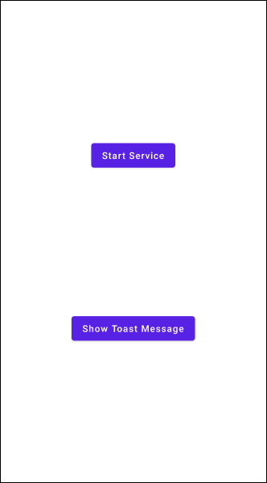
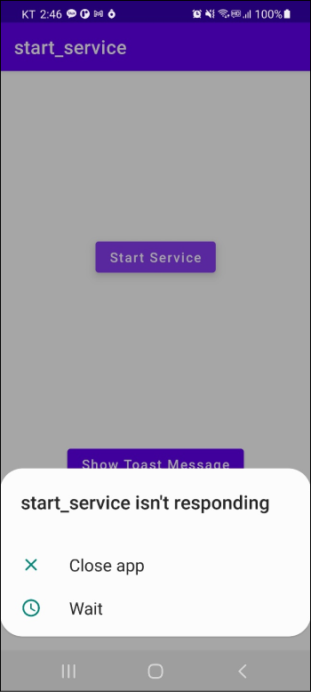
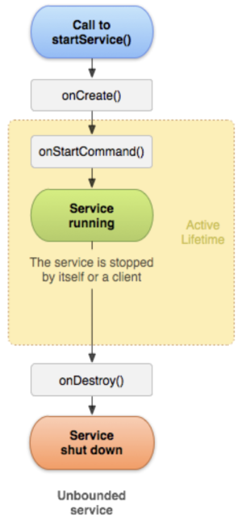
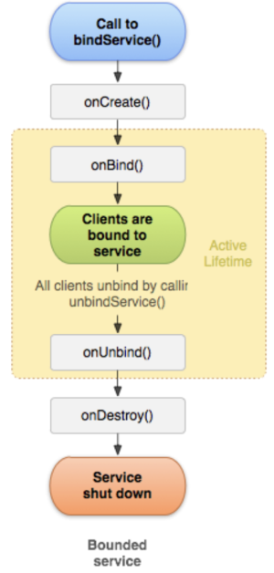

# Table of Contents

[[toc]]

# 서비스란?
`서비스(Service)`는 앱에서 백그라운드 작업을 수행하기 위해 등장했습니다. 액티비티와는 다르게 서비스는 별도의 레이아웃 파일이 존재하지 않습니다. 사용자에게 음악을 스트리밍 서비스하거나 파일을 다운로드하는 것은 백그라운드에서 처리하기 적절한 작업입니다.

서비스에는 세 가지가 있습니다.
- Start Service
- Intent Service
- Bound Service


## 스타트 서비스
`스타트 서비스(Start Service)`는 다른 안드로이드 컴포넌트에 의해 시작됩니다. 그리고 서비스가 중단되거나 안드로이드 운영체제에 의해 소멸될 때까지 백그라운드에서 무한정 실행됩니다. 서비스는 자신을 시작시킨 컴포넌트가 포그라운드에 있지 않거나 소멸되어도 계속 실행됩니다. 그럼 예제를 살펴보겠습니다.

우선 스타트 서비스는 `Service`클래스를 상속해야합니다.
``` kotlin MyStartService.kt
class MyStartService : Service() {

    override fun onCreate() {
        super.onCreate()
    }

    override fun onStartCommand(intent: Intent?, flags: Int, startId: Int): Int {
        // ...
    }

    override fun onBind(intent: Intent): IBinder? {
        return null
    }

    override fun onDestroy() {
        super.onDestroy()
    }
}
```
서비스는 액티비티와 유사하게 생명주기를 가지고 있습니다. 여기서 `onStartCommand()`에 백그라운드에서 수행할 작업을 구현합니다. 

서비스에서 3초에 한번씩 문자열 "This is service"를 출력하겠습니다. `Thread.sleep()`는 현재 스레드를 특정 시간동안 중지합니다.
``` kotlin
class MyStartService : Service() {

    override fun onStartCommand(intent: Intent?, flags: Int, startId: Int): Int {

        // 3초에 한 번씩 This is service. 출력
        while (true) {
            println("This is service.")
            Thread.sleep(1000 * 3)     // 3초 동안 현재 스래드 중지
        }
        return super.onStartCommand(intent, flags, startId)
    }
    // ...
}
```

`MainActivity`는 두 개의 버튼이 있습니다. `Start Service`버튼을 누르면 서비스를 실행합니다. `Show ToastMessage`버튼을 누르면 토스트 메시지를 출력합니다.



레이아웃은 다음과 같습니다.
``` xml activity_main.xml
<?xml version="1.0" encoding="utf-8"?>
<androidx.constraintlayout.widget.ConstraintLayout xmlns:android="http://schemas.android.com/apk/res/android"
    xmlns:app="http://schemas.android.com/apk/res-auto"
    xmlns:tools="http://schemas.android.com/tools"
    android:layout_width="match_parent"
    android:layout_height="match_parent"
    tools:context=".MainActivity">

    <Button android:id="@+id/activity_main_start_service"
        android:layout_width="wrap_content"
        android:layout_height="wrap_content"
        android:text="Start Service"
        android:textAllCaps="false"
        app:layout_constraintTop_toTopOf="parent"
        app:layout_constraintStart_toStartOf="parent"
        app:layout_constraintEnd_toEndOf="parent"
        app:layout_constraintBottom_toTopOf="@+id/activity_main_show_toast"/>

    <Button android:id="@+id/activity_main_show_toast"
        android:layout_width="wrap_content"
        android:layout_height="wrap_content"
        android:text="Show Toast Message"
        android:textAllCaps="false"
        app:layout_constraintTop_toBottomOf="@+id/activity_main_start_service"
        app:layout_constraintStart_toStartOf="parent"
        app:layout_constraintEnd_toEndOf="parent"
        app:layout_constraintBottom_toBottomOf="parent"
        />

</androidx.constraintlayout.widget.ConstraintLayout>
```

코드는 다음과 같습니다. 스타트 서비스를 시작할 때는 `startService()`함수를 사용합니다.

``` kotlin MainActivity.kt
class MainActivity : AppCompatActivity() {

    lateinit var buttonShowToast: Button
    lateinit var buttonStartService: Button

    override fun onCreate(savedInstanceState: Bundle?) {
        super.onCreate(savedInstanceState)
        setContentView(R.layout.activity_main)

        buttonShowToast = findViewById(R.id.activity_main_show_toast)
        buttonStartService = findViewById(R.id.activity_main_start_service)

        buttonStartService.setOnClickListener {
            var intent = Intent(this, MyStartService::class.java)
            startService(serviceIntent)
        }

        buttonShowToast.setOnClickListener {
            Toast.makeText(this@MainActivity, "Toast Message", Toast.LENGTH_SHORT).show()
        }
    }
}
```
이제 앱을 실행해보겠습니다. 버튼을 누르면 서비스가 백그라운드에서 실행되며, 로그에 3초에 한번씩 문자열 "This is service"가 출력됩니다.

서비스를 호출한 컴포넌트에서 `stopService()`를 호출하거나, 서비스 안에서 `stopSelf()`를 호출하여 스타트 서비스를 정지할 수 있습니다. 

## 스타트 서비스의 문제점
서비스를 실행시킨 상태에서 토스트 메시지 버튼을 눌러봅시다. 아무 응답이 없을 겁니다. 이후 다음과 같이 경고 매세지를 보여주고 앱이 종료됩니다.



안드로이드에서 사용자와의 상호작용이나 UI 변경은 `메인 스레드`에서만 이루어집니다. 그런데 스타트 서비스도 액티비티와 같은 메인 스레드에서 실행되고 있습니다. 이 때문에 메인 스레드가 3초간 중지되어있는 동안 액티비티가 사용자와의 상호작용을 할 수 없어서 앱이 종료된 것입니다.

::: tip
위 그림처럼 다른 작업을 하느라 사용자와 상호작용할 수 없어 발생하는 에러를 <b>ANR(Android Not Responding)</b>이라고 합니다.
:::

따라서 스타트 서비스를 다른 작업 스레드에서 실행해야합니다.
``` kotlin
class MyStartService : Service() {

    override fun onStartCommand(intent: Intent?, flags: Int, startId: Int): Int {
        
        var runnable = Runnable {
            while (true) {
                println("This is service.")
                Thread.sleep(1000 * 3)     // 10 seconds
            }
        }

        // 별도의 스레드 생성
        var thread = Thread(runnable)

        // 스레드 시작
        thread.start()

        return super.onStartCommand(intent, flags, startId)
    }
}
```
이제 앱이 정상적으로 작동할 것입니다.

## 인텐트 서비스
`인텐트 서비스(Intent Service)`를 사용하면 별도의 스레드를 생성하지 않아도 서비스가 새로운 스레드에서 실행됩니다. 인텐트 서비스는 `IntentService`클래스를 구현하고 `onHandleIntent()`메소드를 오버라이딩합니다.
``` kotlin
class MyIntentService : IntentService("MyIntentService") {

    override fun onHandleIntent(intent: Intent?) {
        // ...
    }
}
``` 
`onHandleIntent()`메소드에서는 별도의 스레드에서 백그라운드로 실행할 작업을 구현합니다. 3초에 한 번씩 문자열 "This is intent service."를 출력하겠습니다.
``` kotlin
class MyIntentService : IntentService("MyIntentService") {

    override fun onHandleIntent(intent: Intent?) {
        while (true) {
            Log.d("TEST", "This is intent service.")
            Thread.sleep(1000 * 3)     // 10 seconds
        }
    }
}
```
액티비티에서는 `startService()`메소드를 사용하여 서비스를 시작합니다.
``` kotlin
class MainActivity : AppCompatActivity() {

    lateinit var buttonShowToast: Button
    lateinit var buttonIntentService: Button

    override fun onCreate(savedInstanceState: Bundle?) {
        super.onCreate(savedInstanceState)
        setContentView(R.layout.activity_main)

        buttonShowToast = findViewById(R.id.activity_main_show_toast)
        buttonIntentService = findViewById(R.id.activity_main_intent_service)

        buttonStartService.setOnClickListener {
            var intent = Intent(this, MyIntentService::class.java)
            startService(intent)
        }

        buttonShowToast.setOnClickListener {
            Toast.makeText(this@MainActivity, "Toast Message", Toast.LENGTH_SHORT).show()
        }
    }
}
```
이제 앱을 실행하고 버튼을 클릭합니다. 로그에 "This is intent service."가 3초에 한번씩 출력됩니다. 또한 서비스가 실행된 상태에서 토스트 메시지 버튼을 눌러도 앱이 멈추거나 종료되지 않습니다. 인텐트 서비스는 별도의 작업 스레드를 생성하여 실행하기 때문입니다.

## 바운드 서비스
서비스는 자신을 실행시킨 액티비티와 상호작용할 수 있습니다. 이러한 서비스를 `바운드 서비스(Bound Service)`라고 합니다. 

예를 들어 음악 앱은 서비스를 사용하여 백그라운드에서 음악을 실행합니다. 이때 액티비티는 음악을 일시 중지하거나 다음 트랙으로 건너뛰기 위하여 서비스와 상호작용을 합니다. 이러한 경우 바운드 서비스를 사용할 수 있습니다.

### Binding
<u>액티비티가 바운드 서비스에 연결되는 작업</u>을 `바인딩(Binding)`이라고 합니다. 바운드 서비스에서는 `onBind()`메소드를 구현합니다. 이 메소드는 서비스가 최초 생성될 때, 그리고 이후 다른 액티비티가 바운드 서비스에 바인딩할 때마다 호출됩니다. 이 메소드는 `IBinder`를 구현한 객체를 반환하며, 액티비티는 이 객체를 통해 바운드 서비스와 통신할 수 있습니다.

추가적으로 하나의 바운드 서비스에는 여러 컴포넌트가 바인딩할 수 있습니다.
 
### Local Bound Service
액티비티와 서비스가 같은 프로세스에서 실행될 때, 이 서비스를 `로컬 바운드 서비스(Local Bound Service)`라고합니다.

우선 로컬 바운드 서비스를 이해하기 위해 다음과 같은 예제를 만들겠습니다.

> 1. 액티비티에서 버튼을 클릭하면 서비스에 현재 시간을 요청합니다. 
> 2. 서비스는 현재 시간을 계산해서 액티비티에 전달합니다. 
> 3. 액티비티는 현재 시간을 전달받아 화면에 보여줍니다.

액티비티의 레이아웃은 다음과 같습니다.
``` xml
<?xml version="1.0" encoding="utf-8"?>
<androidx.constraintlayout.widget.ConstraintLayout xmlns:android="http://schemas.android.com/apk/res/android"
    xmlns:app="http://schemas.android.com/apk/res-auto"
    xmlns:tools="http://schemas.android.com/tools"
    android:layout_width="match_parent"
    android:layout_height="match_parent"
    tools:context=".LocalBoundServiceActivity">

    <Button android:id="@+id/activity_local_bound_service_btn"
        android:layout_width="wrap_content"
        android:layout_height="wrap_content"
        android:text="CURRENT TIME"
        app:layout_constraintTop_toTopOf="parent"
        app:layout_constraintStart_toStartOf="parent"
        app:layout_constraintEnd_toEndOf="parent"
        app:layout_constraintBottom_toTopOf="@+id/activity_local_bound_service_tv"/>

    <TextView android:id="@+id/activity_local_bound_service_tv"
        android:layout_width="wrap_content"
        android:layout_height="wrap_content"
        android:text="TextView"
        app:layout_constraintTop_toBottomOf="@+id/activity_local_bound_service_btn"
        app:layout_constraintStart_toStartOf="parent"
        app:layout_constraintEnd_toEndOf="parent"
        app:layout_constraintBottom_toBottomOf="parent"/>

</androidx.constraintlayout.widget.ConstraintLayout>
```

`Service`클래스를 구현하는 `LocalBoundService` 클래스를 생성합니다.
``` kotlin
class LocalBoundService : Service() {

    override fun onBind(intent: Intent): IBinder {
        // ...
    }
}
``` 
이제 `Binder`클래스를 구현한 사용자 정의 클래스를 만들어야 합니다. `Binder`객체는 액티비티와 서비스가 통신하는데 사용됩니다. 

`Binder`클래스를 상속하는 `LocalBinder`를 내부 클래스 형태로 정의합시다. 
``` kotlin
class LocalBoundService : Service() {

    inner class LocalBinder : Binder() {
        // ...
    }
}
```
`LocalBinder`클래스 안에 `LocalBoundService`의 참조를 반환하는 `getService()`를 구현합니다.
``` kotlin
class LocalBoundService : Service() {

    inner class LocalBinder : Binder() {
        fun getService(): LocalBoundService = this@LocalBoundService
    }
}
```
변수를 만들고 `LocalBinder`클래스의 인스턴스로 초기화합니다. 또한 `onBind()`함수에서 이 변수를  반환합니다.
``` kotlin
class LocalBoundService : Service() {

    private val binder = LocalBinder()

    override fun onBind(intent: Intent): IBinder {
        return binder
    }

    inner class LocalBinder : Binder() {
        fun getService(): LocalBoundService = this@LocalBoundService
    }
}
```
서비스에 현재 시간을 반환하는 함수를 정의합니다.

``` kotlin
class LocalBoundService : Service() {

    private val binder = LocalBinder()

    override fun onBind(intent: Intent): IBinder {
        return binder
    }

    // 현재 시간을 반환하는 함수
    fun getCurrentTime(): String {
        var dateFormat = SimpleDateFormat("HH:mm:ss MM/dd/yyyy", Locale.US)
        return dateFormat.format(Date())
    }

    inner class LocalBinder : Binder() {
        fun getService(): LocalBoundService = this@LocalBoundService
    }
}
```
이제 액티비티에서 로컬 바운드 서비스를 사용하겠습니다. 

액티비티는 `bindService()`를 호출하여 서비스에 바인딩합니다. 바인딩이 되면 서비스의 `onBind()`가 호출됩니다. `onBind()` 메소드는 `IBinder`클래스를 구현한 객체를 반환하는데, 액티비티에서 `ServiceConnection`클래스를 사용하여 `IBinder`를 구현한 객체를 전달받을 수 있습니다. 이후 `IBinder`클래스를 구현한 객체를 사용하여 통신을 합니다.

액티비티에서 `ServiceConnection`클래스의 인스턴스를 생성하고 `onServiceConnected()`메서드와 `onServiceDisconnected()`메서드를 오버라이딩 합시다.
``` kotlin
class MainActivity : AppCompatActivity() {

    private lateinit var service: LocalBoundService
    private var isBound = false
    
    private val connection = object : ServiceConnection {

        // 서비스가 바인딩 되었을 때 호출
        override fun onServiceConnected(name: ComponentName?, binder: IBinder?) {
            var binder = service as LocalBoundService.LocalBinder
            service = binder.getService()
            isBound = true
        }

        // 서비스가 끊겼을 때 호출
        override fun onServiceDisconnected(name: ComponentName?) {
            isBound = false
        }
    }

    override fun onCreate(savedInstanceState: Bundle?) {
        super.onCreate(savedInstanceState)
        setContentView(R.layout.activity_local_bound_service)
    }
}
```
이제 액티비티에서 서비스에 바인딩하겠습니다. 이때 `bindService()`메소드를 사용합니다.
``` kotlin
class MainActivity : AppCompatActivity() {

    private lateinit var service: LocalBoundService
    private var isBound = false

    private val connection = object : ServiceConnection {

        // 서비스가 연결되었을 때 호출
        override fun onServiceConnected(name: ComponentName?, binder: IBinder?) {
            var binder = service as LocalBoundService.LocalBinder
            service = binder.getService()
            isBound = true
        }

        // 서비스가 끊겼을 때 호출
        override fun onServiceDisconnected(name: ComponentName?) {
            isBound = false
        }
    }

    override fun onCreate(savedInstanceState: Bundle?) {
        super.onCreate(savedInstanceState)
        setContentView(R.layout.activity_local_bound_service)

        // 바인딩
        var intent = Intent(this, LocalBoundService::class.java)
        bindService(intent, connection, Context.BIND_AUTO_CREATE)
    }
}
```
이제 서비스를 사용할 수 있습니다. 버튼을 누르면 서비스의 `getCurrentTime()`메소드를 호출할 수 있습니다.
``` kotlin
class LocalBoundServiceActivity : AppCompatActivity() {

    private lateinit var service: LocalBoundService
    // ...

    override fun onCreate(savedInstanceState: Bundle?) {

        // ...

        button.setOnClickListener {
            // 서비스와 통신
            var currentTime = service.getCurrentTime()
            textView.text = currentTime
        }
    }
}
```
액티비티가 종료되었을 때 서비스와 바인드를 끊어주는 코드도 작성합니다.
``` kotlin
class LocalBoundServiceActivity : AppCompatActivity() {

    // ...

    override fun onStop() {
        super.onStop()
        unbindService(connection)
        isBound = false
    }
}
```

### Remote Bound Service
액티비티와 서비스가 다른 프로세스에서 실행될 때, 이 서비스를 `원격 바운드 서비스`라고 합니다.

원격 바운드 서비스를 이해하기 위해 다음과 같은 예제를 생성합시다.
> 1. 액티비티에서 택스트를 입력하고 버튼을 누르면 원격 바운드 서비스에 메세지가 전달됩니다. 
> 2. 서비스는 이 메세지를 로그에 출력합니다.

우선 다음과 같이 레이아웃을 구성합니다.
``` xml
<?xml version="1.0" encoding="utf-8"?>
<androidx.constraintlayout.widget.ConstraintLayout xmlns:android="http://schemas.android.com/apk/res/android"
    xmlns:app="http://schemas.android.com/apk/res-auto"
    xmlns:tools="http://schemas.android.com/tools"
    android:layout_width="match_parent"
    android:layout_height="match_parent"
    tools:context=".MainActivity">

    <EditText android:id="@+id/activity_main_et"
        android:layout_width="wrap_content"
        android:layout_height="wrap_content"
        android:ems="10"
        android:inputType="textPersonName"
        android:hint="Put your message"
        app:layout_constraintTop_toTopOf="parent"
        app:layout_constraintStart_toStartOf="parent"
        app:layout_constraintEnd_toEndOf="parent"
        app:layout_constraintBottom_toTopOf="@+id/activity_main_btn"/>

    <Button android:id="@+id/activity_main_btn"
        android:layout_width="wrap_content"
        android:layout_height="wrap_content"
        android:text="Send Message"
        android:textAllCaps="false"
        app:layout_constraintTop_toBottomOf="@+id/activity_main_et"
        app:layout_constraintStart_toStartOf="parent"
        app:layout_constraintEnd_toEndOf="parent"
        app:layout_constraintBottom_toBottomOf="parent"/>

</androidx.constraintlayout.widget.ConstraintLayout>
```
이제 `Service`클래스를 구현하는 클래스를 정의합니다. 
``` kotlin
class RemoteBoundService : Service() {
    // ...
}
```
그리고 전달받은 메세지를 처리하는 클래스를 내부 클래스 형태로 정의합니다. 이 클래스는 `android.os.Handler.Handler`클래스를 구현하고 `handleMessage()`를 오버라이딩 합니다.
``` kotlin
import android.os.Handler

class RemoteBoundService : Service() {

    // ...

    class MessageHandler: Handler() {
        override fun handleMessage(message: Message) {
            val data = message.data
            val value = data.getString("name")
            value?.run {
                Log.d("TEST", "value")
            }
        }
    }
}
```
이제 `Messenger`클래스의 인스턴스를 지역변수에 생성합니다. 이때 위에서 정의한 핸들러 클래스의 인스턴스를 생성자로 전달합니다. 또한 `onBind()`도 다음과 같이 구현합니다.
``` kotlin
import android.os.Handler

class RemoteBoundService : Service() {

    val messenger = Messenger(MessageHandler())

    override fun onBind(intent: Intent): IBinder {
        return messenger.binder
    }

    class MessageHandler: Handler() {
        override fun handleMessage(message: Message) {
            val data = message.data
            val value = data.getString("message")
            value?.run {
                println(value)
            }
        }
    }
}
```
이제 `AndroidManifest.xml`에서 서비스가 다른 프로세스에서 수행되도록 코드를 추가합니다. `android:process`속성을 사용합니다.
``` xml
<?xml version="1.0" encoding="utf-8"?>
<manifest xmlns:android="http://schemas.android.com/apk/res/android"
    package="com.yologger.remote_bound_servicee">

    <application android:allowBackup="true"
        android:icon="@mipmap/ic_launcher"
        android:label="@string/app_name"
        android:roundIcon="@mipmap/ic_launcher_round"
        android:supportsRtl="true"
        android:theme="@style/Theme.Remote_bound_servicee">
        <service android:name=".RemoteBoundService"
            android:enabled="true"
            android:exported="true"
            android:process=":another_process">
        </service>
        <activity android:name=".MainActivity">
            <intent-filter>
                <action android:name="android.intent.action.MAIN" />
                <category android:name="android.intent.category.LAUNCHER" />
            </intent-filter>
        </activity>
    </application>

</manifest>
```
이제 액티비티에서 서비스와 바인딩합니다.
``` kotlin
class MainActivity : AppCompatActivity() {

    val editText: EditText by lazy { findViewById<EditText>(R.id.activity_main_et) }
    val button: Button by lazy { findViewById<Button>(R.id.activity_main_btn) }

    var messenger: Messenger? = null
    var isBound = false

    var connection = object: ServiceConnection {
        override fun onServiceConnected(name: ComponentName?, binder: IBinder?) {
            messenger = Messenger(binder)
            isBound = true
        }

        override fun onServiceDisconnected(name: ComponentName?) {
            messenger = null
            isBound = false
        }
    }

    override fun onCreate(savedInstanceState: Bundle?) {
        super.onCreate(savedInstanceState)
        setContentView(R.layout.activity_main)

        val intent = Intent(applicationContext, RemoteBoundService::class.java)
        bindService(intent, connection, Context.BIND_AUTO_CREATE)
    }
}
```
마지막으로 버튼을 눌렀을 때 서비스로 메시지를 전송합니다.
``` kotlin
class MainActivity : AppCompatActivity() {

    val button: Button by lazy { findViewById<Button>(R.id.activity_main_btn) }
    // ...

    override fun onCreate(savedInstanceState: Bundle?) {
        // ...
        button.setOnClickListener {
            if (!isBound) return@setOnClickListener

            var message = Message.obtain()
            var bundle = Bundle()
            bundle.putString("message", editText.text.toString())
            message.data = bundle

            // 서비스로 메시지 전송
            messenger?.send(message)
        }
    }
} 
```

## 서비스의 생명주기 메소드
서비스도 액티비티와 마찬가지로 생명주기 메소드가 존재합니다. 다만 서비스의 종류에 따라 호출되는 메소드가 다릅니다.

### 스타트 서비스
`스타트 서비스(Start Service)`는 `startService()`메소드를 호출하여 실행합니다. 



스타트 서비스가 시작되면 다음과 같은 순서로 서비스의 생명주기 함수가 호출됩니다.

#### onCreate()
서비스가 처음 생성될 때 한 번 호출됩니다. 

#### onStartCommand()
다른 액티비티가 `startService()`를 호출하면 이 메소드가 호출됩니다. 이 메소드에서는 서비스가 백그라운드에서 실행할 작업을 구현합니다. 스타트 서비스는 한번 실행하면 액티비티 종료와 무관하게 무한히 실행됩니다. 따라서 `stopSelf()`나 `stopService()`를 호출하면 서비스를 종료할 수 있습니다.

#### onDestroy()
`stopSelf()`나 `stopService()`가 호출되어 서비스가 소멸할 때 호출됩니다.


### 바운드 서비스
`바운드 서비스(Bound Service)`는 `bindService()`메소드를 호출하여 실행합니다. 



바운드 서비스가 시작되면 다음과 같은 순서로 서비스의 생명주기 메소드가 호출됩니다.

#### onCreate()
서비스가 처음 생성될 때 한 번 호출됩니다. 

#### onBind()
액티비티에서 `bindService()`를 호출하면 이 메소드가 호출됩니다. 이 메소드는 `IBinder`객체를 반환하며, 액티비티는 이 객체를 사용하여 서비스와 통신합니다. 참고로 바운드 서비스에는 여러 액티비티가 바인딩될 수 있습니다.

#### onUnbind()
액티비티에서 `unbindService()`를 호출하여 서비스와의 바인딩을 끊을 수 있습니다. 이후 서비스의 `onUnbind()`메소드가 호출됩니다.

#### onDestroy()
서비스가 소멸할 때 호출됩니다. 바운드 서비스는 `stopSelf()`나 `stopService()`를 호출하지 않아도 됩니다. 서비스에 바인딩된 액티비티가 모두 연결을 끊으면 서비스도 소멸합니다.