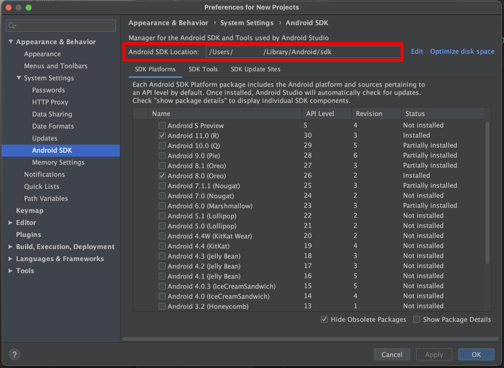
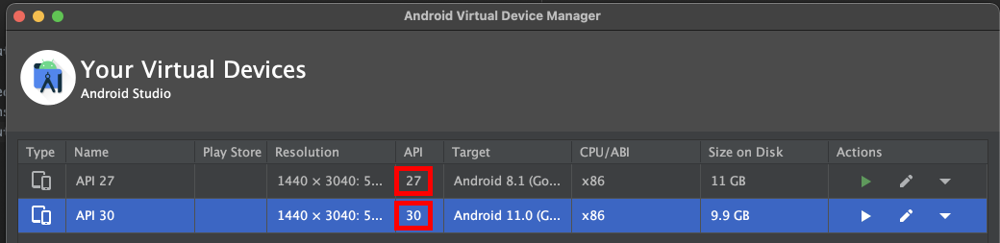
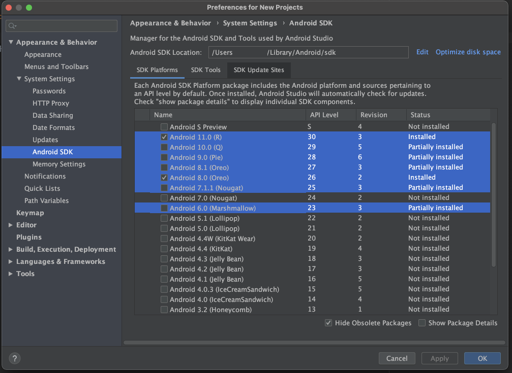
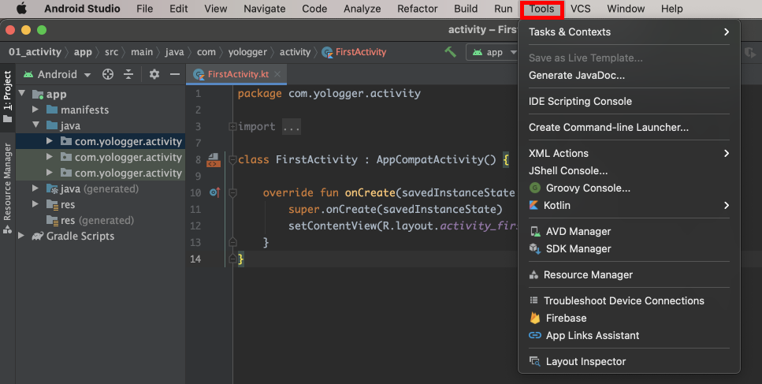
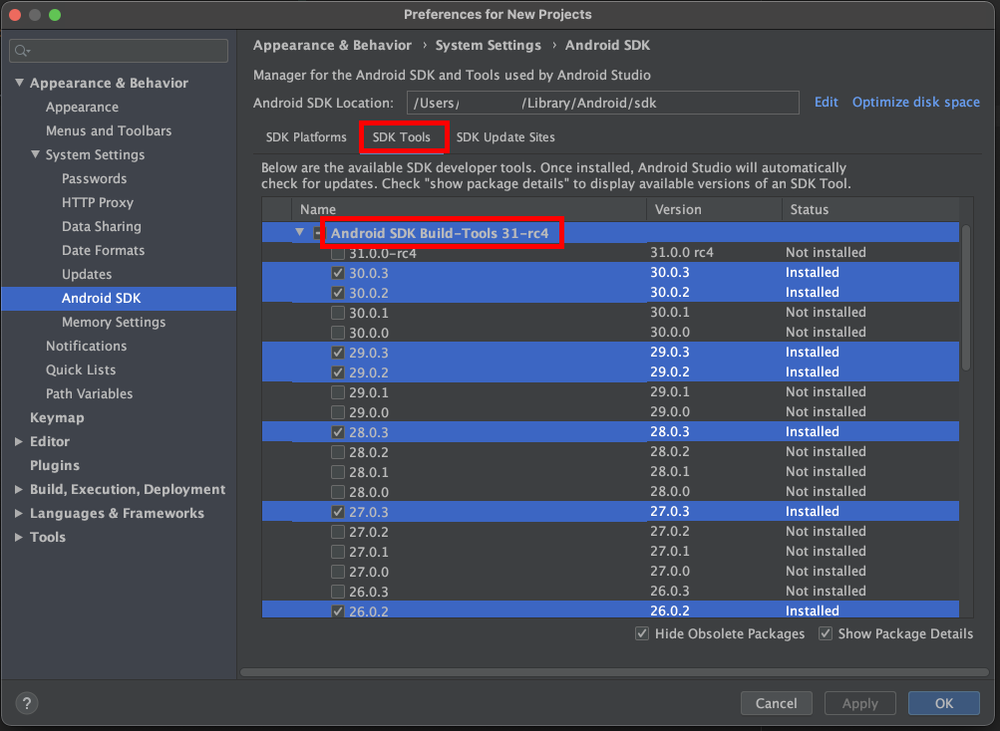
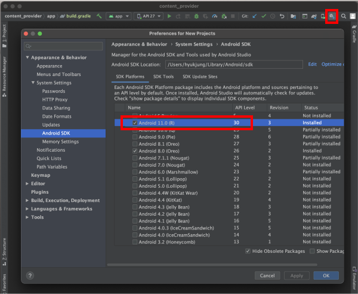

# Table of Contents

[[toc]]

## 안드로이드 SDK
`안드로이드 SDK(Software Development Kit)`는 안드로이드 앱을 개발하기 위한 툴 킷입니다. 안드로이드 스튜디오는 `SDK Manager`를 제공하는데 이 곳에서 안드로이드 SDK를 설치, 삭제, 설정 할 수 있습니다. 또한 SDK Manager에서 SDK의 설치 경로를 확인할 수 있습니다.



그럼 터미널에서 SDK의 설치 경로로 이동해보겠습니다.
``` console
$ cd /Users/[user_name]/Library/Android/sdk
```

SDK에 무엇이 설치되어있는지 확인해봅시다.
``` console
$ ls
build-tools    extras         icons          patcher        platforms      skins          system-images
emulator       fonts          licenses       platform-tools skiaparser     sources        tools
```

### system-images
`system-images`폴더에는 에뮬레이터가 사용하는 안드로이드 운영체제 이미지가 있습니다.
``` console
$ pwd
/Users/[user_name]/Library/Android/sdk/system-images

$ ls
android-23 android-27
```



### platforms
`platforms`폴더에는 안드로이드 플랫폼이 설치되어 있습니다.
``` console
$ pwd
/Users/[user_name]/Library/Android/sdk/platforms

$ ls
android-23 android-25 android-26 android-27 android-28 android-29 android-30
```



### tools
`tools`폴더와 `tools/bin`폴더에는 앱을 개발하고 디버깅하기 위한 여러가지 툴이 있습니다. 에뮬레이터, SDK 매니저, AVD 매니저, UI 뷰어 등이 이 폴더에 설치되어있습니다.
``` console
$ pwd
/Users/[user_name]/Library/Android/sdk/tools

$ ls
bin               
emulator
monitor
proguard
...
```
``` console
$ pwd
/Users/[user_name]/Library/Android/sdk/tools/bin

$ ls
avdmanager
sdkmanager
uiautomatorviewer
...
```
안드로이드 스튜디오에서도 `tools`폴더에 설치된 툴을 확인할 수 있습니다.



### build-tools
`build-tools`폴더에는 앱을 빌드하기 위한 도구들이 설치되어있습니다.
``` console
$ pwd
/Users/[user_name]]/Library/Android/sdk/build-tools

$ ls
25.0.2 26.0.2 27.0.3 28.0.3 29.0.2 29.0.3 30.0.2 30.0.3
```



### platform-tools
`platform-tools`폴더에는 안드로이드 기기와 연결했을 때 사용하는 도구들이 설치되어있습니다. adb, fastboot, systrace, sqlite3 등이 이 폴더에 설치되어있습니다.
``` console
$ pwd
/Users/[user_name]]/Library/Android/sdk/platform-tools

$ ls
adb
fastboot
systrace
sqlite3
...
```

## 런타임에서 현재 기기의 SDK 버전 확인
런타임에서 현재 기기의 SDK 버전을 확인할 수 있습니다.
``` kotlin MainActivity.kt
class MainActivity : AppCompatActivity() {

    override fun onCreate(savedInstanceState: Bundle?) {
        println(Build.VERSION.SDK_INT)  // 기기의 SDK Version 확인
    }
}      
```
안드로이드 API에는 SDK의 버전이 상수 값으로 정의되어있습니다.
``` kotlin MainActivity.kt
class MainActivity : AppCompatActivity() {

    override fun onCreate(savedInstanceState: Bundle?) {
        println(Build.VERSION_CODES.BASE)                   // 1
        println(Build.VERSION_CODES.BASE_1_1)               // 2
        println(Build.VERSION_CODES.CUPCAKE)                // 3
        println(Build.VERSION_CODES.DONUT)                  // 4
        println(Build.VERSION_CODES.ECLAIR)                 // 5
        println(Build.VERSION_CODES.ECLAIR_0_1)             // 6
        println(Build.VERSION_CODES.ECLAIR_MR1)             // 7
        println(Build.VERSION_CODES.FROYO)                  // 8
        println(Build.VERSION_CODES.GINGERBREAD)            // 9
        println(Build.VERSION_CODES.GINGERBREAD_MR1)        // 10
        println(Build.VERSION_CODES.HONEYCOMB)              // 11
        println(Build.VERSION_CODES.HONEYCOMB_MR1)          // 12
        println(Build.VERSION_CODES.HONEYCOMB_MR2)          // 13
        println(Build.VERSION_CODES.ICE_CREAM_SANDWICH)     // 14
        println(Build.VERSION_CODES.ICE_CREAM_SANDWICH_MR1) // 15
        println(Build.VERSION_CODES.JELLY_BEAN)             // 16
        println(Build.VERSION_CODES.JELLY_BEAN_MR1)         // 17
        println(Build.VERSION_CODES.JELLY_BEAN_MR2)         // 18
        println(Build.VERSION_CODES.KITKAT)                 // 19
        println(Build.VERSION_CODES.KITKAT_WATCH)           // 20
        println(Build.VERSION_CODES.LOLLIPOP)               // 21
        println(Build.VERSION_CODES.LOLLIPOP_MR1)           // 22
        println(Build.VERSION_CODES.M)                      // 23
        println(Build.VERSION_CODES.N)                      // 24
        println(Build.VERSION_CODES.N_MR1)                  // 25
        println(Build.VERSION_CODES.O)                      // 26
        println(Build.VERSION_CODES.O_MR1)                  // 27
        println(Build.VERSION_CODES.P)                      // 28
        println(Build.VERSION_CODES.Q)                      // 29
        println(Build.VERSION_CODES.R)                      // 30
    }
}    
```

비교문을 사용하여 버전에 따른 분기처리를 할 수 있습니다.

``` kotlin MainActivity.kt
if (Build.VERSION.SDK_INT < Build.VERSION_CODES.M) {
    // do something when os version is lower than Marshmallow(23).
} else {
    // do something when os version is equal or higher than Marshmallow(23).
}
``` 

## compileSdkVersion, minSdkVersion, targetSdkVersion

### compileSdkVersion 
안드로이드 스튜디오에서 앱을 빌드할 때 어떤 SDK 버전을 사용할 것인지 지정합니다. 즉 `comileSdkVersion`은 지원할 수 있는 가장 높은 버전을 의미합니다.
``` groovy 모듈 수준의 build.gradle
android {
    compileSdkVersion 30
    // ...
}
```
안드로이드 스튜디오의 SDK Manager에 해당 SDK가 설치되어있어야 합니다.




### minSdkVersion

최소 지원 SDK 버전을 의미합니다. 즉 해당 버전 이하의 안드로이드 운영체제가 설치된 기기에서는 앱을 설치할 수 없습니다.

``` groovy 모듈 수준의 build.gradle
android {
    compileSdkVersion 30
    // ...

    defaultConfig {
        minSdkVersion 25
        // ...
    }
}
```

### targetSdkVersion

앱을 실제 기기에서 실행할 때 어떤 SDK 버전을 사용할지 지정합니다. 기능은 똑같아도 SDK 버전에 따라 다르게 동작하는 API도 있습니다. 이때는 `targetSdkVersion`에 맞는 API를 사용하게 됩니다.
``` groovy 모듈 수준의 build.gradle
android {
    compileSdkVersion 30
    // ...

    defaultConfig {
        minSdkVersion 25
        targetSdkVersion 27
        // ...
    }
}
```

`targetSdkVersion`을 지정하지 않으면 기본 값은 `minSdkVersion`과 동일하게 적용됩니다. 

### 예제
모듈 수준의 `build.gradle`파일에서 다음과 같이 SDK 버전 설정을 설정합니다.
``` groovy 모듈 수준의 build.gradle
android {
    compileSdkVersion 30
    // ...

    defaultConfig {
        minSdkVersion 25
        targetSdkVersion 27
        // ...
    }
}
```

이는 SDK 버전이 25 이상 30 이하에서만 이 앱이 실행될 수 있음을 의미합니다. 또한 실제 동작은 27 버전으로 동작하게 됩니다. 보통 실무에서는 
```
minSdkVersion <= targetSdkVersion == compileSdkVersion
```

로 SDK 버전을 설정합니다.