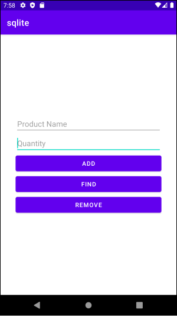
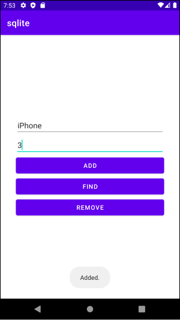
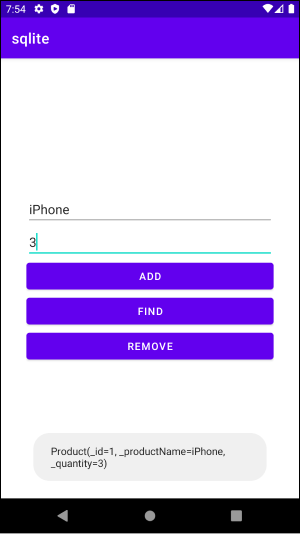
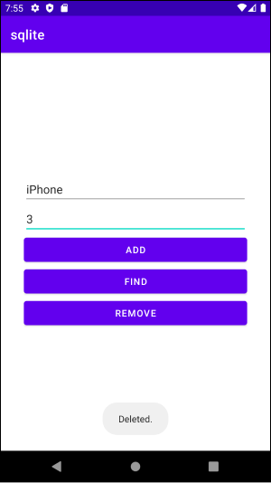
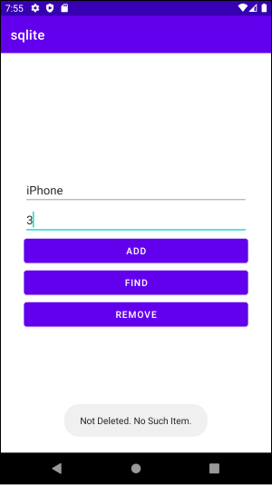

# Table Of Contents

[[toc]]

# SQLite
`SQLite`는 관계형 데이터베이스 입니다. 크기가 작고 가벼워 안드로이드나 애플 iOS처럼 모바일용 데이터베이스로 많이 사용합니다.

`SQLite`는 안드로이드 SDK에 포함되어있습니다. 따라서 별도의 설치가 필요없습니다.
``` console
$ pwd
/Users/[user_name]/Library/Android/sdk/platform-tools

$ ls
sqlite3
...
```

## 사용 방법
상품을 데이터베이스에 저장하는 예제를 만들어보겠습니다.



### 데이터 모델 설계하기

우선 데이터 모델인 `Product`클래스를 정의합니다. `Product`클래스는 상품을 식별하는 `_id`, 상품 이름인 `_productName`, 수량인 `_quantity`를 속성으로 가지고 있습니다.
``` kotlin
data class Product(
    var _id: Int = 0,
    var _productName: String,
    var _quantity: Int
)
```

### 데이터 핸들러 구현하기
데이터 핸들러는 데이터의 추가, 삭제, 변경, 조회를 담당하는 클래스입니다. `SQLiteOpenHelper`클래스의 서브 클래스로 구현됩니다. 
``` kotlin
class DBHelper constructor(
    // ..
): SQLiteOpenHelper(
    // .. 
) {
    override fun onCreate(db: SQLiteDatabase?) {
        TODO("Not yet implemented")
    }

    override fun onUpgrade(db: SQLiteDatabase?, oldVersion: Int, newVersion: Int) {
        TODO("Not yet implemented")
    }

}
```
`데이터베이스 이름`, `데이터베이스 버전`, `테이블 이름`, `컬럼 이름`을 선언합니다.
``` kotlin
class DBHelper constructor(
    // ..
): SQLiteOpenHelper(
    // .. 
) {
    companion object {
        const val DATABASE_NAME = "productDB.db"
        const val DATABASE_VERSION = 1
        const val TABLE_PRODUCTS = "products"

        const val COLUMN_ID = "id"
        const val COLUMN_PRODUCT_NAME = "product_name"
        const val COLUMN_QUANTITY = "quantity"
    }

    // ...
}
```
이제 `생성자`를 다음과 같이 구현합니다. 
``` kotlin
class DBHelper constructor(
    context: Context, name: String?, factory: SQLiteDatabase.CursorFactory?, version: Int
) : SQLiteOpenHelper(
    context, DATABASE_NAME, factory, DATABASE_VERSION
) {

    companion object {
        const val DATABASE_NAME = "productDB.db"
        const val DATABASE_VERSION = 1
        const val TABLE_PRODUCTS = "products"

        const val COLUMN_ID = "id"
        const val COLUMN_PRODUCT_NAME = "product_name"
        const val COLUMN_QUANTITY = "quantity"
    }

    // ...
}
```
`onCreate()`는 데이터베이스가 최초로 초기화될 때 호출됩니다. 여기서 product 테이블을 생성합시다.
``` kotlin
class DBHelper constructor(
    context: Context, name: String, factory: SQLiteDatabase.CursorFactory, version: Int
) : SQLiteOpenHelper(
    context, DATABASE_NAME, factory, DATABASE_VERSION
) {
    // ...

    override fun onCreate(db: SQLiteDatabase?) {
        val query = "CREATE TABLE ${TABLE_PRODUCTS} " +
                "(" +
                "$COLUMN_ID INTEGER PRIMARY KEY, " +
                "$COLUMN_PRODUCT_NAME TEXT," +
                "$COLUMN_QUANTITY INTEGER" +
                ")"
        db?.execSQL(query)
    }

    // ...

}
```
이전에 사용된 것보다 더 높은 데이터베이스 버전을 가지고 핸들러가 실행될 때 `onUpgrade()`가 호출됩니다. 

::: tip
여기서 말하는 <b>데이터베이스 버전</b>은 SQLite의 버전이 아닙니다. 테이블의 열이 추가되거나 데이터베이스 스키마가 변경되었을 때 버전 번호를 올려서 핸들러를 실행하면 <b>onUpgrade()</b>가 자동으로 호출됩니다. 이 때 <b>onUpgrade()</b> 안에서 원하는 SQL 작업을 수행합니다.
:::

``` kotlin
class DBHelper constructor(
    context: Context, name: String, factory: SQLiteDatabase.CursorFactory, version: Int
) : SQLiteOpenHelper(
    context, DATABASE_NAME, factory, DATABASE_VERSION
) {
    // ...

    override fun onUpgrade(db: SQLiteDatabase?, oldVersion: Int, newVersion: Int) {
        val query = "DROP TABLE IF EXISTS ${TABLE_PRODUCTS}"
        db?.execSQL(query)
        onCreate(db)
    }
}
```
이제 데이터를 추가하는 메서드를 구현합시다. 메서드의 이름은 `addProduct()` 입니다.
``` kotlin
class DBHelper constructor(
    context: Context, name: String, factory: SQLiteDatabase.CursorFactory, version: Int
) : SQLiteOpenHelper(
    context, DATABASE_NAME, factory, DATABASE_VERSION
) {
    // ...

    fun addProduct(product: Product) {
        val values = ContentValues()

        values.put(COLUMN_PRODUCT_NAME, product._productName)
        values.put(COLUMN_QUANTITY, product._quantity)

        var db = writableDatabase
        db.insert(TABLE_PRODUCTS, null, values)
        db.close()
    }
}
```
데이터를 검색하는 메서드는 `findProduct()`입니다.
``` kotlin
class DBHelper constructor(
    context: Context, name: String, factory: SQLiteDatabase.CursorFactory, version: Int
) : SQLiteOpenHelper(
    context, DATABASE_NAME, factory, DATABASE_VERSION
) {
    // ...

    fun findProduct(productName: String): Product? {
        val query = "SELECT * FROM ${TABLE_PRODUCTS} WHERE ${COLUMN_PRODUCT_NAME} = \"${productName}\""

        val db = writableDatabase
        val cursor = db.rawQuery(query, null)

        var product: Product? = null

        if (cursor.moveToFirst()) {
           product = Product(
               _id = Integer.parseInt(cursor.getString(0)),
               _productName = cursor.getString(1),
               _quantity =  Integer.parseInt(cursor.getString(2))
           )
            cursor.close()
        } else {
            product = null
        }

        db.close()
        return product
    }
}
```
데이터를 삭제하는 메서드는 `deleteProduct()`입니다.
``` kotlin
class DBHelper constructor(
    context: Context, name: String?, factory: SQLiteDatabase.CursorFactory?, version: Int
) : SQLiteOpenHelper(
    context, DATABASE_NAME, factory, DATABASE_VERSION
) {
    fun deleteProduct(productName: String): Boolean {
        var result = false

        val query = "SELECT * FROM ${TABLE_PRODUCTS} WHERE ${COLUMN_PRODUCT_NAME} = \"${productName}\""

        val db = writableDatabase

        var cursor = db.rawQuery(query, null)

        if (cursor.moveToFirst()) {
            val productId = Integer.parseInt(cursor.getString(0))
            db.delete(TABLE_PRODUCTS, "$COLUMN_ID = ${productId}", null)
            cursor.close()
            result = true
        }

        db.close()
        return result
    }
}
```
전체 코드는 다음과 같습니다.
``` kotlin
class DBHelper constructor(
    context: Context, name: String?, factory: SQLiteDatabase.CursorFactory?, version: Int
) : SQLiteOpenHelper(
    context, DATABASE_NAME, factory, DATABASE_VERSION
) {

    companion object {
        const val DATABASE_NAME = "productDB.db"
        const val DATABASE_VERSION = 1
        const val TABLE_PRODUCTS = "products"

        const val COLUMN_ID = "id"
        const val COLUMN_PRODUCT_NAME = "product_name"
        const val COLUMN_QUANTITY = "quantity"
    }

    override fun onCreate(db: SQLiteDatabase?) {
        val query = "CREATE TABLE ${TABLE_PRODUCTS} " +
                "(" +
                "$COLUMN_ID INTEGER PRIMARY KEY, " +
                "$COLUMN_PRODUCT_NAME TEXT," +
                "$COLUMN_QUANTITY INTEGER" +
                ")"
        db?.execSQL(query)
    }

    override fun onUpgrade(db: SQLiteDatabase?, oldVersion: Int, newVersion: Int) {
        val query = "DROP TABLE IF EXISTS ${TABLE_PRODUCTS}"
        db?.execSQL(query)
        onCreate(db)
    }

    fun addProduct(product: Product) {
        val values = ContentValues()

        values.put(COLUMN_PRODUCT_NAME, product._productName)
        values.put(COLUMN_QUANTITY, product._quantity)

        var db = writableDatabase
        db.insert(TABLE_PRODUCTS, null, values)
        db.close()
    }

    fun findProduct(productName: String): Product? {
        val query = "SELECT * FROM ${TABLE_PRODUCTS} WHERE ${COLUMN_PRODUCT_NAME} = \"${productName}\""

        val db = writableDatabase
        val cursor = db.rawQuery(query, null)

        var product: Product? = null

        if (cursor.moveToFirst()) {
           product = Product(
               _id = Integer.parseInt(cursor.getString(0)),
               _productName = cursor.getString(1),
               _quantity =  Integer.parseInt(cursor.getString(2))
           )
            cursor.close()
        } else {
            product = null
        }

        db.close()
        return product
    }

    fun deleteProduct(productName: String): Boolean {
        var result = false

        val query = "SELECT * FROM ${TABLE_PRODUCTS} WHERE ${COLUMN_PRODUCT_NAME} = \"${productName}\""

        val db = writableDatabase

        var cursor = db.rawQuery(query, null)

        if (cursor.moveToFirst()) {
            val productId = Integer.parseInt(cursor.getString(0))
            Log.d("TEST", "productId: ${productId}")
            db.delete(TABLE_PRODUCTS, "$COLUMN_ID = ${productId}", null)
            cursor.close()
            result = true
        }

        db.close()
        return result
    }
}
```
이제 `MainActivity`에서 버튼을 누르면 추가, 검색, 삭제를 하겠습니다.


레이아웃은 다음과 같습니다

``` xml
<?xml version="1.0" encoding="utf-8"?>
<androidx.constraintlayout.widget.ConstraintLayout xmlns:android="http://schemas.android.com/apk/res/android"
    xmlns:app="http://schemas.android.com/apk/res-auto"
    xmlns:tools="http://schemas.android.com/tools"
    android:layout_width="match_parent"
    android:layout_height="match_parent"
    tools:context=".MainActivity">

    <LinearLayout
        android:padding="36dp"
        android:id="@+id/activity_main_ll_top"
        android:layout_width="match_parent"
        android:layout_height="wrap_content"
        android:orientation="vertical"
        app:layout_constraintTop_toTopOf="parent"
        app:layout_constraintStart_toStartOf="parent"
        app:layout_constraintEnd_toEndOf="parent"
        app:layout_constraintBottom_toBottomOf="parent">

        <EditText
            android:id="@+id/activity_main_tv_product_name"
            android:layout_width="match_parent"
            android:layout_height="wrap_content"
            android:hint="Product Name"/>

        <EditText
            android:id="@+id/activity_main_tv_quantity"
            android:layout_width="match_parent"
            android:layout_height="wrap_content"
            android:hint="Quantity"/>

        <Button
            android:id="@+id/activity_main_btn_add"
            android:layout_width="match_parent"
            android:layout_height="wrap_content"
            android:text="Add" />

        <Button
            android:id="@+id/activity_main_btn_find"
            android:layout_width="match_parent"
            android:layout_height="wrap_content"
            android:text="Find" />

        <Button
            android:id="@+id/activity_main_btn_remove"
            android:layout_width="match_parent"
            android:layout_height="wrap_content"
            android:text="Remove" />

    </LinearLayout>
    
</androidx.constraintlayout.widget.ConstraintLayout>
```

코드는 다음과 같습니다.
``` kotlin
class MainActivity : AppCompatActivity() {

    val buttonAdd: Button by lazy { findViewById<Button>(R.id.activity_main_btn_add) }
    val buttonFind: Button by lazy { findViewById<Button>(R.id.activity_main_btn_find) }
    val buttonRemove: Button by lazy { findViewById<Button>(R.id.activity_main_btn_remove) }

    val editTextProductName: EditText by lazy { findViewById<EditText>(R.id.activity_main_tv_product_name) }
    val editTextQuantity: EditText by lazy { findViewById<EditText>(R.id.activity_main_tv_quantity) }

    override fun onCreate(savedInstanceState: Bundle?) {
        super.onCreate(savedInstanceState)
        setContentView(R.layout.activity_main)

        buttonAdd.setOnClickListener {
            val dbHelper = DBHelper(this, null, null, 1)
            var productName = editTextProductName.text.toString()
            val quantity = Integer.parseInt(editTextQuantity.text.toString())
            val product = Product(_productName = productName, _quantity = quantity)
            dbHelper.addProduct(product)
            Toast.makeText(this, "Added.", Toast.LENGTH_SHORT).show()
        }
        buttonFind.setOnClickListener {
            val dbHelper = DBHelper(this, null, null, 1)
            var productName = editTextProductName.text.toString()
            val product = dbHelper.findProduct(productName)
            if (product != null) {
                Toast.makeText(this, "${product.toString()}", Toast.LENGTH_SHORT).show()
            } else {
                Toast.makeText(this, "No Such Item.", Toast.LENGTH_SHORT).show()
            }

        }
        buttonRemove.setOnClickListener {
            val dbHelper = DBHelper(this, null, null, 1)
            var result = dbHelper.deleteProduct("iPhone")
            if (result) {
                Toast.makeText(this, "Deleted.", Toast.LENGTH_SHORT).show()
            } else {
                Toast.makeText(this, "Not Deleted. No Such Item.", Toast.LENGTH_SHORT).show()
            }
        }
    }
}
```
이제 앱을 실행하고 상품명과 수량을 입력합니다.


 `Find 버튼`을 누르면 다음과 같은 토스트 메시지가 나옵니다. 아직 추가된 데이터가 없기 때문입니다.


이제 `ADD 버튼`을 눌러 데이터를 추가합니다. 데이터가 정상적으로 추가되면 다음과 같이 토스트 메시지가 나옵니다.



다시 `Find 버튼`을 눌러봅니다. 입력한 데이터가 토스트 메시지에 출력됩니다.



이제 `REMOVE 버튼`을 누릅니다. 데이터가 삭제되고 다음과 같은 메시지가 출력됩니다.



다시 한번 `REMOVE 버튼`을 누릅니다. 데이터가 이미 삭제됐으므로 다음과 같은 메시지가 출력됩니다.

