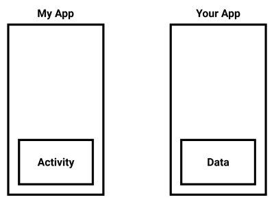
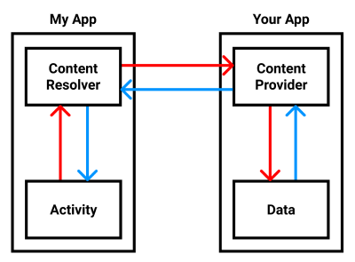
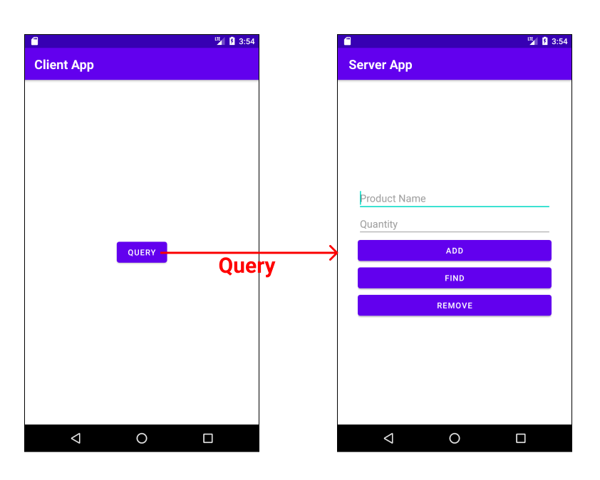
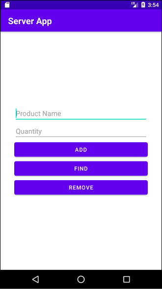
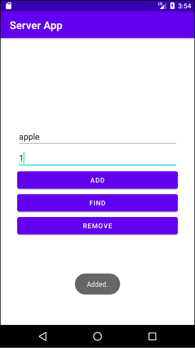
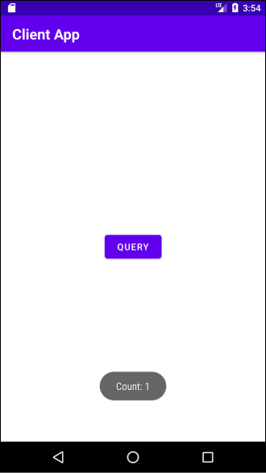
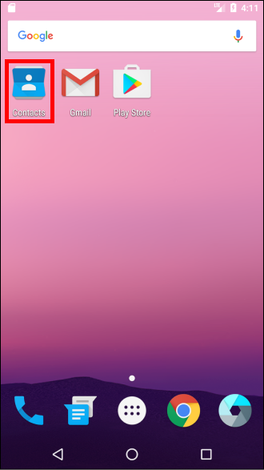

# Table of Contents

[[toc]]

## Content Provider, Content Resolver

다음과 같이 두 앱이 있다고 가정합시다.



`컨텐트 프로바이더(Content Provider)`와 `컨텐트 리솔버(Content Resolver)`를 사용하면 다른 어플리캐이션의 데이터에 접근할 수 있습니다. 컨텐트 프로바이더가 정의된 앱을 `서버 앱`, 컨텐트 리솔버를 사용하는 앱을 `클라이언트 앱`이라고도 합니다.



데이터를 제공하는 앱에서는 `컨텐트 프로바이더`를 구현합니다. 데이터를 사용하는 앱에서는 `getContentResolver()`를 호출하여 `컨텐트 리솔버` 객체에 접근할 수 있습니다. 이 객체를 사용하여 다른 앱에 데이터를 추가, 변경, 삭제, 조회할 수 있습니다.

다음과 같은 예제를 만들며 `컨텐트 프로바이더`와 `컨텐트 리솔버`에 대해 알아보겠습니다.



`서버 앱`에서는 데이터를 추가, 삭제, 탐색할 수 있습니다. 또한 컨텐트 프로바이더도 구현되어있습니다. 

`클라이언트 앱`은 버튼을 누르면 컨텐트 리솔버를 사용하여 데이터를 조회합니다. 이후 토스트 메시지로 조회한 데이터의 개수를 보여줍니다.


## 서버 앱
> 컨텐트 프로바이더 예제는 [SQLite 포스트의 예제](/post/20_android/01_Android%20Framework/190705_sqlite.html#사용-방법)를 사용합니다. 

우선 데이터를 제공하는 앱에서 컨텐트 프로바이더를 구현합시다. 컨텐트 프로바이더는 `ContentProvider`클래스의 서브클래스입니다.
``` kotlin
class ProductContentProvider : ContentProvider() {

    override fun delete(uri: Uri, selection: String?, selectionArgs: Array<String>?): Int {
        TODO("Implement this to handle requests to delete one or more rows")
    }

    override fun getType(uri: Uri): String? {
        TODO(
            "Implement this to handle requests for the MIME type of the data" +
                    "at the given URI"
        )
    }

    override fun insert(uri: Uri, values: ContentValues?): Uri? {
        TODO("Implement this to handle requests to insert a new row.")
    }

    override fun onCreate(): Boolean {
        TODO("Implement this to initialize your content provider on startup.")
    }

    override fun query(
        uri: Uri, projection: Array<String>?, selection: String?,
        selectionArgs: Array<String>?, sortOrder: String?
    ): Cursor? {
        TODO("Implement this to handle query requests from clients.")
    }

    override fun update(
        uri: Uri, values: ContentValues?, selection: String?,
        selectionArgs: Array<String>?
    ): Int {
        TODO("Implement this to handle requests to update one or more rows.")
    }
}
```
`ContentProvider`클래스를 구현하면 위와 같이 여섯 개의 메소드를 오버라이딩 해야합니다. 또한 컨텐트 프로바이더는 안드로이드의 4대 컴포넌트 중 하나이므로 `AndroidManifest.xml`에 선언해야합니다.

``` xml
<?xml version="1.0" encoding="utf-8"?>
<manifest xmlns:android="http://schemas.android.com/apk/res/android"
    package="com.yologger.sqlite">

    <application android:allowBackup="true"
        android:icon="@mipmap/ic_launcher"
        android:label="@string/app_name"
        android:roundIcon="@mipmap/ic_launcher_round"
        android:supportsRtl="true"
        android:theme="@style/Theme.Sqlite">

        <provider android:name=".ProductContentProvider"
            android:authorities="com.yologger.sqlite.ProductContentProvider"
            android:enabled="true"
            android:exported="true">
        </provider>

        <activity android:name=".MainActivity">
            <intent-filter>
                <action android:name="android.intent.action.MAIN" />
                <category android:name="android.intent.category.LAUNCHER" />
            </intent-filter>
        </activity>
    </application>

</manifest>
```
이때 컨텐트 프로바이더의 세 가지 속성 값을 지정해야합니다. 
- `enabled`: 안드로이드 시스템에 의해 컨텐트 프로바이더의 인스턴스가 생성될 수 있는지 여부입니다. 이 값이 false면 시스템이 컨텐트 프로바이더 인스턴스를 생성할 수 없습니다. 따라서 값을 true로 설정합니다.
- `export`: 다른 앱이 컨텐트 프로바이더를 사용할 수 있는지 여부입니다. 이 값이 false면 같은 앱에서만 컨텐트 프로바이더에 접근할 수 있습니다. 따라서 값을 true로 설정합니다.
- `authorities`: 다른 앱이 컨텐트 프로바이더에 접근할 때 사용하는 주소입니다.

이제 컨텐트 프로바이더의 메소드를 하나씩 구현해봅시다. 
### authority, URI 상수 정의
모든 컨텐트 프로바이더는 `authority`와 `콘텐트 URI`을 가지고 있습니다. `authority`값은 콘텐트 제공자 클래스 자신의 완전한 패키지 이름을 사용합니다. `콘텐트 URI`는 앱에 따라 달라질 수 있습니다. 여기서는 데이터베이스 테이블 이름인 product로 구성하겠습니다.
``` kotlin
class ProductContentProvider : ContentProvider() {

    val AUTHORITY = "com.yologger.sqlite.ProductContentProvider"
    val TABLE_PRODUCTS = "products"
    val CONTENT_URI  = Uri.parse("content://$AUTHORITY/$TABLE_PRODUCTS")

    val URL_MATCH_RESULT_PRODUCT = 1
    val URL_MATCH_RESULT_PRODUCT_ID = 2

    // ...
}
```

### UriMatcher 구현하기
컨텐트 리솔버는 `Uri` 객체를 통해 컨텐트 프로바이더에 접근합니다. 컨텐트 프로바이더에서는 `UriMatcher`를 통해 컨텐트 리솔버를 구분합니다. 
``` kotlin
class ProductContentProvider : ContentProvider() {
    // ...

    val URL_MATCH_RESULT_PRODUCT = 1
    val URL_MATCH_RESULT_PRODUCT_ID = 2

    val uriMatcher = UriMatcher(UriMatcher.NO_MATCH)

    init {
        uriMatcher.addURI(AUTHORITY, TABLE_PRODUCTS, URL_MATCH_RESULT_PRODUCT)
        uriMatcher.addURI(AUTHORITY, "$TABLE_PRODUCTS/#", URL_MATCH_RESULT_PRODUCT_ID)
    }

    // ...
}
```

### onCreate()
`onCreate()`에서는 초기화에 필요한 작업을 수행합니다. 여기서는 SQLite 관련 포스트에서 살펴본 `SQLiteHelper`클래스의 인스턴스와 `SQLiteDatabase`클래스의 인스턴스를 생성하겠습니다.
``` kotlin
class ProductContentProvider : ContentProvider() {

    // ...

    lateinit var dbHelper: DBHelper
    lateinit var db: SQLiteDatabase

    override fun onCreate(): Boolean {

        dbHelper = DBHelper(context!!, null, null, 1)
        db = dbHelper.writableDatabase

        return false
    }

    // ...
}
```

### insert()
클라이언트 앱이 데이터 추가를 요청하면 콘텐트 프로바이더의 `insert()`가 호출됩니다. 우선 `UriMatcher`클래스를 사용하여 적절한 URI가 전달되었는지 확인합니다. 이후 데이터베이스에 값을 추가합니다. 마지막으로 컨텐트 리솔버에 데이터 추가 완료를 통보합니다.
``` kotlin
override fun insert(uri: Uri, values: ContentValues?): Uri? {

    var uriType = uriMatcher.match(uri)

    var id: Long = 0

    when(uriType) {
        URL_MATCH_RESULT_PRODUCT -> {
            // 데이터베이스에 데이터 추가
            id = db.insert(DBHelper.TABLE_PRODUCTS, null, values)
        }
        else -> {
            throw IllegalArgumentException("Unknown URI: ${uri}")
        }
    }

    // 컨텐트 리솔버에 데이터 추가를 알림
    requireContext().contentResolver.notifyChange(uri, null)

    return Uri.parse("TABLE_PRODUCTS/${id}")
}
```

### query()
클라이언트 앱이 데이터 조회를 요청하면 컨텐트 프로바이더의 `query()`가 호출됩니다. 우선 `UriMatcher`클래스를 사용하여 적절한 URI가 전달되었는지 확인합니다. 이후 데이터베이스를 조회하면 `Cursor`클래스의 인스턴스가 반환됩니다. 이를 `query()`메소드의 반환값으로 전달합니다.
``` kotlin
override fun query(
    uri: Uri, projection: Array<String>?, selection: String?,
    selectionArgs: Array<String>?, sortOrder: String?
): Cursor? {

    var uriType = uriMatcher.match(uri)

    when (uriType) {
        URL_MATCH_RESULT_PRODUCT -> {
            val query = "SELECT * FROM ${DBHelper.TABLE_PRODUCTS}"
            var cursor = db.rawQuery(query, null)
            return cursor
        }
        else -> {
            throw IllegalArgumentException("Unknown URI")
        }
    }
}
```

### delete()
클라이언트 앱이 데이터 삭제를 요청하면 컨텐트 프로바이더의 `delete()`가 호출됩니다. 우선 `UriMatcher`클래스를 사용하여 적절한 URI가 전달되었는지 확인합니다. 이후 데이터베이스에서 데이터를 삭제하고, 삭제된 데이터의 개수를 반환합니다.
``` kotlin
override fun delete(uri: Uri, selection: String?, selectionArgs: Array<String>?): Int {
    var uriType = uriMatcher.match(uri)
    var db = dbHelper.writableDatabase

    var rowsDeleted = 0

    when(uriType) {
        URL_MATCH_RESULT_PRODUCT -> {
            rowsDeleted = db.delete(DBHelper.TABLE_PRODUCTS, selection,  selectionArgs)
        }
        URL_MATCH_RESULT_PRODUCT_ID -> {
            var id = uri.lastPathSegment
            if (TextUtils.isEmpty(selection)) {
                rowsDeleted = db.delete(DBHelper.TABLE_PRODUCTS, "${DBHelper.COLUMN_ID} = $id",  null)
            } else {
                rowsDeleted = db.delete(DBHelper.TABLE_PRODUCTS, "${DBHelper.COLUMN_ID} = $id and $selection",  selectionArgs)
            }
        }
        else -> {
            throw IllegalArgumentException("Unknown URI: ${uri}")
        }
    }

    requireContext().contentResolver.notifyChange(uri, null)
    return rowsDeleted
}
```

### update()
클라이언트 앱이 데이터 변경를 요청하면 컨텐트 프로바이더의 `update()`가 호출됩니다. 우선 `UriMatcher`클래스를 사용하여 적절한 URI가 전달되었는지 확인합니다. 이후 데이터베이스의 데이터를 변경하고, 변경된 데이터의 개수를 반환합니다.
``` kotlin
override fun update(
    uri: Uri, values: ContentValues?, selection: String?,
    selectionArgs: Array<String>?
): Int {
    var uriType = uriMatcher.match(uri)
    var db = dbHelper.writableDatabase
    var rowsUpdated = 0

    when(uriType) {
        URL_MATCH_RESULT_PRODUCT -> {
            rowsUpdated = db.update(DBHelper.TABLE_PRODUCTS, values,  selection, selectionArgs)
        }
        URL_MATCH_RESULT_PRODUCT_ID -> {
            var id = uri.lastPathSegment
            if (TextUtils.isEmpty(selection)) {
                rowsUpdated = db.update(DBHelper.TABLE_PRODUCTS, values,  "DBHelper.COLUMN_ID = $id", null)
            } else {
                rowsUpdated = db.update(DBHelper.TABLE_PRODUCTS, values,  "DBHelper.COLUMN_ID = $id and $selection", selectionArgs)
            }
        }
        else -> {
            throw IllegalArgumentException("Unknown URI: ${uri}")
        }
    }

    requireContext().contentResolver.notifyChange(uri, null)
    return rowsUpdated
}
```

### 컨텐트 프로바이더의 전체 코드
``` kotlin
class ProductContentProvider : ContentProvider() {

    val AUTHORITY = "com.yologger.sqlite.ProductContentProvider"
    val TABLE_PRODUCTS = "products"
    val CONTENT_URI  = Uri.parse("content://$AUTHORITY/$TABLE_PRODUCTS")

    val URL_MATCH_RESULT_PRODUCT = 1
    val URL_MATCH_RESULT_PRODUCT_ID = 2

    val uriMatcher = UriMatcher(UriMatcher.NO_MATCH)

    init {
        uriMatcher.addURI(AUTHORITY, TABLE_PRODUCTS, URL_MATCH_RESULT_PRODUCT)
        uriMatcher.addURI(AUTHORITY, "$TABLE_PRODUCTS/#", URL_MATCH_RESULT_PRODUCT_ID)
    }

    lateinit var dbHelper: DBHelper
    lateinit var db: SQLiteDatabase

    override fun onCreate(): Boolean {

        dbHelper = DBHelper(context!!, null, null, 1)
        db = dbHelper.writableDatabase

        return false
    }

    override fun insert(uri: Uri, values: ContentValues?): Uri? {
        var uriType = uriMatcher.match(uri)

        var id: Long = 0
        when(uriType) {
            URL_MATCH_RESULT_PRODUCT -> {
                id = db.insert(DBHelper.TABLE_PRODUCTS, null, values)
            }
            else -> {
                throw IllegalArgumentException("Unknown URI: ${uri}")
            }
        }
        requireContext().contentResolver.notifyChange(uri, null)
        return Uri.parse("TABLE_PRODUCTS/${id}")
    }

    override fun query(
        uri: Uri, projection: Array<String>?, selection: String?,
        selectionArgs: Array<String>?, sortOrder: String?
    ): Cursor? {

        var uriType = uriMatcher.match(uri)

        when (uriType) {
            URL_MATCH_RESULT_PRODUCT -> {
                val query = "SELECT * FROM ${DBHelper.TABLE_PRODUCTS}"
                var cursor = db.rawQuery(query, null)
                return cursor
            }
            else -> {
                throw IllegalArgumentException("Unknown URI")
            }
        }
    }

    override fun update(
        uri: Uri, values: ContentValues?, selection: String?,
        selectionArgs: Array<String>?
    ): Int {
        var uriType = uriMatcher.match(uri)
        var db = dbHelper.writableDatabase
        var rowsUpdated = 0

        when(uriType) {
            URL_MATCH_RESULT_PRODUCT -> {
                rowsUpdated = db.update(DBHelper.TABLE_PRODUCTS, values,  selection, selectionArgs)
            }
            URL_MATCH_RESULT_PRODUCT_ID -> {
                var id = uri.lastPathSegment
                if (TextUtils.isEmpty(selection)) {
                    rowsUpdated = db.update(DBHelper.TABLE_PRODUCTS, values,  "DBHelper.COLUMN_ID = $id", null)
                } else {
                    rowsUpdated = db.update(DBHelper.TABLE_PRODUCTS, values,  "DBHelper.COLUMN_ID = $id and $selection", selectionArgs)
                }
            }
            else -> {
                throw IllegalArgumentException("Unknown URI: ${uri}")
            }
        }

        requireContext().contentResolver.notifyChange(uri, null)
        return rowsUpdated
    }

    override fun delete(uri: Uri, selection: String?, selectionArgs: Array<String>?): Int {
        var uriType = uriMatcher.match(uri)
        var db = dbHelper.writableDatabase

        var rowsDeleted = 0

        when(uriType) {
            URL_MATCH_RESULT_PRODUCT -> {
                rowsDeleted = db.delete(DBHelper.TABLE_PRODUCTS, selection,  selectionArgs)
            }
            URL_MATCH_RESULT_PRODUCT_ID -> {
                var id = uri.lastPathSegment
                if (TextUtils.isEmpty(selection)) {
                    rowsDeleted = db.delete(DBHelper.TABLE_PRODUCTS, "${DBHelper.COLUMN_ID} = $id",  null)
                } else {
                    rowsDeleted = db.delete(DBHelper.TABLE_PRODUCTS, "${DBHelper.COLUMN_ID} = $id and $selection",  selectionArgs)
                }
            }
            else -> {
                throw IllegalArgumentException("Unknown URI: ${uri}")
            }
        }

        requireContext().contentResolver.notifyChange(uri, null)
        return rowsDeleted
    }

    override fun getType(uri: Uri): String? {
        return null
    }
}
```

## 클라이언트 앱
이제 클라이언트 앱을 구현하겠습니다. 버튼을 누르면 서버 앱에서 데이터를 조회한 후 데이터의 개수를 토스트 메시지에 출력합니다.
``` kotlin
class MainActivity : AppCompatActivity() {

    val buttonQuery: Button by lazy { findViewById<Button>(R.id.activity_main_btn_query) }

    override fun onCreate(savedInstanceState: Bundle?) {
        super.onCreate(savedInstanceState)
        setContentView(R.layout.activity_main)

        buttonQuery.setOnClickListener {
            // ...
        }
    }
}
```
우선 액티비티에서 `getContentResolver()`를 호출하여 컨텐트 리솔버에 접근할 수 있습니다.

``` kotlin
buttonQuery.setOnClickListener {
    val resolver = getContentResolver()
    // ...
}
```
컨텐트 리솔버는 `Uri`클래스를 사용하여 서버 앱을 탐색합니다. 따라서 다음과 같이 `Uri`클래스의 인스턴스를 생성합니다.
``` kotlin
buttonQuery.setOnClickListener {

    val resolver = getContentResolver()

    val AUTHORITY = "com.yologger.sqlite.ProductContentProvider"
    val TABLE_PRODUCTS = "products"
    val CONTENT_URI  = Uri.parse("content://${AUTHORITY}/${TABLE_PRODUCTS}")
}
```
컨텐트 리솔버의 `query()`를 호출하여 데이터를 조회합니다. 이 메서드를 호출하면 컨텐트 프로바이더의 `query()`가 호출되며, 5개의 인자를 필요로 합니다.

|인자|설명|
|------|---------|
|첫 번째 인자 `uri`|컨텐트 프로바이더의 주소|
|두 번째 인자 `projection`|어떤 열(Column)을 조회할 지 지정|
|세 번째 인자 `selection`|어떤 행(Row)만 조회할 지 지정하는데 사용하며 SQL문의 WHERE절과 동일|
|네 번째 인자 `selectionArgs`|어떤 행(Row)만 조회할 지 지정하는데 사용하며 SQL문의 WHERE절과 동일|
|다섯 번째 인자 `sortOrder`|정렬과 관련 있으며 SQL문의 ORDER BY와 동일|

우리는 조건 없이 모든 데이터를 조회할 것이므로 다음과 같이 `query()`를 호출합니다.
``` kotlin
buttonQuery.setOnClickListener {

    val resolver = getContentResolver()
    val AUTHORITY = "com.yologger.sqlite.ProductContentProvider"
    val TABLE_PRODUCTS = "products"
    val CONTENT_URI  = Uri.parse("content://${AUTHORITY}/${TABLE_PRODUCTS}")

    var cursor = contentResolver.query(CONTENT_URI, null, null, null, null)
}
```

`Cursor` 객체에서 데이터의 개수를 읽어 토스트 메시지에 출력합니다. 
``` kotlin
buttonQuery.setOnClickListener {

    val resolver = getContentResolver()
    val AUTHORITY = "com.yologger.sqlite.ProductContentProvider"
    val TABLE_PRODUCTS = "products"
    val CONTENT_URI  = Uri.parse("content://${AUTHORITY}/${TABLE_PRODUCTS}")

    var cursor = contentResolver.query(CONTENT_URI, null, null, null, null)
    val count = cursor?.count
    Toast.makeText(this, "Count: ${count}", Toast.LENGTH_SHORT).show()

}
```

## 실행
우선 컨텐트 프로바이더가 포함된 서버 앱을 실행합니다.



다음과 같이 데이터 한 개를 추가합니다.



컨텐트 리솔버가 포함된 클라이언트 앱을 실행합니다.


버튼을 누르면 서버 앱에서 데이터를 읽어와 토스트 메시지에 개수를 출력합니다.



## 연락처 앱
안드로이드에 내장된 `연락처 앱`에는 연락처 데이터가 저장되어 있습니다. 



클라이언트 앱에서는 컨텐트 리솔버를 사용하여 연락처 데이터를 읽어올 수 있습니다. 연락처 앱에 컨텐트 프로바이더가 구현되어있기 때문입니다.
