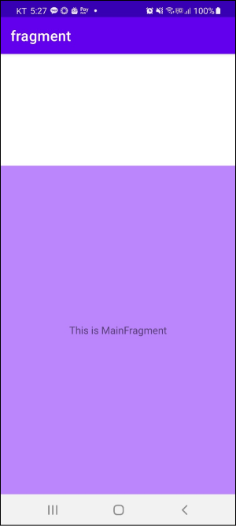
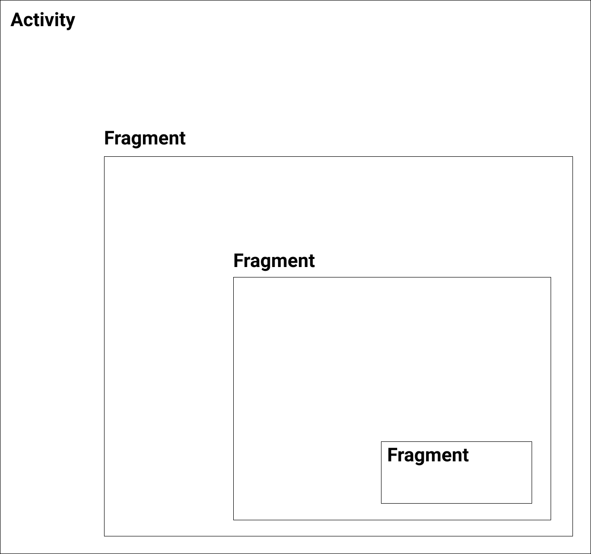
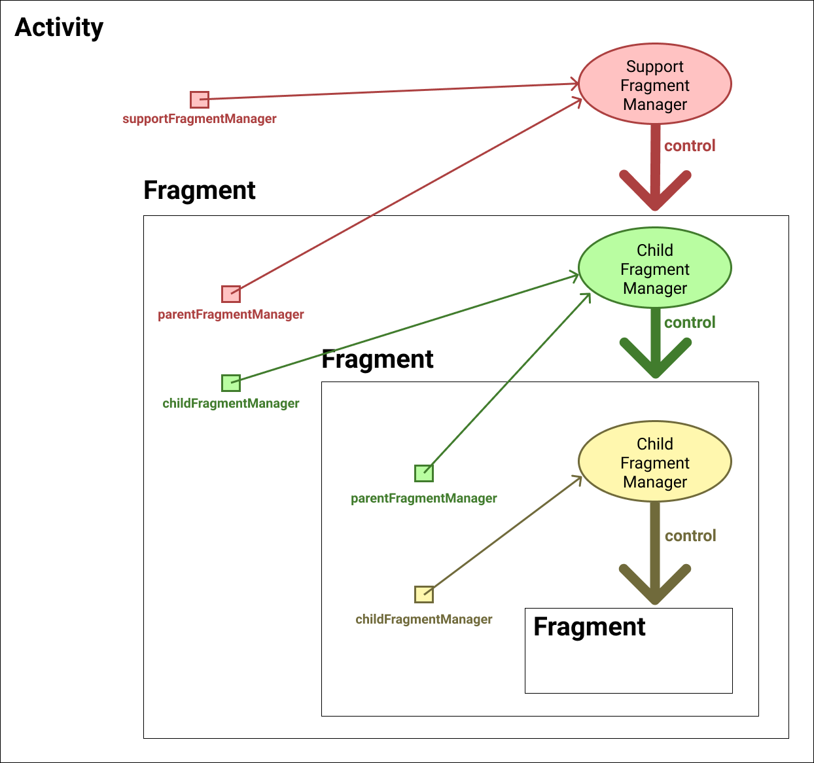

# Table of Contents

[[toc]]

# 프래그먼트
`프래그먼트(Fragment)`는 액티비티 내부에서 독립적으로 애플리케이션의 UI를 관리하는 객체입니다. 

## 프래그먼트 생성하기
모든 프래그먼트는 `Fragment`클래스를 구현합니다. 프래그먼트는 두 가지 방법으로 생성할 수 있습니다.

### 레이아웃 XML 파일에 프래그먼트 추가하기
프래그먼트는 `<fragmemt>`태그를 사용하여 레이아웃 XML 파일에 추가할 수 있습니다.

우선 다음과 같이 `MainFragment`를 생성합시다.
``` kotlin MainFragment.kt
class MainFragment : Fragment() {

    override fun onCreate(savedInstanceState: Bundle?) {
        super.onCreate(savedInstanceState)
    }

    override fun onCreateView(
        inflater: LayoutInflater, container: ViewGroup?,
        savedInstanceState: Bundle?
    ): View? {
        // Inflate the layout for this fragment
        return inflater.inflate(R.layout.fragment_main, container, false)
    }
}
``` 

`MainFragment`에 대한 레이아웃 파일은 다음과 같습니다.
``` xml fragment_main.xml
<?xml version="1.0" encoding="utf-8"?>
<androidx.constraintlayout.widget.ConstraintLayout 
    xmlns:android="http://schemas.android.com/apk/res/android"
    xmlns:tools="http://schemas.android.com/tools"
    xmlns:app="http://schemas.android.com/apk/res-auto"
    android:layout_width="match_parent"
    android:layout_height="match_parent"
    android:background="#BB86FC"
    tools:context=".MainFragment">

    <TextView android:text="This is MainFragment"
        android:layout_width="wrap_content"
        android:layout_height="wrap_content"
        app:layout_constraintTop_toTopOf="parent"
        app:layout_constraintBottom_toBottomOf="parent"
        app:layout_constraintStart_toStartOf="parent"
        app:layout_constraintEnd_toEndOf="parent"/>

</androidx.constraintlayout.widget.ConstraintLayout>
```

이제 `MainActivity`에 대한 레이아웃 파일에 `MainFragment`를 추가합니다.

``` xml activity_main.xml
<?xml version="1.0" encoding="utf-8"?>
<androidx.constraintlayout.widget.ConstraintLayout 
    xmlns:android="http://schemas.android.com/apk/res/android"
    xmlns:app="http://schemas.android.com/apk/res-auto"
    xmlns:tools="http://schemas.android.com/tools"
    android:layout_width="match_parent"
    android:layout_height="match_parent"
    tools:context=".MainActivity">

    <fragment android:id="@+id/fragment"
        android:name="com.yologger.fragment.MainFragment"
        android:layout_width="match_parent"
        android:layout_height="500dp"
        app:layout_constraintBottom_toBottomOf="parent"
        app:layout_constraintStart_toStartOf="parent"
        app:layout_constraintEnd_toEndOf="parent"/>

</androidx.constraintlayout.widget.ConstraintLayout>
```
앱을 실행하면 다음과 같습니다. 흰 부분은 액티비티 영역이고 보라색 부분은 프래그먼트 영역입니다.



### 코드로 프래그먼트 추가하기
프래그먼트는 코드에서 추가할 수도 있습니다. 순서는 다음과 같습니다. 
1. `프래그먼트`의 인스턴스를 생성합니다.
1. 액티비티에서 `프래그먼트 매니저` 객체의 참조를 얻어옵니다.
1. 프래그먼트 매니저의 `beginTransaction()`메소드를 호출하여 `프래그먼트 트랜잭션` 인스턴스를 생성합니다.
1. 프래그먼트 트랜잭션 인스턴스에서 `add()`메소드를 호출합니다. 이때 프래그먼트가 추가될 뷰 그룹과 프래그먼트를 인자로 전달합니다.
1. 프래그먼트 트랜잭션 인스턴스에서 `commit()`메소드를 호출합니다.

우선 `MainActivity`의 레이아웃 파일은 다음과 같습니다. `<FrameLayout>`은 프래그먼트가 추가될 뷰 그룹입니다.
``` xml activity_main.xml
<?xml version="1.0" encoding="utf-8"?>
<androidx.constraintlayout.widget.ConstraintLayout 
    xmlns:android="http://schemas.android.com/apk/res/android"
    xmlns:app="http://schemas.android.com/apk/res-auto"
    xmlns:tools="http://schemas.android.com/tools"
    android:layout_width="match_parent"
    android:layout_height="match_parent"
    tools:context=".MainActivity">

    <FrameLayout android:id="@+id/activity_main_container"
        android:layout_width="match_parent"
        android:layout_height="500dp"
        app:layout_constraintBottom_toBottomOf="parent"
        app:layout_constraintStart_toStartOf="parent"
        app:layout_constraintEnd_toEndOf="parent">

    </FrameLayout>
</androidx.constraintlayout.widget.ConstraintLayout>
```
이제 코드에서 프래그먼트를 추가합시다.
``` kotlin MainActivity.kt
class MainActivity : AppCompatActivity() {

    override fun onCreate(savedInstanceState: Bundle?) {
        super.onCreate(savedInstanceState)
        setContentView(R.layout.activity_main)

        // 프래그먼트의 인스턴스를 생성합니다.
        val fragment = MainFragment()

        // 액티비티에서 프래그먼트 매니저 객체의 참조를 얻어옵니다.
        val fragmentManager = supportFragmentManager

        // 프래그먼트 트랜잭션 인스턴스를 생성합니다.
        val fragmentTransaction = fragmentManager.beginTransaction()

        // 프래그먼트 트랜잭션 인스턴스에서 add()메소드를 호출합니다.
        fragmentTransaction.add(R.id.activity_main_container, fragment)

        // 프래그먼트 트랜잭션 인스턴스에서 commit()메소드를 호출합니다.
        fragmentTransaction.commit()
    }
}
``` 

## 프래그먼트 매니저
`프래그먼트 매니저(Fragment Manager)`는 프래그먼트의 추가, 삭제, 교체 등을 담당하는 객체입니다. `Activity`클래스의 `supportFragmentManager`속성값으로 프래그먼트 매니저에 접근할 수 있습니다.
``` kotlin
class MainActivity : AppCompatActivity() {

    override fun onCreate(savedInstanceState: Bundle?) {
        super.onCreate(savedInstanceState)
        setContentView(R.layout.activity_main)

        // 프래그먼트 매니저
        val fragmentMananger = supportFragmentManager
    }
}
``` 

## 프래그먼트 트랜잭션
`프래그먼트 트랜잭션(Fragment Transaction)`은 프래그먼트 연산들의 한 단위를 나타내는 클래스입니다. 트랜잭션은 프래그먼트 매니저의 `beginTransaction()`메소드를 호출하여 시작할 수 있습니다.
``` kotlin
val fragmentMananger = supportFragmentManager
val transaction = fragmentMananger.beginTransaction()
// ...
``` 
프래그먼트 트랜잭션에는 프래그먼트 연산을 위한 다양한 메소드가 존재합니다.

### add()
컨테이너 뷰에 프래그먼트를 추가합니다. 
``` kotlin
val fragmentA = FragmentA()

val fragmentMananger = supportFragmentManager
val transaction = fragmentMananger.beginTransaction()
transaction.add(R.id.activity_main_container, fragmentA)
transaction.commit()
```
다음과 같이 생명주기 메소드가 호출됩니다.
``` console
[FragmentA] onAttach
[FragmentA] onCreate
[FragmentA] onCreateView
[FragmentA] onViewCreated
[FragmentA] onStart
[FragmentA] onResume
``` 
만약 컨테이너 뷰에 이전 프래그먼트가 있으면 이를 삭제하지 않고 위에 추가합니다.
``` kotlin
val fragmentB = FragmentB()
transaction.add(R.id.activity_main_container, fragmentB)
transaction.commit()
```
다음과 같이 생명주기 메소드가 호출됩니다.
``` console
[FragmentB] onAttach
[FragmentB] onCreate
[FragmentB] onCreateView
[FragmentB] onViewCreated
[FragmentB] onStart
[FragmentB] onResume
```

### remove()
컨테이너에서 프래그먼트를 삭제합니다. 
``` kotlin
val fragmentA = FragmentA()

// ...

val transaction = supportFragmentManager.beginTransaction()
transaction.remove(fragmentA)
transaction.commit()
```
다음과 같이 생명주기 메소드가 호출됩니다.
``` console
[FragmentA] onPause
[FragmentA] onStop
[FragmentA] onDestroyView
[FragmentA] onDestroy
[FragmentA] onDetach
```

### replace()
기존 프래그먼트를 삭제하고 새로운 프래그먼트를 추가합니다. `remove()` 후 `add()`를 호출한다고 생각하면 됩니다.

컨테이너에 `FragmentA`가 이미 있다고 가정합시다. 이제 다음과 같이 `FragmentB`로 대체할 수 있습니다.
``` kotlin
transaction.replace(R.id.activity_main_fl, fragmentB)
transaction.commit()
```
생명주기 메소드는 다음과 같이 호출됩니다.
``` console
[FragmentA] onPause
[FragmentA] onStop
[FragmentB] onAttach
[FragmentB] onCreate
[FragmentB] onCreateView
[FragmentB] onViewCreated
[FragmentB] onStart
[FragmentA] onDestroyView
[FragmentA] onDestroy
[FragmentA] onDetach
[FragmentB] onResume
```
기존에 있던 `FragmentA`는 `onDestroy()`까지 호출되어 메모리에서 사라지는 것을 확인할 수 있습니다.

### commit()
트랜잭션은 다음과 같이 여러 연산으로 구성될 수 있습니다. 따라서 연산 후 반드시 `commit()`메소드를 호출해서 변경사항을 적용해야합니다.
``` kotlin
val fragmentB = FragmentB()
transaction.add(R.id.activity_main_container, fragmentB)
transaction.remove(fragmentB)

val fragmentC = FragmentC()
transaction.add(R.id.activity_main_container, fragmentC)

val fragmentD = FragmentD()
transaction.replace(R.id.activity_main_container, fragmentD)

transaction.commit()
```

### 그 외의 트랜잭션 연산
트랜잭션 연산에는 위에서 살펴본 연산 외에도 `show()`, `hide()`, `attach()`, `detach()`, `isEmpty()`등이 있습니다. 

## childFragmentManager, parentFragmentManager
우리는 액티비티에서 프래그먼트를 제어하기위해 `supportFragmentManager`속성을 사용했습니다.
``` kotlin
class MainActivity : AppCompatActivity() {
    override fun onCreate(savedInstanceState: Bundle?) {
        super.onCreate(savedInstanceState)
        setContentView(R.layout.activity_main)

        var supportFragmentManager = supportFragmentManager
    }
}
```
이제 프래그먼트를 살펴봅시다. 프래그먼트에는 `fragmentManager`, `childFragmentManager`, `parentFragmentManager`속성이 존재합니다.
``` kotlin
class SubFragment: Fragment() {
    override fun onViewCreated(view: View, savedInstanceState: Bundle?) {
        super.onViewCreated(view, savedInstanceState)

        var fragmentManager = fragmentManager
        var parentFragmentMgr = parentFragmentManager
        var childFragmentMgr = childFragmentManager
    }    
}
```
- `fragmentManager(deprecated)`: 더 이상 사용하지 않습니다. 
- `parentFragmentManager`: 현재 프래그먼트를 제어하는 부모 액티비티나 부모 프래그먼트의 프래그먼트 매니저를 반환합니다. `parentFragmentManager`를 통해서 자신을 다른 프래그먼트로 교체하는데 유용하게 사용할 수 있습니다.
- `childFragmentManager`: 현재 프래그먼트는 여러 개의 프래그먼트를 가질 수도 있습니다. 현재 프래그먼트는 `childFragmentManager`속성을 사용하여 자식 프래그먼트를 제어합니다. 다음과 같이 액티비티 안에 프래그먼트가 있고, 그 안에 또 프래그먼트가 있고, 그 안에 또 프래그먼트가 있다고 가정합시다.



이러한 구조에서 `supportFragmentManager`, `parentFragmentManager`, `childFragmentManager`가 가리키는 객체는 다음과 같습니다.



## Fragment Back Stack
액티비티는 태스크에 스택 형태로 유지됩니다. 이 때문에 백 버튼을 누르면 스택의 최상단 액티비티를 종료하고 이전 액티비티로 돌아올 수 있습니다.

`프래그먼트 백 스택(Fragment Back Stack)`은 프래그먼트에서도 액티비티와 유사하게 이전 프래그먼트 상태로 돌아가는 것을 가능하게 합니다. 백 스택을 사용하면 트랜잭션을 백 스택이라는 공간에 유지합니다. 따라서 백 버튼이나 `Fragment.popBackStack()`을 호출하면 이전 프래그먼트의 상태로 돌아올 수 있습니다.

예제를 살펴보겠습니다. 우선 `MainActivity`의 레이아웃는 다음과 같습니다.
``` xml activity_main.xml
<?xml version="1.0" encoding="utf-8"?>
<androidx.constraintlayout.widget.ConstraintLayout xmlns:android="http://schemas.android.com/apk/res/android"
    xmlns:app="http://schemas.android.com/apk/res-auto"
    xmlns:tools="http://schemas.android.com/tools"
    android:layout_width="match_parent"
    android:layout_height="match_parent"
    tools:context=".MainActivity">

    <Button android:id="@+id/activity_main_btn"
        android:layout_margin="16dp"
        android:layout_width="wrap_content"
        android:layout_height="wrap_content"
        android:textAllCaps="false"
        app:layout_constraintTop_toTopOf="parent"
        app:layout_constraintBottom_toTopOf="@+id/activity_main_fl"
        app:layout_constraintStart_toStartOf="parent"
        app:layout_constraintEnd_toEndOf="parent"
        android:text="Start Transaction"/>

    <FrameLayout android:id="@+id/activity_main_fl"
        android:layout_width="match_parent"
        android:layout_height="200dp"
        app:layout_constraintTop_toBottomOf="@+id/activity_main_btn"
        app:layout_constraintBottom_toBottomOf="parent"
        app:layout_constraintStart_toStartOf="parent"
        app:layout_constraintEnd_toEndOf="parent">
    </FrameLayout>
    
</androidx.constraintlayout.widget.ConstraintLayout>
```

버튼을 누르면 다음과 같이 네 개의 트랜잭션을 실행하겠습니다. 백 스택에 트랜잭션을 추가할 때는 `addToBackStack(null)`메소드를 사용합니다. 
``` kotlin MainActivity.kt
class MainActivity : AppCompatActivity() {

    lateinit var button: Button

    override fun onCreate(savedInstanceState: Bundle?) {
        super.onCreate(savedInstanceState)
        setContentView(R.layout.activity_main)

        button = findViewById(R.id.activity_main_btn)

        button.setOnClickListener {

            // 첫 번째 트랜잭션 
            // Fragment A 추가
            var fragmentA = FragmentA()
            val transaction1 = supportFragmentManager.beginTransaction()
            transaction1.add(R.id.activity_main_fl, fragmentA)
            transaction1.addToBackStack(null)
            transaction1.commit()

            // 두 번째 트랜잭션
            // Fragment A 삭제
            val transaction2 = supportFragmentManager.beginTransaction()
            transaction2.remove(fragmentA)
            transaction2.addToBackStack(null)
            transaction2.commit()

            // 세 번째 트랜잭션 
            // Fragment B 추가
            val fragmentB = FragmentB()
            val transaction3 = supportFragmentManager.beginTransaction()
            transaction3.add(R.id.activity_main_fl, fragmentB)
            transaction3.addToBackStack(null)
            transaction3.commit()

            // 네 번째 트랜잭션
            // Fragment B를 Fragment A로 교체
            val transaction4 = supportFragmentManager.beginTransaction()
            transaction4.replace(R.id.activity_main_fl, fragmentA)
            transaction4.addToBackStack(null)
            transaction4.commit()
        }
    }
}
``` 

이제 앱을 실행합시다. `백 버튼`을 누를 때 마다 이전 상태로 돌아가는 것을 확인할 수 있습니다. 만약 백 스택에 트랜잭션을 추가하지 않았다면, `백 버튼`을 눌렀을 때 이전 상태로 돌아가지 않고 앱이 종료됩니다.`백 버튼` 대신 `popBackStack()`메소드를 사용할 수도 있습니다.

### OnBackStackChangedListener
`OnBackStackChangedListener`를 사용하면 `백 스택`의 변화를 감지할 수 있습니다.
``` kotlin
var fragmentManager = supportFragmentManager

fragmentManager.addOnBackStackChangedListener(object: FragmentManager.OnBackStackChangedListener {
    override fun onBackStackChanged() {
        // Do something when back stack changed.
    }
})
```

## 프래그먼트 생명주기
프래그먼트로 액티비티와 마찬가지로 생명주기 함수를 가지고 있습니다. 


### onAttach()
프래그먼트는 액티비티 위에서 동작합니다. 따라서 액티비티와 연관된 생명주기 함수를 가집니다. `onAttach()`는 액티비티와 프래그먼트가 연관될 때 호출됩니다.

### onCreate()
프래그먼트의 인스턴스가 생성될 때 호출됩니다. 액티비티의 `onCreate()`와 마찬가지로 초기화 작업을 이 곳에서 실행하면 됩니다. 다만 프래그먼트의 `onCreate()`에서는 `뷰(View)`와 관련된 UI 작업을 수행할 수 없습니다. 루트 뷰가 아직 인플레이트되지 않았기 때문입니다.

### onCreateView()
프래그먼트의 `루트 뷰(Root View)`를 인플레이트하여 반환합니다. 
``` kotlin
class FragmentA : Fragment() {
    
    override fun onCreateView(inflater: LayoutInflater, container: ViewGroup?, savedInstanceState: Bundle?): View? {
        // Inflate the layout for this fragment
        val rootView: View = inflater.inflate(R.layout.fragment_a, container, false)
        return rootView
    }
}
```

### onViewCreated()
프래그먼트의 루트 뷰와 자식 뷰가 화면에 그려진 후 호출됩니다. 이 메소드에서부터는 `getView()`나 `requireView()`를 통해 프래그먼트의 루트 뷰에 접근할 수 있습니다. 또한 루트 뷰의 `findViewById()`를 사용하여 자식 뷰에 접근할 수 있습니다.
``` kotlin
class FragmentB : Fragment() {

    override fun onCreateView(inflater: LayoutInflater, container: ViewGroup?, savedInstanceState: Bundle?): View? {
        // Inflate the layout for this fragment
        val view = inflater.inflate(R.layout.fragment_b, container, false)
        return view
    }

    override fun onViewCreated(view: View, savedInstanceState: Bundle?) {
        super.onViewCreated(view, savedInstanceState)
        val rootView = requireView()
        val textView = rootView.findViewById<TextView>(R.id.fragment_b_tv)
        textView.setText("Hello")
    }
}
```

### onStart()
액티비티의 `onStart()`와 유사합니다. 프래그먼트가 시작될 때 호출되며, 사용자에게 프래그먼트가 보여집니다.

### onResume()
액티비티의 `onResume()`과 유사합니다. 프래그먼트가 사용자와 상호작용할 수 있을 때 호출됩니다.

### onPause()
액티비티의 `onPause()`와 유사합니다. 프래그먼트가 사용자와 상호작용할 수 없을 때 호출됩니다.

### onStop()
액티비티의 `onStop()`과 유사합니다. 프래그먼트가 다른 프래그먼트나 액티비티에 의해 가려졌을 때 호출됩니다.

### onDestroyView()
프래그먼트의 루트 뷰가 제거될 때 호출됩니다. `프래그먼트 백 스택(Fragment Back Stack)`을 사용하면 프래그먼트의 인스턴스는 삭제하지 않고 재사용하는데, 이 때는 `onDestroy()`가 아니라 `onDestroyView()`까지만 호출됩니다. 이후 프래그먼트를 재사용하면 `onCreate()`가 아니라 `onCreateView()`를 실행합니다.

### onDestroy()
프래그먼트의 뷰가 제거된 후, 프래그먼트의 인스턴스가 소멸할 때 호출됩니다. 프래그먼트 백 스택을 사용하지 않으면, 프래그먼트의 뷰 뿐만 아니라 인스턴스까지 삭제됩니다. 또한 `onDestroyView()` 이후 `onDestroy()`까지 호출됩니다.

### onDetach()
프래그먼트가 소멸되고, 액티비티와의 연결도 끊어질 때 호출됩니다.