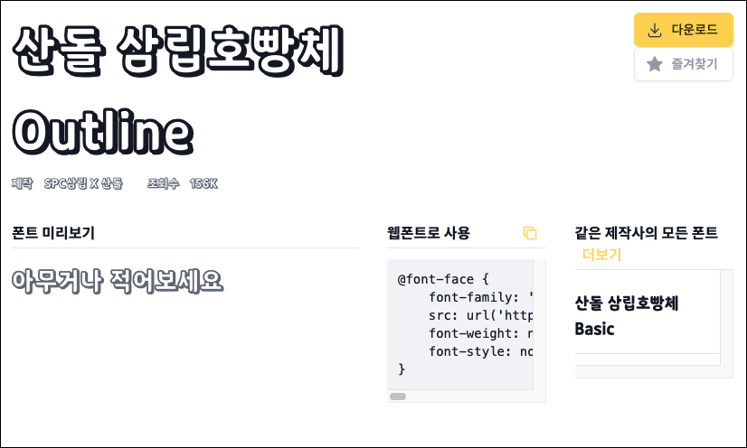
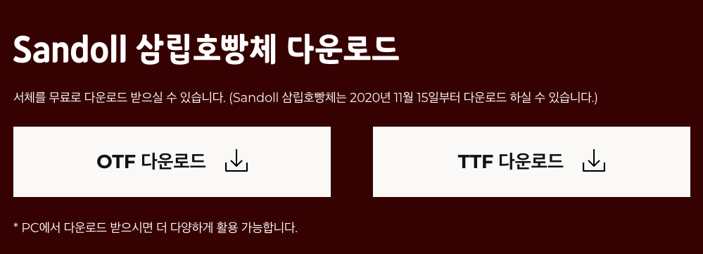
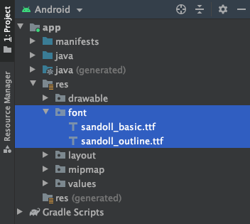
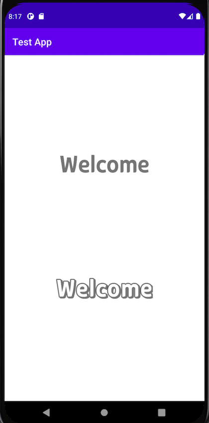

## 폰트 다운로드
우선 [눈누(https://noonnu.cc/)](https://noonnu.cc/)라는 무료 폰트 사이트에서 한글 폰트를 다운로드 받습니다. 저는 [`산돌 삼립호빵체`](https://noonnu.cc/font_page/508)를 선택했습니다. 산돌 살림호빵체는 `basic`버전과 `outline`버전이 있습니다.



폰트 파일은 두 가지 종류 `*.ttf`와 `*.otf`가 있는데 어느 것을 다운로드 받아도 상관없습니다.



이제 아래와 같이 `/res/font`폴더를 생성하고, 두 개의 폰트 파일(basic과 outline)을 추가합니다. 주의할 점은 폰트 파일의 이름을 소문자로 변경해야합니다.



## font.xml 생성
`/res/font`폴더 아래에 `font.xml`파일을 생성하고 다음과 같이 다운로드받은 폰트를 추가합니다.
``` xml 
// font.xml
<?xml version="1.0" encoding="utf-8"?>
<font-family xmlns:android="http://schemas.android.com/apk/res/android">
    <font
        android:fontStyle = "normal"
        android:fontWeight = "400"
        android:font = "@font/sandoll_basic"/>
    <font
        android:fontStyle = "normal"
        android:fontWeight = "400"
        android:font = "@font/sandoll_outline"/>
</font-family>
```

위과 같이 `<font-family>`태그 안에 `<font>`태그를 추가하고 다운받은 폰트를 등록합니다. `font`의 속성값은 `@font/폰트파일이름` 형식으로 지정합니다.

## 폰트 사용하기
이제 레이아웃 파일에서 `fontFamily`속성값으로 폰트를 사용할 수 있습니다.
``` xml 
// activity_main.xml
<?xml version="1.0" encoding="utf-8"?>
<androidx.constraintlayout.widget.ConstraintLayout xmlns:android="http://schemas.android.com/apk/res/android"
    xmlns:app="http://schemas.android.com/apk/res-auto"
    xmlns:tools="http://schemas.android.com/tools"
    android:layout_width="match_parent"
    android:layout_height="match_parent"
    tools:context=".MainActivity">

    <TextView
        android:id="@+id/textview1"
        android:layout_width="wrap_content"
        android:layout_height="wrap_content"
        android:text="@string/textview_welcome"
        android:fontFamily="@font/sandoll_basic"
        android:textSize="50dp"
        app:layout_constraintEnd_toEndOf="parent"
        app:layout_constraintStart_toStartOf="parent"
        app:layout_constraintTop_toTopOf="parent"
        app:layout_constraintBottom_toTopOf="@+id/textview2"/>

    <TextView
        android:id="@+id/textview2"
        android:layout_width="wrap_content"
        android:layout_height="wrap_content"
        android:text="@string/textview_welcome"
        android:fontFamily="@font/sandoll_outline"
        android:textSize="50dp"
        app:layout_constraintEnd_toEndOf="parent"
        app:layout_constraintStart_toStartOf="parent"
        app:layout_constraintTop_toBottomOf="@+id/textview1"
        app:layout_constraintBottom_toBottomOf="parent"/>

</androidx.constraintlayout.widget.ConstraintLayout>
```

화면은 아래와 같습니다.

