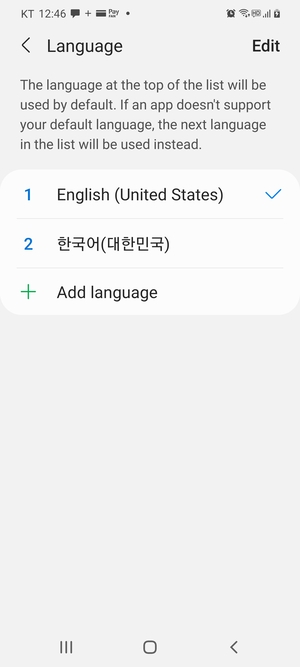
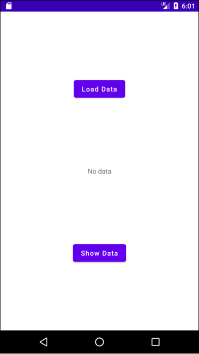
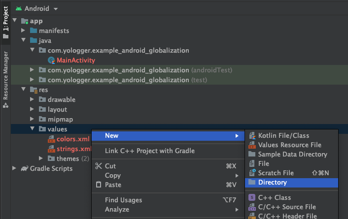
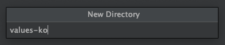
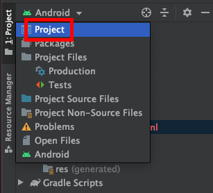
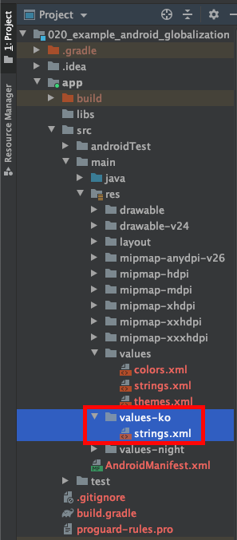
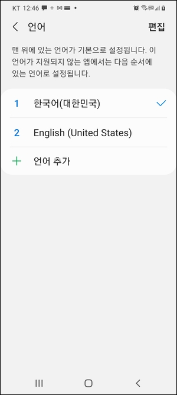
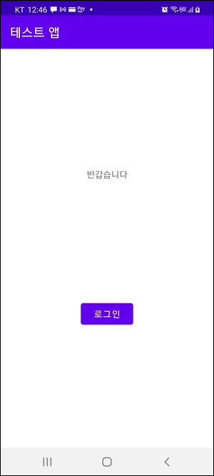

# 다국어 지원
안드로이드 어플리케이션을 사용하다보면 시스템 언어 설정에 따라 어플리케이션의 언어가 바뀌는 것을 볼 수 있습니다. 이를 `다국어 지원(Internationalization)`이라고 합니다. 

우선 시스템 언어를 영어로 설정합니다. 시스템 언어는 `설정 > 일반 > 언어`에서 설정할 수 있습니다.



이제 다음과 같이 레이아웃을 구성합니다.



레이아웃에 대한 xml은 다음과 같습니다.

``` xml 
// activity_main.xml
<?xml version="1.0" encoding="utf-8"?>
<androidx.constraintlayout.widget.ConstraintLayout xmlns:android="http://schemas.android.com/apk/res/android"
    xmlns:app="http://schemas.android.com/apk/res-auto"
    xmlns:tools="http://schemas.android.com/tools"
    android:layout_width="match_parent"
    android:layout_height="match_parent"
    tools:context=".MainActivity">

    <TextView
        android:id="@+id/textview_welcome_message"
        android:layout_width="wrap_content"
        android:layout_height="wrap_content"
        android:text="@string/textview_welcome_message"
        app:layout_constraintEnd_toEndOf="parent"
        app:layout_constraintStart_toStartOf="parent"
        app:layout_constraintTop_toTopOf="parent"
        app:layout_constraintBottom_toTopOf="@+id/btn_log_in"
        tools:layout_editor_absoluteY="124dp" />

    <Button
        android:id="@+id/button_login"
        android:layout_width="wrap_content"
        android:layout_height="wrap_content"
        android:text="@string/button_login"
        app:layout_constraintTop_toBottomOf="@+id/tv_welcome"
        app:layout_constraintBottom_toBottomOf="parent"
        app:layout_constraintEnd_toEndOf="parent"
        app:layout_constraintStart_toStartOf="parent" />

</androidx.constraintlayout.widget.ConstraintLayout>
```

기본 문자열 리소스는 다음과 같습니다.
``` xml 
// /res/values/strings.xml
<resources>
    <string name="app_name">Test App</string>
    <string name="textview_welcome">Welcome</string>
    <string name="button_login">Log in</string>
</resources>
```

이제 한국어를 지원하기 위해 한국어 문자열 리소스를 추가해야합니다. `/res/` 경로에서 `[New] > [Directory]`를 클릭하고 폴더 이름을 `values-ko`로 작성합니다.

::: tip
폴더 이름은 <b>values-[국가코드]</b>입니다. 국가코드는 ISO-639-1 문서를 따르며 [이 곳](https://www.loc.gov/standards/iso639-2/php/code_list.php)에서 확인할 수 있습니다.
:::





프로젝트 뷰를 `Android`에서 `Project`로 변경하면 `values-ko`폴더가 생성된 것을 확인할 수 있습니다.



이 곳에 한국어에 해당하는 xml 문자열 리소스 파일을 생성해줍니다.



한국어 문자열 리소스는 다음과 같습니다.
``` xml 
// /res/values-ko/strings.xml
<resources>
    <string name="app_name">테스트 앱</string>
    <string name="textview_welcome">반갑습니다</string>
    <string name="button_login">로그인</string>
</resources>
```

이제 시스템 언어를 한국어로 변경합니다. 



앱을 실행하면 다음과 같이 한국어 문자열 리소스가 적용됩니다.

