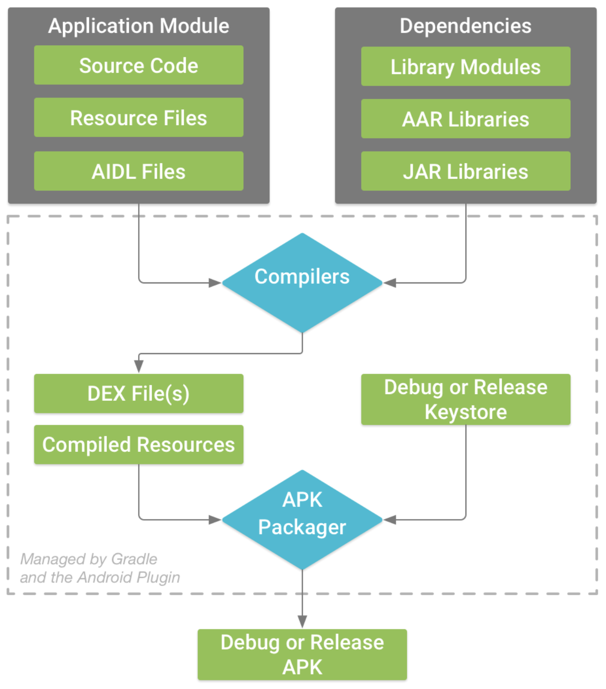

# Table of Contents

[[toc]]

## APK 파일
`APK(Android Application Package)`는 안드로이드 어플리캐이션 설치 파일이다. 안드로이드 시스템에서 APK 파일을 사용하여 어플리케이션을 설치할 수 있다. Windows 계열의 운영체제에서의 인스톨러와 유사하다.

### APK 생성 과정
APK 파일은 다음과 같은 과정을 거쳐 생성된다.
1. 안드로이드 프로젝트는 `소스코드 및 리소스로 구성된 모듈`과 `의존성`으로 구성된다.
2. Gradle은 이 모든 것을 빌드하여 `DEX 파일`과 `컴파일된 리소스`를 생성한다.
3. APK Manager는 개인키로 서명하여 `APK 파일`를 생성한다.
4. `APK 파일`은 구글 플레이스토어에 업로드하거나 안드로이드 시스템에 직접 설치할 수 있다.



### APK 생성 위치
디버그 모드에서 앱을 빌드하면 아래 경로에 APK 파일이 생성된다.
```
[your_project]\app\build\outputs\apk
```

### 앱에서 APK 추출하기
`APK Extractor` 앱을 사용하면 앱에서 APK 파일을 추출할 수 있다.

우선 구글 플레이스토어에서 APK Extractor를 설치한다.


검색창에 추출하려는 앱의 이름을 입력합니다.


앱을 클릭하면 해당 경로에 APK 파일이 추출됩니다.


### APK Analyzer
안드로이드 스튜디오의 `APK Analyzer`를 사용하면 APK 파일을 분석할 수 있다.

`Android Studio > Build > Analyze APK`를 선택한다.


APK 파일을 선택하면 분석 정보를 확인할 수 있다.


### APK 파일 디컴파일하기
`역공학(Reverse Engineering)`은 <u>완성된 결과물을 반대로 분해하고 조각내어 설계와 원리를 분석하는 것</u>을 의미한다. 비유하자면 완성된 비행기를 분해하며 어떻게 조립되었고 동작하는지를 분석하는 것이다.

소프트웨어 공학에서 역공학의 핵심 기술은 디컴파일이다. `디컴파일(Decompile)`은 <u>실행 가능한 소프트웨어를 사람이 읽을 수 있는 소스코드로 변환하는 것</u>이다. 안드로이드에서는 APK 파일을 사용하여 소스코드 파일로 복원하는 작업을 의미한다. 컴파일이나 빌드의 반대 작업이라고 생각하면 된다.

`jadx`를 사용하면 APK 파일을 디컴파일 할 수 있다. 우선 Mac OS 환경에 `jadx`를 설치해보자. 적절한 위치에 `jadx`디렉토리를 생성하고 해당 디렉토리로 이동한다.
``` console
$ mkdir jadx
$ cd jadx
```

이제 GitHub에서 `jadx`를 다운로드합니다.

``` console
$ git clone https://github.com/skylot/jadx.git .
```

그리고 `jadx`를 컴파일한다.
``` console
$ ./gradlew dist
```

`jadx` 실행파일은 `jadx/build/bin/jadx-gui`이다. 우선 `jadx`를 실행해보자.
``` console
$ cd build/jadx/bin

$ ./jadx-gui
```

그리고 디컴파일할 APK 파일을 선택하자.


이제 디컴파일된 소스 코드를 확인할 수 있다.


## JVM, Dalvik, ART
`JVM`, `Dalvik`, `ART`은 다음과 같은 차이점이 있다.

### JVM
`JVM(Java Virtual Machine)`은 Java 바이트코드를 실행하는 가상머신이다. 


`Java Compiler`는 Java 소스코드를 컴파일하여 Java 바이트코드를 생성한다. JVM은 이 <u>Java 바이트코드를 실행하는 주체</u>다. 플랫폼에 적절한 JVM만 설치되면 어떤 플랫폼에서든 Java 바이트코드를 실행할 수 있다.

### DVM
`DEX 컴파일러`는 Java 바이트코드를 `DEX(Dalvik Executable)`파일로 통합한다.


`DVM(Dalvik Virtual Machine)`은 안드로이드 애플리캐이션을 실행하는 주체다. 정확하게 말하자면 DVM는 이 DEX 파일을 실행한다.

구글은 자바 가상머신인 JVM을 사용할 수도 있었지만 오라클과의 라이센스 문제 때문에 DVM을 개발하여 안드로이드에 넣게 된다.

뿐만 아니라 모바일 기기는 베터리 수명, 컴퓨팅 능력, 메모리 등의 자원이 데스크탑 환경에 비해 열악하다. 이 때문에 모바일 기기에 맞게 나온 가상머신이 바로 DVM이다.

DVM은 내부적으로 `JIT(Just In Time) 컴파일러`를 사용한다. 이 컴파일러는 애플리캐이션을 <u>실행</u>할 때마다 자바 바이트코드를 기계어로 컴파일한다. 이 덕분에 설치 파일은 작아졌으나 CPU, 메모리, 베터리 사용이 높아지게 되었다.

### ART
`ART(Android Runtime)`은 안드로이드에서 사용되던 기존 DVM의 한계점을 해결하기 위해서 구글에서 새로 개발한 런타임이다.

ART는 내부적으로 `AOT(Ahead On Time) 컴파일러`를 사용한다. 이 컴파일러는 애플리캐이션을 <u>설치</u>할 때 자바 바이트코드를 기계어로 컴파일한다. 따라서 설치 파일이 커지고 설치 시간이 오래 걸린다는 단점이 있으나 런타임에서 CPU, 메모리, 베터리 사용량이 낮아지고 퍼포먼스가 좋아지게 되었다.

## DEX 파일
`APK`이 설치 파일이라면 `DEX(Dalvik Executable)`은 실행 파일이다. Java 클래스 파일(.class)이 JVM에서 실행되는 것처럼 DEX 파일은 DVM(Dalvik Virtual Machine)에서 실행된다.

## ProGuard
`프로가드(ProGuard)`를 적용하면 어플리캐이션에 <u>코드 난독화</u>와 <u>최적화</u>를 적용할 수 있다. 프로가드를 이해하기 위해 알아야 할 개념은 다음과 같다.

### 역공학과 디컴파일
`역공학(Reverse Engineering)`은 <u>완성된 결과물을 반대로 분해하고 조각내어 설계와 원리를 분석하는 것</u>이다. 비유하자면 완성된 비행기를 분해하며 어떻게 조립되었고 동작하는지를 분석하는 것이다.

소프트웨어 공학에서 역공학의 핵심 기술은 디컴파일이다. `디컴파일(Decompile)`은 <u>실행 가능한 소프트웨어를 사람이 읽을 수 있는 소스코드로 변환하는 것</u>이다. 안드로이드에서는 APK 파일을 사용하여 소스코드 파일로 복원하는 작업을 의미하며, 컴파일이나 빌드의 반대 작업이라고 이해하면 된다.


### 난독화
APK 파일을 추출하는 앱을 사용하면 구글 플레이스토어에서 다운받은 앱의 APK 파일을 추출할 수 있다. 여기에 디컴파일까지 적용하면 앱의 소스코드를 볼 수 있게 된다.

`코드 난독화(Code Obfuscation)`은 악의적으로 앱의 소스코드에 접근하는 공격자로부터 코드를 보호하는 기술이다. <u>소스코드를 읽기 어렵게 만들어 가독성을 떨어지게 할 수 있다</u>.

### 코드 축소와 리소스 축소
코드에서 사용하지 않는 클래스, 속성, 메소드를 탐지하여 안전하게 삭제하는 것을 `코드 축소(Code shrinking)`라고 한다. 또한 앱에서 사용하지 않는 리소스를 안전하게 삭제하는 것을 `리소스 축소(Resource shrinking)`라고 한다.

### 프로가드 사용법
`프로가드(ProGuard)`를 사용하면 빌드 타입별로 난독화, 코드 축소, 리소스 축소를 적용할 수 있다.

모듈 수준의 `build.gradle`에 두 개의 빌드 타입 `debug`, `release`를 추가한다.
``` groovy 
// 모듈 수준의 build.gradle
android {
    buildTypes {
        debug {

        }
        release {

        }
    }
}
```

이제 `release`빌드 타입에 프로가드를 적용해보자. `minifyEnabled`값을 `true`로 설정하면 난독화, 코드 축소, 최적화를 진행한다.
``` groovy
// 모듈 수준의 build.gradle
android {
    buildTypes {
        debug {

        }
        release {
            minifyEnabled true
        }
    }
}
```

`shrinkResources`값을 `true`로 설정하면 리소스 축소가 적용된다.
``` groovy
// 모듈 수준의 build.gradle
android {
    buildTypes {
        debug {

        }
        release {
            shrinkResources true
            minifyEnabled true
        }
    }
}
```

`proguardFiles` 속성을 사용하여 난독화에 사용할 파일을 여러 개 지정할 수 있다. 아래 코드는 두 개의 파일을 지정하고있다.
``` groovy
// 모듈 수준의 build.gradle
android {
    buildTypes {
        debug {

        }
        release {
            proguardFiles getDefaultProguardFile('proguard-android-optimize.txt'), 'proguard-rules.pro'
        }
    }
}
```
위 코드는 아래 코드와 동일하다.
``` groovy
// 모듈 수준의 build.gradle
android {
    buildTypes {
        debug {

        }
        release {
            // proguardFiles getDefaultProguardFile('proguard-android-optimize.txt'), 'proguard-rules.pro'
            proguardFile getDefaultProguardFile('proguard-android-optimize.txt')
            proguardFile 'proguard-rules.pro'
        }
    }
}
```

`proguard-android-optimize.txt`은 안드로이드 그래들 플러그인이 자동으로 생성한다.

``` groovy
// 프로젝트 수준의 build.gradle
buildscript {

    dependencies {
        // 안드로이드 그래이들 플러그인
        classpath "com.android.tools.build:gradle:4.1.2"
        // ...
    }
}
``` 
이 파일에는 사전에 정해진 합리적인 규칙이 정의되어있다. 따라서 개발자는 이 파일을 수정할 필요가 없다.

`proguard-rules.pro`는 안드로이드 프로젝트나 모듈을 생성하면 모듈의 루트 디렉토리에 자동으로 생성된다.


개발자는 이 파일을 수정하여 프로가드 규칙을 적용할 수 있다.

### 프로가드 설정파일
`proguard-rules.pro`를 프로가드 설정파일이라고 한다. 이 파일에서는 특정 클래스나 멤버변수를 난독화에서 제외한다든지, 최적화를 진행하지 않는다든지, 코드 축소를 하지 않는다든지 등의 <u><b>규칙</b></u>을 설정을 할 수 있다. 

자주 사용하는 프로가드 <u><b>규칙</b></u>은 다음과 같습니다.
- `keepclass [패키지명]`: 특정 패키지 난독화에서 제외
- `keepclassmembers`: 클래스 멤버의 원 상태 유지
- `keepattributes`: 소스코드, 라인정보 유지
- `dontoptimize`: 최적화 하지 않기
- `dontshrink`: 사용하지 않는 메소드 코드 축소 하지 않기
- `ignorewarning`: 경고 무시
- `dontwarn [패키지명]`: 특정 패키지에 대한 경고 무시

프로가드의 모든 규칙은 [이 곳](https://www.guardsquare.com/manual/configuration/usage)에서 확인할 수 있다.

### 외부 라이브러리에 프로가드 적용하기
안드로이드 개발을 하다보면 다양한 <u>외부 라이브러리</u>를 사용하게된다. 프로가드와 외부 라이브러리를 함께 사용하는 경우, 외부 라이브러리에 대한 프로가드 설정이 필요한지를 라이브러리 공식 홈페이지에서 꼭 확인해야한다.

#### Retrofit

`Retrofit`은 HTTP 통신 라이브러리다. `Retrofit`을 사용하기 위해 프로가드에 추가 설정이 필요하다. [Retrofit 공식 홈페이지](https://square.github.io/retrofit/)에서 [프로가드 설정 파일](https://github.com/square/retrofit/blob/master/retrofit/src/main/resources/META-INF/proguard/retrofit2.pro)을 제공하고 있다. 해당 파일을 `proguard-rules.pro`에 복사해준다.

```
# Retrofit does reflection on generic parameters. InnerClasses is required to use Signature and
# EnclosingMethod is required to use InnerClasses.
-keepattributes Signature, InnerClasses, EnclosingMethod

# Retrofit does reflection on method and parameter annotations.
-keepattributes RuntimeVisibleAnnotations, RuntimeVisibleParameterAnnotations

# Keep annotation default values (e.g., retrofit2.http.Field.encoded).
-keepattributes AnnotationDefault

# Retain service method parameters when optimizing.
-keepclassmembers,allowshrinking,allowobfuscation interface * {
    @retrofit2.http.* <methods>;
}

# Ignore annotation used for build tooling.
-dontwarn org.codehaus.mojo.animal_sniffer.IgnoreJRERequirement

# Ignore JSR 305 annotations for embedding nullability information.
-dontwarn javax.annotation.**

# Guarded by a NoClassDefFoundError try/catch and only used when on the classpath.
-dontwarn kotlin.Unit

# Top-level functions that can only be used by Kotlin.
-dontwarn retrofit2.KotlinExtensions
-dontwarn retrofit2.KotlinExtensions$*

# With R8 full mode, it sees no subtypes of Retrofit interfaces since they are created with a Proxy
# and replaces all potential values with null. Explicitly keeping the interfaces prevents this.
-if interface * { @retrofit2.http.* <methods>; }
-keep,allowobfuscation interface <1>

# Keep generic signature of Call (R8 full mode strips signatures from non-kept items).
-keep,allowobfuscation,allowshrinking interface retrofit2.Call
```

#### OkHttp
[OkHttp의 GitHub 저장소](https://github.com/square/okhttp/blob/master/okhttp/src/main/resources/META-INF/proguard/okhttp3.pro)에서 확인할 수 있다.
```
# JSR 305 annotations are for embedding nullability information.
-dontwarn javax.annotation.**

# A resource is loaded with a relative path so the package of this class must be preserved.
-keepnames class okhttp3.internal.publicsuffix.PublicSuffixDatabase

# Animal Sniffer compileOnly dependency to ensure APIs are compatible with older versions of Java.
-dontwarn org.codehaus.mojo.animal_sniffer.*

# OkHttp platform used only on JVM and when Conscrypt dependency is available.
-dontwarn okhttp3.internal.platform.ConscryptPlatform
-dontwarn org.conscrypt.ConscryptHostnameVerifier
```

#### Glide
[Glide의 GitHub 저장소](https://github.com/bumptech/glide#proguard)에서 확인할 수 있다.
```
-keep public class * implements com.bumptech.glide.module.GlideModule
-keep class * extends com.bumptech.glide.module.AppGlideModule {
 <init>(...);
}
-keep public enum com.bumptech.glide.load.ImageHeaderParser$** {
  **[] $VALUES;
  public *;
}
-keep class com.bumptech.glide.load.data.ParcelFileDescriptorRewinder$InternalRewinder {
  *** rewind();
}

# for DexGuard only
-keepresourcexmlelements manifest/application/meta-data@value=GlideModule
```

#### Gson
[Gson의 GitHub 저장소](https://github.com/google/gson/blob/master/examples/android-proguard-example/proguard.cfg)에서 확인할 수 있다.
``` 
##---------------Begin: proguard configuration for Gson  ----------
# Gson uses generic type information stored in a class file when working with fields. Proguard
# removes such information by default, so configure it to keep all of it.
-keepattributes Signature

# For using GSON @Expose annotation
-keepattributes *Annotation*

# Gson specific classes
-dontwarn sun.misc.**
#-keep class com.google.gson.stream.** { *; }

# Application classes that will be serialized/deserialized over Gson
-keep class com.google.gson.examples.android.model.** { <fields>; }

# Prevent proguard from stripping interface information from TypeAdapter, TypeAdapterFactory,
# JsonSerializer, JsonDeserializer instances (so they can be used in @JsonAdapter)
-keep class * extends com.google.gson.TypeAdapter
-keep class * implements com.google.gson.TypeAdapterFactory
-keep class * implements com.google.gson.JsonSerializer
-keep class * implements com.google.gson.JsonDeserializer

# Prevent R8 from leaving Data object members always null
-keepclassmembers,allowobfuscation class * {
  @com.google.gson.annotations.SerializedName <fields>;
}

##---------------End: proguard configuration for Gson  ----------
```

### 프로가드 설정파일 분리하기
외부 라이브러리에 따라 프로가드 설정파일을 분리하는 것이 권장된다. 모듈의 루트 디렉토리에 다음 다섯 개의 프로가드 설정파일을 생성하자.

- proguard-common.pro
- proguard-retrofit.pro
- proguard-okhttp.pro
- proguard-glide.pro
- proguard-gson.pro

모듈 수준의 `build.gradle`에 프로가드 설정파일을 추가하자.
```  groovy
// 모듈 수준의 build.gradle
android {
    buildTypes {
        debug {

        }
        release {
            proguardFile getDefaultProguardFile('proguard-android-optimize.txt')
            // 공통
            proguardFile 'proguard-common.pro'
            // Retrofit을 위한 프로가드 설정파일
            proguardFile 'proguard-retrofit.pro'
            // OkHttp를 위한 프로가드 설정파일
            proguardFile 'proguard-okhttp.pro'
            // Glide를 위한 프로가드 설정파일
            proguardFile 'proguard-glide.pro'
            // Gson 위한 프로가드 설정파일
            proguardFile 'proguard-gson.pro'
        }
    }
}
```

## DEX 컴파일러
`DEX 컴파일러`는 자바 바이트코드를 안드로이드 시스템에서 실행 가능한 DEX 파일로 변환한다. DEX 컴파일러는 오랜 시간에 걸쳐 발전해왔다.

### DX 컴파일러
D8 컴파일러가 출시되기 전까지 사용되었던 DEX 컴파일러다.

### D8 컴파일러
구글이 2018년 출시한 새로운 DEX 컴파일러다. `Android Studio 3.0 버전`부터 사용할 수 있으며, `Android Studio 3.1 버전`부터 기본 DEX 컴파일러가 되었다. DEX 컴파일러는 `Android Gradle Plugin`에 포함되어있다.

### R8 컴파일러
구글이 2019년 출시한 새로운 DEX 컴파일러다. `Android Stuido 3.4 버전`부터 사용할 수 있다. R8 컴파일러는 프로가드(ProGurad)가 기존에 수행하던 <u>코드 난독화</u> 및 <u>최적화 작업</u>을 대신 수행한다. 따라서 `Android Gradle Plugin 3.4.0` 버전부터는 ProGuard 대신 R8 컴파일러를 사용하여 코드 난독화와 최적화 작업을 수행할 수 있다.

R8 컴파일러 이전에는 DEX 파일을 생성하는 과정이 두 단계로 나누어 있었다.
1. 프로가드(ProGurad)가 수행하는 난독화와 최적화 작업
2. D8 컴파일러가 수행하는 DEX 컴파일 


R8 컴파일러는 이 두 과정을 한 단계로 통합했습니다.


프로가드와 D8 컴파일러 대신 R8 컴파일러를 사용하는 것은 매우 간단합니다. `gradle.properties`파일에 다음 한 줄을 추가하면 된다.
``` 
android.enableR8=true
```
이 코드를 추가하면 `Android Gradle Plugin 3.4.0` 버전부터는 ProGuard 대신 R8 컴파일러를 사용하여 코드 난독화와 최적화 작업을 수행한다.

## 멀티 덱스
안드로이드에서 Java 소스코드나 Kotlin 소스코드는 DEX 파일로 컴파일된다. 이 DEX 파일의 메소드가 `64K(65,536)`개를 초과하면 안드로이드 시스템은 다음과 같은 빌드 오류를 발생시킨다.

```
trouble writing output:
Too many field references: 131000; max is 65536.
You may try using --multi-dex option.
``` 

`멀티 덱스(Multidex)`는 <u>메소드가 64K(65,536)개를 초과하지 않도록 DEX 파일을 여러 개로 나누는 기술</u>이다.

### 사용 방법
우선 모듈 수준의 `build.gradle`에 다음 코드를 추가한다.
``` groovy 
// build.gradle
android {
    defaultConfig{
        // 멀티덱스 기능 true
        multiDexEnabled true
    }
}
  
dependencies {
    // 의존성 추가
    implementation 'com.android.support:multidex:1.0.3'
}
``` 

`AndroidManifest.xml`에서 `<application>`태그의 `android:name`속성을 다음과 같이 설정한다.

``` xml 
// AndroidManifest.xml
<?xml version="1.0" encoding="utf-8"?>
<manifest 
    xmlns:android="http://schemas.android.com/apk/res/android"
    package="com.example.project">

    <application
        android:name="androidx.multidex.MultiDexApplication"
        ...>
        
    </application>
</manifest>
```

만약 `Application`클래스를 사용 중이라면 다음과 같이 수정한다.
``` xml 
// AndroidManifest.xml
class App: MultiDexApplication() {
    // ...
}
```

`AndroidManifest.xml`에서 `<application>`태그의 `android:name`속성을 다음과 같이 설정한다.

``` xml 
// AndroidManifest.xml
<?xml version="1.0" encoding="utf-8"?>
<manifest 
    xmlns:android="http://schemas.android.com/apk/res/android"
    package="com.example.project">

    <application
        android:name=".App"
        ...>
        
    </application>
</manifest>
```