# Table Of Contents

[[toc]]

## 권한
안드로이드 앱에서 사용자의 자원에 접근하려면 핸드폰 소유자에게 `권한(Permission)`을 부여받아야 합니다. 권한에는 크게 두 종류가 있습니다.

### 일반 권한
`일반 권한`은 `AndroidManifest.xml`에 추가하기만 하면 됩니다. 사용자의 개인 정보에 접근하지 않는 권한이며, 대표적인 일반 권한은 아래와 같습니다.
``` xml AndroidManifest.xml
<!-- 인터넷 사용 권한 -->
<uses-permission android:name="android.permission.INTERNET"/>

<!-- 네트워크 연결상태 확인 권한 -->
<uses-permission android:name="android.permission.ACCESS_NETWORK_STATE"/>

<!-- 와이파이 상태 확인 권한-->
<uses-permission android:name="android.permission.ACCESS_WIFI_STATE"/>

<!-- 블루투스 상태 확인 권한 -->
<uses-permission android:name="android.permission.BLUETOOTH"/>

<!-- 근거리 통신 사용 권한 -->
<uses-permission android:name="android.permission.NFC"/>

<!-- 알람 설정 권한 -->
<uses-permission android:name="android.permission.SET_ALARM"/>

<!-- 진동 설정 권한 -->
<uses-permission android:name="android.permission.VIBRATE"/>
```

다음은 버튼을 눌렀을 때 Retrofit2를 사용하여 서버에 http 요청을 하는 코드입니다.
``` kotlin PostService.kt
interface PostService {
    @GET("/post/posts")
    fun getPosts(@Query("page") page: Int,@Query("size") size: Int): Call<ResponseBody>
}
```

``` kotlin MainActivity.kt
class MainActivity: AppCompatActivity() {
    
    val button: Button by lazy { findViewById<Button>(R.id.activity_main_button) }

    val page = 10
    var size = 10

    override fun onCreate(savedInstanceState: Bundle?) {
        super.onCreate(savedInstanceState)
        setContentView(R.layout.activity_main)

        button.setOnClickListener {

            val okHttpClient = OkHttpClient.Builder()
            .addInterceptor(authInterceptor)
            .build()

            val retrofit = Retrofit.Builder()
            .baseUrl(BASE_URL)
            .client(okHttpClient)
            .build()

            val postService = retrofit.create(PostService::class.java)

            postService.getPosts(page, size).enqueue(object:  Callback<ResponseBody> {

                override fun onResponse(call: Call<ResponseBody>, response: Response<ResponseBody>) {
                    // 성공했을 때    
                }
                override fun onFailure(call: Call<ResponseBody>, t: Throwable) {
                    // 실패했을 때
                }
            })
        }
    }
}
```

만약 인터넷 사용 권한을 추가하지 않으면 다음과 같은 오류가 발생합니다.
``` console
java.lang.SecurityException: Permission denied (missing INTERNET permission?)
```
따라서 `AndroidManifest.xml`에 다음과 같이 권한을 명시해야합니다.
``` xml AndroidManifest.xml
<?xml version="1.0" encoding="utf-8"?>
<manifest xmlns:android="http://schemas.android.com/apk/res/android"
    package="com.yologger.example_android_permission">

    <!-- 인터넷 사용 권한 추가 -->
    <uses-permission android:name="android.permission.INTERNET" />

    <application>
        <!-- ... -->
    </application>

</manifest>
```

### 위험 권한
`위험 권한(Dangerous Permission)`은 `AndroidManifest.xml`에 권한을 추가해야할 뿐만 아니라, 런타임에 권한 확인 및 권한 요청 코드를 반드시 작성해야합니다. 이 때문에 위험 권한은 `런타임 권한`이라고도 불립니다. 보통 앱을 처음 실행하거나 권한을 필요로 하는 기능을 사용할 때 권한을 확인합니다.


대표적인 위험 권한은 아래와 같습니다.
``` xml AndroidManifest.xml
<!-- 달력 -->
<uses-permission android:name="android.permission.READ_CALENDAR"/>
<uses-permission android:name="android.permission.WRITE_CALENDAR"/>

<!-- 카메라 -->
<uses-permission android:name="android.permission.CAMERA"/>

<!-- 전화번호부 -->
<uses-permission android:name="android.permission.READ_CONTACTS"/>
<uses-permission android:name="android.permission.WRITE_CONTACTS"/>
<uses-permission android:name="android.permission.GET_ACCOUNTS"/>

<!-- 위치 -->
<uses-permission android:name="android.permission.ACCESS_FINE_LOCATION"/>
<uses-permission android:name="android.permission.ACCESS_COARSE_LOCATION_LOCATION"/>

<!-- 마이크 -->
<uses-permission android:name="android.permission.RECORD_AUDIO"/>

<!-- 전화 -->
<uses-permission android:name="android.permission.READ_PHONE_STATE"/>
<uses-permission android:name="android.permission.MODIFY_PHONE_NUMBER"/>
<uses-permission android:name="android.permission.CALL_PHONE"/>
<uses-permission android:name="android.permission.ANSWER_PHONE_CALLS"/>
<uses-permission android:name="android.permission.READ_CALL_LOG"/>
<uses-permission android:name="android.permission.WRITE_CALL_LOG"/>
<uses-permission android:name="android.permission.ADD_VOICEMAIL"/>
<uses-permission android:name="android.permission.USE_SIP"/>

<!-- 센서 -->
<uses-permission android:name="android.permission.BODY_SENSORS"/>

<!-- 문자 메시지 -->
<uses-permission android:name="android.permission.SEND_SMS"/>
<uses-permission android:name="android.permission.RECEIVE_SMS"/>
<uses-permission android:name="android.permission.READ_SMS"/>
<uses-permission android:name="android.permission.RECEIVE_WAP_PUSH"/>
<uses-permission android:name="android.permission.RECEIVE_MMS"/>

<!-- 스토리지 -->
<uses-permission android:name="android.permission.READ_EXTERNAL_STORAGE"/>
<uses-permission android:name="android.permission.WRITE_EXTERNAL_STORAGE"/>
```

우선 예제를 살펴봅시다. 예제는 버튼을 누르면 카메라를 실행합니다.

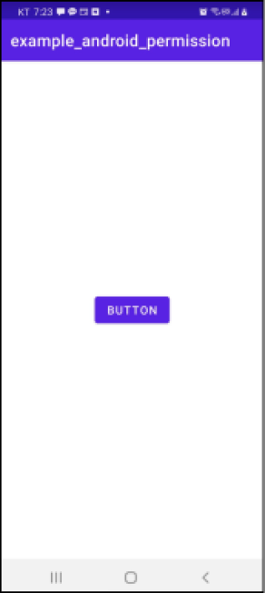

우선 `AndroidManifest.xml`에 카메라 권한을 추가합니다.

``` xml AndroidManifest.xml
<?xml version="1.0" encoding="utf-8"?>
<manifest xmlns:android="http://schemas.android.com/apk/res/android"
    package="com.yologger.example_android_permission">

    <!-- 카메라 접근 권한 명시 -->
    <uses-permission android:name="android.permission.CAMERA"/>

    <application>
        <!-- ... -->
    </application>

</manifest>
```

버튼을 눌렀을 때, 카메라를 실행하는 `openCamera()`메소드를 호출합니다.

``` kotlin MainActivity.kt
class MainActivity : AppCompatActivity() {

    private val buttonOpenCamera: Button by lazy {
        findViewById<Button>(R.id.button_open_camera)
    }

    override fun onCreate(savedInstanceState: Bundle?) {
        super.onCreate(savedInstanceState)
        setContentView(R.layout.activity_main)

        buttonOpenCamera.setOnClickListener {
            openCamera()
        }
    }

    // 카메라 열기
    private fun openCamera() {
        var intent = Intent(MediaStore.ACTION_IMAGE_CAPTURE)
        startActivity(intent)
    }
}
```

위 예제를 실행하면 아래와 같이 카메라 접근 권한이 없다는 에러를 발생시킵니다.

``` console
java.lang.SecurityException: Permission Denial: starting Intent from ProcessRecord with revoked permission android.permission.CAMERA
```

따라서 우리는 권한이 있는지 확인하고, 권한이 없으면 권한을 요청하며, 사용자가 권한을 허용하거나 거절했을 때 어떻게 할지 코드로 작성해야합니다.

``` kotlin MainActivity.kt
class MainActivity : AppCompatActivity() {

    private val REQUEST_CODE_CAMERA_PERMISSION = 1000

    private val buttonOpenCamera: Button by lazy {
        findViewById<Button>(R.id.button_open_camera)
    }

    override fun onCreate(savedInstanceState: Bundle?) {
        super.onCreate(savedInstanceState)
        setContentView(R.layout.activity_main)

        buttonOpenCamera.setOnClickListener {
            // openCamera()
            checkPermissionAndOpenCamera()
        }
    }

    private fun checkPermissionAndOpenCamera() {
        // 권한 확인하기
        when(ContextCompat.checkSelfPermission(this, Manifest.permission.CAMERA)) {
            // 권한이 있을 때
            PackageManager.PERMISSION_GRANTED -> {
                // 카메라 열기
                openCamera()
            }
            // 권한이 없을 때
            PackageManager.PERMISSION_DENIED -> {
                // 권한 요청하기
                ActivityCompat.requestPermissions(this, arrayOf(Manifest.permission.CAMERA), REQUEST_CODE_CAMERA_PERMISSION)
            }
        }
    }

    private fun openCamera() {
        var intent = Intent(MediaStore.ACTION_IMAGE_CAPTURE)
        startActivity(intent)
    }
}
```

권한이 있는지 확인할 때는 `ContextCompat.checkSelfPermission()`메소드를 사용합니다. 권한이 없을 때 `ActivityCompat.requestPermissions()`메소드를 호출하면 다음과 같이 권한 요청 대화상자가 출력됩니다.

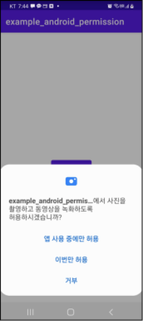

세 가지 선택지 중에 어떤 것을 선택해도 `onRequestPermissionsResult()`메소드가 자동으로 호출됩니다. 이 안에서 `앱 사용 중에만 허용`, `이번만 허용`, `거부`에 따라 다르게 처리해주면 됩니다.

``` kotlin MainActivity.kt
class MainActivity : AppCompatActivity() {

    private val REQUEST_CODE_CAMERA_PERMISSION = 1000

    // ...

    override fun onRequestPermissionsResult(requestCode: Int, permissions: Array<out String>, grantResults: IntArray) {
        super.onRequestPermissionsResult(requestCode, permissions, grantResults)
        when(requestCode) {
            REQUEST_CODE_CAMERA_PERMISSION -> {
                // 권한을 승인했을 경우
                if(grantResults[0] == PackageManager.PERMISSION_GRANTED) {
                    // 카메라 열기
                    openCamera()
                // 권한을 승인하지 않았을 경우
                } else {
                    // 앱 종료
                    finish()
                }
            }
            else -> {
                // ...
            }
        }
    }
}
```

## 여러 권한 동시에 요청하기
우선 `AndroidManifest.xml`에 `카메라 접근 권한`과 `달력 읽기 권한`을 명시합니다. 
``` xml 
// AndroidManifest.xml
<?xml version="1.0" encoding="utf-8"?>
<manifest xmlns:android="http://schemas.android.com/apk/res/android"
    package="com.yologger.multi_permissions">

    <uses-permission android:name="android.permission.CAMERA" />
    <uses-permission android:name="android.permission.READ_CALENDAR" />

    <!-- ... -->

</manifest>
```

이제 `MainActivity`가 실행되면 권한을 확인하겠습니다. 다음과 같이 반복문을 활용하여 권한 여러 개를 확인할 수 있습니다.

``` kotlin MainActivity.kt
class MainActivity : AppCompatActivity() {

    val REQUEST_CODE_PERMISSIONS = 1

    val button: Button by lazy { findViewById<Button>(R.id.activity_main_button) }

    override fun onCreate(savedInstanceState: Bundle?) {
        super.onCreate(savedInstanceState)
        setContentView(R.layout.activity_main)
        checkPermissions()
    }

    private fun checkPermissions() {
        // 필요한 권한
        val requiredPermissions = arrayOf<String>(
            Manifest.permission.CAMERA,
            Manifest.permission.READ_CALENDAR
        )

        // 거절된 권한
        val rejectedPermissions = arrayListOf<String>()

        // 반복문 안에서 권한 확인
        for (permission in requiredPermissions) {
            if (ContextCompat.checkSelfPermission(this, permission) != PackageManager.PERMISSION_GRANTED) {
                // 거절된 권한은 ArrayList에 추가
                rejectedPermissions.add(permission)
            }
        }

        if (rejectedPermissions.isNotEmpty()) {
            val array = arrayOfNulls<String>(rejectedPermissions.size)
            // 거절된 권한은 권한 요청
            ActivityCompat.requestPermissions(this, rejectedPermissions.toArray(array), REQUEST_CODE_PERMISSIONS)
        }
    }
}
```

이제 `onRequestPermissionsResult()`메소드를 정의합시다.

``` kotlin MainActivity.kt
class MainActivity : AppCompatActivity() {

    val REQUEST_CODE_PERMISSIONS = 1

    // ...

    override fun onRequestPermissionsResult(requestCode: Int, permissions: Array<out String>, grantResults: IntArray) {
        super.onRequestPermissionsResult(requestCode, permissions, grantResults)
        when (requestCode) {
            REQUEST_CODE_PERMISSIONS -> {
                if(grantResults.isNotEmpty()) {
                    for ((i, permission) in permissions.withIndex()) {
                        if (grantResults[i] == PackageManager.PERMISSION_GRANTED) {
                            // Do something when allowed.
                        } else {
                            // Do something when denied.
                        }
                    }
                }
            }
            else -> {
                // ...
            }
        }
    }
}
```

## 설정 앱
`설정(Settings) 앱`에서는 안드로이드와 관련된 환경 설정을 할 수 있습니다.

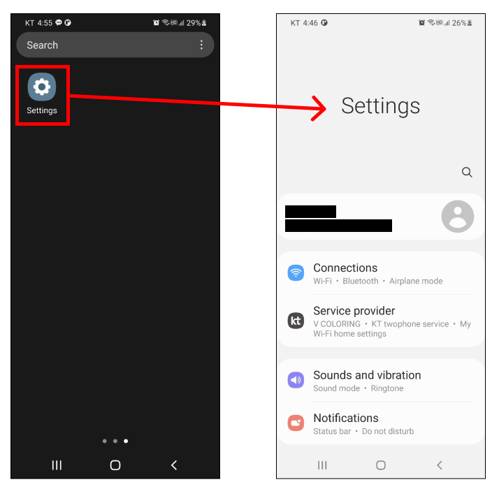

`설정 > 어플리케이션`에서는 설치된 어플리케이션을 확인할 수 있습니다.

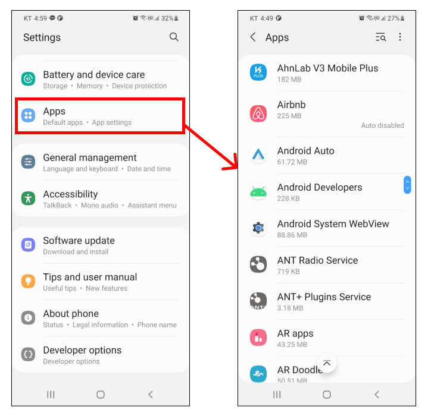

특정 앱을 선택하고 권한을 클릭하면 앱이 필요로 하는 권한을 확인할 수 있습니다.

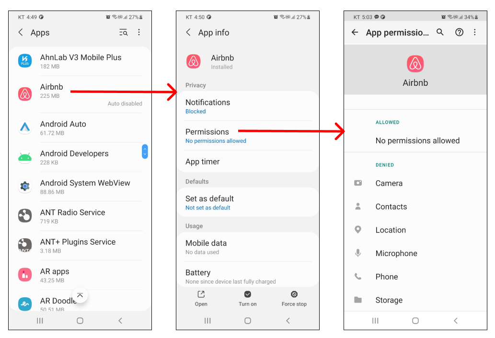

`ALLOWED` 항목에는 허용된 권한이 포함됩니다.

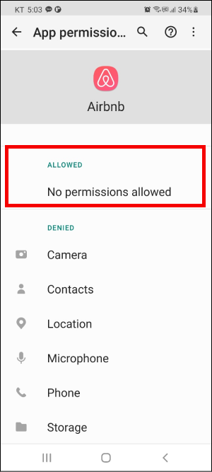

`DENIED` 항목에는 거부된 권한이 포함됩니다.

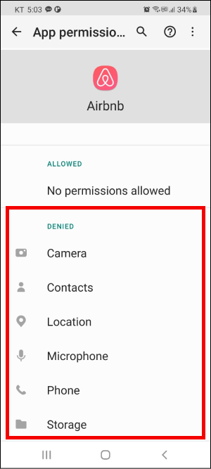

`DENIED` 항목에 포함된 권한을 선택하면 권한을 부여할 수 있습니다.

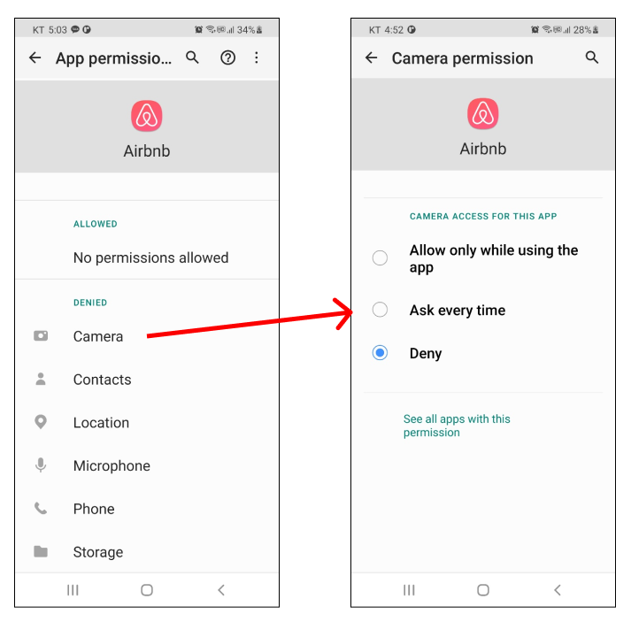

## 액티비티에서 설정 앱 시작하기
`인텐트(Intent)`를 사용하면 액티비티에서 설정 앱을 바로 시작할 수 있습니다. 버튼을 누르면 설정 앱을 바로 시작해보겠습니다.
``` kotlin MainActivity.kt
class MainActivity : AppCompatActivity() {

    private val buttonOpenSettings: Button by lazy { findViewById<Button>(R.id.activity_main_btn_open_settings) }
    private val REQUEST_CODE = 0

    override fun onCreate(savedInstanceState: Bundle?) {
        super.onCreate(savedInstanceState)
        setContentView(R.layout.activity_main)

        buttonOpenSettings.setOnClickListener {
            val intent = Intent(android.provider.Settings.ACTION_SETTINGS)
            startActivityForResult(intent, REQUEST_CODE)
        }
    }
}
```

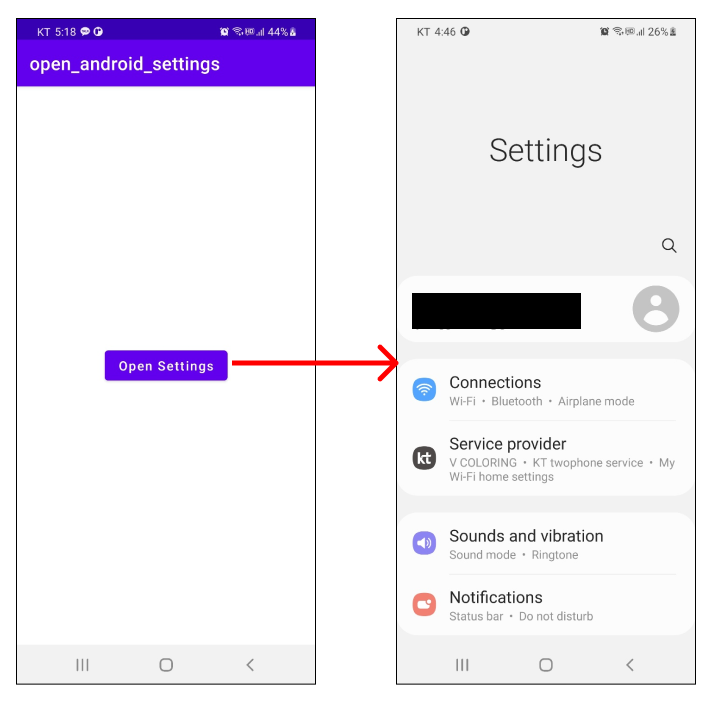

`설정 > 위치`로 이동할 수도 있습니다. 

``` kotlin
val intent = Intent(android.provider.Settings.ACTION_LOCATION_SOURCE_SETTINGS)
startActivityForResult(intent, REQUEST_CODE)
```


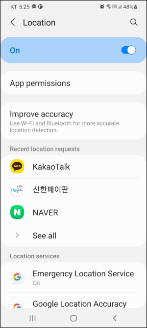

`설정 > 앱`으로 이동할 수도 있습니다. 

``` kotlin
val intent = Intent(android.provider.Settings.ACTION_APPLICATION_SETTINGS)
startActivityForResult(intent, REQUEST_CODE)
```

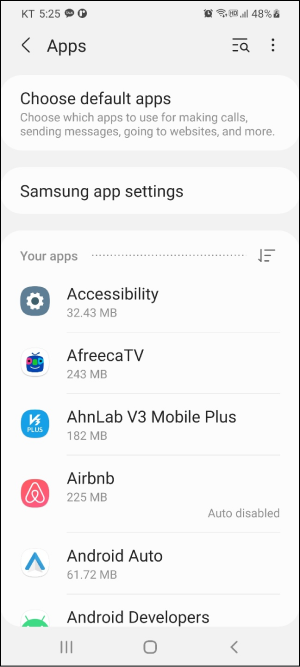

`설정 > 앱 > 특정 앱`으로 이동할 수도 있습니다. 이 때는 인텐트에 패키지 이름을 추가해야합니다.
``` kotlin
val intent = Intent(android.provider.Settings.ACTION_APPLICATION_DETAILS_SETTINGS)
intent.data = Uri.parse("package:${packageName}")
startActivityForResult(intent, REQUEST_CODE)
```
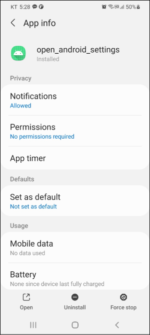

## TedPermission 라이브러리
[`TedPermission`](https://github.com/ParkSangGwon/TedPermission)는 대한민국의 개발자 박상권님께서 개발하신 권한 설정 라이브러리입니다. 이 라이브러리를 사용하면 권한 설정을 좀 더 쉽게 구현할 수 있습니다.

### 설치
모듈 수준의 `build.gradle`에 의존성을 추가합니다.
``` groovy 모듈 수준의 build.gradle
dependencies {
    // ...
    implementation 'gun0912.ted:tedpermission:2.2.0'
}
```

### 사용 방법
예제에서 카메라 권한을 확인하고, 권한이 없으면 권한을 요청하고, 권한을 얻었을 때 카메라 앱을 구동하겠습니다.

이제 동일한 내용을 `TedPermission 라이브러리`를 사용해서 구현해보겠습니다.
``` kotlin MainActivity.kt
class MainActivity : AppCompatActivity() {

    private val buttonOpenCamera: Button by lazy {
        findViewById<Button>(R.id.button_open_camera)
    }

    override fun onCreate(savedInstanceState: Bundle?) {
        super.onCreate(savedInstanceState)
        setContentView(R.layout.activity_main)

        buttonOpenCamera.setOnClickListener {
            TedPermission.with(this)
                // 요청할 권한 나열하기
                .setPermissions(Manifest.permission.CAMERA)
                // 권한 요청 결과에 대한 리스너 등록
                .setPermissionListener(object: PermissionListener {
                    // 권한을 승인했을 경우
                    override fun onPermissionGranted() {
                        // 카메라 열기
                        openCamera()
                    }

                    // 권한을 승인하지 않았을 경우
                    override fun 역(deniedPermissions: ArrayList<String>?) {
                        // 앱 종료
                        finish()
                    }
                })
                // 권한을 거부할 경우 나타나는 Alert dialog의 메시지
                .setDeniedMessage("If you reject permission, you can not use this service. \n\nPlease turn on permissions at [Setting] > [Permission]")
                // 권한 요청하기
                .check()
        }
    }

    private fun openCamera() {
        var intent = Intent(MediaStore.ACTION_IMAGE_CAPTURE)
        startActivity(intent)
    }
}
```

이제 앱을 실행하고 버튼을 누르면 다음과 같이 권한 설정 대화상자가 나옵니다. 

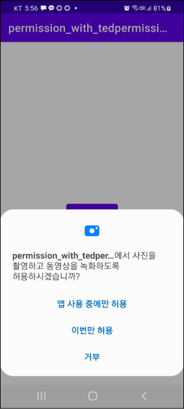

`앱 사용 중에만 허용`을 누르면 `onPermissionGranted()`메소드가 호출되며, 앱을 종료하고 다시 시작해도 권한 설정 대화상자가 나오지 않습니다. `이번만 허용`을 눌러도 `onPermissionGranted()` 메소드가 호출됩니다. 차이점은 앱 종료 후 다시 시작할 때마다 권한 설정 대화상자가 다시 나오느냐 입니다.

만약 `거부`를 누르면 `setDeniedMessage()`메소드에서 설정한 메시지와 함께 설정 또는 닫기를 선택할 수 있는 대화상자가 나옵니다. 

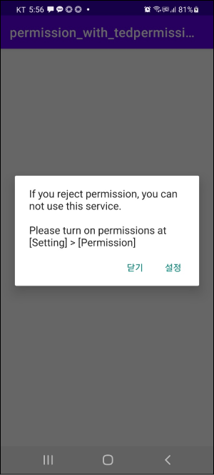

여기서도 `닫기`를 누르면 `onPermissionDenied()`가 호출됩니다. 만약 설정을 누르면 다음과 같이 앱 설정 화면으로 이동합니다.

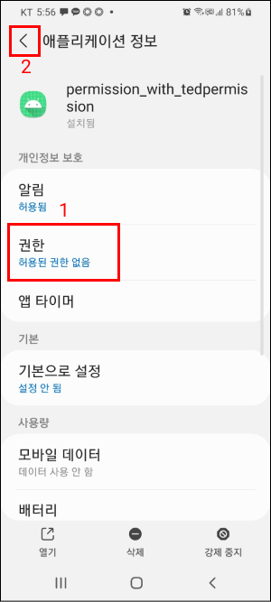

여기서 권한을 모두 부여하고 뒤로가기를 누르면 `onPermissionGranted()`이 호출됩니다. 그러나 하나라도 권한을 부여하지 않으면 `onPermissionDenied()`이 호출됩니다.

### 다중 권한 요청
여러 권한이 필요할 때 다음과 같이 동시에 요청할 수도 있습니다.
``` kotlin
TedPermission.with(this)
    // 권한 여러개 설정
    .setPermissions(Manifest.permission.CAMERA, Manifest.permission.READ_CALENDAR)
    .setPermissionListener(object: PermissionListener {
        override fun onPermissionGranted() {
            // ...
        }
        override fun 역(deniedPermissions: ArrayList<String>?) {
            // ...
        }
    })
    .setDeniedMessage("If you reject permission, you can not use this service. \n\nPlease turn on permissions at [Setting] > [Permission]")
    .check()
```