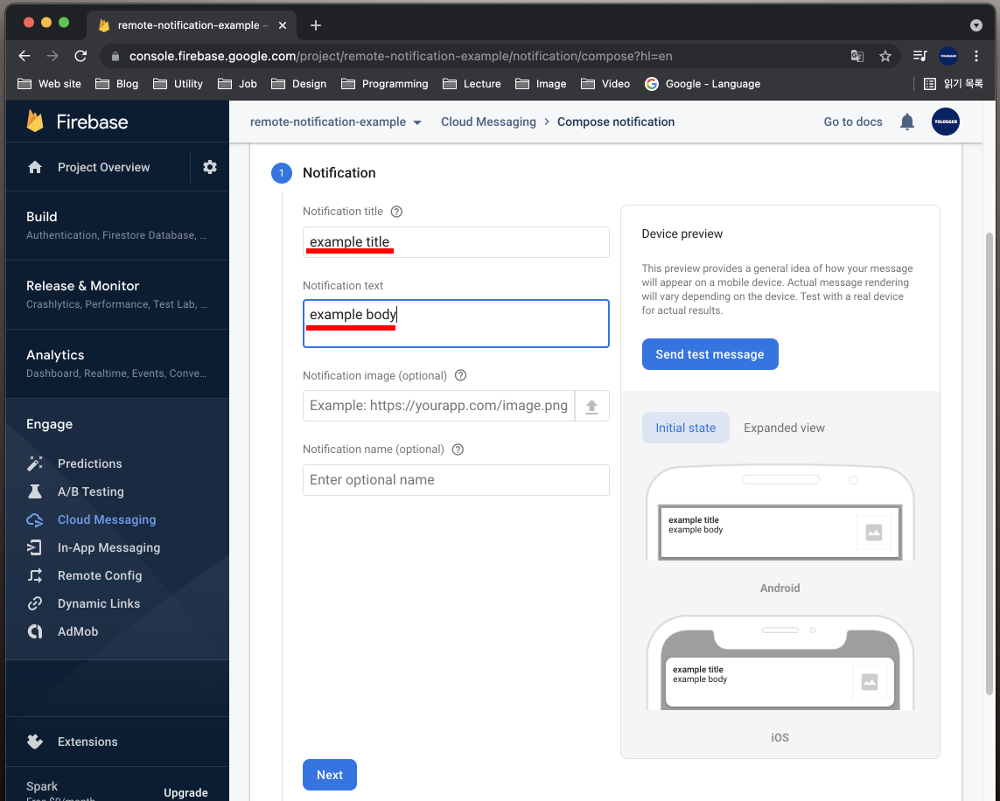

# Table Of Contents

[[toc]]


## 알림
`알림(Notification)`은 앱이 실행되고 있지 않거나 백그라운드 상태일 때 메시지를 전달하는 방법을 제공합니다. 문자 앱이나 Gmail 앱이 대표적인 알림입니다.

알림이 생성되면 화면 위쪽 `상태 바`에 아이콘으로 나타납니다.


상태 바를 끌어내리면 `알림 패널`에서 알림의 자세한 내용을 확인할 수 있습니다.


## 알림의 종류
알림에는 두 종류가 있습니다.
1. 로컬 알림(Local Notification)
2. 원격 알림(Remote Notification)

### 로컬 알림
`로컬 알림(Local Notification)`은 기기에서 실행 중인 앱에서 생성됩니다. 버튼을 누르면 로컬 알림을 전송하는 예제를 만들어봅시다.

`NotificationCompat.Builder`객체를 사용하면 알림을 생성할 수 있습니다. 우선 `NotificationBuilder`객체를 생성합니다.
``` kotlin
val notificationBuilder = NotificationCompat.Builder(this)
        .setSmallIcon(android.R.drawable.ic_dialog_info)
        .setContentTitle("A Notification")
        .setContentText("This is a notification")
``` 
`setSmallIcon()`메소드를 사용하면 알림의 아이콘을 설정할 수 있습니다. `setContentTitle()`메소드를 사용하면 알림의 제목을 설정할 수 있으며, `setContentText()`메소드를 사용하면 알림의 본문을 설정할 수 있습니다.

이제 `NotificationBuilder`객체의 `build()`메소드를 사용하여 알림을 생성합시다.
``` kotlin
val notification = notificationBuilder.build()
``` 
알림을 보내기 위해서는 `NotificationManager`객체가 필요합니다. 시스템 서비스에서 다음과 같이 `NotificationManager`객체를 가져옵니다.
``` kotlin
val notificationManager = getSystemService(Context.NOTIFICATION_SERVICE) as NotificationManager
``` 
마지막으로 `NotificationManager`객체의 `notify()`메소드를 사용하여 알람을 전송합니다. 이때 메소드의 첫 번째 인자로 `알림의 ID`를 나타내는 임의의 정수값을 전달합니다. `알람 ID`는 안드로이드 시스템이 알림을 구분하는데 사용합니다.
``` kotlin
notificationManager.notify(NOTIFICATION_ID, notification)
```
완성된 코드는 다음과 같습니다. 버튼을 누르면 알림을 전송합니다.
``` kotlin
class MainActivity : AppCompatActivity() {

    lateinit var button: Button

    val NOTIFICATION_ID = 1

    override fun onCreate(savedInstanceState: Bundle?) {
        super.onCreate(savedInstanceState)
        setContentView(R.layout.activity_main)

        button = findViewById<Button>(R.id.activity_main_btn)

        button.setOnClickListener {
            val notificationBuilder = NotificationCompat.Builder(this)
                    .setSmallIcon(android.R.drawable.ic_dialog_info)
                    .setContentTitle("A Notification")
                    .setContentText("This is a notification")

            val notification = notificationBuilder.build()         

            val notificationManager = getSystemService(Context.NOTIFICATION_SERVICE) as NotificationManager

            notificationManager.notify(NOTIFICATION_ID, notification)
        }
    }
}
```

이제 앱을 실행하고 버튼을 눌러봅니다.


상단 상태 바에 알림 아이콘이 생성됩니다.


상태 바를 아래로 쓸어내리면 알림을 확인할 수 있습니다.


### Oreo 버전에서의 알림
`안드로이드 API 26 (Oreo)`부터는 알림을 사용하는 방식이 변경되었습니다. 따라서 버전에 따른 분기처리를 해야합니다.
``` kotlin
if (Build.VERSION.SDK_INT >= Build.VERSION_CODES.O) {
    // 오레오 버전 이상
    // ...
} else {
    // 오레오 이전 버전
    // 위 코드와 동일
    val notificationBuilder = NotificationCompat.Builder(this)
            .setSmallIcon(android.R.drawable.ic_dialog_info)
            .setContentTitle("A Notification")
            .setContentText("This is a notification")

    val notification = notificationBuilder.build()         

    val notificationManager = getSystemService(Context.NOTIFICATION_SERVICE) as NotificationManager

    notificationManager.notify(NOTIFICATION_ID, notification)
}
```
`Oreo` 이후 버전부터는 알림을 사용할 때 `Notification Channel`을 지정해야합니다.

### Notification Channel
`Oreo` 이하 버전에서는 모든 알림이 하나의 `Notification Channel`로 관리됐습니다. 이 때문에 스마트폰에 알림이 쌓이길 원하지 않아 알림을 끄면, 모든 알림을 받을 수 없었습니다.

`Oreo` 버전부터는 알림을 여러 채널 별로 분리하여 사용자가 `확인하고 싶은 알림`과 `보고싶지 않은 알림`을 직접 설정할 수 있습니다. 각 채널별 수신 여부 외에도 잠금화면 표시 여부, 소리 설정, 진동 설정 등 여러 옵션을 세밀하게 설정할 수 있습니다.

우선 다음과 같이 `NotificationChannel` 객체를 생성합니다.
``` kotlin
val channelId = "channel_id"
val channelName = "channel_name"
val channelDescription = "channel_description"
val importance = NotificationManager.IMPORTANCE_HIGH

val notificationChannel = NotificationChannel(channelId, channelName, importance)
notificationChannel.description = channelDescription
```
`NotificationChannel`객체를 생성할 때 사용하는 `id`, `name`, `importance`, `description`은 다음과 같습니다.
- id: 각 채널을 구분할 수 있는 고유한 값
- name: 사용자에게 표시되는 채널의 이름
- description: 채널에 대한 설명, 특정 채널 설정 창에서 표시됩니다.
- importance: 알림에 대한 중요도, 이 값에 따라 알림이 다르게 똥작합니다. importance 값에 따른 동작은 [이 곳](https://developer.android.com/training/notify-user/channels#importance)에서 확인할 수 있습니다.

`Notification Manager`에 채널을 등록합니다.
``` kotlin
val notificationManager = getSystemService(Context.NOTIFICATION_SERVICE) as NotificationManager
notificationManager.createNotificationChannel(notificationChannel)
```
`NotificationBuilder`를 생성합니다. 이 때 `Builer()`의 두 번째 인자로 채널의 `id`를 전달합니다.
``` kotlin
val notificationBuilder = NotificationCompat.Builder(this, channelId)
    .setSmallIcon(android.R.drawable.ic_dialog_info)
    .setContentTitle("A Notification")
    .setContentText("This is a notification")
```
`Notification`을 생성합니다.
``` kotlin
val notification = notificationBuilder.build()
```
`NotificationManager`의 `notify()`메소드를 호출하여 알림을 전송합니다.
``` kotlin
notificationManager.notify(NOTIFICATION_ID, notification)
```
전체 코드는 다음과 같습니다.
``` kotlin
class MainActivity : AppCompatActivity() {

    lateinit var button: Button

    val NOTIFICATION_ID = 1

    override fun onCreate(savedInstanceState: Bundle?) {
        super.onCreate(savedInstanceState)
        setContentView(R.layout.activity_main)

        button = findViewById<Button>(R.id.activity_main_btn)
        button.setOnClickListener {

            if (Build.VERSION.SDK_INT >= Build.VERSION_CODES.O) {

                val channelId = "channel_id"
                val channelName = "channel_name"
                val channelDescription = "channel_description"
                val importance = NotificationManager.IMPORTANCE_HIGH

                val notificationChannel = NotificationChannel(channelId, channelName, importance)
                notificationChannel.description = channelDescription

                val notificationManager = getSystemService(Context.NOTIFICATION_SERVICE) as NotificationManager
                notificationManager.createNotificationChannel(notificationChannel)

                val notificationBuilder = NotificationCompat.Builder(this, channelId)
                        .setSmallIcon(android.R.drawable.ic_dialog_info)
                        .setContentTitle("A Notification")
                        .setContentText("This is a notification")

                val notification = notificationBuilder.build()

                notificationManager.notify(NOTIFICATION_ID, notification)

            } else {
                // 오레오 이전 버전
            }
        }
    }
}
```

이제 앱을 실행하고 버튼을 클릭합시다.


다음과 같이 화면에 알림 상자가 나오며, 상태바에 알림 아이콘이 생성됩니다.


상태 바를 아래로 쓸어내리면 자세한 내용을 확인할 수 있습니다.


## 알림에서 액티비티 시작시키기

현재는 알림 패널에서 알림을 클릭해도 아무 일이 일어나지 않습니다. 


알림을 클릭했을 때 특정 액티비티가 실행되도록 할 수 있습니다.


우선 실행할 액티비티를 포함하는 명시적 인텐트를 생성합니다.
``` kotlin
val resultIntent = Intent(this@MainActivity, ResultActivity::class.java)
```
그리고 이 인텐트를 `PendingIntent`에 포함시킵니다.
``` kotlin
val REQUEST_CODE = 1

val pendingIntent = PendingIntent.getActivity(this@MainActivity, REQUEST_CODE, resultIntent, PendingIntent.FLAG_UPDATE_CURRENT)
```
마지막으로 `NotificationBuilder`클래스의 `setContentIntent()`메소드를 호출하면서 인자로 pendingIntent를 전달합니다.
``` kotlin
notificationBuilder.setContentIntent(pendingIntent)
```
전체 코드는 다음과 같습니다.
``` kotlin
class MainActivity : AppCompatActivity() {

    lateinit var button: Button

    val REQUEST_CODE = 1
    val NOTIFICATION_ID = 1

    override fun onCreate(savedInstanceState: Bundle?) {
        super.onCreate(savedInstanceState)
        setContentView(R.layout.activity_main)

        button = findViewById<Button>(R.id.activity_main_btn)
        button.setOnClickListener {

            if (Build.VERSION.SDK_INT >= Build.VERSION_CODES.O) {

                val channelId = "channel_id"
                val channelName = "channel_name"
                val channelDescription = "channel_description"
                val importance = NotificationManager.IMPORTANCE_HIGH

                val notificationChannel = NotificationChannel(channelId, channelName, importance)
                notificationChannel.description = channelDescription

                val notificationManager = getSystemService(Context.NOTIFICATION_SERVICE) as NotificationManager
                notificationManager.createNotificationChannel(notificationChannel)

                val notificationBuilder = NotificationCompat.Builder(this, channelId)
                        .setSmallIcon(android.R.drawable.ic_dialog_info)
                        .setContentTitle("A Notification")
                        .setContentText("This is a notification")

                val resultIntent = Intent(this@MainActivity, ResultActivity::class.java)
                val pendingIntent = PendingIntent.getActivity(this@MainActivity, REQUEST_CODE, resultIntent, PendingIntent.FLAG_UPDATE_CURRENT)
                notificationBuilder.setContentIntent(pendingIntent)

                val notification = notificationBuilder.build()

                notificationManager.notify(NOTIFICATION_ID, notification)

            } else {
                // ...
            }
        }
    }
}
```
이제 알림 패널에서 알림을 클릭하면 `ResultActivity`가 실행됩니다.

## 알림에 액션 버튼 추가하기
알림에는 버튼이 포함될 수 있습니다. 이를 `액션 버튼`이라고 합니다.


액션은 다음과 같이 생성할 수 있습니다.
``` kotlin
val action = NotificationCompat.Action.Builder(
    android.R.drawable.sym_action_chat,
    "OPEN",
    pendingIntent
).build()
```
생성된 액션은 `NotificationBuilder`객체의 `addAction()`메소드를 사용하여 추가합니다.
``` kotlin
notificationBuilder.addAction(action)
```
전체 코드는 다음과 같습니다.
``` kotlin
class MainActivity : AppCompatActivity() {

    lateinit var button: Button

    val REQUEST_CODE = 1
    val NOTIFICATION_ID = 1

    override fun onCreate(savedInstanceState: Bundle?) {
        super.onCreate(savedInstanceState)
        setContentView(R.layout.activity_main)

        button = findViewById<Button>(R.id.activity_main_btn)
        button.setOnClickListener {

            if (Build.VERSION.SDK_INT >= Build.VERSION_CODES.O) {

                val channelId = "channel_id"
                val channelName = "channel_name"
                val channelDescription = "channel_description"
                val importance = NotificationManager.IMPORTANCE_HIGH

                val notificationChannel = NotificationChannel(channelId, channelName, importance)
                notificationChannel.description = channelDescription

                val notificationManager = getSystemService(Context.NOTIFICATION_SERVICE) as NotificationManager
                notificationManager.createNotificationChannel(notificationChannel)

                val notificationBuilder = NotificationCompat.Builder(this, channelId)
                    .setSmallIcon(android.R.drawable.ic_dialog_info)
                    .setContentTitle("A Notification")
                    .setContentText("This is a notification")

                val resultIntent = Intent(this@MainActivity, ResultActivity::class.java)
                val pendingIntent = PendingIntent.getActivity(this@MainActivity, REQUEST_CODE, resultIntent, PendingIntent.FLAG_UPDATE_CURRENT)
                notificationBuilder.setContentIntent(pendingIntent)

                val action = NotificationCompat.Action.Builder(
                    android.R.drawable.sym_action_chat,
                    "OPEN",
                    pendingIntent
                ).build()

                notificationBuilder.addAction(action)

                val notification = notificationBuilder.build()

                notificationManager.notify(NOTIFICATION_ID, notification)

            } else {
                // ... 
            }
        }
    }
}
```
이제 알림 패널에서 액션 버튼을 클릭하면 `ResultActivity`가 실행됩니다.


## 알림 메시지 묶기
같은 앱에서 여러 알림을 보낼 때 다음과 같이 묶을 수 있습니다. 예제를 살펴보겠습니다. 버튼을 눌렀을 때 다음과 같이 세 개의 알림을 보내봅시다.
``` kotlin
button.setOnClickListener { 

    val NOTIFICATION_1_ID = 1
    val NOTIFICATION_2_ID = 2
    val NOTIFICATION_3_ID = 3

    val notification1 = NotificationCompat.Builder(this, channelId)
        .setSmallIcon(android.R.drawable.ic_dialog_info)
        .setContentTitle("A Notification 1")
        .setContentText("This is a notification 1")
        .build()

    val notification2 = NotificationCompat.Builder(this, channelId)
        .setSmallIcon(android.R.drawable.ic_dialog_info)
        .setContentTitle("A Notification 2")
        .setContentText("This is a notification 2")
        .build()

    val notification3 = NotificationCompat.Builder(this, channelId)
        .setSmallIcon(android.R.drawable.ic_dialog_info)
        .setContentTitle("A Notification 3")
        .setContentText("This is a notification 3")
        .build()

    notificationManager.notify(NOTIFICATION_1_ID, notification1)
    notificationManager.notify(NOTIFICATION_2_ID, notification2)
    notificationManager.notify(NOTIFICATION_3_ID, notification3)
}
```

이제 버튼을 누르면 상단 상태바에 세 개의 알림을 확인할 수 있습니다.


알람 패널에도 세 개의 알림이 있습니다.


`NotificationCompat.Builder`클래스의 `setGroup()`과 `setGroupSummary()`를 사용하면 연관된 알람들을 한 개의 알람으로 묶을 수 있습니다. 코드를 다음과 같이 수정해봅시다.

``` kotlin
button.setOnClickListener { 

    val NOTIFICATION_GROUP_ID = 0
    val NOTIFICATION_1_ID = 1
    val NOTIFICATION_2_ID = 2
    val NOTIFICATION_3_ID = 3

    val NOTIFICATION_GROUP_KEY = "notification_group_key"

    val notification1 = NotificationCompat.Builder(this, channelId)
        .setSmallIcon(android.R.drawable.ic_dialog_info)
        .setContentTitle("A Notification 1")
        .setContentText("This is a notification 1")
        .setGroup(NOTIFICATION_GROUP_KEY)
        .build()

    val notification2 = NotificationCompat.Builder(this, channelId)
        .setSmallIcon(android.R.drawable.ic_dialog_info)
        .setContentTitle("A Notification 2")
        .setContentText("This is a notification 2")
        .setGroup(NOTIFICATION_GROUP_KEY)
        .build()

    val notification3 = NotificationCompat.Builder(this, channelId)
        .setSmallIcon(android.R.drawable.ic_dialog_info)
        .setContentTitle("A Notification 3")
        .setContentText("This is a notification 3")
        .setGroup(NOTIFICATION_GROUP_KEY)
        .build()

    val summaryNotification = NotificationCompat.Builder(this, channelId)
        .setSmallIcon(android.R.drawable.ic_dialog_info)
        .setContentTitle("Summary Notification")
        .setContentText("This is a summary notification")
        .setGroup(NOTIFICATION_GROUP_KEY)
        .setGroupSummary(true)
        .build()

    notificationManager.notify(NOTIFICATION_1_ID, notification1)
    notificationManager.notify(NOTIFICATION_2_ID, notification2)
    notificationManager.notify(NOTIFICATION_3_ID, notification3)
    notificationManager.notify(NOTIFICATION_GROUP_ID, summaryNotification)
}
```
이제 앱을 실행합니다. 버튼을 클릭하면 상단 상태바에 한 개의 알람만 확인할 수 있습니다.


알람 패널에는 연관된 세 개의 알람이 그룹으로 묶여있습니다.


그룹을 클릭하면 세 개의 알람을 모두 확인할 수 있습니다.


전체 코드는 다음과 같습니다.
``` kotlin
class MainActivity : AppCompatActivity() {

    lateinit var button: Button

    val NOTIFICATION_GROUP_ID = 0
    val NOTIFICATION_1_ID = 1
    val NOTIFICATION_2_ID = 2
    val NOTIFICATION_3_ID = 3

    val NOTIFICATION_GROUP_KEY = "notification_group_key"

    override fun onCreate(savedInstanceState: Bundle?) {
        super.onCreate(savedInstanceState)
        setContentView(R.layout.activity_main)

        button = findViewById<Button>(R.id.activity_main_btn)
        button.setOnClickListener {

            if (Build.VERSION.SDK_INT >= Build.VERSION_CODES.O) {

                val channelId = "channel_id"
                val channelName = "channel_name"
                val channelDescription = "channel_description"
                val importance = NotificationManager.IMPORTANCE_HIGH

                val notificationChannel = NotificationChannel(channelId, channelName, importance)
                notificationChannel.description = channelDescription

                val notificationManager = getSystemService(Context.NOTIFICATION_SERVICE) as NotificationManager
                notificationManager.createNotificationChannel(notificationChannel)

                val notification1 = NotificationCompat.Builder(this, channelId)
                        .setSmallIcon(android.R.drawable.ic_dialog_info)
                        .setContentTitle("A Notification 1")
                        .setContentText("This is a notification 1")
                        .setGroup(NOTIFICATION_GROUP_KEY)
                        .build()

                val notification2 = NotificationCompat.Builder(this, channelId)
                        .setSmallIcon(android.R.drawable.ic_dialog_info)
                        .setContentTitle("A Notification 2")
                        .setContentText("This is a notification 2")
                        .setGroup(NOTIFICATION_GROUP_KEY)
                        .build()

                val notification3 = NotificationCompat.Builder(this, channelId)
                        .setSmallIcon(android.R.drawable.ic_dialog_info)
                        .setContentTitle("A Notification 3")
                        .setContentText("This is a notification 3")
                        .setGroup(NOTIFICATION_GROUP_KEY)
                        .build()

                val summaryNotification = NotificationCompat.Builder(this, channelId)
                        .setSmallIcon(android.R.drawable.ic_dialog_info)
                        .setContentTitle("Summary Notification")
                        .setContentText("This is a summary notification")
                        .setGroup(NOTIFICATION_GROUP_KEY)
                        .setGroupSummary(true)
                        .build()

                notificationManager.notify(NOTIFICATION_1_ID, notification1)
                notificationManager.notify(NOTIFICATION_2_ID, notification2)
                notificationManager.notify(NOTIFICATION_3_ID, notification3)
                notificationManager.notify(NOTIFICATION_GROUP_ID, summaryNotification)

            } else {
                // ..
            }
        }
    }
}
```

## 원격 알림
`구글 파이어베이스`의 `클라우드 메시징(Cloud Messaging)`서비스를 사용하면 `원격 알림(Remote Notification)`을 구현할 수 있습니다.

### 파이어베이스 프로젝트 만들기
우선 [파이어베이스](https://firebase.google.com/?hl=ko)에 접속하여 로그인합니다. 계정이 없다면 회원가입을 먼저 합니다. 이후 오른쪽 상단의 `Go to console`을 클릭합니다.


`Add Project`를 클릭하여 `파이어베이스 프로젝트`를 생성합니다.


프로젝트 이름을 입력하고 계속을 누릅니다.


구글 에널리틱스를 사용할 것인지를 물어봅니다. 이때는 구글 에널리틱스 계정이 필요합니다. 일단 사용하지 않음을 선택하고 프로젝트를 생성합시다.


프로젝트가 정상적으로 생성되면 다음과 같은 화면이 나옵니다.


### 안드로이드 스튜디오 프로젝트와 파이어베이스 프로젝트 연동
이제 `안드로이드 스튜디오 프로젝트`에서 `Tool > Firebase`를 선택합니다.


오른쪽 패널의 `Assistant` 도구 창에서 `Cloud Messaging` 항목을 찾습니다. 그리고 `Set up Firebase Cloud Messaging`을 클릭합니다.


`Connect to Firebase`를 눌러 안드로이드 스튜디오 프로젝트와 파이어베이스 프로젝트를 연결합니다. 다음과 같은 화면이 나오면 정상적으로 연결된 것입니다.


두 프로젝트가 연결되면 자동으로 `google-services.json`파일이 생성됩니다. 이 파일은 Firebase에서 안드로이드 프로젝트를 고유하게 식별하는 정보가 담겨있습니다. 프로젝트 도구창을 `Android 뷰`에서 `Project 뷰`로 전환합니다.


프로젝트의 `app 모듈` 아래에서 `google-service.json`파일을 확인할 수 있습니다.


### 파이어베이스 라이브러리 추가
이제 `파이어베이스 라이브러리`를 안드로이드 스튜디오 프로젝트에 추가해야합니다. 다시 
오른쪽 패널의 `Assistant` 도구 창에서 `Cloud Messaging` 항목을 찾습니다. 그리고 `Set up Firebase Cloud Messaging`을 클릭합니다. 그리고 `Add FCM to your app`을 클릭합니다.


프로젝트에 추가되는 것들은 다음과 같습니다. 우선 프로젝트 수준의 `build.gradle`에 `구글 서비스 라이브러리`가 추가됩니다.
``` groovy
buildscript {
    dependencies {
        classpath 'com.google.gms:google-services:4.3.8'
        // ...
    }
}
```
모듈 수준의 `build.gradle`에는 `Firebase 메시징 라이브러리`와 `구글 서비스 라이브러리 플러그인`이 추가됩니다.
``` groovy
plugins {
    id 'com.google.gms.google-services'
    // ...
}

dependencies {
    implementation 'com.google.firebase:firebase-messaging:22.0.0'
    // ...
}
```

### 알림 보내기
앱을 실제 기기나 에뮬레이터에서 실행합니다. 그리고 `홈 버튼`을 눌러서 앱이 `백그라운드`에서 실행되도록 합니다. 앱이 실행 중이지 않거나 백그라운드에 있을 때만 원격 알림을 수신하기 때문입니다.

파이어베이스 콘솔에 접속하여 앞에서 생성한 프로젝트를 선택합니다.


왼쪽 사이드 바 메뉴에서 `Cloud Messaging`을 선택합니다.


`Send your first message`를 클릭합니다.


다음과 같이 `알림 제목`과 `알림 텍스트`를 입력합니다. `알림 이미지`와 `알림 이름`은 선택사항입니다. 오른 쪽에서 어떻게 알림이 나올 지 확인할 수 있습니다. 이후 `Next`버튼을 누릅니다.


이제 어떤 앱과 어떤 사용자에게 알림을 보낼 지 설정합니다. `User segment`로 설정하면 앱의 모든 사용자에게 알림이 전송됩니다. 또한 어떤 앱에 알림을 보낼지 앱도 선택하고 `Next` 버튼을 누릅니다.


알림을 언제 보낼지를 설정할 수 있습니다. `Now`로 설정하고 `Next`버튼을 누릅니다.


`Additional options`는 선택사항입니다. 일단 비워두고 `Review`버튼을 누릅니다.


이제 검토창에서 게시를 누르면 알림이 발송됩니다.


알림을 클릭하면 백그라운드 상태이던 앱이 포그라운드로 실행됩니다.

### 알림에 데이터 포함시키기
알림을 보낼 때 `키-값` 형태의 데이터를 추가할 수 있습니다. `Additional Option` 항목에서 데이터를 추가할 수 있습니다.


앱이 백그라운드에 진입하면 `onPause()`메소드가 호출됩니다. 알림을 클릭하여 앱이 포그라운드 상태로 변하면 `onRestart() > onStart() > onResume()`메소드가 순서대로 실행됩니다. 이 메소드 중 한 곳에서 데이터를 읽어올 수 있습니다. 데이터를 전달받아 토스트 메시지로 화면에 출력하겠습니다.
``` kotlin
class MainActivity : AppCompatActivity() {

    override fun onCreate(savedInstanceState: Bundle?) {
        super.onCreate(savedInstanceState)
        setContentView(R.layout.activity_main)
    }

    override fun onStart() {
        super.onStart()

        val extras = intent.extras

        extras?.run {
            val name = getString("name")
            val nation = getString("nation")
            if (name != null && nation != null) {
                Toast.makeText(this@MainActivity, "${name} comes from ${nation}. ", Toast.LENGTH_SHORT).show()
            }
        }
    }
}
```

이제 앱을 실행하고 백그라운드 모드로 변경한 후 알림을 전송합시다. 알림을 클릭하면 다음과 같이 토스트 메시지가 나옵니다.


### 포그라운드 상태에서 원격 알림 받기
현재 포그라운드로 실행되고 있는 앱은 Firebase 알림을 받지 못합니다. 포그라운드 상태에서 알림을 받으려면 `FirebaseMessagingService`클래스를 구현하고 `onMessageReceived()`메서드를 오버라이딩 해야합니다. `MyFBMessageService`라는 클래스를 다음과 같이 구현합니다.
``` kotlin
class MyFBMessageService : FirebaseMessagingService() {

    override fun onMessageReceived(remoteMessage: RemoteMessage) {
        super.onMessageReceived(remoteMessage)
        // Do somthing when you receive a message.
    }
}
```
`onMessageReceived()`메소드가 호출될 때는 `RemoteMessage`객체를 인자로 받습니다. 이 객체에는 알림의 `제목`과 `내용`같은 정보가 담겨있습니다. 제목과 내용을 로그에 출력해보겠습니다.
``` kotlin
class MyFBMessageService : FirebaseMessagingService() {

    override fun onMessageReceived(remoteMessage: RemoteMessage) {
        super.onMessageReceived(remoteMessage)

        // 제목
        val title = remoteMessage.notification?.title

        // 내용
        val body = remoteMessage.notification?.body

        Log.d("TEST", "title: ${title}")
        Log.d("TEST", "body: ${body}")
    }
}
```

마지막으로 `AndroidManifest.xml`에 `Firebase 메시징과 관련된 액션`을 수신할 수 있도록 `인텐트 필터`를 추가합니다.
``` xml AndroidManefest.xml
<?xml version="1.0" encoding="utf-8"?>
<manifest xmlns:android="http://schemas.android.com/apk/res/android"
    package="com.yologger.remote_notification">

    <application android:allowBackup="true"
        android:icon="@mipmap/ic_launcher"
        android:label="@string/app_name"
        android:roundIcon="@mipmap/ic_launcher_round"
        android:supportsRtl="true"
        android:theme="@style/Theme.Remote_notification">

        <service android:name=".MyFBMessageService"
            android:enabled="true"
            android:exported="true">
            <intent-filter>
                <action android:name="com.google.firebase.MESSAGING_EVENT"/>
            </intent-filter>
        </service>

        <!-- ... -->
    </application>

</manifest>
```

이제 앱을 실행시킵니다. 홈 버튼을 누르지 않고 앱을 포그라운드 상태로 유지합니다.


`Firebase 콘솔`에서 알림을 보냅시다. 



그러면 로그에 다음과 같은 내용이 출력됩니다.

