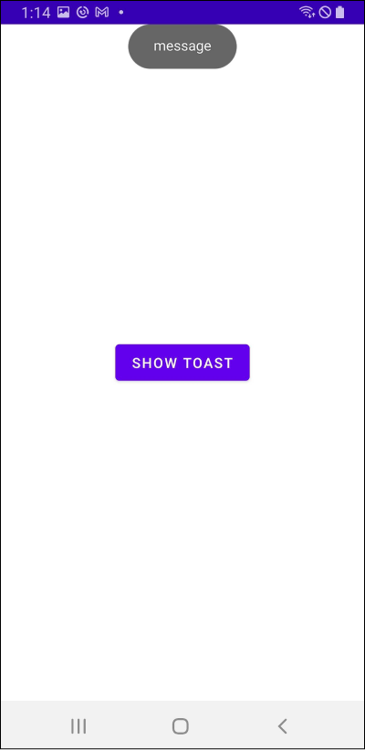

# Table of Contents

[[toc]]

## 토스트
`토스트(Toast)`는 사용자에게 메시지를 알려주기 위한 작은 박스입니다.


토스트는 액티비티에서 다음과 같이 사용합니다.
``` kotlin MainActivity.kt
class MainActivity : AppCompatActivity() {

    // 버튼을 눌렀을 때
    buttonShowToast.setOnClickListener {
        // 토스트 보여주기
        val toast = Toast.makeText(this@MainActivity, "message", Toast.LENGTH_SHORT)
        toast.show()
    }
}
```

`makeText()`의 세 번째 인자로 토스트 메시지의 지속 기간을 설정할 수 있으며, 값으로는 `Toast.LENGTH_SHORT`와 `Toast.LENGTH_LONG`이 올 수 있습니다.

프래그먼트에서는 다음과 같이 사용합니다.
``` kotlin MainFragment.kt
class MainFragment : Fragment() {

    // 버튼을 눌렀을 때
    buttonShowToast.setOnClickListener {
        // 토스트 보여주기
        val toast = Toast.makeText(requireActivity(), "message", Toast.LENGTH_SHORT)
        toast.show()
    }
}
```

## 위치 변경
`Toast`클래스의 `setGravity()`메소드를 사용하면 토스트의 위치를 변경할 수 있습니다. 

토스트 위치를 화면 <u>위쪽</u>에 위치시켜보겠습니다.
``` kotlin
val toast = Toast.makeText(this@MainActivity, "message", Toast.LENGTH_SHORT)
toast.setGravity(Gravity.TOP, 0, 0)
toast.show()
```



위쪽과 왼쪽에 위치시킬 수도 있습니다.
``` kotlin
val toast = Toast.makeText(this@MainActivity, "message", Toast.LENGTH_SHORT)
toast.setGravity(Gravity.TOP or Gravity.Left, 0, 0)
toast.show()
```


x축, y축으로 `offset`을 줄 수도 있습니다.
``` kotlin
val toast = Toast.makeText(this@MainActivity, "message", Toast.LENGTH_SHORT)
toast.setGravity(Gravity.TOP or Gravity.Left, 100, 500)
toast.show()
```


화면 중앙에 위치시킬 수도 있습니다.
``` kotlin
val toast = Toast.makeText(this@MainActivity, "message", Toast.LENGTH_SHORT)
toast.setGravity(Gravity.CENTER or Gravity.Left, 100, 500)
// toast.setGravity(Gravity.CENTER_HORIZONTAL or Gravity.CENTER_HORIZONTAL, 0, 0)
toast.show()
```

