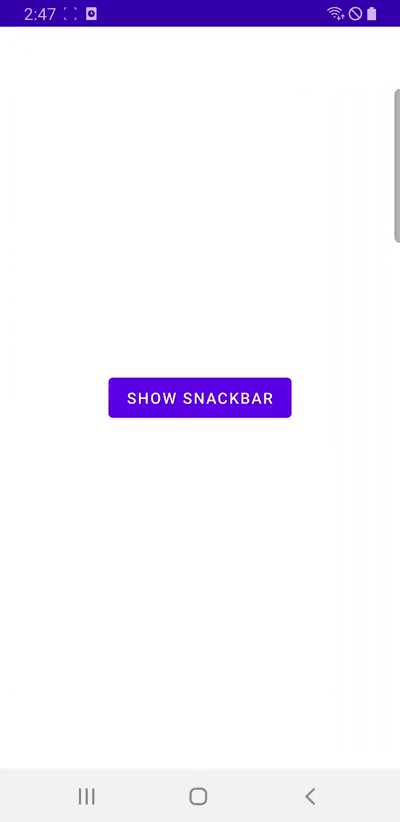
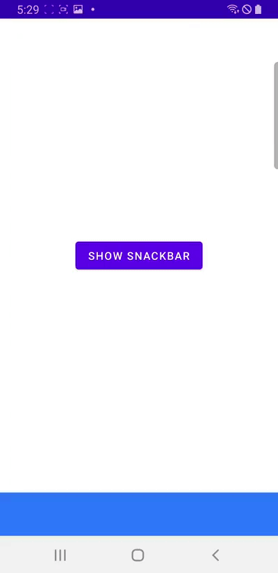

# Table of Contents

[[toc]]

## 스낵바
`스낵바(Snackbar)`는 사용자에게 메시지를 알려주기 위한 작은 박스입니다. 스낵바는 화면 하단에 표시됩니다.


예제를 살펴봅시다. 레이아웃은 다음과 같습니다.
``` xml
// activity_main.xml
<?xml version="1.0" encoding="utf-8"?>
<androidx.constraintlayout.widget.ConstraintLayout 
    xmlns:android="http://schemas.android.com/apk/res/android"
    xmlns:app="http://schemas.android.com/apk/res-auto"
    xmlns:tools="http://schemas.android.com/tools"
    android:id="@+id/activity_main_rootView"
    android:layout_width="match_parent"
    android:layout_height="match_parent"
    tools:context=".MainActivity">

    <Button
        android:id="@+id/activity_main_button"
        android:layout_width="wrap_content"
        android:layout_height="wrap_content"
        android:text="Show Snackbar"
        app:layout_constraintTop_toTopOf="parent"
        app:layout_constraintBottom_toBottomOf="parent"
        app:layout_constraintStart_toStartOf="parent"
        app:layout_constraintEnd_toEndOf="parent"/>
</androidx.constraintlayout.widget.ConstraintLayout>
```

스낵바는 액티비티에서 다음과 같이 사용합니다.
``` kotlin 
// MainActivity.kt 
class MainActivity : AppCompatActivity() {

    val rootView: ConstraintLayout by lazy { findViewById(R.id.activity_main_rootView) }
    val button: Button by lazy { findViewById(R.id.activity_main_button) }

    // 버튼 눌렀을 때
    button.setOnClickListener {
        // 스낵바 보여주기
        val snackbar = Snackbar.make(rootView, "This is snackbar", Snackbar.LENGTH_SHORT)
        snackbar.show()
    }
}
```

`Snackbar.make()`의 첫 번째 인자로 액티비티나 프래그먼트의 루트 뷰를 전달합니다. 세 번째 인자로는 스낵바의 지속 기간을 설정할 수 있으며, 값으로는 `Snackbar.LENGTH_SHORT`와 `Snackbar.LENGTH_LONG`이 올 수 있습니다.

## 액션
스낵바에는 `액션(Action)`을 추가할 수 있습니다.


``` kotlin 
// MainActivity.kt 
val snackbar = Snackbar.make(rootView, "This is snackbar", Snackbar.LENGTH_SHORT)
snackbar.setAction("OK") {
    // 액션을 눌렀을 때
}
snackbar.show()
```

## 스낵바 스와이프 하기
현재 스낵바를 `스와이프(Swipe)`하면 아무 일도 일어나지 않습니다.



`CoordinatorLayout`을 사용하면 스와이프하여 스낵바를 종료할 수 있습니다.


레이아웃을 `CoordinatorLayout`으로 감싸주면 됩니다.
``` xml activity_main.xml
<?xml version="1.0" encoding="utf-8"?>
<androidx.coordinatorlayout.widget.CoordinatorLayout
    xmlns:android="http://schemas.android.com/apk/res/android"
    xmlns:app="http://schemas.android.com/apk/res-auto"
    xmlns:tools="http://schemas.android.com/tools"
    android:id="@+id/activity_main_rootView"
    android:layout_width="match_parent"
    android:layout_height="match_parent"
    tools:context=".MainActivity">

    <androidx.constraintlayout.widget.ConstraintLayout
        android:layout_width="match_parent"
        android:layout_height="match_parent">

        <Button
            android:id="@+id/activity_main_button"
            android:layout_width="wrap_content"
            android:layout_height="wrap_content"
            android:text="Show Snackbar"
            app:layout_constraintBottom_toBottomOf="parent"
            app:layout_constraintEnd_toEndOf="parent"
            app:layout_constraintStart_toStartOf="parent"
            app:layout_constraintTop_toTopOf="parent" />

    </androidx.constraintlayout.widget.ConstraintLayout>

</androidx.coordinatorlayout.widget.CoordinatorLayout>
```

``` kotlin MainActivity.kt 
class MainActivity : AppCompatActivity() {

    // val rootView: ConstraintLayout by lazy { findViewById(R.id.activity_main_rootView) }
    val rootView: CoordinatorLayout by lazy { findViewById(R.id.activity_main_rootView) }

    button.setOnClickListener {
        val snackbar = Snackbar.make(rootView, "This is snackbar", Snackbar.LENGTH_SHORT)
        snackbar.show()
    }
}
```

## 스낵바와 FloatingActionButton
화면 우측 하단에 `FloatingActionButton`이 위치한다고 가정합시다.


코드는 다음과 같습니다.

``` xml activity_main.xml
<?xml version="1.0" encoding="utf-8"?>
<androidx.constraintlayout.widget.ConstraintLayout 
xmlns:android="http://schemas.android.com/apk/res/android"
    xmlns:app="http://schemas.android.com/apk/res-auto"
    xmlns:tools="http://schemas.android.com/tools"
    android:id="@+id/activity_main_rootView"
    android:layout_width="match_parent"
    android:layout_height="match_parent"
    tools:context=".MainActivity">

    <com.google.android.material.floatingactionbutton.FloatingActionButton
        android:id="@+id/activity_main_fab"
        android:layout_width="wrap_content"
        android:layout_height="wrap_content"
        android:clickable="true"
        app:srcCompat="@drawable/ic_baseline_add_24"
        android:layout_margin="16dp"
        app:layout_constraintBottom_toBottomOf="parent"
        app:layout_constraintEnd_toEndOf="parent"/>
</androidx.constraintlayout.widget.ConstraintLayout>
```
``` kotlin MainActivity.kt
class MainActivity : AppCompatActivity() {

    private val rootView: ConstraintLayout by lazy { findViewById(R.id.activity_main_rootView) }
    private val fab: FloatingActionButton by lazy { findViewById(R.id.activity_main_fab) }

    fab.setOnClickListener {
        val snackbar = Snackbar.make(rootView, "This is snackbar", Snackbar.LENGTH_SHORT)
        snackbar.show()
    }
}
```

버튼을 클릭하면 스낵바가 `FloatingActionButton`을 가리게 됩니다.


`CoordinatorLayout`을 사용하면 스낵바가 등장했을 때 `FloatingActionButton`이 적절하게 재배치됩니다.
``` xml activity_main.xml
<?xml version="1.0" encoding="utf-8"?>
<androidx.coordinatorlayout.widget.CoordinatorLayout xmlns:android="http://schemas.android.com/apk/res/android"
    xmlns:app="http://schemas.android.com/apk/res-auto"
    xmlns:tools="http://schemas.android.com/tools"
    android:id="@+id/activity_with_fab_rootView"
    android:layout_width="match_parent"
    android:layout_height="match_parent"
    tools:context=".with_fab.WithFabActivity">

    <androidx.constraintlayout.widget.ConstraintLayout
        android:layout_width="match_parent"
        android:layout_height="match_parent">
    </androidx.constraintlayout.widget.ConstraintLayout>

    <com.google.android.material.floatingactionbutton.FloatingActionButton
        android:id="@+id/activity_with_fab_fab"
        android:layout_width="wrap_content"
        android:layout_height="wrap_content"
        android:clickable="true"
        android:layout_gravity="right|bottom"
        app:srcCompat="@drawable/ic_baseline_add_24"
        android:layout_margin="16dp"/>

</androidx.coordinatorlayout.widget.CoordinatorLayout>
```
``` kotlin MainActivity.kt
class MainActivity : AppCompatActivity() {

    // private val rootView: ConstraintLayout by lazy { findViewById(R.id.activity_main_rootView) }
    private val rootView: CoordinatorLayout by lazy { findViewById(R.id.activity_main_rootView) }
    private val fab: FloatingActionButton by lazy { findViewById(R.id.activity_main_fab) }

    fab.setOnClickListener {
        val snackbar = Snackbar.make(rootView, "This is snackbar", Snackbar.LENGTH_SHORT)
        snackbar.show()
    }
}
```

스낵바가 등장하면서 `FloatingActionButton`이 재배치됩니다.


## 스낵바와 BottomNavigationView
화면 하단에 `BottomNavigationView`이 위치한다고 가정합시다.


레이아웃은 다음과 같습니다.
``` xml activity_main.xml
<?xml version="1.0" encoding="utf-8"?>
<LinearLayout xmlns:android="http://schemas.android.com/apk/res/android"
    xmlns:app="http://schemas.android.com/apk/res-auto"
    xmlns:tools="http://schemas.android.com/tools"
    android:id="@+id/activity_main_rootView"
    android:layout_width="match_parent"
    android:layout_height="match_parent"
    android:orientation="vertical"
    tools:context=".MainActivity">

    <androidx.constraintlayout.widget.ConstraintLayout
        android:id="@+id/activity_main_constraintLayout"
        android:layout_width="match_parent"
        android:layout_height="0dp"
        android:layout_weight="1">

        <Button
            android:id="@+id/activity_main_button_show_snackbar"
            android:layout_width="wrap_content"
            android:layout_height="wrap_content"
            android:text="SHOW SNACKBAR"
            app:layout_constraintBottom_toBottomOf="parent"
            app:layout_constraintEnd_toEndOf="parent"
            app:layout_constraintStart_toStartOf="parent"
            app:layout_constraintTop_toTopOf="parent" />
    </androidx.constraintlayout.widget.ConstraintLayout>

    <com.google.android.material.bottomnavigation.BottomNavigationView
        android:layout_width="match_parent"
        android:layout_height="wrap_content"
        android:background="#2978FF"/>
</LinearLayout>
```

코드는 다음과 같습니다.
``` kotlin MainActivity.kt
class WithBottomNavigationActivity : AppCompatActivity() {

    val rootView: LinearLayout by lazy { findViewById(R.id.activity_main_rootView) }
    val button: Button by lazy { findViewById(R.id.activity_main_button_show_snackbar) }

    button.setOnClickListener {
        val snackbar = Snackbar.make(rootView, "This is snackbar", Snackbar.LENGTH_SHORT)
        snackbar.show()
    }
}
```

스낵바가 등장하면 `BottomNavigationView`를 가리게됩니다. 


`CoordinatorLayout`을 사용하면 스낵바가 등장했을 때 `BottomNavigationView`를 적절하게 재배치할 수 있습니다.



레이아웃은 다음과 같습니다.
``` xml activity_main.xml 
<?xml version="1.0" encoding="utf-8"?>
<androidx.coordinatorlayout.widget.CoordinatorLayout
    xmlns:android="http://schemas.android.com/apk/res/android"
    xmlns:app="http://schemas.android.com/apk/res-auto"
    xmlns:tools="http://schemas.android.com/tools"
    android:layout_width="match_parent"
    android:layout_height="match_parent"
    android:id="@+id/activity_main_rootView"
    tools:context=".MainActivity">

    <LinearLayout
        android:layout_width="match_parent"
        android:layout_height="match_parent"
        android:orientation="vertical"
        app:layout_dodgeInsetEdges="bottom">  <!-- Added -->
        
        <androidx.constraintlayout.widget.ConstraintLayout
            android:id="@+id/activity_main_constraintLayout"
            android:layout_width="match_parent"
            android:layout_height="0dp"
            android:layout_weight="1">
            <Button
                android:id="@+id/activity_main_button_show_snackbar"
                android:layout_width="wrap_content"
                android:layout_height="wrap_content"
                app:layout_constraintTop_toTopOf="parent"
                app:layout_constraintStart_toStartOf="parent"
                app:layout_constraintEnd_toEndOf="parent"
                app:layout_constraintBottom_toBottomOf="parent"
                android:text="SHOW SNACKBAR"/>
        </androidx.constraintlayout.widget.ConstraintLayout>

        <com.google.android.material.bottomnavigation.BottomNavigationView
            android:background="#2978FF"
            android:layout_width="match_parent"
            android:layout_height="wrap_content"
            app:layout_anchor="@id/activity_main_constraintLayout"  
            app:layout_anchorGravity="bottom|end"/>  <!-- Added -->
        
    </LinearLayout>

</androidx.coordinatorlayout.widget.CoordinatorLayout>
```

코드는 다음과 같습니다.
``` kotlin MainActivity.kt
class MainActivity : AppCompatActivity() {

    // val rootView: LinearLayout by lazy { findViewById(R.id.activity_main_button_rootView) }
    val rootView: CoordinatorLayout by lazy { findViewById(R.id.activity_main_button_rootView) }
    val button: Button by lazy { findViewById(R.id.activity_main_button_show_snackbar) }

    button.setOnClickListener {
        val snackbar = Snackbar.make(rootView, "This is snackbar", Snackbar.LENGTH_SHORT)
        snackbar.show()
    }
}
```