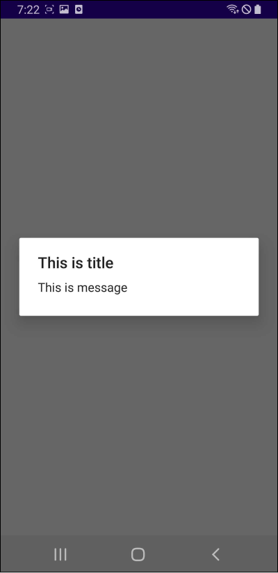
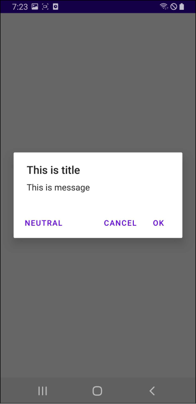

# Table of Contents

[[toc]]

# AlertDialog
`AlertDialog`는 전체 화면 전체를 가리지 않으면서 사용자의 응답이나 추가 정보를 입력받을 수 있는 창입니다.



`AlertDialog`는 다음과 같이 사용합니다.

``` kotlin MainActivity.kt
class MainActivity : AppCompatActivity() {

    // 버튼 눌렀을 때
    button.setOnClickListener {

        val builder = AlertDialog.Builder(this@MainActivity)

        val alertDialog = builder
            .setTitle("This is title")
            .setMessage("This is message")
            .create()

        // AlertDialog 보여주기
        alertDialog.show()
    }
}
```

`AlertDialog`는 세 개의 버튼을 포함할 수 있습니다. 



버튼 추가와 클릭 이벤트 처리는 다음과 같이 합니다.
``` kotlin MainActivity.kt
class MainActivity : AppCompatActivity() {

    button.setOnClickListener {

        val builder = AlertDialog.Builder(this@MainActivity)

        val alertDialog = builder
            .setTitle("This is title")
            .setMessage("This is message")
            .setPositiveButton("OK") { dialog, id ->
                // OK 버튼이 눌렸을 때
            }
            .setNegativeButton("Cancel") { dialog, id ->
                // Cancel 버튼이 눌렸을 때
            }
            .setNeutralButton("Neutral") { dialog, id ->
                // Neutral 버튼이 눌렸을 때
            }
            .create()

        alertDialog.show()
    }
}
```