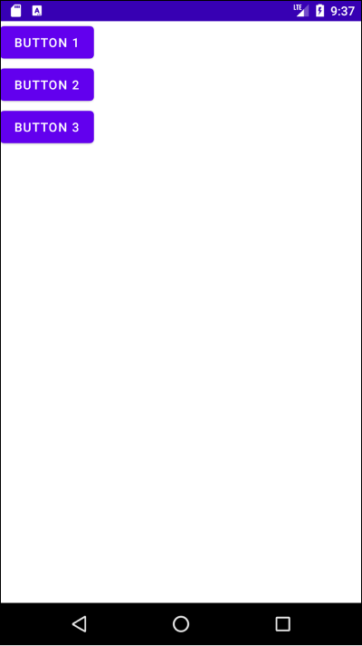
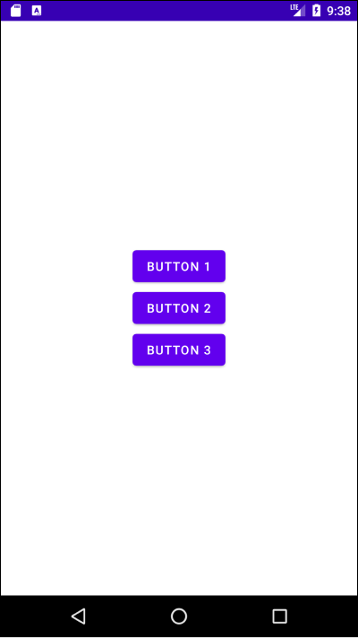
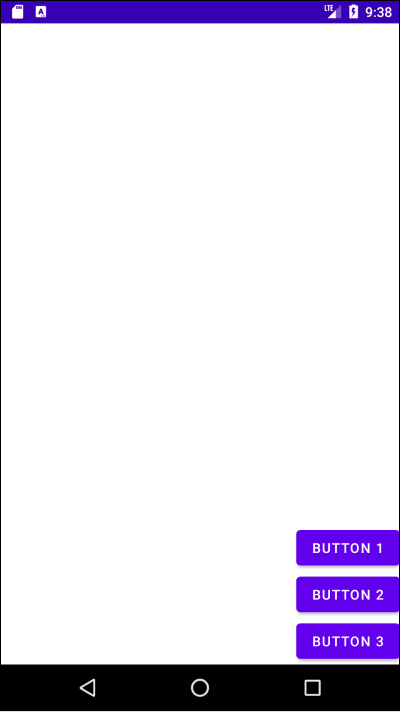
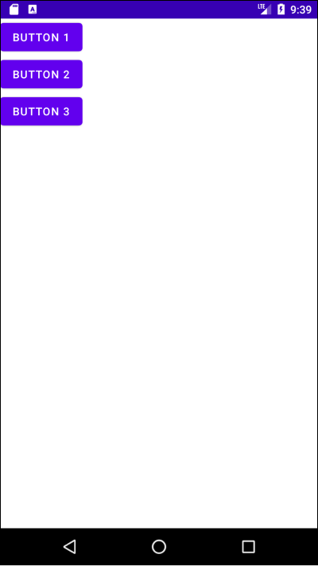
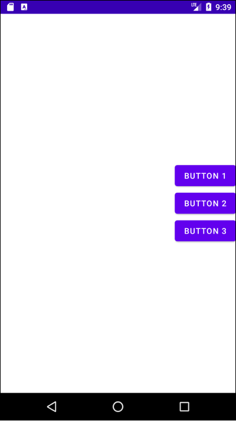
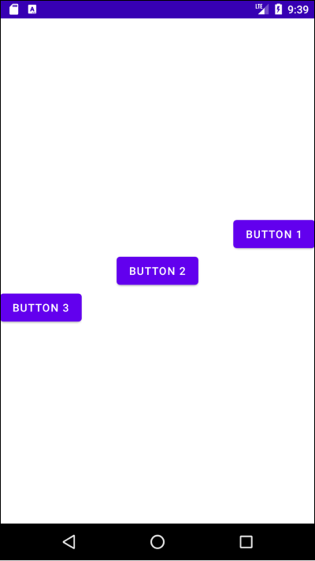
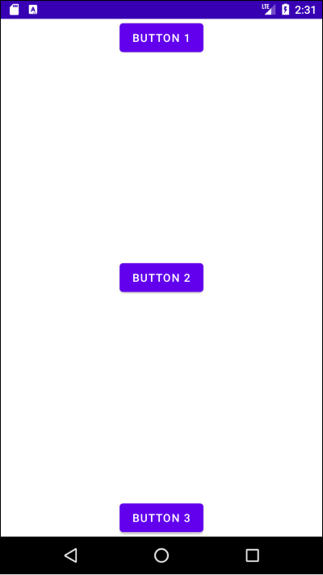
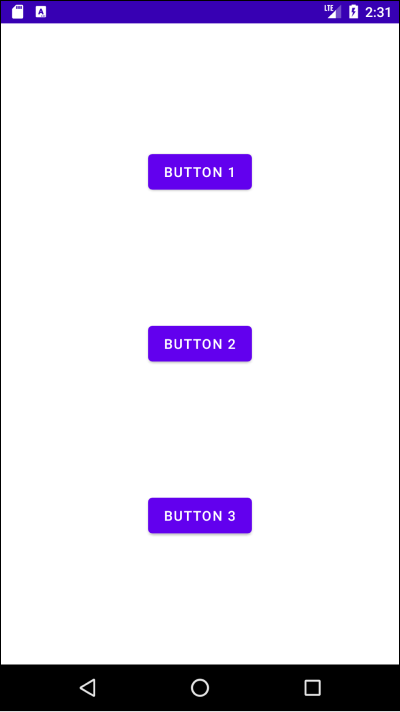

# Table of Contents

[[toc]]

# LinearLayout
`LinearLayout`은 자식 요소들을 가로 또는 세로 방향으로 배치하는데 사용합니다.

## orientation
`LinearLayout`의 `orientation`속성을 `horizontal`로 설정하면 요소가 가로 방향으로 배치됩니다.
``` xml 
// activity_main.xml
<?xml version="1.0" encoding="utf-8"?>
<LinearLayout 
    xmlns:android="http://schemas.android.com/apk/res/android"
    xmlns:tools="http://schemas.android.com/tools"
    android:layout_width="match_parent"
    android:layout_height="match_parent"
    android:orientation="horizontal"
    tools:context=".MainActivity">

    <Button
        android:layout_width="wrap_content"
        android:layout_height="wrap_content"
        android:text="button 1"/>

    <Button
        android:layout_width="wrap_content"
        android:layout_height="wrap_content"
        android:text="button 2"/>

    <Button
        android:layout_width="wrap_content"
        android:layout_height="wrap_content"
        android:text="button 3"/>

</LinearLayout>
```


`orientation`을 `vertical`로 설정하면 요소가 세로 방향으로 배치됩니다.
``` xml 
// activity_main.xml
<?xml version="1.0" encoding="utf-8"?>
<LinearLayout
    xmlns:android="http://schemas.android.com/apk/res/android"
    xmlns:tools="http://schemas.android.com/tools"
    android:layout_width="match_parent"
    android:layout_height="match_parent"
    android:orientation="vertical"
    tools:context=".MainActivity">

    <Button
        android:layout_width="wrap_content"
        android:layout_height="wrap_content"
        android:layout_gravity="left"
        android:text="button 1"/>

    <Button
        android:layout_width="wrap_content"
        android:layout_height="wrap_content"
        android:text="button 2"/>

    <Button
        android:layout_width="wrap_content"
        android:layout_height="wrap_content"
        android:text="button 3"/>

</LinearLayout>
```



## gravity
`LinearLayout`의 자식 요소들을 어떻게 배치할지 결정합니다. 속성 값에는 `top`, `bottom`, `left`, `right`, `center`, `center_horizontal`, `center_vertical` 등이 올 수 있으며 `android:gravity="top|right"`와 같이 여러 속성을 함께 사용할 수 있습니다.

### center
모든 요소를 `LinearLayout`의 중앙에 배치합니다.
``` xml activity_main.xml
<?xml version="1.0" encoding="utf-8"?>
<LinearLayout
    xmlns:android="http://schemas.android.com/apk/res/android"
    xmlns:tools="http://schemas.android.com/tools"
    android:layout_width="match_parent"
    android:layout_height="match_parent"
    android:orientation="vertical"
    android:gravity="center"
    tools:context=".MainActivity">

    <Button
        android:layout_width="wrap_content"
        android:layout_height="wrap_content"
        android:text="button 1"/>

    <Button
        android:layout_width="wrap_content"
        android:layout_height="wrap_content"
        android:text="button 2"/>

    <Button
        android:layout_width="wrap_content"
        android:layout_height="wrap_content"
        android:text="button 3"/>

</LinearLayout>
```



### right|bottom
``` xml activity_main.xml
<?xml version="1.0" encoding="utf-8"?>
<LinearLayout
    xmlns:android="http://schemas.android.com/apk/res/android"
    xmlns:tools="http://schemas.android.com/tools"
    android:layout_width="match_parent"
    android:layout_height="match_parent"
    android:orientation="vertical"
    android:gravity="right|bottom"
    tools:context=".MainActivity">

    <Button
        android:layout_width="wrap_content"
        android:layout_height="wrap_content"
        android:text="button 1"/>

    <Button
        android:layout_width="wrap_content"
        android:layout_height="wrap_content"
        android:text="button 2"/>

    <Button
        android:layout_width="wrap_content"
        android:layout_height="wrap_content"
        android:text="button 3"/>

</LinearLayout>
```



### left|top

``` xml activity_main.xml
<?xml version="1.0" encoding="utf-8"?>
<LinearLayout
    xmlns:android="http://schemas.android.com/apk/res/android"
    xmlns:tools="http://schemas.android.com/tools"
    android:layout_width="match_parent"
    android:layout_height="match_parent"
    android:orientation="vertical"
    android:gravity="left|top"
    tools:context=".MainActivity">

    <Button
        android:layout_width="wrap_content"
        android:layout_height="wrap_content"
        android:text="button 1"/>

    <Button
        android:layout_width="wrap_content"
        android:layout_height="wrap_content"
        android:text="button 2"/>

    <Button
        android:layout_width="wrap_content"
        android:layout_height="wrap_content"
        android:text="button 3"/>

</LinearLayout>
```



### right|center_vertical

``` xml activity_main.xml
<?xml version="1.0" encoding="utf-8"?>
<LinearLayout
    xmlns:android="http://schemas.android.com/apk/res/android"
    xmlns:tools="http://schemas.android.com/tools"
    android:layout_width="match_parent"
    android:layout_height="match_parent"
    android:orientation="vertical"
    android:gravity="right|center_vertical"
    tools:context=".MainActivity">

    <Button
        android:layout_width="wrap_content"
        android:layout_height="wrap_content"
        android:text="button 1"/>

    <Button
        android:layout_width="wrap_content"
        android:layout_height="wrap_content"
        android:text="button 2"/>

    <Button
        android:layout_width="wrap_content"
        android:layout_height="wrap_content"
        android:text="button 3"/>

</LinearLayout>
```




## layout_gravity
부모 뷰 안에서 자식 뷰 자신을 어디에 위치시킬 지 지정합니다. 부모 뷰가 아니라 자식 뷰에 설정합니다.
``` activity_main.xml
<?xml version="1.0" encoding="utf-8"?>
<LinearLayout
    xmlns:android="http://schemas.android.com/apk/res/android"
    xmlns:tools="http://schemas.android.com/tools"
    android:layout_width="match_parent"
    android:layout_height="match_parent"
    android:orientation="vertical"
    android:gravity="center"
    tools:context=".MainActivity">

    <Button
        android:layout_width="wrap_content"
        android:layout_height="wrap_content"
        android:layout_gravity="right"
        android:text="button 1"/>

    <Button
        android:layout_width="wrap_content"
        android:layout_height="wrap_content"
        android:layout_gravity="center"
        android:text="button 2"/>

    <Button
        android:layout_width="wrap_content"
        android:layout_height="wrap_content"
        android:layout_gravity="left"
        android:text="button 3"/>

</LinearLayout>
```



## layout_weight
요소들이 차지하고 남은 공간을 어떻게 나눌지 비율로 설정할 수 있습니다. 예를 들어 다음과 같이 설정하면 공간을 1:1:2 비율로 사용하게 됩니다.

``` xml activity_main.xml
<?xml version="1.0" encoding="utf-8"?>
<LinearLayout
    xmlns:android="http://schemas.android.com/apk/res/android"
    xmlns:tools="http://schemas.android.com/tools"
    android:layout_width="match_parent"
    android:layout_height="match_parent"
    android:orientation="vertical"
    android:gravity="center"
    tools:context=".MainActivity">

    <Button
        android:layout_width="wrap_content"
        android:layout_height="0dp"
        android:layout_weight="1"
        android:text="button 1"/>

    <Button
        android:layout_width="wrap_content"
        android:layout_height="0dp"
        android:layout_weight="1"
        android:text="button 2"/>

    <Button
        android:layout_width="wrap_content"
        android:layout_height="0dp"
        android:layout_weight="2"
        android:text="button 3"/>

</LinearLayout>
```


## Space
`Space`는 공간만 차지하는 위젯입니다. `Space`를 사용하면 더욱 다양하게 위젯을 배치할 수 있습니다. 

아래 예제를 살펴봅시다.


``` xml activity_main.xml
<?xml version="1.0" encoding="utf-8"?>
<LinearLayout xmlns:android="http://schemas.android.com/apk/res/android"
    xmlns:tools="http://schemas.android.com/tools"
    android:layout_width="match_parent"
    android:layout_height="match_parent"
    xmlns:app="http://schemas.android.com/apk/res-auto"
    android:orientation="vertical"
    android:gravity="center"
    tools:context=".MainActivity">

    <Button
        android:id="@+id/button1"
        android:layout_width="wrap_content"
        android:layout_height="wrap_content"
        android:text="Button 1" />

    <Button
        android:id="@+id/button2"
        android:layout_width="wrap_content"
        android:layout_height="wrap_content"
        android:text="Button 2" />

    <Button
        android:id="@+id/button3"
        android:layout_width="wrap_content"
        android:layout_height="wrap_content"
        android:text="Button 3" />
</LinearLayout>
```

`Space`를 활용하여 다음과 같이 배치할 수도 있습니다.



``` xml activity_main.xml
<?xml version="1.0" encoding="utf-8"?>
<LinearLayout xmlns:android="http://schemas.android.com/apk/res/android"
    xmlns:tools="http://schemas.android.com/tools"
    android:layout_width="match_parent"
    android:layout_height="match_parent"
    xmlns:app="http://schemas.android.com/apk/res-auto"
    android:orientation="vertical"
    android:gravity="center"
    tools:context=".MainActivity">

    <Button
        android:id="@+id/button1"
        android:layout_width="wrap_content"
        android:layout_height="wrap_content"
        android:text="Button 1" />

    <Space
        android:layout_width="wrap_content"
        android:layout_height="0dp"
        android:layout_weight="1"/>

    <Button
        android:id="@+id/button2"
        android:layout_width="wrap_content"
        android:layout_height="wrap_content"
        android:text="Button 2" />

    <Space
        android:layout_width="wrap_content"
        android:layout_height="0dp"
        android:layout_weight="1"/>

    <Button
        android:id="@+id/button3"
        android:layout_width="wrap_content"
        android:layout_height="wrap_content"
        android:text="Button 3" />
</LinearLayout>
```

다음과 같이 배치할 수도 있습니다.



``` xml activity_main.xml
<?xml version="1.0" encoding="utf-8"?>
<LinearLayout xmlns:android="http://schemas.android.com/apk/res/android"
    xmlns:tools="http://schemas.android.com/tools"
    android:layout_width="match_parent"
    android:layout_height="match_parent"
    xmlns:app="http://schemas.android.com/apk/res-auto"
    android:orientation="vertical"
    android:gravity="center"
    tools:context=".MainActivity">

    <Button
        android:id="@+id/button1"
        android:layout_width="wrap_content"
        android:layout_height="wrap_content"
        android:text="Button 1" />

    <Space
        android:layout_width="wrap_content"
        android:layout_height="0dp"
        android:layout_weight="1"/>

    <Button
        android:id="@+id/button2"
        android:layout_width="wrap_content"
        android:layout_height="wrap_content"
        android:text="Button 2" />

    <Space
        android:layout_width="wrap_content"
        android:layout_height="0dp"
        android:layout_weight="1"/>

    <Button
        android:id="@+id/button3"
        android:layout_width="wrap_content"
        android:layout_height="wrap_content"
        android:text="Button 3" />
</LinearLayout>
```