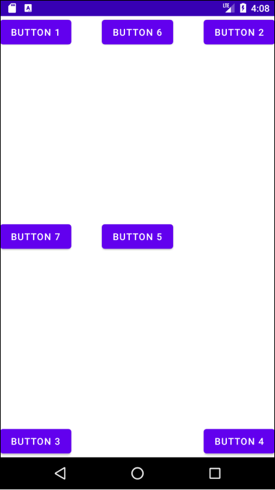
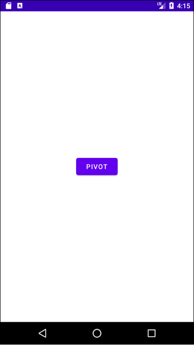
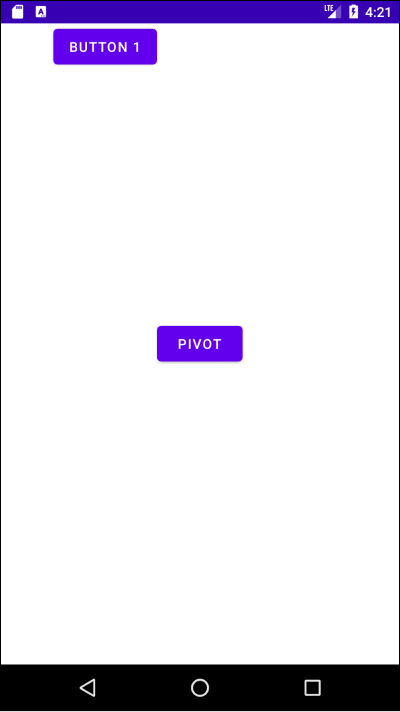
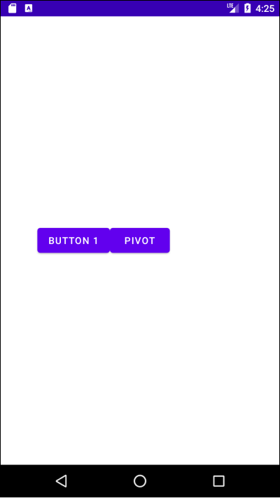
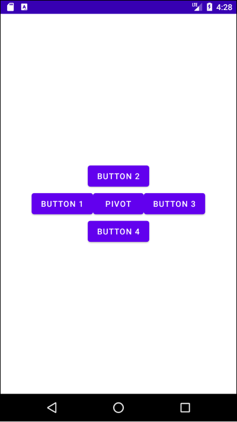

# Table of Contents

[[toc]]

# RelativeLayout
`LinearLayout`를 사용하면 특정 뷰를 기준으로 다른 뷰의 위치를 결정할 수 있습니다. 예를 들면 부모 뷰의 왼쪽 상단, 다른 뷰의 하단에 뷰를 배치할 수 있습니다.

## 부모 뷰를 기준으로 배치하기
다음 속성을 사용하면 부모 뷰를 기준으로 뷰 위치를 지정할 수 있습니다.

|뷰 이름|설명|
|------|---|
|`android:layout_alignParentLeft`|부모 뷰의 왼쪽에 배치|
|`android:layout_alignParentRight`|부모 뷰의 오른쪽에 배치|
|`android:layout_alignParentTop`|부모 뷰의 상단에 배치|
|`android:layout_alignParentBottom`|부모 뷰의 하단에 배치|
|`android:layout_centerInParent`|부모 뷰의 정중앙에 배치|
|`android:layout_centerHorizontal`|부모 뷰의 가로 방향 중앙에 배치|
|`android:layout_centerVertical`|부모 뷰의 가로 방향 세로에 배치|

예제를 살펴봅시다.

``` xml activity_main.xml
<?xml version="1.0" encoding="utf-8"?>
<RelativeLayout
    xmlns:android="http://schemas.android.com/apk/res/android"
    xmlns:tools="http://schemas.android.com/tools"
    android:layout_width="match_parent"
    android:layout_height="match_parent"
    android:orientation="horizontal"
    tools:context=".MainActivity">

    <Button
        android:layout_width="wrap_content"
        android:layout_height="wrap_content"
        android:layout_alignParentLeft="true"
        android:text="button 1"/>

    <Button
        android:layout_width="wrap_content"
        android:layout_height="wrap_content"
        android:layout_alignParentRight="true"
        android:text="button 2"/>

    <Button
        android:layout_width="wrap_content"
        android:layout_height="wrap_content"
        android:layout_alignParentBottom="true"
        android:text="button 3"/>

    <Button
        android:layout_width="wrap_content"
        android:layout_height="wrap_content"
        android:layout_alignParentRight="true"
        android:layout_alignParentBottom="true"
        android:text="button 4"/>

    <Button
        android:layout_width="wrap_content"
        android:layout_height="wrap_content"
        android:layout_centerInParent="true"
        android:text="button 5"/>

    <Button
        android:layout_width="wrap_content"
        android:layout_height="wrap_content"
        android:layout_centerHorizontal="true"
        android:text="button 6"/>

    <Button
        android:layout_width="wrap_content"
        android:layout_height="wrap_content"
        android:layout_centerVertical="true"
        android:text="button 7"/>

</RelativeLayout>
```



## 다른 뷰를 기준으로 배치하기
`RelativeLayout`을 사용하면 같은 부모 뷰에 포함된 다른 자식 뷰를 기준으로 뷰를 배치할 수 있습니다. 우선 다음과 같이 `기준 뷰(Pivot)`가 가운데 배치되어있다고 가정합시다.
``` xml activity_main.xml
<?xml version="1.0" encoding="utf-8"?>
<RelativeLayout
    xmlns:android="http://schemas.android.com/apk/res/android"
    xmlns:tools="http://schemas.android.com/tools"
    android:layout_width="match_parent"
    android:layout_height="match_parent"
    android:orientation="horizontal"
    tools:context=".MainActivity">

    <Button
        android:id="@+id/pivot"
        android:layout_width="wrap_content"
        android:layout_height="wrap_content"
        android:layout_centerInParent="true"
        android:text="Pivot"/>

</RelativeLayout>
```



다음 속성들을 사용하면 다른 뷰를 기준으로 뷰를 배치할 수 있습니다.

|뷰 이름|설명|
|------|---|
|`android:layout_toLeftOf`|다른 뷰의 왼쪽에 배치|
|`android:layout_toRightOf`|다른 뷰의 오른쪽에 배치|
|`android:layout_above`|다른 뷰의 상단에 배치|
|`android:layout_below`|다른 뷰의 하단에 배치|

이제 `layout_toLeftOf`속성을 사용하여 `Button1`을 `Pivot`의 왼쪽에 배치해보겠습니다.
``` xml activity_main.xml
<?xml version="1.0" encoding="utf-8"?>
<RelativeLayout
    xmlns:android="http://schemas.android.com/apk/res/android"
    xmlns:tools="http://schemas.android.com/tools"
    android:layout_width="match_parent"
    android:layout_height="match_parent"
    android:orientation="horizontal"
    tools:context=".MainActivity">

    <Button
        android:id="@+id/pivot"
        android:layout_width="wrap_content"
        android:layout_height="wrap_content"
        android:layout_centerInParent="true"
        android:text="Pivot"/>

    <Button
        android:layout_width="wrap_content"
        android:layout_height="wrap_content"
        android:layout_toLeftOf="@+id/pivot"
        android:text="Button 1"/>

</RelativeLayout>
```

결과 화면은 다음과 같습니다.



`Button1`의 가로 방향은 `Pivot`의 왼쪽에 배치되었습니다. 다만 세로 방향 배치가 지정되지 않았기 때문에 화면 상단에 배치된 것을 확인할 수 있습니다. 

이제 `android:layout_centerVertical` 속성을 이용하여 세로 방향이 부모 뷰의 중앙에 배치되도록 합시다.
``` xml activity_main.xml
<?xml version="1.0" encoding="utf-8"?>
<RelativeLayout
    xmlns:android="http://schemas.android.com/apk/res/android"
    xmlns:tools="http://schemas.android.com/tools"
    android:layout_width="match_parent"
    android:layout_height="match_parent"
    android:orientation="horizontal"
    tools:context=".MainActivity">

    <Button
        android:id="@+id/pivot"
        android:layout_width="wrap_content"
        android:layout_height="wrap_content"
        android:layout_centerInParent="true"
        android:text="Pivot"/>

    <Button
        android:layout_width="wrap_content"
        android:layout_height="wrap_content"
        android:layout_toLeftOf="@+id/pivot"
        android:layout_centerVertical="true"
        android:text="Button 1"/>

</RelativeLayout>
```



마지막으로 기준 뷰의 왼쪽, 오른쪽, 상단, 하단에 뷰를 배치하는 예제를 첨부합니다.
``` xml activity_main.xml
<?xml version="1.0" encoding="utf-8"?>
<RelativeLayout
    xmlns:android="http://schemas.android.com/apk/res/android"
    xmlns:tools="http://schemas.android.com/tools"
    android:layout_width="match_parent"
    android:layout_height="match_parent"
    android:orientation="horizontal"
    tools:context=".MainActivity">

    <Button
        android:id="@+id/pivot"
        android:layout_width="wrap_content"
        android:layout_height="wrap_content"
        android:layout_centerInParent="true"
        android:text="Pivot"/>

    <Button
        android:layout_width="wrap_content"
        android:layout_height="wrap_content"
        android:layout_toLeftOf="@+id/pivot"
        android:layout_centerVertical="true"
        android:text="Button 1"/>

    <Button
        android:layout_width="wrap_content"
        android:layout_height="wrap_content"
        android:layout_above="@+id/pivot"
        android:layout_centerHorizontal="true"
        android:text="Button 2"/>

    <Button
        android:layout_width="wrap_content"
        android:layout_height="wrap_content"
        android:layout_toRightOf="@+id/pivot"
        android:layout_centerVertical="true"
        android:text="Button 3"/>

    <Button
        android:layout_width="wrap_content"
        android:layout_height="wrap_content"
        android:layout_below="@+id/pivot"
        android:layout_centerHorizontal="true"
        android:text="Button 4"/>

</RelativeLayout>
```

