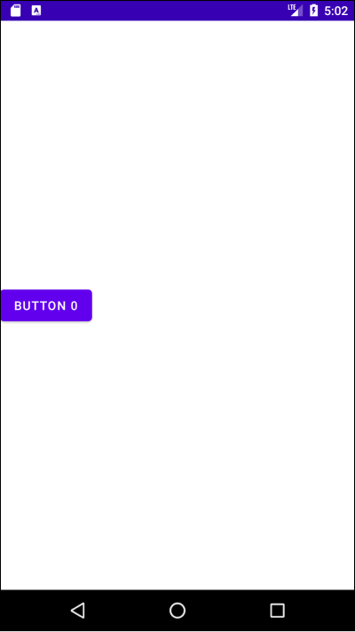
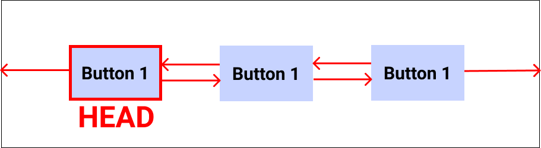

# Table of Contents

[[toc]]

# ConstraintLayout
`ConstraintLayout`은 `RelativeLayout`과 유사하지만 `LinearLayout`의 가중치를 추가하여 보다 유연하게 자식 뷰를 배치할 수 있습니다. `ConstraintLayout`은 `제약조건(Constraint)`을 사용하여 뷰를 배치합니다.

## 설정
`ConstraintLayout`을 사용하려면 아래와 같은 의존성을 추가해야합니다.
``` xml 모듈 수준의 build.gradle
dependencies {
    implementation 'androidx.constraintlayout:constraintlayout:$constraintlayout_version'
}
```

## 부모 뷰를 기준으로 배치하기
다음 속성을 사용하면 뷰에 제약조건을 추가할 수 있습니다.

|뷰 이름|설명|
|------|---|
|`app:layout_constraintTop_toTopOf`|현재 뷰 상단과 다른 뷰 상단 사이에 제약조건을 추가|
|`app:layout_constraintBottom_toBottomOf`|현재 뷰 하단과 다른 뷰 하단 사이에 제약조건을 추가|
|`app:layout_constraintStart_toStartOf`|현재 뷰 시작점과 다른 뷰 시작점 사이에 제약조건을 추가|
|`app:layout_constraintEnd_toEndOf`|현재 뷰 끝점과 다른 뷰 끝점 사이에 제약조건을 추가|


예제를 살펴봅시다. `Button 0`의 상단과 부모 뷰의 상단 사이에 제약조건을 추가하면 다음과 같습니다.
``` xml activity_main.xml
<?xml version="1.0" encoding="utf-8"?>
<androidx.constraintlayout.widget.ConstraintLayout xmlns:android="http://schemas.android.com/apk/res/android"
    xmlns:tools="http://schemas.android.com/tools"
    android:layout_width="match_parent"
    android:layout_height="match_parent"
    xmlns:app="http://schemas.android.com/apk/res-auto"
    android:orientation="horizontal"
    tools:context=".MainActivity">

    <Button
        android:id="@+id/button0"
        android:layout_width="wrap_content"
        android:layout_height="wrap_content"
        app:layout_constraintTop_toTopOf="parent"
        android:text="Button 0"/>

</androidx.constraintlayout.widget.ConstraintLayout>
```


이제 `Button 0`의 하단과 부모 뷰의 하단 사이에 제약조건을 추가해봅시다.
``` xml activity_main.xml 
<?xml version="1.0" encoding="utf-8"?>
<androidx.constraintlayout.widget.ConstraintLayout xmlns:android="http://schemas.android.com/apk/res/android"
    xmlns:tools="http://schemas.android.com/tools"
    android:layout_width="match_parent"
    android:layout_height="match_parent"
    xmlns:app="http://schemas.android.com/apk/res-auto"
    android:orientation="horizontal"
    tools:context=".MainActivity">

    <Button
        android:id="@+id/button0"
        android:layout_width="wrap_content"
        android:layout_height="wrap_content"
        app:layout_constraintTop_toTopOf="parent"
        app:layout_constraintBottom_toBottomOf="parent"
        android:text="Button 0"/>

</androidx.constraintlayout.widget.ConstraintLayout>
```



`Button 0`의 끝과 부모 뷰 끝 사이에 제약조건을 추가합니다.
``` xml activity_main.xml 
<?xml version="1.0" encoding="utf-8"?>
<androidx.constraintlayout.widget.ConstraintLayout xmlns:android="http://schemas.android.com/apk/res/android"
    xmlns:tools="http://schemas.android.com/tools"
    android:layout_width="match_parent"
    android:layout_height="match_parent"
    xmlns:app="http://schemas.android.com/apk/res-auto"
    android:orientation="horizontal"
    tools:context=".MainActivity">

    <Button
        android:id="@+id/button0"
        android:layout_width="wrap_content"
        android:layout_height="wrap_content"
        app:layout_constraintTop_toTopOf="parent"
        app:layout_constraintBottom_toBottomOf="parent"
        app:layout_constraintEnd_toEndOf="parent"
        android:text="Button 0"/>

</androidx.constraintlayout.widget.ConstraintLayout>
```


`Button 0`의 시작과 부모 뷰의 시작 사이에 제약조건을 추가합니다.
``` xml activity_main.xml 
<?xml version="1.0" encoding="utf-8"?>
<androidx.constraintlayout.widget.ConstraintLayout xmlns:android="http://schemas.android.com/apk/res/android"
    xmlns:tools="http://schemas.android.com/tools"
    android:layout_width="match_parent"
    android:layout_height="match_parent"
    xmlns:app="http://schemas.android.com/apk/res-auto"
    android:orientation="horizontal"
    tools:context=".MainActivity">

    <Button
        android:id="@+id/button0"
        android:layout_width="wrap_content"
        android:layout_height="wrap_content"
        app:layout_constraintTop_toTopOf="parent"
        app:layout_constraintBottom_toBottomOf="parent"
        app:layout_constraintEnd_toEndOf="parent"
        app:layout_constraintStart_toStartOf="parent"
        android:text="Button 0"/>

</androidx.constraintlayout.widget.ConstraintLayout>
```


`app:layout_constraintVertical_bias` 속성을 사용하면 세로축으로 `Bias`를 추가할 수 있습니다. `app:layout_constraintVertical_bias="0.2"`으로 설정하면 다음과 같습니다.
 ``` xml activity_main.xml
<?xml version="1.0" encoding="utf-8"?>
<androidx.constraintlayout.widget.ConstraintLayout xmlns:android="http://schemas.android.com/apk/res/android"
    xmlns:tools="http://schemas.android.com/tools"
    android:layout_width="match_parent"
    android:layout_height="match_parent"
    xmlns:app="http://schemas.android.com/apk/res-auto"
    android:orientation="horizontal"
    tools:context=".MainActivity">

    <Button
        android:id="@+id/button0"
        android:layout_width="wrap_content"
        android:layout_height="wrap_content"
        app:layout_constraintTop_toTopOf="parent"
        app:layout_constraintBottom_toBottomOf="parent"
        app:layout_constraintEnd_toEndOf="parent"
        app:layout_constraintStart_toStartOf="parent"
        app:layout_constraintVertical_bias="0.2" 
        android:text="Button 0"/>

</androidx.constraintlayout.widget.ConstraintLayout>
```


`app:layout_constraintVertical_bias="0.8"`으로 설정하면 다음과 같습니다.
``` xml activity_main.xml
<?xml version="1.0" encoding="utf-8"?>
<androidx.constraintlayout.widget.ConstraintLayout xmlns:android="http://schemas.android.com/apk/res/android"
    xmlns:tools="http://schemas.android.com/tools"
    android:layout_width="match_parent"
    android:layout_height="match_parent"
    xmlns:app="http://schemas.android.com/apk/res-auto"
    android:orientation="horizontal"
    tools:context=".MainActivity">

    <Button
        android:id="@+id/button0"
        android:layout_width="wrap_content"
        android:layout_height="wrap_content"
        app:layout_constraintTop_toTopOf="parent"
        app:layout_constraintBottom_toBottomOf="parent"
        app:layout_constraintEnd_toEndOf="parent"
        app:layout_constraintStart_toStartOf="parent"
        app:layout_constraintVertical_bias="0.8" 
        android:text="Button 0"/>

</androidx.constraintlayout.widget.ConstraintLayout>
```


이제 `android:layout_height="match_parent"`로 설정해봅시다.
``` activity_main.xml
<?xml version="1.0" encoding="utf-8"?>
<androidx.constraintlayout.widget.ConstraintLayout xmlns:android="http://schemas.android.com/apk/res/android"
    xmlns:tools="http://schemas.android.com/tools"
    android:layout_width="match_parent"
    android:layout_height="match_parent"
    xmlns:app="http://schemas.android.com/apk/res-auto"
    android:orientation="horizontal"
    tools:context=".MainActivity">

    <Button
        android:id="@+id/button0"
        android:layout_width="wrap_content"
        android:layout_height="match_parent"
        app:layout_constraintTop_toTopOf="parent"
        app:layout_constraintBottom_toBottomOf="parent"
        app:layout_constraintEnd_toEndOf="parent"
        app:layout_constraintStart_toStartOf="parent"
        android:text="Button 0"/>

</androidx.constraintlayout.widget.ConstraintLayout>
```


`android:layout_width="match_parent"`도 설정해봅시다.
``` xml activity_main.xml
<?xml version="1.0" encoding="utf-8"?>
<androidx.constraintlayout.widget.ConstraintLayout xmlns:android="http://schemas.android.com/apk/res/android"
    xmlns:tools="http://schemas.android.com/tools"
    android:layout_width="match_parent"
    android:layout_height="match_parent"
    xmlns:app="http://schemas.android.com/apk/res-auto"
    android:orientation="horizontal"
    tools:context=".MainActivity">

    <Button
        android:id="@+id/button0"
        android:layout_width="match_parent"
        android:layout_height="match_parent"
        app:layout_constraintTop_toTopOf="parent"
        app:layout_constraintBottom_toBottomOf="parent"
        app:layout_constraintEnd_toEndOf="parent"
        app:layout_constraintStart_toStartOf="parent"
        android:text="Button 0"/>

</androidx.constraintlayout.widget.ConstraintLayout>
```


## 다른 자식 뷰와의 제약 조건
다음 속성을 사용하면 다른 뷰와의 제약 조건을 추가할 수 있습니다.

|뷰 이름|설명|
|------|---|
|`app:layout_constraintLeft_toRightOf`|현재 뷰 왼쪽과 다른 뷰의 오른쪽 사이에 제약조건을 추가|
|`app:layout_constraintRight_toLeftOf`|현재 뷰 오른쪽과 다른 뷰 왼쪽 사이에 제약조건을 추가|
|`app:layout_constraintTop_toBottomOf`|현재 뷰 위쪽과 다른 뷰 아래쪽 사이에 제약조건을 추가|
|`app:layout_constraintBottom_toTopOf`|현재 뷰 아래쪽과 다른 뷰 위쪽 사이에 제약조건을 추가|

예제를 살펴봅시다. `Button 0`이 다음과 같이 배치되어있습니다.
``` xml activity_main.xml
<?xml version="1.0" encoding="utf-8"?>
<androidx.constraintlayout.widget.ConstraintLayout xmlns:android="http://schemas.android.com/apk/res/android"
    xmlns:tools="http://schemas.android.com/tools"
    android:layout_width="match_parent"
    android:layout_height="match_parent"
    xmlns:app="http://schemas.android.com/apk/res-auto"
    android:orientation="horizontal"
    tools:context=".MainActivity">

    <Button
        android:id="@+id/button0"
        android:layout_width="wrap_content"
        android:layout_height="wrap_content"
        android:text="Button 0"
        app:layout_constraintTop_toTopOf="parent"
        app:layout_constraintStart_toStartOf="parent"/>

</androidx.constraintlayout.widget.ConstraintLayout>
```


이제 `Button 1`는 `Button 0`의 아래에, `Button 2`는 `Button 0`의 오른쪽에 배치하겠습니다. 


제약조건을 다음과 같이 설정하면 됩니다.
``` xml activity_main.xml
<?xml version="1.0" encoding="utf-8"?>
<androidx.constraintlayout.widget.ConstraintLayout xmlns:android="http://schemas.android.com/apk/res/android"
    xmlns:tools="http://schemas.android.com/tools"
    android:layout_width="match_parent"
    android:layout_height="match_parent"
    xmlns:app="http://schemas.android.com/apk/res-auto"
    android:orientation="horizontal"
    tools:context=".MainActivity">

    <Button
        android:id="@+id/button0"
        android:layout_width="wrap_content"
        android:layout_height="wrap_content"
        android:text="Button 0"
        app:layout_constraintTop_toTopOf="parent"
        app:layout_constraintStart_toStartOf="parent"/>

    <Button
        android:id="@+id/button1"
        android:layout_width="wrap_content"
        android:layout_height="wrap_content"
        android:text="Button 1"
        app:layout_constraintTop_toBottomOf="@+id/button0"
        app:layout_constraintStart_toStartOf="parent"/>

    <Button
        android:id="@+id/button2"
        android:layout_width="wrap_content"
        android:layout_height="wrap_content"
        android:text="Button 2"
        app:layout_constraintStart_toEndOf="@+id/button0"
        app:layout_constraintTop_toTopOf="parent"/>

</androidx.constraintlayout.widget.ConstraintLayout>
```

## 체이닝(Chaining)
한 방향으로 모든 요소의 제약조건이 설정되어있을 때를 `체이닝(Chaining)`이라고 합니다. 예제를 살펴봅시다.
``` xml activity_main.xml 
<?xml version="1.0" encoding="utf-8"?>
<androidx.constraintlayout.widget.ConstraintLayout xmlns:android="http://schemas.android.com/apk/res/android"
    xmlns:tools="http://schemas.android.com/tools"
    android:layout_width="match_parent"
    android:layout_height="match_parent"
    xmlns:app="http://schemas.android.com/apk/res-auto"
    android:orientation="horizontal"
    tools:context=".MainActivity">

    <Button
        android:id="@+id/button1"
        android:layout_width="wrap_content"
        android:layout_height="wrap_content"
        android:text="Button 1"
        app:layout_constraintTop_toTopOf="parent"
        app:layout_constraintStart_toStartOf="parent"
        app:layout_constraintEnd_toStartOf="@+id/button2"
        app:layout_constraintHorizontal_chainStyle="spread_inside"/>

    <Button
        android:id="@+id/button2"
        android:layout_width="wrap_content"
        android:layout_height="wrap_content"
        android:text="Button 2"
        app:layout_constraintStart_toEndOf="@+id/button1"
        app:layout_constraintTop_toTopOf="parent"
        app:layout_constraintEnd_toStartOf="@+id/button3"/>

    <Button
        android:id="@+id/button3"
        android:layout_width="wrap_content"
        android:layout_height="wrap_content"
        android:text="Button 3"
        app:layout_constraintStart_toEndOf="@+id/button2"
        app:layout_constraintTop_toTopOf="parent"
        app:layout_constraintEnd_toEndOf="parent" />

</androidx.constraintlayout.widget.ConstraintLayout>
```

위 예제는 아래 그림과 같이 제약조건이 설정되어있으며, 가로축 방향으로 `체이닝(Chaining)`이 설정되어있다고 합니다.


가로축 방향의 체이닝에서는 가장 왼쪽 요소를, 세로축 방향의 체이닉에서는 가장 위쪽 요소를 `헤드(Head)`라고 합니다.



`헤드(Head)`요소에서 `layout_constraintHorizontal_chainStyle` 또는 `layout_constraintVertical_chainStyle` 속성으로 요소들의 배치 방법을 설정할 수 있습니다.

`app:layout_constraintHorizontal_chainStyle="packed"`로 설정하면 다음과 같이 배치됩니다.
``` xml activity_main.xml 
<?xml version="1.0" encoding="utf-8"?>
<androidx.constraintlayout.widget.ConstraintLayout xmlns:android="http://schemas.android.com/apk/res/android"
    xmlns:tools="http://schemas.android.com/tools"
    android:layout_width="match_parent"
    android:layout_height="match_parent"
    xmlns:app="http://schemas.android.com/apk/res-auto"
    android:orientation="horizontal"
    tools:context=".MainActivity">

    <Button
        android:id="@+id/button1"
        android:layout_width="wrap_content"
        android:layout_height="wrap_content"
        android:text="Button 1"
        app:layout_constraintTop_toTopOf="parent"
        app:layout_constraintStart_toStartOf="parent"
        app:layout_constraintEnd_toStartOf="@+id/button2"
        app:layout_constraintHorizontal_chainStyle="packed"/>

    <Button
        android:id="@+id/button2"
        android:layout_width="wrap_content"
        android:layout_height="wrap_content"
        android:text="Button 2"
        app:layout_constraintStart_toEndOf="@+id/button1"
        app:layout_constraintTop_toTopOf="parent"
        app:layout_constraintEnd_toStartOf="@+id/button3"/>

    <Button
        android:id="@+id/button3"
        android:layout_width="wrap_content"
        android:layout_height="wrap_content"
        android:text="Button 3"
        app:layout_constraintStart_toEndOf="@+id/button2"
        app:layout_constraintTop_toTopOf="parent"
        app:layout_constraintEnd_toEndOf="parent" />

</androidx.constraintlayout.widget.ConstraintLayout>
```


`app:layout_constraintHorizontal_chainStyle="spread"`로 설정하면 다음과 같이 배치됩니다.


`app:layout_constraintHorizontal_chainStyle="spread_inside"`로 설정하면 다음과 같이 배치됩니다.

