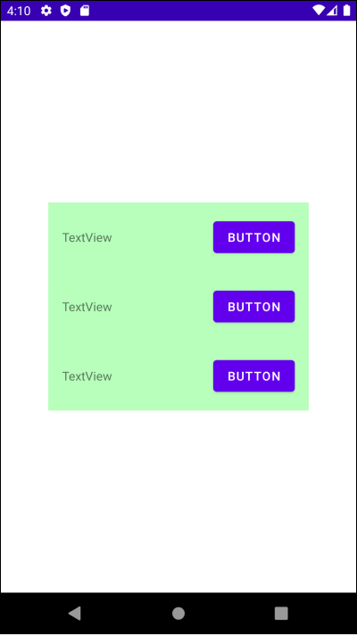
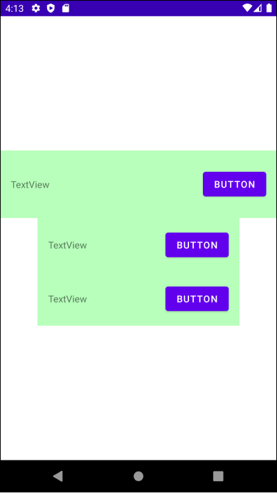
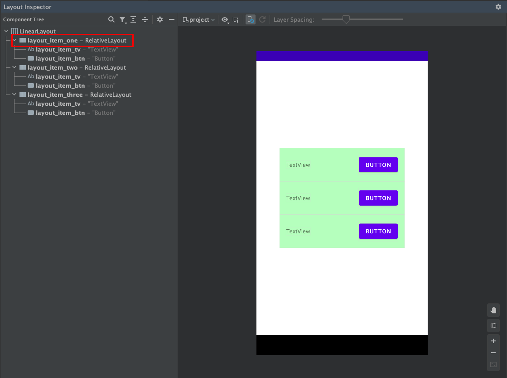
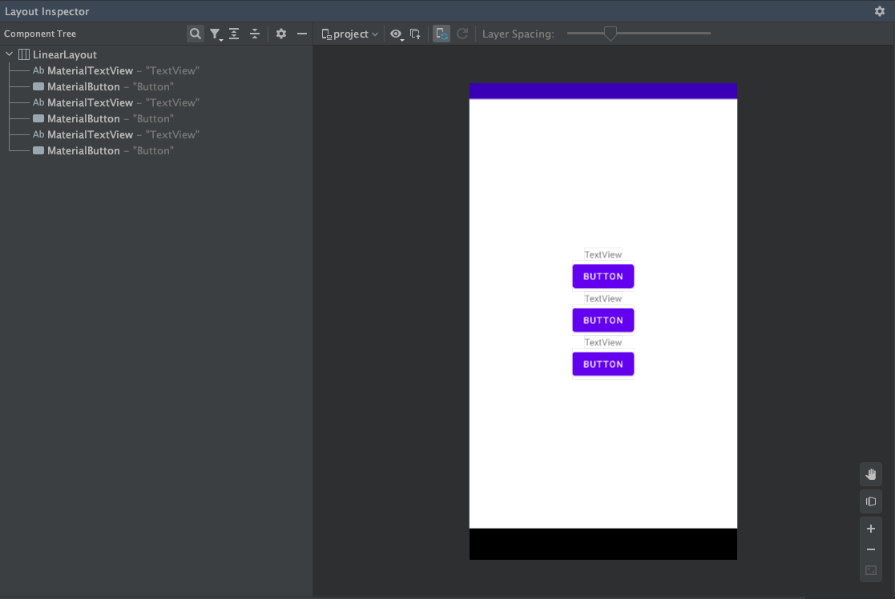

# Table of Contents

[[toc]]

## 레이아웃 재사용 하기
`<include />`, `<merge />` 태그를 사용하면 레이아웃 XML 파일에서 중복된 코드를 줄이고 이를 재사용할 수 있습니다. 예제를 살펴봅시다.

``` xml activity_main.xml
<?xml version="1.0" encoding="utf-8"?>
<LinearLayout xmlns:android="http://schemas.android.com/apk/res/android"
    xmlns:app="http://schemas.android.com/apk/res-auto"
    xmlns:tools="http://schemas.android.com/tools"
    android:layout_width="match_parent"
    android:layout_height="match_parent"
    android:orientation="vertical"
    android:gravity="center"
    tools:context=".MainActivity">

    <RelativeLayout
        android:layout_width="300dp"
        android:layout_height="wrap_content"
        android:background="#B7FFBB"
        android:padding="16dp">

        <TextView
            android:layout_width="wrap_content"
            android:layout_height="wrap_content"
            android:layout_alignParentLeft="true"
            android:layout_centerVertical="true"
            android:text="TextView" />

        <Button
            android:layout_width="wrap_content"
            android:layout_height="wrap_content"
            android:layout_alignParentRight="true"
            android:layout_centerVertical="true"
            android:text="Button" />
    </RelativeLayout>

    <RelativeLayout
        android:layout_width="300dp"
        android:layout_height="wrap_content"
        android:background="#B7FFBB"
        android:padding="16dp">

        <TextView
            android:layout_width="wrap_content"
            android:layout_height="wrap_content"
            android:layout_alignParentLeft="true"
            android:layout_centerVertical="true"
            android:text="TextView" />

        <Button
            android:layout_width="wrap_content"
            android:layout_height="wrap_content"
            android:layout_alignParentRight="true"
            android:layout_centerVertical="true"
            android:text="Button" />
    </RelativeLayout>

    <RelativeLayout
        android:layout_width="match_parent"
        android:layout_height="wrap_content"
        android:background="#B7FFBB"
        android:padding="16dp">

        <TextView
            android:layout_width="300dp"
            android:layout_height="wrap_content"
            android:layout_alignParentLeft="true"
            android:layout_centerVertical="true"
            android:text="TextView" />

        <Button
            android:layout_width="wrap_content"
            android:layout_height="wrap_content"
            android:layout_alignParentRight="true"
            android:layout_centerVertical="true"
            android:text="Button" />
    </RelativeLayout>
</LinearLayout>
```



여기서 중복된 부분은 다음과 같습니다.
``` xml
<RelativeLayout
    android:layout_width="match_parent"
    android:layout_height="wrap_content"
    android:background="#B7FFBB"
    android:padding="16dp">

    <TextView
        android:layout_width="300dp"
        android:layout_height="wrap_content"
        android:layout_alignParentLeft="true"
        android:layout_centerVertical="true"
        android:text="TextView" />

    <Button
        android:layout_width="wrap_content"
        android:layout_height="wrap_content"
        android:layout_alignParentRight="true"
        android:layout_centerVertical="true"
        android:text="Button" />
</RelativeLayout>
```

이제 `<include />`과 `<merge />`를 사용하여 중복된 부분을 제거하겠습니다.

## include
우선 별도의 레이아웃 XML 파일을 만들고 중복된 부분을 다음과 같이 작성합니다.
``` xml layout_item.xml
<RelativeLayout
    android:layout_width="match_parent"
    android:layout_height="wrap_content"
    android:background="#B7FFBB"
    android:padding="16dp">

    <TextView
        android:id="@+id/layout_item_tv"
        android:layout_width="300dp"
        android:layout_height="wrap_content"
        android:layout_alignParentLeft="true"
        android:layout_centerVertical="true"
        android:text="TextView" />

    <Button
        android:id="@+id/layout_item_btn"
        android:layout_width="wrap_content"
        android:layout_height="wrap_content"
        android:layout_alignParentRight="true"
        android:layout_centerVertical="true"
        android:text="Button" />
</RelativeLayout>
```

이제 `activity_main.xml`을 다음과 같이 수정할 수 있습니다.

``` xml activity_main.xml
<?xml version="1.0" encoding="utf-8"?>
<LinearLayout xmlns:android="http://schemas.android.com/apk/res/android"
    xmlns:app="http://schemas.android.com/apk/res-auto"
    xmlns:tools="http://schemas.android.com/tools"
    android:layout_width="match_parent"
    android:layout_height="match_parent"
    android:orientation="vertical"
    tools:context=".MainActivity">

    <include layout="@layout/layout_item"/>
    <include layout="@layout/layout_item"/>
    <include layout="@layout/layout_item"/>
    
</LinearLayout>
```

`<include />` 태그에도 `layout_width`와 `layout_height`를 설정할 수 있습니다. 이 경우 기존 설정값을 오버라이드합니다.

``` xml activity_main.xml
<?xml version="1.0" encoding="utf-8"?>
<LinearLayout xmlns:android="http://schemas.android.com/apk/res/android"
    xmlns:app="http://schemas.android.com/apk/res-auto"
    xmlns:tools="http://schemas.android.com/tools"
    android:layout_width="match_parent"
    android:layout_height="match_parent"
    android:orientation="vertical"
    android:gravity="center"
    tools:context=".MainActivity">

    <include layout="@layout/layout_item"
        android:layout_width="match_parent"
        android:layout_height="100dp"/>
    <include layout="@layout/layout_item"/>
    <include layout="@layout/layout_item"/>

</LinearLayout>
```



`<include />` 태그에 `id`를 부여할 수 있습니다.

``` xml activity_main.xml
<?xml version="1.0" encoding="utf-8"?>
<LinearLayout xmlns:android="http://schemas.android.com/apk/res/android"
    xmlns:app="http://schemas.android.com/apk/res-auto"
    xmlns:tools="http://schemas.android.com/tools"
    android:layout_width="match_parent"
    android:layout_height="match_parent"
    android:orientation="vertical"
    android:gravity="center"
    tools:context=".MainActivity">

    <include
        android:id="@+id/layout_item_one"
        layout="@layout/layout_item"/>
    <include
        android:id="@+id/layout_item_two"
        layout="@layout/layout_item"/>
    <include
        android:id="@+id/layout_item_three"
        layout="@layout/layout_item"/>

</LinearLayout>
```

`<include />`와 `findViewById()`는 다음과 같이 사용할 수 있습니다.

``` kotlin MainActivity.kt
class MainActivity : AppCompatActivity() {

    override fun onCreate(savedInstanceState: Bundle?) {
        super.onCreate(savedInstanceState)
        setContentView(R.layout.activity_main)

        val viewGroupOne = findViewById<ViewGroup>(R.id.layout_item_one)
        val textViewOne = viewGroupOne.findViewById<TextView>(R.id.layout_item_tv)
        val buttonOne = viewGroupOne.findViewById<Button>(R.id.layout_item_btn)

        val viewGroupTwo = findViewById<ViewGroup>(R.id.layout_item_two)
        val textViewTwo = viewGroupTwo.findViewById<TextView>(R.id.layout_item_tv)
        val buttonTwo = viewGroupTwo.findViewById<Button>(R.id.layout_item_btn)

        val viewGroupThree = findViewById<ViewGroup>(R.id.layout_item_three)
        val textViewThree = viewGroupThree.findViewById<TextView>(R.id.layout_item_tv)
        val buttonThree = viewGroupThree.findViewById<Button>(R.id.layout_item_btn)
    }
}
```

## merge
`layout_item.xml`을 다시 살펴봅시다.
``` layout_item.xml
<?xml version="1.0" encoding="utf-8"?>
<RelativeLayout
    android:layout_width="match_parent"
    android:layout_height="wrap_content"
    android:background="#B7FFBB"
    android:padding="16dp">

    <TextView
        android:id="@+id/layout_item_tv"
        android:layout_width="300dp"
        android:layout_height="wrap_content"
        android:layout_alignParentLeft="true"
        android:layout_centerVertical="true"
        android:text="TextView" />

    <Button
        android:id="@+id/layout_item_btn"
        android:layout_width="wrap_content"
        android:layout_height="wrap_content"
        android:layout_alignParentRight="true"
        android:layout_centerVertical="true"
        android:text="Button" />
</RelativeLayout>
```

`Layout Inspector`에서 확인해보면 `RelativeLayout`이라는 `ViewGroup`이 `TextView`와 `Button`을 감싸고 있습니다. 



계층구조가 복잡한 UI(중첩된 `ViewGroup`)는 성능을 저하시킵니다. 따라서 중첩된 `ViewGroup`은 최대한 제거하는 것이 좋습니다.

`<merge />`를 사용하면 `RelativeLayout`, `ConstraintLayout`, `LinearLayout`같은 `ViewGroup`을 사용하지 않고 루트 뷰를 구성할 수 있습니다.
``` xml layout_item.xml
<?xml version="1.0" encoding="utf-8"?>
<merge xmlns:android="http://schemas.android.com/apk/res/android">

    <TextView
        android:layout_width="wrap_content"
        android:layout_height="wrap_content"
        android:layout_alignParentLeft="true"
        android:layout_centerVertical="true"
        android:text="TextView" />

    <Button
        android:layout_width="wrap_content"
        android:layout_height="wrap_content"
        android:layout_alignParentRight="true"
        android:layout_centerVertical="true"
        android:text="Button" />
</merge>
```

위 코드는 다음과 동일하게 동작합니다.

``` xml activity_main.xml 
<?xml version="1.0" encoding="utf-8"?>
<LinearLayout xmlns:android="http://schemas.android.com/apk/res/android"
    xmlns:app="http://schemas.android.com/apk/res-auto"
    xmlns:tools="http://schemas.android.com/tools"
    android:layout_width="match_parent"
    android:layout_height="match_parent"
    android:orientation="vertical"
    android:gravity="center"
    tools:context=".MainActivity">

    <TextView
        android:layout_width="wrap_content"
        android:layout_height="wrap_content"
        android:layout_alignParentLeft="true"
        android:layout_centerVertical="true"
        android:text="TextView" />

    <Button
        android:layout_width="wrap_content"
        android:layout_height="wrap_content"
        android:layout_alignParentRight="true"
        android:layout_centerVertical="true"
        android:text="Button" />
        
    <TextView
        android:layout_width="wrap_content"
        android:layout_height="wrap_content"
        android:layout_alignParentLeft="true"
        android:layout_centerVertical="true"
        android:text="TextView" />

    <Button
        android:layout_width="wrap_content"
        android:layout_height="wrap_content"
        android:layout_alignParentRight="true"
        android:layout_centerVertical="true"
        android:text="Button" />

    <TextView
        android:layout_width="wrap_content"
        android:layout_height="wrap_content"
        android:layout_alignParentLeft="true"
        android:layout_centerVertical="true"
        android:text="TextView" />

    <Button
        android:layout_width="wrap_content"
        android:layout_height="wrap_content"
        android:layout_alignParentRight="true"
        android:layout_centerVertical="true"
        android:text="Button" />

</LinearLayout>
```

`Layout Inspector`에서 확인해보면 `RelativeLayout`이 사라진 것을 확인할 수 있습니다.



`<merge />`는 UI의 중첩도를 낮추지만 `RelativeLayout`, `ConstraintLayout`, `LinearLayout`처럼 원하는 곳에 자식 뷰를 배치할 수 없습니다. 따라서 상황에 맞게 `<merge />`와 `<include />`를 사용해야합니다.