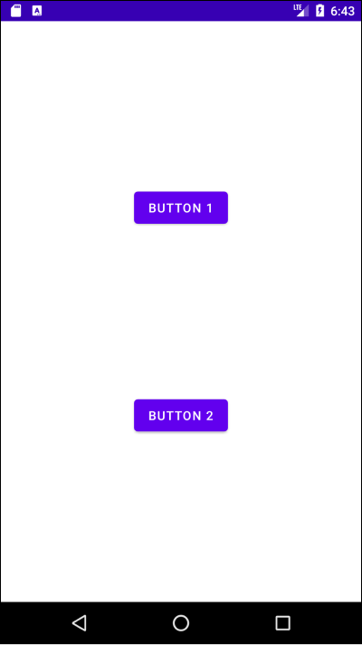

# Table of Contents

[[toc]]

---

# 코드에서 동적으로 View 추가하기

안드로이드에서는 보통 다음과 같은 방법으로 화면을 구성합니다.
1. `XML 레이아웃 파일`에 `View`를 추가한다.
2. 액티비티에서 `setContentView()`를 호출하여 인플레이트한다.

예제는 루트 뷰를 `LinearLayout`으로 구성하고 두 개의 버튼을 추가했습니다.
``` xml activity_main.xml
<?xml version="1.0" encoding="utf-8"?>
<LinearLayout xmlns:android="http://schemas.android.com/apk/res/android"
    xmlns:tools="http://schemas.android.com/tools"
    android:layout_width="match_parent"
    android:layout_height="match_parent"
    android:orientation="vertical"
    tools:context=".MainActivity">

    <Button
        android:id="@+id/button1"
        android:layout_width="match_parent"
        android:layout_height="wrap_content"
        android:text="Button 1" />

    <Button
        android:id="@+id/button2"
        android:layout_width="match_parent"
        android:layout_height="wrap_content"
        android:text="Button 2" />

</LinearLayout>
```

``` kotlin MainActivity.kt
class MainActivity : AppCompatActivity() {
    override fun onCreate(savedInstanceState: Bundle?) {
        super.onCreate(savedInstanceState)
        setContentView(R.layout.activity_main)
    }
}
```


그러나 `XML 레이아웃 파일`을 사용하지 않고도 화면을 구성할 수 있습니다. 우선 루트 뷰 역할을 하는 `LinearLayout`은 다음과 같이 추가할 수 있습니다.
``` kotlin MainActivity.kt
class MainActivity : AppCompatActivity() {
    override fun onCreate(savedInstanceState: Bundle?) {
        super.onCreate(savedInstanceState)
        // setContentView(R.layout.activity_main)

        val linearLayout = LinearLayout(this)
        linearLayout.orientation = LinearLayout.VERTICAL
        setContentView(linearLayout)
    }
}
```

두 개의 버튼을 생성합니다. 그리고 `addView()`를 사용하여 버튼을 추가합니다.
``` kotlin MainActivity.kt
class MainActivity : AppCompatActivity() {
    override fun onCreate(savedInstanceState: Bundle?) {
        super.onCreate(savedInstanceState)
        // setContentView(R.layout.activity_main)

        val linearLayout = LinearLayout(this)
        linearLayout.orientation = LinearLayout.VERTICAL
        setContentView(linearLayout)

        val button1 = Button(this)
        button1.text = "Button 1"

        val button2 = Button(this)
        button2.text = "Button 2"

        linearLayout.addView(button1)
        linearLayout.addView(button2)        
    }
}
```

결과는 다음과 같습니다.


## LayoutParams

안드로이드 공식 문서에서는 `LayoutParams`를 다음과 같이 정의하고 있습니다.

```
LayoutParams are used by views to tell their parents how they want to be laid out.
``` 

즉 부모 뷰가 자식 뷰를 배치할 때 필요로 하는 정보를 `LayoutParams`로 전달하게 됩니다. 예를 들어 버튼의 글자나 패딩은 부모 뷰가 필요로 하는 정보가 아니기 때문에 `LayoutParams`를 필요로 하지 않습니다. 그저 버튼 객체의 속성이나 메소드를 사용하면 됩니다.

``` kotlin
val button = Button(this)
button.text = "Button 1"
button.setPadding(10, 30, 30, 10)
```

반면 `layout_width`, `layout_height`, `margin` 같은 속성은 부모 뷰에 따라 상대적으로 설정되므로 `LayoutParams`를 통해 설정하게 됩니다.
``` kotlin MainActivity.kt
class MainActivity : AppCompatActivity() {
    override fun onCreate(savedInstanceState: Bundle?) {
        super.onCreate(savedInstanceState)

        val linearLayout = LinearLayout(this)
        setContentView(linearLayout)

        val button = Button(this)
        button.text = "Button"

        val params = LinearLayout.LayoutParams(
            LinearLayout.LayoutParams.MATCH_PARENT,
            LinearLayout.LayoutParams.WRAP_CONTENT
        )

        params.setMargins(100, 50, 100, 50)

        linearLayout.addView(button, params)
    }
}
```

화면은 다음과 같습니다.


## ConstraintLayout
우선 `XML 레이아웃 파일`로 구성한 화면은 다음과 같습니다.
``` xml activity_main.xml
<?xml version="1.0" encoding="utf-8"?>
<androidx.constraintlayout.widget.ConstraintLayout 
    xmlns:android="http://schemas.android.com/apk/res/android"
    xmlns:tools="http://schemas.android.com/tools"
    android:layout_width="match_parent"
    android:layout_height="match_parent"
    xmlns:app="http://schemas.android.com/apk/res-auto"
    android:orientation="vertical"
    tools:context=".MainActivity">

    <Button
        android:id="@+id/button1"
        android:layout_width="wrap_content"
        android:layout_height="wrap_content"
        app:layout_constraintTop_toTopOf="parent"
        app:layout_constraintStart_toStartOf="parent"
        app:layout_constraintEnd_toEndOf="parent"
        app:layout_constraintBottom_toTopOf="@+id/button2"
        android:text="Button 1" />

    <Button
        android:id="@+id/button2"
        android:layout_width="wrap_content"
        android:layout_height="wrap_content"
        app:layout_constraintTop_toBottomOf="@+id/button1"
        app:layout_constraintStart_toStartOf="parent"
        app:layout_constraintEnd_toEndOf="parent"
        app:layout_constraintBottom_toBottomOf="parent"
        android:text="Button 2" />

</androidx.constraintlayout.widget.ConstraintLayout>
```

화면은 다음과 같습니다.



이를 코드로 구현하면 다음과 같습니다.

``` kotlin MainActivity.kt
class MainActivity : AppCompatActivity() {
    override fun onCreate(savedInstanceState: Bundle?) {
        super.onCreate(savedInstanceState)
        // setContentView(R.layout.activity_main)

        val constraintLayout = ConstraintLayout(this)
        setContentView(constraintLayout)

        val button1 = Button(this)
        button1.id = generateViewId()
        button1.text = "Button 1"

        val button2 = Button(this)
        button2.id = generateViewId()
        button2.text = "Button 2"

        constraintLayout.addView(button1)
        constraintLayout.addView(button2)

        val constraintSet1 = ConstraintSet()
        constraintSet1.clone(constraintLayout)
        constraintSet1.connect(button1.id, ConstraintSet.TOP, ConstraintSet.PARENT_ID, ConstraintSet.TOP, 0)
        constraintSet1.connect(button1.id, ConstraintSet.START, ConstraintSet.PARENT_ID, ConstraintSet.START, 0)
        constraintSet1.connect(button1.id, ConstraintSet.END, ConstraintSet.PARENT_ID, ConstraintSet.END, 0)
        constraintSet1.connect(button1.id, ConstraintSet.BOTTOM, button2.id, ConstraintSet.TOP, 0)
        constraintSet1.applyTo(constraintLayout)

        val constraintSet2 = ConstraintSet()
        constraintSet2.clone(constraintLayout)
        constraintSet2.connect(button2.id, ConstraintSet.TOP, button1.id, ConstraintSet.BOTTOM, 0)
        constraintSet2.connect(button2.id, ConstraintSet.START, ConstraintSet.PARENT_ID, ConstraintSet.START, 0)
        constraintSet2.connect(button2.id, ConstraintSet.END, ConstraintSet.PARENT_ID, ConstraintSet.END, 0)
        constraintSet2.connect(button2.id, ConstraintSet.BOTTOM, ConstraintSet.PARENT_ID, ConstraintSet.BOTTOM, 0)
        constraintSet2.applyTo(constraintLayout)
    }
}
```

결과는 다음과 같습니다.


`ConstraintLayout`에 제약조건을 추가하려면 `ConstraintSet`클래스를 사용합니다. 이 클래스의 `connect()`를 사용하여 다른 뷰와의 제약조건을 생성할 수 있습니다. 또한 제약조건 설정이 완료되면 `applyTo()`를 호출하여 적용을 해야합니다.

