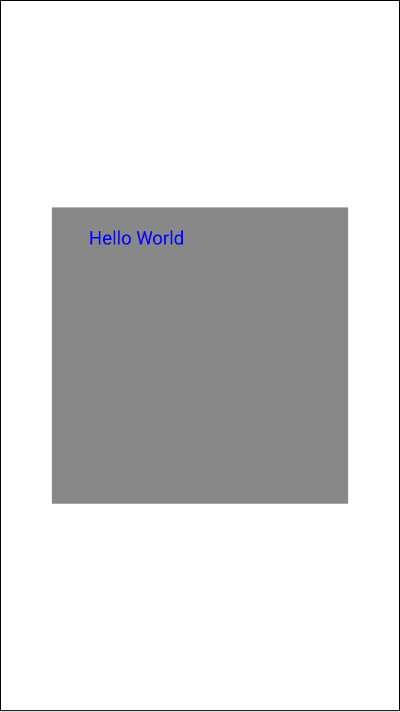
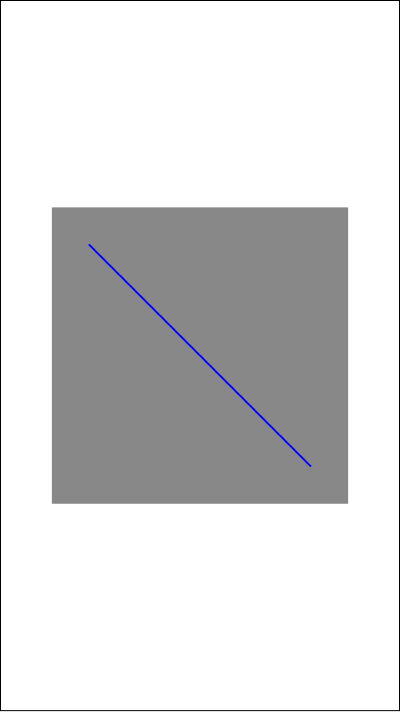

# Table of Contents

[[toc]]

---

# Canvas, Paint
`Canvas`와 `Paint`를 사용하면 화면에 원하는 그림을 그릴 수 있습니다. 

## Canvas
`Canvas`는 도화지입니다. `Canvas`는 `Bitmap`을 통해 생성됩니다. `Bitmap`은 `createBitmap()`을 통해 생성하며 매개변수는 다음과 같습니다.

- `witdh`: 가로 길이
- `height`: 세로 길이
- `config`: 보통 `Bitmap.Config.ARGB_8888` 값을 넣습니다. 한 픽셀은 4바이트로 저장되며, 각 바이트는 `Alpha`, `Red`, `Green`, `Blue`를 의미합니다. 1바이트는 256개의 값을 표현할 수 있습니다.

``` kotlin
import android.graphics.Bitmap

// 가로 800, 세로 800의 비트맵 생성
val bitmap = Bitmap.createBitmap(800, 800, Bitmap.Config.ARGB_8888)
```

`Bitmap`을 사용하여 `Canvas`를 생성합니다.

``` kotlin
import android.graphics.Canvas

// Canvas 생성
val canvas = Canvas(bitmap)
```

`Canvas`의 배경화면은 기본적으로 투명색입니다. `Canvas`의 색상을 회색으로 변경하겠습니다.

``` kotlin
// Canvas의 Background 설정
canvas.drawColor(Color.GRAY)
``` 

이제 `Canvas`를 `ImageView`에 표시하겠습니다.

``` xml activity_main.xml 
<?xml version="1.0" encoding="utf-8"?>
<LinearLayout xmlns:android="http://schemas.android.com/apk/res/android"
    xmlns:tools="http://schemas.android.com/tools"
    android:layout_width="match_parent"
    android:layout_height="match_parent"
    android:orientation="vertical"
    android:gravity="center"
    tools:context=".MainActivity">

    <ImageView
        android:id="@+id/activity_main_iv"
        android:layout_width="wrap_content"
        android:layout_height="wrap_content"/>

</LinearLayout>
```

``` kotlin MainActivity.kt 
class MainActivity : AppCompatActivity() {

    private val imageView: ImageView by lazy { findViewById(R.id.activity_main_iv) }

    override fun onCreate(savedInstanceState: Bundle?) {
        super.onCreate(savedInstanceState)
        setContentView(R.layout.activity_main)

        val bitmap = Bitmap.createBitmap(800, 800, Bitmap.Config.ARGB_8888)
        val canvas = Canvas(bitmap)
        canvas.drawColor(Color.GRAY)

        imageView.setImageBitmap(bitmap)
    }
}
```

앱을 실행해봅시다.


## Paint
`Canvas`가 도화지라면 `Paint`는 물감입니다. `Paint`를 사용하면 `Canvas`위에 그림을 그릴 수 있습니다. `Paint`는 다음과 같이 생성합니다.
``` kotlin
val paint = Paint().apply {
    // 페인트 색상
    color = Color.BLUE

    // 페인트 굵기
    strokeWidth = 30F
}
```

### 점 그리기
`Canvas`에는 `Paint`로 그림을 그리기 위한 여러가지 메소드가 포함되있습니다. `drawPoint()`를 사용하여 `Canvas`에 점을 찍어보겠습니다.
``` kotlin
// x축 200, y축 200에 점을 그린다.
canvas.drawPoint(200, 200, paint)
```

앱을 실행합시다.


완성된 코드는 다음과 같습니다.
``` kotlin MainActivity.kt
class MainActivity : AppCompatActivity() {

    private val imageView: ImageView by lazy { findViewById(R.id.activity_main_iv) }

    override fun onCreate(savedInstanceState: Bundle?) {
        super.onCreate(savedInstanceState)
        setContentView(R.layout.activity_main)

        val bitmap = Bitmap.createBitmap(800, 800, Bitmap.Config.ARGB_8888)
        val canvas = Canvas(bitmap)
        canvas.drawColor(Color.GRAY)

        imageView.setImageBitmap(bitmap)

        val paint = Paint().apply {
            color = Color.BLUE
            strokeWidth = 30F
        }

        canvas.drawPoint(200F, 200F, paint)
    }
}
```

### 직사각형 그리기
`Canvas`의 `drawRect()` 메소드를 사용하면 직사각형을 그릴 수 있습니다.
``` kotlin
val paint = Paint().apply {
    color = Color.BLUE
}

canvas.drawRect(100F, 100F, 300F, 300F, paint)
```


### 원 그리기
`Canvas`의 `drawArc()`를 사용하면 원을 그릴 수 있습니다.
``` kotlin
val paint = Paint().apply {
    color = Color.BLUE
}

canvas.drawCircle(100F, 100F, 50F, paint)
```


### 텍스트 그리기
`Canvas`의 `drawText()`를 사용하면 텍스트를 그릴 수 있습니다.
``` kotlin
val paint = Paint().apply {
    color = Color.BLUE
    textSize = 50F
}

canvas.drawText("Hello World", 100F, 100F, paint)
```



### 선 그리기
`Canvas`의 `drawLine()`을 사용하면 선을 그릴 수 있습니다.
``` kotlin
val paint = Paint().apply {
    color = Color.BLUE
    strokeWidth = 5F
}

canvas.drawLine(100F, 100F, 700F, 700F, paint)
```



### 경로
`Path`클래스와 `Canvas`의 `drawPath()`를 사용하면 그림을 그릴 경로를 지정할 수 있습니다.
``` kotlin
val paint = Paint().apply {
    color = Color.BLUE
    strokeWidth = 5F
}

val path = Path().apply {
    // 시작점 설정
    moveTo(100F, 100F)

    // 경로 이동
    lineTo(100F, 500F)
    lineTo(500F, 300F)
}

canvas.drawPath(path, paint)
```


`Canvas`에는 그림을 그리기 위한 다양한 메소드가 있습니다. [공식 문서](https://developer.android.com/reference/android/graphics/Canvas#drawArc(float,%20float,%20float,%20float,%20float,%20float,%20boolean,%20android.graphics.Paint))에서 이 메소드들을 확인할 수 있습니다.