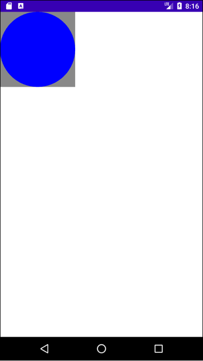

# Table of Contents

[[toc]]

# 커스텀 위젯
안드로이드에서는 UI 구성을 위한 `뷰(View)`를 제공합니다. `TextView`, `EditText`, `Button`과 같은 위젯과 `LinearLayout`, `ConstraintLayout`같은 `뷰 그룹(ViewGroup)`이 대표적입니다.

안드로이드에서는 기본으로 제공하는 위젯 외에도 직접 커스텀 위젯을 만들 수 있습니다. 커스텀 위젯을 만드는 방법에는 크게 두 가지가 있습니다.
- `Compound View`
- `Custom View`

이번 포스트에서는 `Compound View`에 대해 알아보겠습니다.

## Compound View
`Compound View`는 `ViewGroup`과 기존 `View`를 조합하여 새로운 뷰를 구성합니다. 예제에서는 다음과 같은 `PostView`를 구현하겠습니다.


`Compound View`를 만들기 위해서는 별도의 레이아웃 XML 파일을 구성해야합니다.
``` xml view_post.xml
<?xml version="1.0" encoding="utf-8"?>
<LinearLayout xmlns:android="http://schemas.android.com/apk/res/android"
    android:layout_width="match_parent"
    android:layout_height="wrap_content"
    android:orientation="vertical">

    <RelativeLayout
        android:layout_width="match_parent"
        android:layout_height="wrap_content"
        android:padding="16dp">

        <ImageView
            android:id="@+id/view_post_iv_avatar"
            android:layout_width="75dp"
            android:layout_height="75dp"
            android:layout_alignParentLeft="true"
            android:layout_centerVertical="true"/>

        <TextView
            android:id="@+id/view_post_tv_writer"
            android:layout_width="wrap_content"
            android:layout_height="wrap_content"
            android:layout_toRightOf="@+id/view_post_iv_avatar"
            android:layout_marginLeft="16dp"
            android:layout_centerVertical="true"/>

    </RelativeLayout>

    <TextView
        android:id="@+id/view_post_tv_content"
        android:layout_width="match_parent"
        android:layout_height="wrap_content" />

</LinearLayout>
```

이제 `view_post.xml`의 루트 뷰인 `LinearLayout`을 상속하는 `PostView` 클래스를 정의합니다.
``` kotlin PostView.kt
class PostView: LinearLayout {

    private lateinit var mImageViewAvatar: ImageView
    private lateinit var mTextViewWriter: TextView
    private lateinit var mTextViewContent: TextView

    constructor(context: Context): super(context) {
        inflateView()
    }

    constructor(context: Context, attrs: AttributeSet): super(context, attrs) {
        inflateView()
    }

    private fun inflateView() {
        val view = inflate(context, R.layout.view_post, this)
        mImageViewAvatar = view.findViewById(R.id.view_post_iv_avatar)
        mTextViewWriter = view.findViewById(R.id.view_post_tv_writer)
        mTextViewContent = view.findViewById(R.id.view_post_tv_content)
    }
}
```
`Compound View`를 구성할 때는 기본적으로 두 개의 생성자를 반드시 정의해야합니다. 첫 번째 생성자는 코드에서 동적으로 `View`를 생성할 때 호출됩니다.
``` kotlin
constructor(context: Context): super(context) {
    inflateView()
}
```
두 번째 생성자는 `Layout Editor`에서 `View`를 생성할 때 호출됩니다.
``` kotlin
constructor(context: Context, attrs: AttributeSet): super(context, attrs) {
    inflateView()
}
```
`View`클래스에는 `inflate()` 함수가 정의되어있습니다. 이 함수는 XML 리소스에서 뷰를 `인플레이트`합니다. `inflateView()`함수에서 `inflate()`를 호출하여 뷰를 `인플레이트`합시다.
``` kotlin
private fun inflateView() {
    val view = inflate(context, R.layout.view_post, this)
    mImageViewAvatar = view.findViewById(R.id.view_post_iv_avatar)
    mTextViewWriter = view.findViewById(R.id.view_post_tv_writer)
    mTextViewContent = view.findViewById(R.id.view_post_tv_content)
}
```
이제 `activity_main.xml`에서 `PostView`를 다음과 같이 사용할 수 있습니다.
``` xml activity_main.xml
<?xml version="1.0" encoding="utf-8"?>
<LinearLayout xmlns:android="http://schemas.android.com/apk/res/android"
    xmlns:tools="http://schemas.android.com/tools"
    android:layout_width="match_parent"
    android:layout_height="match_parent"
    android:orientation="vertical"
    tools:context=".MainActivity">

    <com.yologger.project.PostView
        android:layout_width="match_parent"
        android:layout_height="wrap_content" />

</LinearLayout>
```

### 커스텀 속성 추가하기
`ImageView`는 `src`속성으로 보여줄 이미지를 설정할 수 있습니다.
``` xml
<ImageView
    android:layout_width="75dp"
    android:layout_height="75dp"
    android:src="@drawable/your_image"/>
```

`TextView`도  `text` 속성으로 보여줄 문자열을 설정할 수 있습니다.
``` xml
<TextView
    android:layout_width="wrap_content"
    android:layout_height="wrap_content"
    android:text="Your Text">
```

이처럼 `Compound Widget`에도 사용자 정의 속성을 추가할 수 있습니다. 

이제 아바타 이미지를 설정하는 `avatarSrc`, 글쓴이를 설정하는 `writerText`, 본문을 설정하는 `contentWriter` 속성을 추가하겠습니다. 커스텀 속성을 추가하려면 `res > values` 아래에 `attrs.xml`을 생성하고 다음과 같이 작성합니다.
``` xml attrs.xml
<?xml version="1.0" encoding="utf-8"?>
<resources>
    <declare-styleable name="PostView">
        <attr name="avatarSrc" format="reference"/>
        <attr name="writerText" format="string"/>
        <attr name="contentText" format="string"/>
    </declare-styleable>
</resources>
```

이제 `activity_main.xml`에서 위 속성들을 사용할 수 있습니다.
``` xml activity_main.xml
<?xml version="1.0" encoding="utf-8"?>
<LinearLayout xmlns:android="http://schemas.android.com/apk/res/android"
    xmlns:tools="http://schemas.android.com/tools"
    android:layout_width="match_parent"
    android:layout_height="match_parent"
    xmlns:app="http://schemas.android.com/apk/res-auto"
    android:orientation="vertical"
    tools:context=".MainActivity">

    <com.yologger.project.PostView
        android:layout_width="match_parent"
        android:layout_height="wrap_content"
        app:avatarSrc="@drawable/paul_image"
        app:writerText="Paul"
        app:contentText="Hello. My name is Paul. Nice to meet you."/>

</LinearLayout>
```

다음은 `PostView` 클래스를 다음과 같이 수정합니다.
``` kotlin PostView.kt 
class PostView: LinearLayout {

    private lateinit var mImageViewAvatar: ImageView
    private lateinit var mTextViewWriter: TextView
    private lateinit var mTextViewContent: TextView

    constructor(context: Context): super(context) {
        inflateView()
    }

    constructor(context: Context, attrs: AttributeSet): super(context, attrs) {
        inflateView()
        applyAttrs()
    }

    private fun inflateView() {
        val view = inflate(context, R.layout.view_post, this)
        mImageViewAvatar = view.findViewById(R.id.view_post_iv_avatar)
        mTextViewWriter = view.findViewById(R.id.view_post_tv_writer)
        mTextViewContent = view.findViewById(R.id.view_post_tv_content)
    }

    private fun applyAttrs(attrs: AttributeSet) {
        val typedArray: TypedArray = context.obtainStyledAttributes(attrs, R.styleable.PostView)
        val avatarSrc = typedArray.getResourceId(R.styleable.PostView_avatarSrc, 0)
        val writerText = typedArray.getText(R.styleable.PostView_writerText)
        val contentText = typedArray.getText(R.styleable.PostView_contentText)
        typedArray.recycle()

        mImageViewAvatar.setImageResource(avatarSrc)
        mTextViewWriter.text = writerText
        mTextViewContent.text = contentText
    }
}
```

`Context`의 `obtainStyledAttributes()`를 호출하면 `TypeArray` 타입의 객체를 반환합니다. 이 객체에는 레이아웃 XML 파일에서 추가한 속성값들이 저장되어있으며 `getResourceId()`, `getText()` 등의 메소드로 속성값을 추출할 수 있습니다. `TypedArray`객체를 사용한 후에는 `recycle()`을 호출하여 자원을 해제합니다.

마지막으로 코드로 `Compound View`를 생성할 때 속성값을 설정하는 코드를 추가합니다.
``` kotlin PostView.kt
class PostView: LinearLayout {

    private lateinit var mImageViewAvatar: ImageView
    private lateinit var mTextViewWriter: TextView
    private lateinit var mTextViewContent: TextView

    // ..

    fun setAvatarImage(@DrawableRes resId: Int) {
        mImageViewAvatar.setImageResource(resId)
    }

    fun setWriter(text: String) {
        mTextViewWriter.text = text
    }

    fun setContext(text: String) {
        mTextViewContent.text = text
    }
}
```

## View의 생명주기
`Activity`와 `Fragment`처럼 `View`도 생명주기가 있습니다. `Custom View`를 만드려면 `View`의 생명주기를 이해해야합니다.


생명주기 함수에서 중요한 것은 `onMeasure()`, `onLayout()`, `onDraw()` 입니다.

### measure(), onMeasure()
`LinearLayout`, `ConstraintLayout` 같은 `ViewGroup`은 자식 뷰를 가질 수 있으며, 보통 두 가지 방법으로 자식 뷰를 추가합니다.
- 코드에서 자식 뷰 추가
``` kotlin
val button = Button(this)
addView(button)
```
- 레이아웃 XML 파일에서 추가
``` xml
<?xml version="1.0" encoding="utf-8"?>
<LinearLayout xmlns:android="http://schemas.android.com/apk/res/android"
    xmlns:app="http://schemas.android.com/apk/res-auto"
    xmlns:tools="http://schemas.android.com/tools"
    android:layout_width="match_parent"
    android:layout_height="match_parent"
    tools:context=".MainActivity">
    
    <Button
        android:layout_width="wrap_content"
        android:layout_height="wrap_content"
        android:text="Button"/>

</LinearLayout>
```

이때 부모 뷰는 내부적으로 자식 뷰의 `measure()`를 호출합니다.  이때 부모 뷰는 자식 뷰의 대략적인 크기 정보를 함께 전달해야합니다. 자식 뷰의 크기는 부모 뷰에 따라 달라질 수 있기 때문입니다.
``` kotlin
button.measure(MeasureSpec.UNSPECIFIED, MeasureSpec.UNSPECIFIED)
```
`MeasureSpec`가 가질 수 있는 값은 다음과 같습니다. 
- `MeasureSpec.AT_MOST`: 자식 뷰의 크기를 `wrap_content`로 설정했을 때
- `MeasureSpec.EXACTLY`: 자식 뷰의 크기를 `match_parent`로 설정했을 때
- `MeasureSpec.UNSPECIFIED`: 자식 뷰의 크기를 `30dp` 등으로 직접 설정했을 때


부모 뷰가 `measure()`를 호출하면 자식 뷰의 `onMeasure()` 메소드가 호출됩니다. `onMeasure()`에서는 `setMeasuredDimension()`를 호출하여 자식 뷰의 크기를 결정하게 됩니다.
``` kotlin
class ChildView: View {

    // ..

    override fun onMeasure(widthMeasureSpec: Int, heightMeasureSpec: Int) {
        super.onMeasure(widthMeasureSpec, heightMeasureSpec)
        // 자식 뷰의 크기를 가로 500, 세로 500으로 설정
        setMeasuredDimension(500, 500)
    }
}
```
요약하자면 `measure()`와 `onMeasure()`는 자식 뷰의 <u>크기</u>를 결정하는데 사용됩니다.

### layout(), onLayout()
이제 자식 뷰가 부모 뷰의 어디에 <u>위치</u>할지를 결정해야합니다. 이때 부모 뷰는 내부적으로 자식 뷰의 `layout()`을 호출합니다. 또한 자식 뷰의 위치를 매개변수로 함께 전달합니다.
``` kotlin
childView.layout(left: 100, top: 100, right: 100, bottom: 100)
```
부모 뷰가 자식 뷰의 `layout()`을 호출하면 자식 뷰의 `onLayout()`이 호출됩니다.
``` kotlin
class ChildView: View {
    // ..

    protected void onLayout(boolean changed, int left, int top, int right, int bottom) {
        // ..
    }
}
```
만약 뷰를 다시 그렸다면 첫 번째 인자인 `changed`를 통해 변화를 확인할 수 있습니다.

### draw(), onDraw()
자식 뷰의 크기와 위치가 결정되면 부모 뷰는 내부적으로 자식 뷰의 `draw()`를 호출합니다.
``` kotlin
childView.draw(canvas)
```
이제 자식 뷰의 `onDraw()`가 호출되며, 이 안에서 `Canvas`를 통해 뷰를 그릴 수 있습니다.
``` kotlin
class ChildView: View {
    override fun onDraw(canvas: Canvas?) {
        super.onDraw(canvas)
        // 그리기 
    }
}
``` 

## Custom View 구현하기
이제 `Custom View`를 직접 구현해보겠습니다. `CircleView`라는 뷰를 정의합시다. 이 뷰는 원을 그려줍니다.
``` kotlin
class CircleView: View {

    constructor(context: Context): super(context) {

    }

    constructor(context: Context, attrs: AttributeSet): super(context, attrs) {

    }
}
```
`Custom View`를 구현할 때는 두 개의 생성자를 반드시 선언해야합니다. 첫 번째 생성자는 `Context`객체를 인자로 받으며, 코드에서 뷰를 생성할 때 사용됩니다.
``` kotlin
constructor(context: Context): super(context) {
    // ..
}
```
두 번째 생성자는 `Context`객체 외에도 `AttributeSet`을 인자로 받으며, 레이아웃 파일에서 뷰를 생성할 때 사용합니다.
``` kotlin
constructor(context: Context, attrs: AttributeSet): super(context, attrs) {
    // ..
}
```
이제 `onDraw()`와 `onMeasure()`를 구현합니다.
``` kotlin
class CircleView: View {

    private val paint = Paint()

    constructor(context: Context): super(context) {

    }

    constructor(context: Context, attrs: AttributeSet): super(context, attrs) {

    }

    override fun onMeasure(widthMeasureSpec: Int, heightMeasureSpec: Int) {
        super.onMeasure(widthMeasureSpec, heightMeasureSpec)
        // 뷰의 크기를 가로 400, 세로 400으로 지정
        setMeasuredDimension(400, 400);
    }

    override fun onDraw(canvas: Canvas?) {
        super.onDraw(canvas)

        // Canvas의 배경을 회색으로 설정
        canvas?.drawColor(Color.GRAY)

        // 중심 좌표가 (200, 200)이고 반지름이 200인 원을 그린다.
        paint.color = Color.BLUE
        canvas?.drawCircle(200F, 200F, 200F, paint)
    }
}
```
부모 뷰의 레이아웃 파일에 `FigureView`를 추가합니다.
``` xml
<?xml version="1.0" encoding="utf-8"?>
<LinearLayout xmlns:android="http://schemas.android.com/apk/res/android"
    xmlns:tools="http://schemas.android.com/tools"
    android:layout_width="match_parent"
    android:layout_height="match_parent"
    android:orientation="vertical"
    tools:context=".MainActivity">

    <com.yologger.project.CircleView
        android:layout_width="wrap_content"
        android:layout_height="wrap_content"/>

</LinearLayout>
```

앱을 실행하면 다음과 같습니다. `Canvas`는 회색, 원은 파란색입니다.



### 커스텀 속성 추가하기
원의 색상과 크기를 설정할 수 있도록 커스텀 속성을 추가하겠습니다. 우선 `res > values`에 `attrs.xml` 파일을 생성합니다.
``` xml attrs.xml
<?xml version="1.0" encoding="utf-8"?>
<resources>
    <declare-styleable name="FigureView">
        <attr name="radius" format="dimension"/>
        <attr name="figureColor" format="color"/>
    </declare-styleable>
</resources>
```
액티비티의 레이아웃 파일을 수정합니다.
``` xml activity_main.xml
<?xml version="1.0" encoding="utf-8"?>
<LinearLayout xmlns:android="http://schemas.android.com/apk/res/android"
    xmlns:tools="http://schemas.android.com/tools"
    android:layout_width="match_parent"
    android:layout_height="match_parent"
    xmlns:app="http://schemas.android.com/apk/res-auto"
    android:orientation="vertical"
    tools:context=".MainActivity">

    <com.yologger.project.CircleView
        android:layout_width="wrap_content"
        android:layout_height="wrap_content"
        app:figureColor="#FF0000"
        app:radius="100dp"/>

    <com.yologger.project.CircleView
        android:layout_width="wrap_content"
        android:layout_height="wrap_content"
        app:figureColor="#FFC107"
        app:radius="50dp"/>

</LinearLayout>
```

`CircleView` 파일을 수정합니다.
``` kotlin FigureView.kt
package com.yologger.project

import android.content.Context
import android.content.res.TypedArray
import android.graphics.Canvas
import android.graphics.Color
import android.graphics.Paint
import android.util.AttributeSet
import android.view.View

class CircleView: View {

    private val paint = Paint()

    private var color: Int = Color.TRANSPARENT
    private var radius: Float = 0F

    private var centerX: Float = 0.0f
        get() {
            return radius
        }

    private var centerY: Float = 0.0f
        get() {
            return radius
        }

    constructor(context: Context): super(context) {

    }

    constructor(context: Context, attrs: AttributeSet): super(context, attrs) {
        val typedArray: TypedArray = context.obtainStyledAttributes(attrs, R.styleable.FigureView)
        color = typedArray.getColor(R.styleable.FigureView_figureColor, Color.TRANSPARENT)
        radius = typedArray.getDimension(R.styleable.FigureView_radius, 0.0f)
        typedArray.recycle()
    }

    override fun onMeasure(widthMeasureSpec: Int, heightMeasureSpec: Int) {
        super.onMeasure(widthMeasureSpec, heightMeasureSpec)
        setMeasuredDimension((centerX*2).toInt(), (centerY*2).toInt());
    }

    override fun onDraw(canvas: Canvas?) {
        super.onDraw(canvas)
        paint.color = color
        canvas?.drawColor(Color.GRAY)
        canvas?.drawCircle(centerX, centerX, radius, paint)
    }
}
```
이제 앱을 실행합니다.


[안드로이드 공식문서](https://developer.android.com/guide/topics/ui/custom-components)에 가시면 `커스텀 뷰`에 대한 더 자세한 내용을 확인하실 수 있습니다.