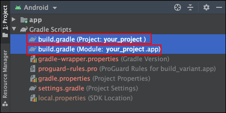

# Table of Contents
[[toc]]


# build.gradle 파일
`build.gradle`은 <u>Gradle 설정 파일</u>입니다. 이 파일에 어떤 식으로 앱을 빌드할 지를 명시합니다. Gradle은 이 파일을 참조하여 프로젝트를 빌드합니다.

안드로이드 프로젝트를 생성하면 기본적으로 두 개의 `build.gradle`가 생성됩니다.


## 프로젝트 수준의 build.gradle
하나의 프로젝트는 여러 개의 `모듈(Module)`로 구성될 수 있습니다. 프로젝트 수준의 `build.gradle`은 프로젝트 전체에, 다시 말해 모든 모듈에 적용되는 설정 파일입니다. 프로젝트를 생성하면 자동으로 생성되는 프로젝트 수준의 `build.gradle`파일은 다음과 같습니다.
``` groovy 
// 프로젝트 수준의 build.gradle

buildscript {

    // 그래들에서 사용할 변수
    ext {
        kotlin_version = "1.3.72"
    }

    // 라이브러리를 다운 받을 원격 저장소
    repositories {
        google()
        jcenter()
    }

    dependencies {
        // 안드로이드 그래들 플러그인
        classpath "com.android.tools.build:gradle:4.1.2"

        // 코틀린 그래들 플러그인
        classpath "org.jetbrains.kotlin:kotlin-gradle-plugin:$kotlin_version"
    }
}

allprojects {
    repositories {
        google()
        jcenter()
    }
}

// Task, 앱을 새로 빌드할 때 이전에 빌드했던 컴파일된 코드를 삭제
task clean(type: Delete) {
    delete rootProject.buildDir
}
```
여기서는 설정 파일에서 사용할 변수, 원격 라이브러리를 다운받을 저장소, 안드로이드 그래들 플러그인, 코틀린 그래들 플러그인 등이 선언되어있습니다.


## 모듈 수준의 build.gradle
모듈 수준의 `build.gradle`은 특정 모듈에만 적용되는 설정 파일입니다.
``` groovy 
// 모듈 수준의 build.gradle

plugins {
    id 'com.android.application'
    id 'kotlin-android'
}

android {
    compileSdkVersion 30
    buildToolsVersion "30.0.3"

    defaultConfig {
        applicationId "com.yologger.app"
        minSdkVersion 21
        targetSdkVersion 30
        versionCode 1
        versionName "1.0"

        testInstrumentationRunner "androidx.test.runner.AndroidJUnitRunner"
    }

    buildTypes {
        release {
            applicationIdSuffix '.prod'
            minifyEnabled false
            proguardFiles getDefaultProguardFile('proguard-android-optimize.txt'), 'proguard-rules.pro'
            buildConfigField "boolean", "IS_DEBUG", "true"
        }
    }
    compileOptions {
        sourceCompatibility JavaVersion.VERSION_1_8
        targetCompatibility JavaVersion.VERSION_1_8
    }
    kotlinOptions {
        jvmTarget = '1.8'
    }
}

// 의존성
dependencies {
    implementation "org.jetbrains.kotlin:kotlin-stdlib:$kotlin_version"
    implementation 'androidx.core:core-ktx:1.5.0'
    implementation 'androidx.appcompat:appcompat:1.3.0'
    implementation 'com.google.android.material:material:1.3.0'
    implementation 'androidx.constraintlayout:constraintlayout:2.0.4'
    testImplementation 'junit:junit:4.+'
    androidTestImplementation 'androidx.test.ext:junit:1.1.2'
    androidTestImplementation 'androidx.test.espresso:espresso-core:3.3.0'
}
```
`plugins`섹션에는 적용할 Gradle 플러그인을 나열합니다. 위 코드에서는 안드로이드 플러그인과 코틀린 플러그인의 적용하고 있습니다.
``` groovy
plugins {
    id 'com.android.application'
    id 'kotlin-android'
}
```
`android`섹션에서는 빌드할 때 사용할 SDK와 빌드 도구의 버전을 정의하고 있습니다.
``` groovy
android {
    compileSdkVersion 30
    buildToolsVersion "30.0.3"
    // ...
}
```
`defaultConfig`섹션에 선언된 항목들은 빌드하는 동안 해당 모듈의 `AndroidManifest.xml`파일로 생성되는 요소를 정의합니다.
``` groovy
defaultConfig {
    applicationId "com.yologger.build_variant"
    minSdkVersion 21
    targetSdkVersion 30
    versionCode 1
    versionName "1.0"

    testInstrumentationRunner "androidx.test.runner.AndroidJUnitRunner"
}
```
`buildType`섹션에는 어플리케이션을 어떻게 빌드할 지를 명시합니다.
``` groovy
buildTypes {
    release {
        applicationIdSuffix '.prod'
        minifyEnabled true
        proguardFiles getDefaultProguardFile('proguard-android-optimize.txt'), 'proguard-rules.pro'
    }
}
```

`dependencies 섹션`은 외부 모듈이나 라이브러리를 사용할 때 정의합니다. 같은 프로젝트 내 다른 모듈, jar 파일, 다른 개발자가 만든 라이브러리 등을 사용하려면 이 섹션에 명시해야합니다.
``` groovy
dependencies {
    implementation "org.jetbrains.kotlin:kotlin-stdlib:$kotlin_version"
    implementation 'androidx.core:core-ktx:1.5.0'
    implementation 'androidx.appcompat:appcompat:1.3.0'
    implementation 'com.google.android.material:material:1.3.0'
    implementation 'androidx.constraintlayout:constraintlayout:2.0.4'
    testImplementation 'junit:junit:4.+'
    androidTestImplementation 'androidx.test.ext:junit:1.1.2'
    androidTestImplementation 'androidx.test.espresso:espresso-core:3.3.0'
}
```

## CoC
그래들은 `설정보다는 관례(CoC, Convention over Configuration)`라는 개념을 구현하고 있습니다. 즉, 그래들은 사전에 정의된 합리적인 기본 설정값을 가지고 있습니다. 따라서 모든 설정을 설정하지 않아도 기본 설정값이 적용됩니다. 이 덕분에 개발자는 모든 설정을 모두 설정할 필요가 없어집니다. 자신의 요구 사항에 맞지 않는 설정만 빌드 설정 파일에서 변경하면 됩니다.
